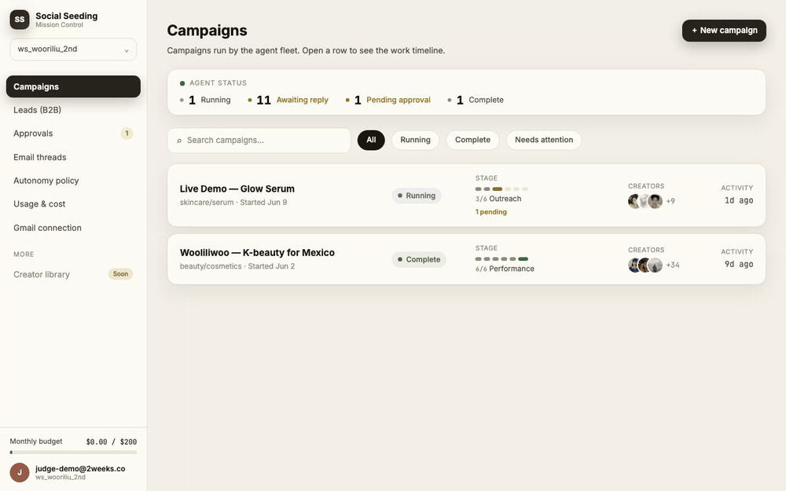
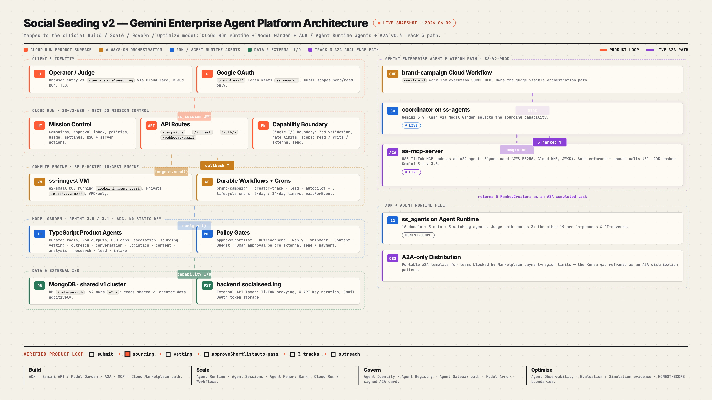
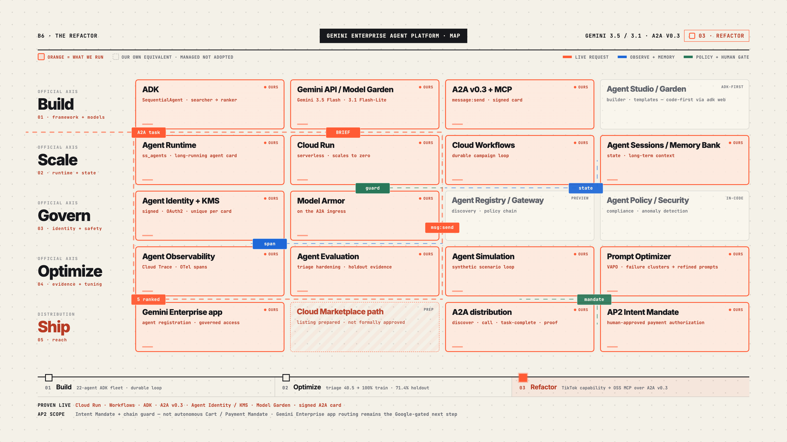

# Social Seeding — the brief is all you need

> **You stop being the campaign _operator_ and become its _supervisor_.** Give one brand brief; a fleet of **22 specialized agents** runs the entire TikTok influencer-campaign loop — **source → vet → outreach → reply → ship → verify → report** — and halts only at the policy gates you keep on. It even finishes the unglamorous verification + ROI tail that human teams routinely abandon.

<p align="center">
  <a href="https://agents.socialseed.ing"></a>
  <a href="https://youtu.be/4SDvNK4cwZs"></a>
  <a href="#it-runs-live-not-slideware"></a>
  <a href="#track-3--built-for-the-google-cloud-agent-platform"></a>
</p>



---

## What you can do with it

Hand Mission Control a brief — *"seed our K-beauty serum launch with ~20 micro-creators in Mexico"* — and the fleet takes it from there:

- **Sources** real creators from a shared **174k-creator pool**, **ranked by Gemini** with a semantic `fit_score` + per-creator reasoning — not keyword search.
- **Vets** each one (audience, engagement, brand-safety) and proposes a shortlist.
- **Writes and sends** outreach in the creator's language (ko / en / ja / zh) over a real **Gmail** connection.
- **Handles the replies** — classifies interest, responds, runs follow-ups on the same thread.
- **Arranges seeding** — turns a reply address into a shipment.
- **Verifies the content went live** and **reports the ROI** — the unglamorous tail human teams skip.

You watch it all on **Mission Control**: a live **timeline** of what the agents did, an **approval inbox**, a **policy page** (flip any gate to *"always review"*), a **cost ledger**, and a **leads CRM** — multi-tenant by workspace. You only ever touch the gates you keep on. Agents are **typed functions**, never free ReAct loops: each has a curated tool set, a Zod/Pydantic output contract, a per-call USD ceiling, and a named escalation policy.

## From v1 to v2 — the operator inversion

v2 is a ground-up rewrite of **[v1](https://github.com/Two-Weeks-Team/social-seeding)** (frozen 2026-05-13). v1 was a **tool dashboard** — three years of strata (multi-SNS → TikTok, Express → Go → Next.js, **266 API routes**, a 6-step workspace board the human clicked through, every cold email hand-written). **The human _was_ the operator.**

The thing that had to change wasn't the tech — it was **who operates**. So v2 starts clean and **inverts the roles**: the **agent operates the loop; the human supervises at policy gates.** We carried the hard-won domain assets across — TikTok ranking algorithms, the `cold-mail` agent pipeline, Gmail integration, CRM enrichment, billing — and deleted the manual-labor surface. ([v1 → v2 capability map](docs/CAPABILITIES.md))

> **v1:** a human clicks through 6 steps and writes every email.  **v2:** the fleet runs them; you approve at the gates you keep on.

## ▶ Watch &amp; try it

- **▶ [Watch the 2-minute demo](https://youtu.be/4SDvNK4cwZs)** — *the brief is all you need · a 22-agent fleet on A2A*: a signed A2A card → live Cloud Workflow → Model Garden, the Mission Control gate, a real campaign verified, the operator business model.
- **🔑 Try it — no account needed.** The hosted Mission Control runs a **read-only session**: **<https://agents.socialseed.ing>** → **"Enter as judge — read-only demo."** Browse the live campaigns, open the approval gate, and confirm the guardrail — **clicking _Approve_ returns 403**, because nothing sends without a human.

---

## It runs live, not slideware

Everything below is reproducible against the deployed endpoints — one script does it all: [`verify-live-evidence.sh`](scripts/demo/submission/verify-live-evidence.sh) (7/7 on the last run).

- **Signed A2A agent card —** `curl https://ss-mcp-server-1049119860518.us-central1.run.app/.well-known/agent.json` → `protocolVersion 0.3.0` + **one ES256 JWS** (ECDSA P-256); the card's own `jku` points at the matching JWKS (`kid ss-agent-card-prod-v1`) so any consumer can verify it, and the **production signing key lives in Cloud KMS**. Genuinely signed at the live endpoint — not just on disk.
- **A2A inside a live Cloud Workflow —** the coordinator A2A-invokes our separately-deployed OSS `tiktok-mcp-server` as a workflow step (exec `7c08ce50`, **SUCCEEDED** in 15.8s — the A2A cross-call itself ~3.7s cold / sub-second warm) and gets back **5 ranked creators**. A `SequentialAgent` ranker chains `gemini-3.1-flash-lite` (search) → `gemini-3.5-flash` (rank).
- **Reliability is measured, not vibed —** we caught a stall in reply-triage, fixed it with one deterministic rule, and re-scored: **40.5% → 100% on training, 71.4% on an unseen adversarial holdout**. The 28.6pp gap (four misses) is left visible — an overfit guard, not a vanity number.
- **Guardrails —** inbound A2A queries are sanitized through **Model Armor**; no-token requests get **401**; agent spans wire into **Cloud Trace**.
- **Gates —** `agents-adk` pytest **2933 passing** · `pnpm test` **449** TS · `pnpm run verify-build` green.

## Real results — a measured campaign, not a mockup

The pilot **Wooliliwoo · K-beauty for Mexico** was auto-completed through the verification tail that teams usually skip:

| 16 | 59,498 | 7.9% |
|:--:|:--:|:--:|
| **verified posts** | **views** | **engagement** |

Content verification ran on the real campaign — actual post covers, per-creator leaderboard, reach roll-up.

## Architecture

> Refactored onto Google's **Gemini Enterprise Agent Platform** (formerly Vertex AI). Four Cloud Run / Cloud Workflow components run live (`ss-v2-prod` / `ss-mcp-prod` / `ss-shared-infra`, ≈ $1–5/mo, scale-to-zero).

[](https://storage.googleapis.com/ss-social-seeding-v2-docs/architecture-track3.html)

<sub>▶ **[Open the interactive architecture](https://storage.googleapis.com/ss-social-seeding-v2-docs/architecture-track3.html)** — the full system, both stacks, the live continuous loop.</sub>

| Layer | What runs |
|---|---|
| **Operator UI** | Mission Control — Next 16 on Cloud Run; timeline + approval inbox; every external send passes a policy gate |
| **Orchestration** | **Cloud Workflows** (challenge path) · self-hosted **Inngest** durable engine (TS product loop) |
| **Coordinator** | `gemini-3.5-flash` on the Vertex **`global`** endpoint, routed through the **Model Garden** publisher plane |
| **Fleet** | 22-agent **ADK** fleet (16 domain + 3 meta + 3 watchdog) on **Agent Runtime / Cloud Run** |
| **Inter-agent** | **A2A v0.3** `message:send` + signed card (JWS ES256, Cloud KMS) + JWKS · SPIFFE Agent Identity |
| **Models** | `gemini-3.5-flash` (judgment) + `gemini-3.1-flash-lite` (bulk) — Gemini-3.x only |
| **Data** | MongoDB — shared v1 cluster (174k creators) + v2-owned `v2_*` collections |

## Business model — an operator, not a software seat

We don't sell a dashboard seat — we **operate the media spend** and keep a cut:

- **$0.01 per measured view** (first 10k free) → we keep **~29%** (**≈$135 net** on a 16-post run after ~$7 compute) — software-like margin, because agents run the loop.
- **TAM ≈ $33B** — global influencer-marketing **spend** (cited range $27.5–37.3B) · **SAM ~$3.3B** · **SOM ~$10M ARR.**
- The KR-region Marketplace-payment gap is reframed as the contribution: **A2A as a portable distribution + billing rail** — any enterprise agent discovers our signed card and *hires* the fleet over open A2A. ([`BUSINESS-CASE.md`](scripts/demo/submission/BUSINESS-CASE.md))

## Track 3 — built for the Google Cloud agent platform

[](https://storage.googleapis.com/ss-social-seeding-v2-docs/agent-platform-map.html)

<sub>▶ **[Open the interactive platform map](https://storage.googleapis.com/ss-social-seeding-v2-docs/agent-platform-map.html)** — orange = what we run live today across the platform's official axes.</sub>

| # | Requirement | Proof |
|---|---|---|
| ① | **B2B** agent product | Multi-tenant autonomous campaign **operator** — runs the loop, takes ~29% of operated spend |
| ② | Deployed on **Cloud Run** | `ss-agents` · `ss-mcp-server` · `ss-landing` live; `brand-campaign` on Cloud Workflows |
| ③ | **Model Garden** routing | Coordinator ran with `MODEL_GARDEN_ROUTING=true` (publisher path), validated output |
| ④ | **A2A v0.3** | `coordinator → a2a_invoke → ss-mcp.plan_creator_search` live in the Workflow; signed card + JWKS |
| ⑤ | **Multi-agent orchestration** | 22-agent fleet routed coordinator → fleet → A2A → live ss-mcp end-to-end |
| ⑥ | **A2A intents + Agent Identity** | [`A2A-INTENTS.md`](gcp-research/refactor-mcp/A2A-INTENTS.md) + SPIFFE [`AGENT-IDENTITY.md`](gcp-research/refactor-mcp/AGENT-IDENTITY.md) |

**Honest scope.** What's real vs. compressed is delineated per-feature in [`HONEST-SCOPE.md`](scripts/demo/submission/HONEST-SCOPE.md), each with a re-runnable proof. The live agent surface — signed card, A2A call, Model Garden routing, Cloud KMS, Model Armor — is **reproducible today**; the Mission Control walkthrough is a **clearly-labeled simulation** of a multi-day campaign, and AP2 covers **Intent Mandate + a human-signed chain guard** (not autonomous settlement).

---

<details>
<summary><strong>For developers — quick start, repo layout, what's next</strong></summary>

### Quick start

```bash
pnpm install
cp .env.example .env.local             # MONGODB_URI, AUTH_*, GEMINI_API_KEY, GOOGLE_*, INNGEST_*
pnpm run verify-build                   # lint → next build → tsc --noEmit (CI gate — keep green)
pnpm test                               # full TS suite (self-boots an ephemeral mongo)
pnpm --filter @ss/web dev               # Mission Control :3000
npx inngest-cli@latest dev              # workflow runtime :8288

# Python ADK fleet (packages/agents-adk):
uv pip install --system -e ".[dev]"
pytest -q                               # offline by design (no GCP creds) — 2933 passing
```

### Two stacks, one repo

- **TS product stack** — `apps/web` (Next 16 Mission Control), `packages/workflows` (Inngest), `packages/agents` (11 product agents), `packages/capabilities` (the only I/O boundary), `packages/db` (Mongo), `packages/{observability,contracts,config}`.
- **Python challenge stack** — `packages/agents-adk` (the 22-agent ADK fleet on Vertex), `oss/a2a-only-distribution` (the OSS `tiktok-mcp-server`), `deploy/` + `terraform/` (Cloud Run / Workflows IaC), `site/` (landing/report), `gcp-research/decisions/` (the binding D1–D53).

Decision source-of-truth: [`DECISIONS.md`](gcp-research/decisions/DECISIONS.md) · Architecture: [`docs/ARCHITECTURE.md`](docs/ARCHITECTURE.md) · Rendered docs: [architecture · onboarding · runbooks](https://storage.googleapis.com/ss-social-seeding-v2-docs/index.html).

### What's next

Turning the hardcoded campaign workflows into editable `WorkflowDefinition` data + a single-page canvas, and packaging the fleet for Google Cloud Marketplace distribution over A2A.

</details>

## License

[BUSL-1.1](LICENSE) (core) + Apache-2.0 (ancillary) — see [`LICENSE`](LICENSE) + [`NOTICE`](NOTICE).
