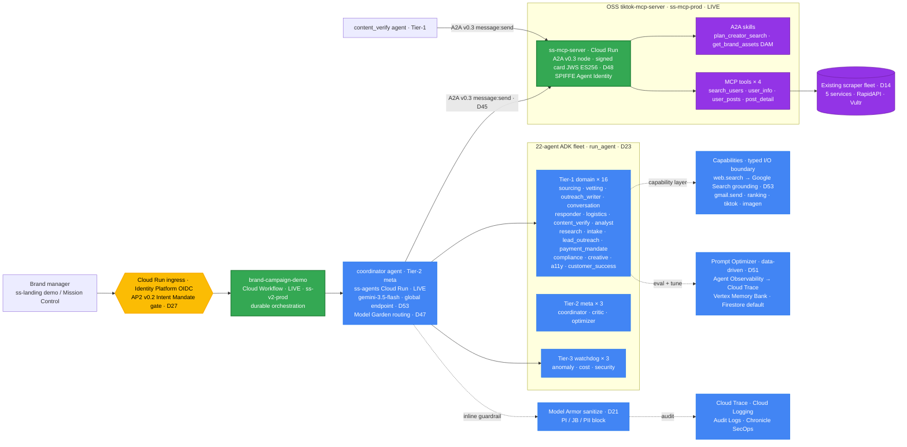
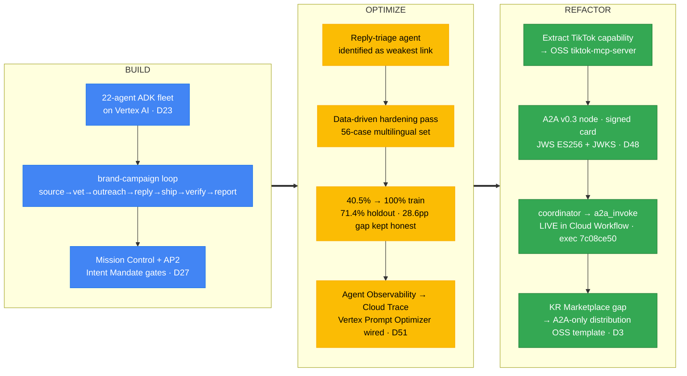
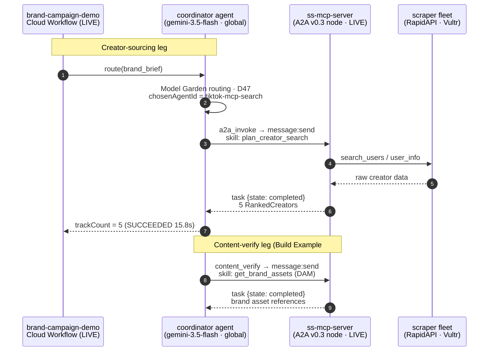

# Social Seeding v2 — an agent-operated TikTok influencer-campaign platform

<p align="center">
  <a href="https://ss-landing-80064221403.us-central1.run.app/demo/"></a>
  <a href="#track-3--the-6-official-requirements"></a>
  <a href="#live-evidence"></a>
  <a href="https://agents.socialseed.ing"></a>
  <a href="https://storage.googleapis.com/ss-social-seeding-v2-docs/index.html"></a>
</p>

> **What it is.** Social Seeding v2 turns a brand brief into a finished TikTok influencer campaign by handing the loop — **source → vet → outreach → reply-handling → ship → verify content → report** — to a fleet of 22 specialized agents, with the human stepping in only at the policy gates they choose to keep on. The dashboard becomes **Mission Control**: a timeline of what the agents did + an approval inbox, not a manual-labor surface.

**Live demo (no install, runs in your browser):** **<https://ss-landing-80064221403.us-central1.run.app/demo/>**

**The Build → Optimize → Refactor arc (Track 3, single grand-narrative submission, D45/D50).** We **built** a 22-agent ADK fleet on Vertex AI that runs the full campaign loop as durable orchestration. We **optimized** its weakest link — the reply-triage agent — with a data-driven hardening pass that lifted routing accuracy 40.5% → 100% on the training set and 71.4% on a held-out adversarial set the rules never saw (28.6pp gap, kept honest). We **refactored** the TikTok capability into a standalone OSS `tiktok-mcp-server` that the coordinator reaches over **A2A v0.3** — an edge that runs **live inside a deployed Cloud Workflow** (execution `7c08ce50`, SUCCEEDED 15.8s, 5 real ranked creators).

---

## The product loop runs itself — live (2026-06-02)

Beyond the challenge-stack A2A path above, the v2 **product** loop now runs end-to-end on its own infrastructure:

- **Mission Control is live** at **<https://agents.socialseed.ing>** with **real Google sign-in** (OAuth → `ss_session` cookie), the campaign timeline + approval inbox, and a Gmail-connect settings page.
- **A self-hosted Inngest durable-orchestration engine** runs on a Compute Engine VM (`ss-inngest`, `docker inngest start` — single binary, no external Postgres/Redis), reached privately from Cloud Run over **Direct VPC egress**. No external SaaS account; signing/event keys are self-generated. It picks up a submitted campaign and drives the durable workflows + crons (brand-campaign · creator-track · lead · pollers).
- The **11 TypeScript product agents** run on the **Vertex AI `global` endpoint via ADC** — no API key, D53-compliant.
- **Proven live:** a submitted campaign flows `submit → sourcing` (real creators from the shared cluster) `→ vetting → approveShortlist` (auto-approved) `→ 3 creator tracks → outreach`, autonomously, on the self-hosted engine.

This shipped with five **measured** root-cause fixes (PRs #46–#50): TS Vertex mode (ADC, no key), env-flag case-fold, a forced-final agent turn, accepting `language: null` on the creator schema (it was silently dropping every creator → sourcing returned zero), and disabling Gemini-3.x thinking so agents emit their JSON instead of burning the output budget.

A further hardening pass (PRs #57–#59), each verified against the live deploy:

- **DB-name default unified to the real prod `instarsearch`**, and a `run-demo` safety guard that only checked the never-existed `social_seeding` — so a live run against the real prod DB was **not actually blocked** — now fails closed on both names.
- **The signed A2A card's `jku` now points at the verified-reachable Cloud Run JWKS.** It had defaulted to a not-yet-cut-over vanity domain (`mcp.socialseed.ing`, 404), so a spec-pure verifier following the card's own `jku` couldn't fetch the key — `verify_card_with_jwks(card, jwks_from_jku)` now passes end-to-end (rev `ss-mcp-server-00015`).
- **Outbound email goes out as `multipart/alternative`** so HTML bodies render — the ADK send path was emitting a lone `text/plain` part, so `<br>` showed literally; fixed + a regression test that decodes the actual Gmail `raw`, then proven on a real send (the received message reads back as `multipart/alternative` with the HTML part intact).

## Documentation (rendered)

Polished, shareable renders — self-contained, open in any browser ([index](https://storage.googleapis.com/ss-social-seeding-v2-docs/index.html)):

- 🏛️ **[System architecture](https://storage.googleapis.com/ss-social-seeding-v2-docs/architecture-current.html)** — color-zoned diagram of both stacks + the live continuous loop.
- 📘 **[Master onboarding manual](https://storage.googleapis.com/ss-social-seeding-v2-docs/onboarding-master.html)** — brief → intermediate → detailed; all 22 ADK + 11 TS agents, capabilities, data model, workflows, A2A, decisions D1–D53.
- 🧰 **[Zero-to-reproduce runbook](https://storage.googleapis.com/ss-social-seeding-v2-docs/onboarding-zero-to-reproduce.html)** — stand the whole thing up from a blank account.
- ⚙️ **[GCP operations manual](https://storage.googleapis.com/ss-social-seeding-v2-docs/gcp-operations-manual.html)** — how it works + team runbook + live evidence.

---

## Architecture

> **Naming (current).** Google's platform is now **Gemini Enterprise Agent Platform** (formerly Vertex AI). We keep "Vertex AI" where it's still the official surface — the model-serving **`global`** endpoint (`aiplatform.googleapis.com`), the Gemini API in Vertex AI, and the Prompt Optimizer — and use **"Agent Runtime"** (formerly "Vertex AI Agent Engine") for the managed agent runtime.

Four Cloud Run / Cloud Workflow components are deployed live (project `ss-v2-prod` / `ss-mcp-prod` / `ss-shared-infra`, Cloud Run ≈ $1–5/mo — `ss-mcp-server` kept warm at `minScale=1`, the rest `min=0`). The diagram below shows the request path: a brand brief enters the `brand-campaign-demo` Cloud Workflow, the **coordinator** (`gemini-3.5-flash`, served on the Vertex **`global`** endpoint, routed through the Model Garden publisher plane) decides who runs, the 22-agent fleet executes, and the creator-sourcing and brand-asset legs cross to the OSS `tiktok-mcp-server` node over **A2A v0.3 `message:send`**.



**Legend** — 🟩 green = **deployed live** (`brand-campaign-demo` Workflow, `ss-agents` + `ss-mcp-server` Cloud Run); 🟦 blue = GCP-managed agent/capability surfaces; 🟪 purple = the OSS `tiktok-mcp-server` node + its skills/tools/scrapers; 🟨 yellow = the trust/policy boundary. Solid edges are the live request path; dashed edges are guardrail / capability / observability side-channels. The fleet split is **16 Tier-1 domain + 3 Tier-2 coordinator·critic·optimizer + 3 Tier-3 anomaly·cost·security watchdogs = 22** (D23). Standalone render source: [`scripts/demo/submission/ARCHITECTURE-track3.mmd`](scripts/demo/submission/ARCHITECTURE-track3.mmd).

---

## The Build → Optimize → Refactor arc



The Optimize chapter is folded into the single Track 3 entry as the "we hardened it" evidence (D50): Agent Observability surfaces a stall, the data-driven pass repairs the triage agent, and the before/after is a committed, re-runnable offline measurement (`scripts/smoke-test/run-hardening-measure.sh`). The live **Prompt Optimizer (data-driven / VAPO)** is the production path and is wired operator-gated (see [`HONEST-SCOPE.md`](scripts/demo/submission/HONEST-SCOPE.md) row 1).

---

## A2A cross-call sequence

Two real A2A v0.3 `message:send` hops cross from the agent fleet to the OSS `tiktok-mcp-server` node. The first ran live inside the `brand-campaign-demo` Cloud Workflow (exec `7c08ce50`); the second makes the official Guide's Build Example #2 (marketing agent → multimodal → A2A → DAM) transport-exact.



Both hops use the same A2A v0.3 `message:send` envelope (`{"message":{"role":"user","parts":[...]}}` → `{"kind":"task","status":{"state":"completed"},"artifacts":[...]}`). The intents are documented in [`gcp-research/refactor-mcp/A2A-INTENTS.md`](gcp-research/refactor-mcp/A2A-INTENTS.md) (Track 3 requirement #6).

---

## Tech stack

| Layer | Choice | Notes |
|---|---|---|
| **Models** | `gemini-3.5-flash` (judgment + coordinator; GA 2026-05-19) + `gemini-3.1-flash-lite` (bulk) | Served on the Vertex **`global`** endpoint. `$1.50/$9.00` and `$0.25/$1.50` per 1M tokens. Gemini-3.x family only — the larger pro tier returns 404 (Preview allowlist not granted in our project), so we use flash; no prior-generation or third-party models remain in the product (D53). |
| **Agent runtime** | Agent Development Kit (ADK) · `run_agent` (curated tools, Zod/Pydantic output contract, USD cap, escalation) | 22-agent fleet (16 domain + 3 meta + 3 watchdog, D23). Routed through the **Model Garden** publisher plane (`publishers/google/models/...`, D47). |
| **Orchestration** | **Cloud Workflows** (`brand-campaign-demo`, LIVE) for the challenge path · **self-hosted Inngest** engine (Compute Engine VM, LIVE) for the TS product loop | Cloud Workflows: coordinator routes, then the workflow does the A2A transport switch. Inngest: durable timers/`waitForEvent`/crons drive brand-campaign · creator-track · pollers, reached privately over Direct VPC egress. |
| **Agent compute** | **Cloud Run** — `ss-agents` (FastAPI `serve.py` over `run_agent`) + `ss-mcp-server` (OSS A2A node) | `ss-agents` `min=0`; `ss-mcp-server` `minScale=1` (kept warm for A2A/demo latency + a stable card-signing key). `ss-landing` (Cloud Run) serves the demo + report. |
| **Inter-agent protocol** | **A2A v0.3** `message:send` + signed agent card (JWS ES256 / RFC 7515, JCS RFC 8785) + JWKS | SPIFFE Agent Identity per agent (D48). |
| **Grounding** | **Google Search grounding** on the `web.search` capability | `gemini-3.5-flash` + built-in `GoogleSearch` tool, cites `grounding_metadata` sources — demonstrated live (D53), not a chat completion. |
| **Guardrails / security** | Model Armor sanitize (PI/JB/PII), `prompt-guard` on user text, Cloud Audit Logs → Chronicle SecOps | D21. |
| **Observability** | Agent Observability → **Cloud Trace** (OTel spans per `run_agent`), token/cost ledger | Gated by `SS_OTEL_ENABLED`. |
| **Memory** | Vertex AI **Memory Bank** (Firestore as zero-config default) | Env-gated managed backend (D51). |
| **Optimization** | Vertex AI **Prompt Optimizer** (data-driven / VAPO), wired operator-gated | D51. |
| **Multimodal** | Imagen 4 (real 1024×1024 sample via standalone script; in-fleet tool W7-staged) | See [`HONEST-SCOPE.md`](scripts/demo/submission/HONEST-SCOPE.md) row 10. |
| **Data (product)** | MongoDB (shared v1 cluster, DB `instarsearch` + v2-owned `v2_*` collections) | The TS app layer reads shared v1 collections (174k creators) + writes `v2_*` additively. The ADK fleet's data plane targets Spanner/AlloyDB/Firestore per the architecture-of-record. |
| **Distribution** | OSS `tiktok-mcp-server` + the **A2A-only distribution** forkable template (`oss/a2a-only-distribution/`) | KR-region Marketplace-payment gap reframed as the innovation contribution (D2/D3). |

---

## Track 3 — the 6 official requirements

| # | Requirement | Status | Proof |
|---|---|---|---|
| ① | **B2B** agent product | ✓ | Multi-tenant autonomous campaign **operator** (runs the loop, takes ~29% of operated spend); ~99.7% ops-cost cut vs agency, **TAM ~$27.5–37.3B media spend** ([`BUSINESS-CASE.md`](scripts/demo/submission/BUSINESS-CASE.md)). |
| ② | Deployed on **Cloud Run** | ✓ | `ss-agents`, `ss-mcp-server`, `ss-landing` all live on Cloud Run (`min=0`); `brand-campaign-demo` on Cloud Workflows. |
| ③ | **Model Garden** LLM routing | ✓ | `projects/ss-v2-prod/locations/us-central1/publishers/google/models/gemini-3.1-flash-lite` returned a validated `CoordinatorOutput`, exit 0; the live workflow coordinator ran with `MODEL_GARDEN_ROUTING=true` (D47). |
| ④ | **A2A v0.3** | ✓ | `coordinator → a2a_invoke → ss-mcp.plan_creator_search` ran live in the Cloud Workflow (exec `7c08ce50`, SUCCEEDED 15.8s, 5 RankedCreators); signed agent card (JWS ES256) + JWKS (D48). |
| ⑤ | **Multi-agent orchestration** (live) | ✓ | 22-agent fleet; the `brand-campaign-demo` Workflow routed coordinator → fleet → A2A → live ss-mcp end-to-end. |
| ⑥ | **A2A intents documentation** + Agent Identity | ✓ | [`A2A-INTENTS.md`](gcp-research/refactor-mcp/A2A-INTENTS.md) (exposed + consumed intents) + SPIFFE Agent Identity ([`AGENT-IDENTITY.md`](gcp-research/refactor-mcp/AGENT-IDENTITY.md), D48). |

---

## Live evidence

> **Reproduce it all in one run:** [`scripts/demo/submission/verify-live-evidence.sh`](scripts/demo/submission/verify-live-evidence.sh) hits the live endpoints and checks the demo, the **signed** agent card, the JWKS, auth enforcement, real ADK ranking, and Model Armor — 7/7 on the last run, captured in [`scripts/demo/assets/live-evidence-2026-05-24.txt`](scripts/demo/assets/live-evidence-2026-05-24.txt).

- **Live demo:** <https://ss-landing-80064221403.us-central1.run.app/demo/> — Lighthouse (desktop) a11y **96** / SEO **100** / best-practices **100** / agentic **100**. ([screenshot](scripts/demo/assets/live-demo-2026-05-24.jpeg))
- **Signed A2A agent card (live):** `curl …/.well-known/agent.json | jq .signatures` → 1 **ES256** JWS; `…/.well-known/jwks.json` → matching key (`kid ss-agent-card-prod`); `securitySchemes` = oidc/oauth/mutualTLS. The card is genuinely signed at the live endpoint (not just on disk).
- **Real ADK ranking (live):** an authenticated `plan_creator_search` on `ss-mcp-server` (rev `00008+`) returns Gemini-`3.5-flash`-ranked creators with non-zero `engagement_rate` + semantic `fit_score` + reasoning (Vertex `global`); no-token → **401**; a jailbreak input is **blocked by Model Armor**.
- **Live A2A-in-workflow execution:** `7c08ce50` / `9cc843c1` — SUCCEEDED, 5 RankedCreators. Evidence: [`scripts/demo/assets/live-orchestration-evidence.md`](scripts/demo/assets/live-orchestration-evidence.md).
- **Model Garden live smoke:** `scripts/smoke-test/run-model-garden-live.sh` (operator ADC) → validated `CoordinatorOutput`, exit 0.
- **Google Search grounding live:** `scripts/smoke-test/run-web-search-grounding.sh` → 5 real K-beauty/TikTok sources with URLs + per-source snippets from `grounding_metadata`.
- **Triage hardening:** `scripts/smoke-test/run-hardening-measure.sh` → 40.5% → 100% train / 71.4% holdout (offline, $0).
- **Gates:** `agents-adk` pytest **2932**; `pnpm test` **449** TS; `pnpm run verify-build` green.
- **Architecture render source:** [`scripts/demo/submission/ARCHITECTURE-track3.mmd`](scripts/demo/submission/ARCHITECTURE-track3.mmd).

---

## Honest scope

Every honesty caveat lives in one place — [`scripts/demo/submission/HONEST-SCOPE.md`](scripts/demo/submission/HONEST-SCOPE.md) (production path vs shipped-for-judging, per feature, with the re-runnable proof command). In short: most surfaces are **GA-real** (code real, offline tests green; going live is an operator ADC/billing step), the A2A-in-workflow / Model Garden / Search-grounding rows are **demonstrated-live**, and the only items not in our control are the **3 Google-gated** ones: `*-pro` Preview not granted (we use `gemini-3.5-flash`), Agent Gateway mTLS is in **Private Preview**, and Gemini Enterprise enrollment is on Google's allowlist (O7 — **not required for judging**, since the signed A2A card + JWKS make the agent discoverable today).

---

## Live demo (no install)

The hosted walkthrough simulates a real mouse session over Mission Control: brand brief intake → 22-agent fleet → AP2 mandate signing → multimodal creative → reply classification → cost ledger. Toggle 4 locales (ko / en / ja / zh-CN), adjust playback `0.5×` ~ `8×`, jump to any of 24 scenes.

👉 **[https://ss-landing-80064221403.us-central1.run.app/demo/](https://ss-landing-80064221403.us-central1.run.app/demo/)**

> **Hosting**: Cloud Run on `ss-shared-infra` (us-central1, min=0 / max=10, 256Mi). Source: `site/`. Re-deploy: `cd site && gcloud run deploy ss-landing --source=. --project=ss-shared-infra --region=us-central1 --allow-unauthenticated --quiet`. Total cost target: < $1/month at demo traffic.

---

> **For LLMs picking this up**: jump to [§ For agents picking up the codebase](#for-agents-picking-up-the-codebase). State: `docs/STATUS.md` → `HANDOFF.md` → `CLAUDE.md` → `docs/ARCHITECTURE.md`.
> **For team members**: jump to [§ TL;DR — what's running, what works](#tldr--whats-running-what-works) then [§ An end-to-end run actually looks like this](#an-end-to-end-run-actually-looks-like-this).

> The product shift, in one line: v1 was a *tool dashboard* (the human clicked through a 6-step board and hand-wrote emails); v2 makes **the agent the operator** and the human reviews at the gates. Rewrite of [`Two-Weeks-Team/social-seeding`](https://github.com/Two-Weeks-Team/social-seeding) (v1, frozen 2026-05-13 — see that repo's `FREEZE.md`).

---

## TL;DR — what's running, what works

```
Status        Phases 0–6 shipped (autonomous build, verified by live demo)
Tests         449 vitest passing (77 web · 64 agents · 191 capabilities · 113 workflows · 4 observability) + 2932 pytest
Inngest       10 functions registered (brand-campaign, creator-track, lead-campaign,
              lead-track, campaign-progression, gmail-watch-renew, report-deliver,
              report-deliver-cron, shipment-tracking-poller, tiktok-post-poller)
Mongo         23 indexes on 14 v2_* collections + 13 SHARED_* read-only carry-overs from v1
verify-build  green (lint + next build + tsc across 7 packages)
Live demo     2026-05-14/15 — full loop verified end-to-end:
                · brand brief → sourcing agent (gemini-3.5-flash) → 4 candidates
                · vetting agent (gemini-3.5-flash × 4 fan-out) → 2 shortlisted
                · approveShortlist gate → operator approved
                · creator-track → outreach-writer (gemini-3.5-flash tournament) → Korean email
                · approveOutreachSend gate → operator approved
                · gmail.send → ACTUAL email sent (msgId 19e264a093c97c8e)
                · reply received → classify-reply (gemini-3.1-flash-lite, "interested") → respond (gemini-3.5-flash)
                · two follow-up emails on the same Gmail thread
                · final reply with shipping address → logistics (gemini-3.1-flash-lite) → shipment.create
                · ↑ deferred at the carrier integration boundary (YUNTRACK)
```

**Next iteration**: v4 ([`Two-Weeks-Team/social-seeding-v4`](https://github.com/Two-Weeks-Team/social-seeding-v4)) — greenfield rewrite that turns the hardcoded Inngest workflows here into editable `WorkflowDefinition` data + a single-page canvas. Phases 0–5 done. v2 remains the **running production demo**.

---

## Quick start

```bash
pnpm install
cp .env.example .env.local            # MONGODB_URI, AUTH_*, GEMINI_API_KEY, GOOGLE_*, INNGEST_*
pnpm run verify-build                  # lint → next build → tsc --noEmit (must stay green)
pnpm run dev-mongo                     # mongodb-memory-server :27027
pnpm exec tsx scripts/init-indexes.ts  # provision v2_* indexes (idempotent)
pnpm --filter @ss/web dev              # Mission Control :3000
npx inngest-cli@latest dev             # workflow runtime :8288

# End-to-end demo:
pnpm exec tsx scripts/run-demo.ts --dry-run --type=brand    # env preflight only
pnpm exec tsx scripts/run-demo.ts --type=brand              # live brand-campaign
pnpm exec tsx scripts/run-demo.ts --type=lead               # sales-lead loop
```

Mission Control:
- `/sign-in` → click "테스트 세션으로 로그인" (dev-only button) → `/campaigns`
- `/campaigns/<id>` → timeline view + approval inbox sidebar
- `/campaigns/<id>?view=canvas` → React Flow workflow visualization
- `/approvals`, `/policies`, `/usage`, `/leads`, `/share/<id>` — operator surfaces

---

## Why a new repo (not a renewal)

v1 accumulated 3 years of strata — multi-SNS→TikTok, Express→Go→Next.js, Polar→NicePay, 4-phase workspace ACL, 5-phase rate limit, i18n pipeline — 266+ API routes, ~100 lib files, migration flags, dual-key helpers, a half-built `workflow-automation.ts` with no durable engine under it, and a Go/LangGraph backend being re-absorbed into Next.js. The *product model itself* ("human = operator") is what needs to change, so we start clean — but **carry the hard-won domain assets** (TikTok ranking algos, the `cold-mail` agent pipeline, Gmail integration, CRM enrichment, billing). See [`docs/CAPABILITIES.md`](docs/CAPABILITIES.md) for the v1→v2 mapping.

## Key decisions (2026-05-13)

| Decision | Choice | Rationale |
|---|---|---|
| Orchestration engine | **Inngest** | Serverless/Vercel-friendly durable execution: `step.run` (atomic + retried), `step.sleep` (durable timers — "follow up in 3 days"), `step.waitForEvent` (block on a human approval or a Gmail reply without holding a process). State survives deploys. |
| Autonomy | **Staged** | Ships with every gate ON (`checkpointed`). Owners relax gates one at a time, per workspace → `autonomous`. Gates & budgets live in [`packages/contracts/src/policy.ts`](packages/contracts/src/policy.ts). |
| Database | **Same MongoDB Atlas cluster as v1** | Creator data, campaign history, CRM, blacklist, Gmail tokens carry over with zero migration. v2 reads v1-owned collections and owns new `v2_*` collections. v1 must not make breaking schema changes while both run. |
| Agents | **Agent runtime (`run_agent`)** | Agents are *functions the workflow invokes* (curated tool set, structured output, budget cap, escalation) — not free ReAct loops. This generalizes v1's `cold-mail` evaluator-optimizer pattern. Model routing (D53): `gemini-3.5-flash` for judgment, `gemini-3.1-flash-lite` for bulk classification, on the Vertex `global` endpoint. |
| Human checkpoints | **5 explicit gate kinds** | `approveShortlist`, `approveOutreachSend`, `approveReplyResponse`, `approveShipment`, `approveStageAdvance`. Each has its own MC drill-in (e.g. shortlist shows a candidate table with fitScore bars; outreach shows the email preview with 4 judge scores). |

---

## An end-to-end run actually looks like this

```
1. Operator submits a brief → /campaigns/new
   ↳ Brand: "Hydra Demo Serum", category: skincare/serum
   ↳ Targeting: 3 creators, KO language, hashtags [스킨케어, kbeauty]
   ↳ Goals: 2 verified posts in 30 days
   ↳ campaign/submitted event fires

2. brand-campaign Inngest function picks it up
   ↳ step.run("source") → runAgent(sourcingAgent)
        ↳ gemini-3.5-flash with tiktok.search + blacklist.check tools
        ↳ Plans 2-4 search queries, executes them, dedupes
        ↳ Returns { candidates: [4 creators], queriesUsed, coverageNote }
   ↳ step.run("vet-{i}") × N → runAgent(vettingAgent) per candidate (parallel)
        ↳ gemini-3.5-flash with tiktok.getCreator + ranking.score
        ↳ Returns { creator, fitScore, flags, matchReasons }
   ↳ pickShortlist (deterministic, top ceil(creatorCount * 1.5), drop hard-fail flags)

3. gate(approveShortlist) → step.waitForEvent
   ↳ Creates v2_approvals row with the shortlist
   ↳ Pauses durably (state in Inngest, no Node process held)
   ↳ MC inbox shows it → operator clicks /approvals/<id> →
     reviews candidate table → "전체 승인" → /api/approvals/<id>/resolve →
     approval/resolved event → workflow resumes

4. brand-campaign fan-out
   ↳ persist tracks (v2_creator_tracks)
   ↳ step.sendEvent("creator-track-fanout") — one CreatorTrackStart per creator

5. creator-track Inngest function (one per shortlisted creator)
   ↳ step.run("plan") → load workspace policy + creator
   ↳ step.run("extract-facts") → outreach.extractFacts capability
   ↳ step.run("draft-outreach") → runAgent(outreachWriterAgent)
        ↳ gemini-3.5-flash tournament: 5 angles × 4 judges
          (brand / conversion / deliverability / skeptic)
        ↳ Returns winning draft + judgeScores + spamScore + groundedFacts
   ↳ gate(approveOutreachSend) → MC drill-in shows subject/body preview +
     judge bars + grounded facts + editable subject/body
   ↳ operator approves (optionally edits) → workflow resumes
   ↳ step.run("send-outreach") → capabilities.gmail.send
        ↳ Real Gmail API via googleapis SDK (user's refresh_token)
        ↳ Returns { messageId, threadId, scheduled: false, spamScore }
   ↳ step.run("outreach-sent-mark") → patch creator-track state
   ↳ step.waitForEvent("await-reply") — 3-day timeout

6. Recipient replies → Gmail Pub/Sub webhook → /api/webhooks/gmail
   ↳ Verifies push token, walks gmail.history, normalizes message
   ↳ Emits gmail/reply.received with { campaignId, creatorId, threadId, ... }
   ↳ creator-track's waitForEvent matches → workflow resumes

7. creator-track continues:
   ↳ step.run("classify-reply") → runAgent(conversationAgent / gemini-3.1-flash-lite)
        ↳ Returns { classification: "interested" | "send_sample" | "negotiating" |
                    "declined" | "unsubscribe" | "not_now" | "out_of_office" |
                    "unrelated", extracted: { question?, shippingAddress?,
                    proposedRateUsd? } }
   ↳ Branch by classification:
        · interested + shippingAddress → runShippingAndContentReview leg
        · interested (no address)      → draft-response leg (responder agent)
        · negotiating                  → forced escalate via reply_response gate
        · declined / unsubscribe       → terminal + suppression.add (CAN-SPAM)
        · others                       → terminal in_conversation

8. Shipping leg (interested + shippingAddress):
   ↳ gate(approveShipment) → MC drill-in: address + product manifest
   ↳ step.run("create-shipment") → runAgent(logisticsAgent / gemini-3.1-flash-lite)
        ↳ Parses free-text Korean address → structured fields
        ↳ Calls shipment.create capability → carrier (YUNTRACK, currently deferred)
   ↳ step.waitForEvent("shipment-tracking-updated") — 14-day timeout
   ↳ On terminal carrier status, branch:
        · delivered                 → continue to content review
        · cancelled/failed/returned → terminal shipment_failed

9. Content review leg:
   ↳ step.waitForEvent("tiktok-post-detected") — 14-day timeout
        (tiktok-post-poller cron emits this when it detects a matching post)
   ↳ step.run("verify-content") → runAgent(contentVerifyAgent / gemini-3.1-flash-lite)
        ↳ Checks: brand mentioned + ToS-compliant + matches expected post style
        ↳ Returns { matches: true|false, rationale }
   ↳ matches: true  → terminal verified
   ↳ matches: false → terminal flaked (with rationale)

10. Campaign completion:
    ↳ campaign-progression cron daily checks for campaigns with all tracks terminal
    ↳ When done → step.run("generate-report") → runAgent(analystAgent / gemini-3.5-flash)
    ↳ /share/<id> generates a public report (no-auth, signed token)
```

The same shape applies to **lead-campaign** (sales B2B) — outreach to companies via `lead-track`, classified by `conversationAgent`, drafted by `leadOutreachWriterAgent`. See `packages/workflows/src/workflows/lead-campaign.ts`.

---

## Repo layout (Turborepo + pnpm workspaces)

```
apps/
  web/                  Next.js 16 — Mission Control UI + webhook receivers + /api/inngest serve
                        - app/(mission-control)/{campaigns,leads,approvals,policies,usage,share}
                        - app/api/{auth/test-login, approvals/[id]/resolve, inngest,
                                    webhooks/gmail, webhooks/nicepay}
                        - components/mission-control/{sidebar, stage-bar, activity-timeline,
                                                       campaign-canvas, campaign-track-buckets}
                        - components/ui/{button, card, badge}
packages/
  contracts/            Zod schemas — single source of truth (campaign, creator, outreach,
                        policy, shipment, events, analytics, report, lead)
  db/                   MongoDB client + 8 repositories (campaign, approval, lead, creator,
                        report, shipment, trace, workspace) + v1-workspace importer
  capabilities/         13 capability families — the typed functions HTTP + agents both call:
                        analytics · blacklist · crm · gmail (client/send/watch/reply) ·
                        outreach (extractFacts/judge/render) · ranking · shipment (create/
                        track/carrier-yuntrack) · suppression · templates · tiktok (search/
                        getCreator/fetcher-rapidapi) · workspace · usage · prompt-guard
  agents/               11 agent definitions + runAgent runtime (budget, tracing, escalation,
                        pseudo-tool-call recovery):
                        sourcing · vetting · outreach-writer · lead-outreach-writer ·
                        conversation · conversation-responder · logistics · content-verify ·
                        analyst · research · intake
                        NOTE: these 11 are the TS product agents (the Inngest/Mission-Control
                        loop). The "22-agent ADK fleet" cited above is the separate Track-3
                        submission surface in `packages/agents-adk` (16 Tier-1 domain + 3 Tier-2
                        meta + 3 Tier-3 watchdog, D23) — two stacks, not one count restated.
  workflows/            9 Inngest function definitions:
                        brand-campaign · creator-track · lead-campaign · lead-track ·
                        campaign-progression · gmail-watch-renew · report-deliver ·
                        report-deliver-cron · shipment-tracking-poller · tiktok-post-poller
  observability/        per-run trace recorder + token/cost ledger
  config/               shared tsconfig + eslint preset
docs/
  STATUS.md             one-screen heartbeat (read first when picking up)
  ARCHITECTURE.md       6-layer model, orchestrator↔agent split
  CAPABILITIES.md       v1 → v2 feature mapping
  ROADMAP.md            Phases 0–6
  PHASE-1-PLAN.md       Phase 1 task list with DoD (kept for traceability)
  SMOKE-TEST*.md        per-phase credential-free smoke runbook
  V3-UI-COMPARISON.md   2026-05-15 audit of ~/social-seeding-v3 vs v2 MC
  V4-PLAN.md            2026-05-15 master plan for the v4 greenfield rewrite
scripts/
  run-demo.ts           operator end-to-end demo (--type=brand|lead, --dry-run)
  init-indexes.ts       provision v2_* Mongo indexes (idempotent)
  dev-mongo.ts          mongodb-memory-server runner
HANDOFF.md              append-only per-chunk log (every P0-P6-Cx)
CLAUDE.md               agent-facing context (read this if you're an LLM)
```

---

## Where to look in code (LLM-friendly map)

| Want to understand… | Read this |
|---|---|
| How a campaign runs end-to-end | `packages/workflows/src/workflows/brand-campaign.ts` (218 lines) |
| How one creator's lifecycle runs | `packages/workflows/src/workflows/creator-track.ts` (945 lines — the real density) |
| What the sourcing agent actually does | `packages/agents/src/sourcing.agent.ts` + `runtime.ts` |
| How tool calls work (pseudo-tool-call lesson) | `packages/agents/src/runtime.ts` (see "// tool loop") |
| What a gate does | `packages/workflows/src/gate.ts` (167 lines) |
| How Gmail send is wired | `packages/capabilities/src/gmail/{client,send,reply,watch}.ts` |
| How the operator approves a shortlist | `apps/web/app/(mission-control)/approvals/[id]/page.tsx` |
| What the timeline view renders | `apps/web/components/mission-control/activity-timeline.tsx` |
| What the canvas view renders | `apps/web/components/mission-control/campaign-canvas.tsx` |
| The 5 gate-kind contracts | `packages/contracts/src/policy.ts` + `events.ts` |
| Mongo collection names + indexes | `packages/db/src/collections.ts` + `scripts/init-indexes.ts` |
| v1 import (workspace policies) | `packages/db/src/imports/v1-workspaces.ts` |

---

## Conventions

- **One commit per task**, small diffs, message references the phase tag (`P0-1:`, `P3-C5:`, …)
- **`pnpm run verify-build` must stay green** — never push red.
- **`codex review --base main`** before pushing `src/`/`packages/` changes (reduces review-bot rounds).
- **No unrelated changes** in a task's diff (no drive-by cleanup).
- **Shared v1 Atlas collections** (`accounts_tiktok`, `blacklist`, `workspaces`, `user_tokens`, `crm_accounts`, `templates`, `unified_emails`, …): read freely; **write additive fields only**; never remove/retype. v2 owns `v2_*`.
- Agents = functions the workflow invokes (curated tools, Zod output, USD cap, escalation), never free loops.
- `prompt-guard` runs on user text before it reaches any agent prompt; `external_send`-scoped capabilities (`gmail.send`) never fire without a cleared policy gate.

---

## For agents picking up the codebase

If you're an LLM continuing development on v2:

1. **Read in order**: [`CLAUDE.md`](CLAUDE.md) → [`docs/STATUS.md`](docs/STATUS.md) → [`HANDOFF.md`](HANDOFF.md) tail → [`docs/ARCHITECTURE.md`](docs/ARCHITECTURE.md) → relevant `docs/SMOKE-TEST-Pn.md` for the phase you're touching.
2. **Memory dir**: `~/.claude/projects/<this-repo-path-slug>/memory/` (Claude derives the slug from the absolute repo path) — may hold decisions like `autonomous-phase-progression`, `goal-4000-char-limit`, `p6-operator-decisions-2026-05-14`, `v3-prototype-comparison`.
3. **The 10 hard-won lessons** from this session's live demo are encoded in **v4's `docs/V2-LESSONS-LEARNED.md`** (the v4 repo is at [Two-Weeks-Team/social-seeding-v4](https://github.com/Two-Weeks-Team/social-seeding-v4)). Before re-implementing anything agent-runtime / Inngest / Gmail-related, **read that file** — it'll save days of rediscovery. Examples:
   - Inngest `step.waitForEvent` `if:` expression must use `async.data.X`, not `event.data.X`
   - The judgment model emits pseudo-tool-calls as text when `tool_choice: "any"` isn't forced on turn 1
   - Sourcing agent prompt must say "RUN EACH PLANNED QUERY" or the model escalates after 1 search
   - Agent `maxUsd` caps for the judgment tier need ≥$1.0 with tools (early defaults were 2–4× too low)
   - Logistics agent system prompt must render the `products` array — else the bulk model hallucinates "products_missing"
4. **Run pattern**: every change ends with `pnpm run verify-build` green + a commit tagged with the phase ID.
5. **Don't touch shared v1 collections destructively** — additive only.

---

## Read next

1. [`docs/STATUS.md`](docs/STATUS.md) — current state heartbeat
2. [`docs/ARCHITECTURE.md`](docs/ARCHITECTURE.md) — 6-layer model with diagrams
3. [`docs/CAPABILITIES.md`](docs/CAPABILITIES.md) — v1→v2 migration inventory
4. [`docs/AGENTS.md`](docs/AGENTS.md) — agent roster, tool sets, output contracts
5. [`docs/ROADMAP.md`](docs/ROADMAP.md) — phase-by-phase scope
6. [`docs/V3-UI-COMPARISON.md`](docs/V3-UI-COMPARISON.md) — why v4 exists
7. [`docs/V4-PLAN.md`](docs/V4-PLAN.md) — the greenfield rewrite plan (mirrored in [v4 repo](https://github.com/Two-Weeks-Team/social-seeding-v4))
8. [`HANDOFF.md`](HANDOFF.md) — granular per-chunk history

---

## Sibling repos

- **v4** ([Two-Weeks-Team/social-seeding-v4](https://github.com/Two-Weeks-Team/social-seeding-v4)) — greenfield rewrite, workflow-as-data + single-page canvas. Phases 0–5 done.
- **v1** ([Two-Weeks-Team/social-seeding](https://github.com/Two-Weeks-Team/social-seeding)) — the tool-dashboard origin (frozen 2026-05-13). See its `FREEZE.md`.

## License

Private / internal — `Two-Weeks-Team`.
