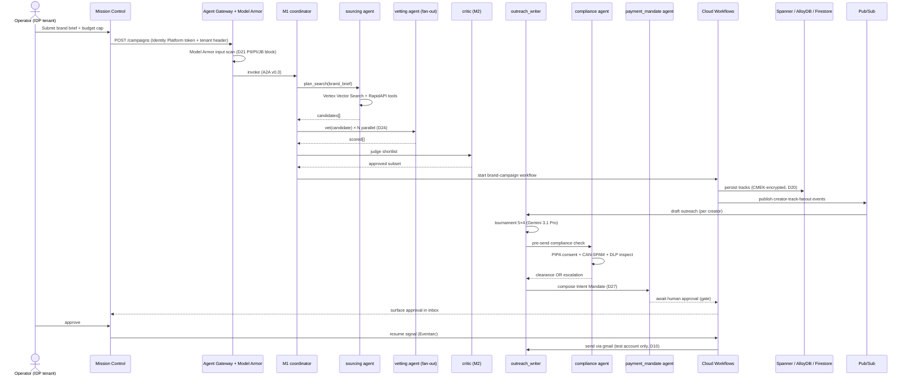
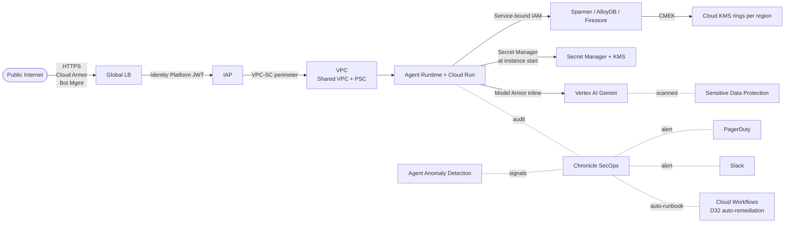
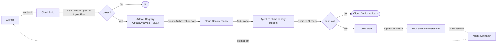

# ARCHITECTURE.md — Topology derived from DECISIONS.md

> **Authority**: This file describes the system **as decided**. It does NOT prescribe new behavior; everything here cites a D-ID from [`DECISIONS.md`](DECISIONS.md). If a diagram conflicts with a decision, the decision wins.
>
> **Audience**: Implementing agents (background fleet) + code reviewers + judges.

---

## 1. System map (Mermaid)

```mermaid
flowchart TB
  subgraph CLIENT[User surfaces — D26]
    MC[Mission Control<br/>Next.js 16<br/>Firebase App Hosting]
    DCX[Dialogflow CX Chat]
    PWA[Mobile PWA<br/>React Native Expo]
  end

  subgraph EDGE[Edge — Global Active-Active D13]
    GLB[Global LB + Cloud CDN]
    CA[Cloud Armor + Bot Mgmt]
    IAP[IAP]
  end

  subgraph IDENTITY[Identity — D19]
    IDP[Identity Platform<br/>multi-tenant]
    WIF[Workforce IF — staff]
    AID[Agent Identity SPIFFE]
  end

  subgraph GATEWAY[Agent Gateway — D32]
    AG[Agent Gateway<br/>Private Preview]
    MA[Model Armor max policy — D21]
  end

  subgraph FLEET[Agent fleet — D23-D25]
    T1[Tier 1 Domain × 16<br/>sourcing · vetting · outreach_writer · conversation ·<br/>responder · logistics · content_verify · analyst ·<br/>research · intake · lead_outreach · payment_mandate ·<br/>compliance · creative · a11y · customer_success]
    T2[Tier 2 Meta × 3<br/>coordinator · critic · optimizer]
    T3[Tier 3 Watchdog × 3<br/>anomaly · cost · security]
  end

  subgraph RUNTIME[Runtime — D17]
    AR[Agent Runtime<br/>managed · sub-second cold]
    AS[Agent Sandbox<br/>GKE Autopilot · gVisor]
    AMB[Agent Memory Bank<br/>Firestore-backed]
    ASES[Agent Sessions]
  end

  subgraph ORCH[Orchestration — D18]
    WF[Cloud Workflows<br/>durable timers + correlation]
    PS[Pub/Sub fan-out]
    CT[Cloud Tasks retry]
    EA[Eventarc Advanced]
  end

  subgraph DATA[Data plane — D15/D16/D33]
    SP[(Spanner Multi-region<br/>core + tenant + billing)]
    AL[(AlloyDB AI<br/>analytics + feature store)]
    FS[(Firestore Native<br/>Memory Bank backing)]
    VV[Vertex AI Vector Search<br/>creator + brand embeddings]
    BQ[(BigQuery<br/>analytics + BQ ML)]
    CS[Cloud Storage<br/>assets + audit archive]
    MS[Memorystore Valkey 8<br/>hot cache + vector cache]
  end

  subgraph AI[Specialized AI]
    GEM[Gemini 3.5 Flash judgment + 3.1 Flash-Lite bulk · global endpoint — D53 supersedes D5]
    IM[Imagen 4]
    VE[Veo 3]
    LY[Lyria]
    DOC[Document AI]
    VIS[Vision AI]
    TR[Translation API]
    STT[Speech-to-Text]
    TTS[Text-to-Speech]
  end

  subgraph EXTERN[External — D14]
    RAPI[RapidAPI<br/>TikTok + Instagram]
    GMAIL[Gmail API<br/>test-account-only D10]
    AP2P[AP2 Payment Partners<br/>Intent Mandate only D27]
  end

  subgraph DEVOPS[DevOps — D35-D38]
    CB[Cloud Build]
    AR2[Artifact Registry + SLSA]
    CD[Cloud Deploy canary]
    BA[Binary Authorization]
    CW[Cloud Workstations]
    GCA[Gemini Code Assist Enterprise]
  end

  subgraph SEC[Security — D20-D22]
    SM[Secret Manager]
    KMS[Cloud KMS CMEK + HSM]
    DLP[Sensitive Data Protection]
    SCC[Security Command Center<br/>AI Protection]
    CHR[Chronicle SecOps — D32]
    BNZ[Binary Authorization]
    CVM[Confidential VM/GKE]
  end

  subgraph OBS[Observability — D31/D32]
    CL[Cloud Logging + Log Analytics]
    CM[Cloud Monitoring]
    MP[Managed Prometheus]
    MG[Managed Grafana]
    CTR[Cloud Trace + Profiler]
    ER[Error Reporting]
    AO[Agent Observability]
    AE[Agent Evaluation — D25/D37]
    AOPT[Agent Optimizer — D25]
    ASIM[Agent Simulation — D25/D37]
    AAD[Agent Anomaly Detection — D23]
  end

  CLIENT --> GLB
  GLB --> CA --> IAP --> AG
  IDP --> AG
  WIF --> AG
  AG --> MA
  MA --> T1
  T1 --> AR
  T2 --> AR
  T3 --> AR
  AR --> AMB
  AR --> ASES
  AR --> GEM
  AR --> VV
  AR --> AS
  T1 -.uses.-> AI
  T2 -.coordinates.-> T1
  T3 -.watches.-> T1
  T3 -.watches.-> T2
  AR --> ORCH
  ORCH --> SP
  ORCH --> AL
  ORCH --> FS
  ORCH --> BQ
  ORCH --> CS
  AR --> MS
  AR -.audit.-> CHR
  AR -.metrics.-> AO
  AO --> AE
  AO --> AOPT
  AOPT --> ASIM
  ASIM --> AR
  AAD --> T3
  T1 -.RapidAPI.-> RAPI
  T1 -.Gmail.-> GMAIL
  T1 -.AP2.-> AP2P
  AR2 --> AR
  CB --> AR2
  CD --> AR
  BA --> CD
  GCA --> CW
  KMS -.encrypts.-> SP
  KMS -.encrypts.-> AL
  KMS -.encrypts.-> FS
  KMS -.encrypts.-> CS
  KMS -.encrypts.-> BQ
  SM --> AR
  DLP -.scans.-> CL
  SCC --> AAD
  CVM -.PII workloads.-> AR
```

---

## 2. Per-region resource matrix (D13: Global active-active)

| Resource | `us-central1` | `europe-west4` | `asia-northeast3` (Seoul) | Notes |
|---|---|---|---|---|
| Spanner config | `nam-eur-asia1` multi-region (Spanner spans all three) | — | — | Single Spanner instance, 5×9 strong consistency |
| AlloyDB AI cluster | ✓ regional | ✓ regional | ✓ regional | Per-region read replicas; cross-region async via Datastream |
| Firestore Native | `nam5` (regional) | `eur3` (regional) | `asia-northeast3` (regional) | Memory Bank backing; CMEK per region |
| Vertex AI Vector Search index | ✓ | ✓ | ✓ | Replicated build pipeline via Cloud Build matrix |
| Agent Runtime endpoints | ✓ | ✓ | ✓ | Customer routed via Global LB latency-based |
| Cloud Workflows + Eventarc | ✓ | ✓ | ✓ | Pub/Sub topic spans regions; subscribers regional |
| Memorystore Valkey 8 | ✓ | ✓ | ✓ | Vector + session cache; no cross-region replication needed |
| Cloud Storage bucket | Multi-region `nam` | Multi-region `eu` | Dual-region `asia-northeast3+asia-east2` | Asset replication: `gcs.replication` policy |
| Identity Platform tenant | — | — | — | Identity Platform is global-only |
| Cloud KMS keyring | ✓ | ✓ | ✓ | CMEK keys per region; HSM optional |
| Cloud Run worker pools (non-agent services) | ✓ | ✓ | ✓ | Webhook receivers, image pre-processors, scrape fan-out |
| GKE Autopilot (Agent Sandbox + GPU) | ✓ (H100) | ✓ (A3) | ✓ (A3) | For Veo/Imagen generation; sandboxed code execution |

---

## 3. Per-agent service mapping (D23/D25)

| Agent | Tier | Default model | Tools (capabilities) | Memory | Eval criteria |
|---|---|---|---|---|---|
| `sourcing` | 1 | Gemini 3.1 Pro | `rapidapi.tiktok_search`, `rapidapi.instagram_search`, `blacklist.check`, `vector_search.creator` | Session + Memory Bank | trajectory + coverage |
| `vetting` | 1 | Gemini 3.1 Pro (parallel) | `rapidapi.get_user_info`, `ranking.score`, `vector_search.brand_fit` | Session | tool_trajectory_avg_score |
| `outreach_writer` | 1 | Gemini 3.1 Pro tournament | `templates.list`, `outreach.extract_facts`, `outreach.render`, `outreach.judge` | Memory Bank (style adapt) | response_match_v2 + spam_score |
| `conversation` | 1 | Gemini 3.1 Flash-Lite | `nlp.classify_intent` | Session | classification_f1 |
| `conversation_responder` | 1 | Gemini 3.1 Pro | `templates.list`, `outreach.render` | Memory Bank | response_match_v2 |
| `logistics` | 1 | Gemini 3.1 Flash-Lite | `address.normalize`, `carrier.create` | Session | structured_extract_accuracy |
| `content_verify` | 1 | Gemini 3.1 Flash-Lite multimodal | `rapidapi.post_detail`, `vision.brand_logo_detect` | None | precision + recall vs holdout |
| `analyst` | 1 | Gemini 3.1 Pro | `bigquery.query`, `view_metrics.aggregate` | Memory Bank | accuracy + grounding score |
| `research` | 1 | Gemini 3.1 Pro | `web.search` (Google grounding), `vector_search.competitor` | Memory Bank | hallucinations_v1 |
| `intake` | 1 | Gemini 3.1 Flash-Lite | `forms.upsert` | Session | task_completion |
| `lead_outreach_writer` | 1 | Gemini 3.1 Pro | `templates.list`, `outreach.render`, `crm.enrich` | Memory Bank | response_match_v2 |
| `payment_mandate` (NEW) | 1 | Gemini 3.1 Flash-Lite | `ap2.compose_intent_mandate`, `gate.approveOutreachSend` | Session | mandate_validity |
| `compliance` (NEW) | 1 | Gemini 3.1 Pro | `pipa.check_consent`, `canspam.check_unsubscribe`, `dlp.inspect` | Memory Bank | precision (no false-clear) |
| `creative` (NEW) | 1 | Gemini 3.1 Pro + Imagen 4 + Veo 3 | `imagen.generate`, `veo.generate`, `lyria.generate`, `assets.upload` | Memory Bank (brand) | safety_v1 + brand_consistency |
| `a11y` (NEW) | 1 | Gemini 3.1 Flash-Lite | `vision.describe`, `stt.transcribe`, `tts.synthesize`, `translation.translate` | None | a11y_compliance_score |
| `customer_success` (NEW) | 1 | Gemini 3.1 Pro | `analytics.funnel`, `intervention.propose` | Memory Bank (per-customer) | activation_lift |
| `coordinator` (M1) | 2 | Gemini 3.1 Flash-Lite | `agent_registry.list`, `a2a.invoke` | Session | routing_accuracy |
| `critic` (M2) | 2 | Gemini 3.1 Pro | `evaluation.score`, `gate.escalate` | None | judge_agreement_v_human |
| `optimizer` (M3) | 2 | Gemini 3.1 Pro | `agent_optimizer.tune`, `prompt_registry.update` | None | offline_eval_lift |
| `anomaly_watch` (W1) | 3 | Gemini 3.1 Flash-Lite | `metrics.query`, `runbook.execute` | None | precision (alert vs false) |
| `cost_watch` (W2) | 3 | rule-based (no LLM, but agent-shaped for D23 consistency) | `billing.query`, `pubsub.alert` | None | latency to alert |
| `security_watch` (W3) | 3 | Gemini 3.1 Flash-Lite | `model_armor.query_blocks`, `chronicle.query`, `tenant.quarantine` | None | TTR (time to remediate) |

**Total: 22 agents** (16 domain + 3 meta + 3 watchdog) per D23.

---

## 4. Data flow — canonical campaign run

Combines D11 (influencer domain), D12 (multi-tenant + AP2), D17/D18 (Runtime + Workflows), D20/D21 (CMEK + Model Armor), D27 (AP2 Intent only):

---

## 5. Security perimeter

Per D19/D20/D21/D22/D32:

**Defense in depth**:
1. **Edge**: Cloud CDN + Cloud Armor (D21 inherits adaptive protection) + Bot Mgmt
2. **Identity**: Identity Platform (customer) + Workforce IF (staff) + Agent Identity (SPIFFE) per workload
3. **Network**: VPC-SC perimeter; Private Service Connect for any GCP API call from agent runtime
4. **Model layer**: Model Armor max policy (D21) inline on every Vertex AI call
5. **Data**: CMEK on Spanner / AlloyDB / Firestore / Cloud Storage / BigQuery; DLP scans logs and outputs
6. **Audit**: Cloud Audit Logs → BigQuery sink (90-day retention per D33) → Chronicle SIEM
7. **Code supply chain**: Binary Authorization gates on Cloud Deploy; SLSA L3 attestation on Artifact Registry

---

## 6. Observability stack (D31/D32/D37)

| Signal | Producer | Sink | Consumer |
|---|---|---|---|
| Agent reasoning trace | Agent Runtime + OpenTelemetry | Cloud Trace | Agent Observability dashboard |
| Token + cost per call | OTLP exporter | Cloud Monitoring custom metric `agent.tokens.input/output` + `agent.cost.usd` | Grafana dashboard + cost_watch (W2) |
| LLM eval score | Agent Evaluation pipeline | BigQuery `agent_evals` table | Grafana + critic (M2) |
| Errors + stack traces | All services | Error Reporting | PagerDuty + Slack |
| Latency p50/p95/p99 | Cloud Run + Agent Runtime | Cloud Monitoring SLI | SLO burn rate alert (D31) |
| Audit logs | Cloud Audit Logs | BigQuery `audit_logs` + Cloud Logging | Chronicle SecOps (D32) |
| Model Armor blocks | Model Armor | Cloud Logging + Pub/Sub | security_watch (W3) |
| Anomaly signals | Agent Anomaly Detection | Pub/Sub | anomaly_watch (W1) + Workflows runbooks |
| Demo reproducibility | Custom recorder (D30) | Cloud Storage replay bucket | judge replay UI |

---

## 7. Build pipeline (D35/D37)

Per D37, each PR runs:
1. ESLint + TypeScript type-check (capabilities, contracts)
2. Vitest (capabilities + workflows)
3. pytest (agents)
4. Vertex AI Agent Evaluation against golden set
5. Chaos engineering (subset — full chaos on nightly)
6. Spec conformance: OpenAPI 3.1 + AsyncAPI 3.0 + JSON Schema validation

Nightly:
1. Full Agent Simulation (1000+ scenarios)
2. Full chaos engineering (Spanner failover, Pub/Sub message drop, Vertex 429)
3. Cost regression check
4. License + secret scan (gitleaks + secretlint)

---

## 8. Conformance to GCP "Build/Scale/Govern/Optimize" 4-pillar model

Per the Google for Startups AI Agents Challenge framing (AI-AGENTS.md §1):

| Pillar | Service used | D-ID |
|---|---|---|
| **Build** | ADK 2.0 Beta Python + TS 1.0 GA, Agent Studio (visual prototyping), Agent Garden (atomic agent seeds), Gemini API (2.5 + 3.1 Preview), MCP, A2A v0.3, AP2 v0.2 Intent only, Cloud Marketplace, Grounding | D17, D23-D27 |
| **Scale** | Agent Runtime (managed) · Agent Sandbox (GKE Autopilot) · Agent Memory Bank (Firestore) · Agent Sessions | D17, D15 |
| **Govern** | Agent Gateway · Agent Identity (SPIFFE) · Agent Registry · **Model Armor max** · Agent Policy · Binary Authorization · IAM Conditions · Chronicle SecOps | D19-D22, D32 |
| **Optimize** | Agent Evaluation · Agent Observability · Agent Optimizer · Agent Simulation · Agent Anomaly Detection | D25, D31, D37 |

**Pillar coverage**: 4/4. Every named GCP service in the 4-pillar diagram (PDF page 8) is mapped above.

---

## 9. Next derived documents

This file will be cited by:

| Downstream doc | Owner agent | Status |
|---|---|---|
| `SERVICE-INVENTORY.md` | system-architect (Task #28) | pending |
| `migrations/INNGEST-MIGRATION.md` | backend-architect (Task #23) | pending |
| `sources/INSTAGRAM.md` | deep-research-agent (Task #21) | pending |
| `ux/AP2-UX.md` | frontend-architect (Task #22) | pending |
| `specs/{agent}/{spec}.md` | backend-architect × 16 (Task #25) | pending (one per Tier-1 agent) |
| `tests/MATRIX.md` | quality-engineer (Task #26) | pending |
| `simulation/SCENARIOS.md` | deep-research-agent (Task #27 derivative) | pending |
| `chaos/SCENARIOS.md` | devops-architect | pending |
| `edge-cases/CATALOG.md` | security-engineer (Task #27) | pending |
| `pricing/MODEL.md` | business-panel-experts | pending |
| `demo/SCRIPT.md` | technical-writer | pending |
| `submission/DEVPOST.md` | technical-writer | pending |
| `strategy/KR-GAP.md` | business-panel-experts | pending |
