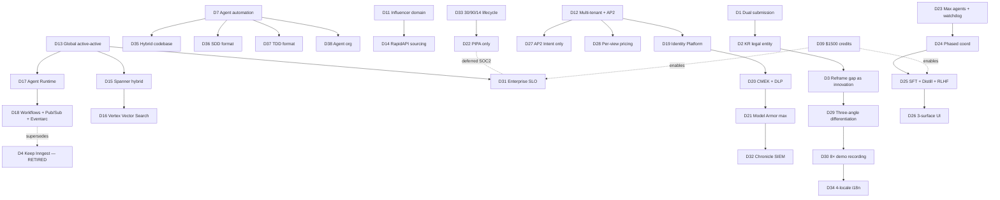

# DECISIONS.md — Single Source of Truth

> **Purpose**: Canonical record of every architectural / strategic / operational decision made in the pre-code design phase for the Google for Startups AI Agents Challenge submission.
>
> **Authority**: This file overrides any earlier statement made in other documents. When a later document conflicts with a decision recorded here, this file wins until an entry is added to the change log below.
>
> **Audience**: (1) the 13 background agents queued for SDD/TDD/architecture work, (2) future code authors, (3) judges (a sanitized subset).
>
> **Status as of 2026-05-20**: 50 decisions recorded across 13 rounds. D1 (dual submission) superseded by D45; **D50 reaffirms the single grand-narrative Track 3 submission after verifying the official Rules PDF** (a dual Track 2+3 option was explored this session and rejected by the operator). D47-D49 added after extracting the official designed_guide.pdf and gap-analyzing Track 3's 6 official requirements (operator-approved). No code may be written until each decision has either an entry below or an explicit "Outstanding" line in §6.

---

## 1. Executive summary

**Project**: Multi-tenant, multi-region AI agent operating platform for influencer marketing, submitted to the Google for Startups AI Agents Challenge as two distinct entries.

**Submissions**:
- **Track 2 (Optimize)**: `social-seeding-v2` rebuilt on the GCP Agent Platform — ADK on Agent Runtime, hybrid Spanner + AlloyDB AI + Firestore, GCP-native orchestration (Workflows + Pub/Sub + Cloud Tasks + Eventarc), Enterprise-grade SLO + Model Armor + Chronicle SIEM, multi-region active-active across US + EU + APAC.
- **Track 3 (Refactor)**: `tiktok-mcp-server` wrapped as an A2A-compliant ADK agent registered with Gemini Enterprise. Korean-region-listing-gap reframed as the contribution.

**Deadline**: 2026-06-05 23:59 PT (= 2026-06-06 15:59 KST). Time pressure deprioritized per D7.

**Credits**: $1,500 GCP credits available (vibeCat 수상 외).

**Differentiation (3-angle stack)**:
1. **Agent-as-function** reference implementation (typed input/output, USD cap, escalation gate, judge — beyond ReAct loops)
2. **KR-startup region-gap** distribution path (A2A-only listing pattern for non-Marketplace-payment-region founders)
3. **Multimodal + AP2 + Multi-agent** (Veo/Imagen content + AP2 Intent Mandates + RemoteA2AAgent fleet)

---

## 2. Decisions of record (53)

Status legend: ✅ active · 🔁 superseded · ⏸ deferred · ❓ outstanding

### Round 0 — Meta / context (D1-D10)

| ID | Decision | Source | Status | Implication |
|---|---|---|---|---|
| **D1** | ~~**Dual submission**: v2 → Track 2; tiktok-mcp-server → Track 3~~ | INDEX §0 · 2026-05-19 | 🔁 superseded by **D45** | — |
| **D2** | **Korean legal entity** — Marketplace direct listing impossible (payment-region exclusion) | TRACK3-PLAYBOOK §1.1 · user-confirmed | ✅ | Track 3 cannot deliver paid Marketplace listing on the timeline |
| **D3** | **Reframe listing-gap as innovation** — "A2A-only distribution path for non-Marketplace-region startups" | user-confirmed 2026-05-19 | ✅ | Becomes Innovation-20% talking point in Devpost write-up |
| **D4** | ~~Keep Inngest durable orchestration in v2~~ | PORTING-V2 §6 | 🔁 superseded by **D18** | — |
| **D5** | ~~**Gemini 2.5 family as production baseline**; 3.1 Preview only for final demo~~ | GEMINI-MODELS §4 | 🔁 superseded by **D53** | Stable + cheap + tunable; 3.x revisited post-2026-07-01 |
| **D6** | **Devpost gated invite accepted**; 10 GAPs to confirm in console | CHALLENGE-RULES §12 | ✅ | User confirmed registration; GAPs are Day-1 task |
| **D7** | **Engineering via background-agent automation** (SDD + TDD + edge-case prediction); calendar-day constraints ignored | user-confirmed 2026-05-19 | ✅ | Quality > deadline; agents do the work, user supervises |
| **D8** | **TikTok scraping**: "public data only" framing — keep current RapidAPI-based path | user-confirmed 2026-05-19 | ✅ | No TikTok Research API migration; Devpost write-up declares public-only access |
| **D9** | **OSS licensing**: core IP under **BUSL-1.1** (4-year Apache-2.0 conversion clause); ancillary code Apache-2.0 | user-confirmed 2026-05-19 | ✅ | Marketplace-compatible + Devpost-compliant + IP-protected |
| **D10** | **Gmail demo**: send only to operator-owned test accounts (e.g. `app.2weeks@gmail.com`) | user-confirmed 2026-05-19 | ✅ | CAN-SPAM/GDPR/PIPA exposure removed; real-influencer screens redacted in demo |

### Round 1 — Business scope (D11-D14)

| ID | Decision | Source | Status | Implication |
|---|---|---|---|---|
| **D11** | **Domain**: influencer-campaign-only (current v2 scope; not generalized platform) | user 2026-05-19 R1 | ✅ | sourcing/vetting/outreach/reply/ship/verify/report loop unchanged |
| **D12** | **Tenancy**: multi-tenant SaaS + AP2 autonomous payment ("agent pays agent") | user 2026-05-19 R1 | ✅ | Identity Platform tenant-per-customer; AP2 Mandate chain pervasive |
| **D13** | **Region**: Global multi-region active-active (US-central + EU-west + APAC-northeast) | user 2026-05-19 R1 | ✅ | Spanner multi-region, Cloud CDN, Global LB mandatory |
| **D14** | **Sourcing**: RapidAPI-mediated; TikTok current; Instagram email-base feasibility study queued (Task #21) | user 2026-05-19 R1 | ✅ | Instagram add deferred until feasibility known |

### Round 2 — Data & infrastructure plane (D15-D18)

| ID | Decision | Source | Status | Implication |
|---|---|---|---|---|
| **D15** | **OLTP hybrid**: **Spanner** (core/tenant/billing) + **AlloyDB AI** (analytics/feature store) + **Firestore Native** (Agent Memory Bank backing) | user 2026-05-19 R2 | ✅ | Mongo Atlas retired from new build; capability layer rewrites repository per data plane |
| **D16** | **Vector search**: **Vertex AI Vector Search** dedicated service | user 2026-05-19 R2 | ✅ | Independent of any single OLTP store; 10M+ vectors, p99 < 50ms |
| **D17** | **Agent runtime**: **Agent Runtime** (managed) | user 2026-05-19 R2 | ✅ | Track 3 reference path; sub-second cold start; 7-day long-running. **Naming (2026-06):** the managed runtime is now **"Agent Runtime / Agent Platform Runtime"** (formerly "Vertex AI Agent Engine"); the platform is **"Gemini Enterprise Agent Platform" (formerly Vertex AI)**. "Vertex AI" stays correct for the model-serving endpoint / `aiplatform.googleapis.com` / Prompt Optimizer (VAPO). |
| **D18** | **Orchestration**: **Cloud Workflows** (durable) + **Pub/Sub** (fan-out) + **Cloud Tasks** (retry) + **Eventarc Advanced** (system events) — Inngest **retired** | user 2026-05-19 R2 | ✅ | Supersedes D4; v2's `step.sleep(14d)` + `if`-correlation pattern rewritten on Workflows |

### Round 3 — Security & compliance (D19-D22)

| ID | Decision | Source | Status | Implication |
|---|---|---|---|---|
| **D19** | **Auth**: **Identity Platform multi-tenant** (customers) + **Workforce Identity Federation** (staff) | user 2026-05-19 R3 | ✅ | better-auth + NextAuth replaced; tenant-per-customer; SSO for staff |
| **D20** | **Data protection**: **CMEK across all stores** + **Secret Manager** for credentials + **DLP automatic redaction** for logs/PII | user 2026-05-19 R3 | ✅ | Cloud KMS rings per region; SDP inspect templates on every Cloud Logging sink |
| **D21** | **Model Armor max policy**: PI+JB + PII block + RAI default + **custom regex (brand, competitor, influencer handle)** + **Agent Anomaly Detection** + **real-time alerting** + **auto-block at threshold** | user 2026-05-19 R3 | ✅ | Highest-tier policies on all model calls; audit-only → enforce ramp on Day 1 |
| **D22** | **Compliance day-1**: **PIPA + Marketplace minimal**; SOC2/GDPR/HIPAA deferred | user 2026-05-19 R3 | ⏸ phased | PIPA Article 23/24 compliance code baked in; SOC2 evidence-collection pipeline (Drata/Vanta) deferred |

### Round 4 — Agent system (D23-D26)

| ID | Decision | Source | Status | Implication |
|---|---|---|---|---|
| **D23** | **Fleet topology**: "maximum verifiable agents" + "all GCP services that aren't unnecessary" + **watchdog agents** | user 2026-05-19 R4 | ✅ | See §4 for the agent inventory; watchdog = Cloud Monitoring + Agent Anomaly Detection + auto-runbook composite |
| **D24** | **Coordination**: phased — **0→1 hybrid in-process** (low-risk MVP), **1→100 free** (RemoteA2AAgent fan-out, no architecture lock-in) | user 2026-05-19 R4 | ✅ | Phase boundary at "first multi-tenant production customer" |
| **D25** | **Learning loop**: **Prompt + Agent Evaluation + Vertex SFT + Distillation (Pro→Flash) + RLHF on Agent Simulation** | user 2026-05-19 R4 | ✅ | Full GCP learning stack; simulation seeds RLHF reward without human labels |
| **D26** | **UI surface**: **Mission Control (Next.js 16)** + **Dialogflow CX chatbot** + **React Native Expo mobile PWA** | user 2026-05-19 R4 | ✅ | Three surfaces; shared API via Agent Gateway; OpenAPI 3.1 client codegen |

### Round 5 — Payment, pricing, differentiation, demo (D27-D30)

| ID | Decision | Source | Status | Implication |
|---|---|---|---|---|
| **D27** | **AP2 scope**: **Intent Mandate only** — agent plans, human approves payment | user 2026-05-19 R5 | ✅ | Safety-first; v2's existing approval-gate pattern preserved; Cart/Payment Mandate revisited post-launch |
| **D28** | **Pricing**: **$0.01 per delivered view** ($10 effective CPM, ROI-linked) | user 2026-05-19 R5 | ✅ | Per-view metering pipeline (Pub/Sub event → BigQuery → billing) required; no per-seat or per-creator alternatives shipped day-1 |
| **D29** | **Differentiation**: **all three angles** (Agent-as-function · KR-region-gap · Multimodal+AP2+Multi-agent) | user 2026-05-19 R5 | ✅ | Devpost write-up uses all three; demo emphasizes whichever angle the scene illustrates |
| **D30** | **Demo format**: **8× speed real mouse-action recording** + transparent preview (no slides, no manual-typed scripts) | user 2026-05-19 R5 | ✅ | Custom recorder needed; 24-min real interactions compress to 3-min video; subtitles per i18n locale (D34) |

### Round 6 — Operations & observability (D31-D34)

| ID | Decision | Source | Status | Implication |
|---|---|---|---|---|
| **D31** | **SLO**: Enterprise-grade — **99.99%/yr availability, p99 < 1s on hot path, RTO 1 min, RPO 30 s** | user 2026-05-19 R6 | ✅ | Multi-region active-active mandatory (already D13); failure-injection tests required (D37) |
| **D32** | **Alerting/IR**: **Cloud Monitoring + PagerDuty + Slack + Auto-runbook (Cloud Workflows) + Chronicle/SecOps SIEM** | user 2026-05-19 R6 | ✅ | Chronicle in Track 3 "Enterprise Standards" evidence; PagerDuty webhook from Cloud Monitoring alerts |
| **D33** | **Data lifecycle**: PII 30 d · Audit logs 90 d · Memory 14 d | user 2026-05-19 R6 | ✅ | TTL policies on Firestore Memory Bank; BigQuery audit log expiration; Cloud Storage lifecycle rules |
| **D34** | **i18n**: 4 locales — **한국어 / English / 日本語 / 中文(简)** | user 2026-05-19 R6 | ✅ | Translation API runtime fallback; Mission Control next-intl messages; outreach email templates per locale |

### Round 7 — Build methodology (D35-D38)

| ID | Decision | Source | Status | Implication |
|---|---|---|---|---|
| **D35** | **Codebase strategy**: **Hybrid** — keep v2 `packages/capabilities/` + `packages/contracts/` + `packages/db/` (capabilities reskinned for Spanner/AlloyDB/Firestore); 0-to-1 rebuild `packages/agents/` + `packages/workflows/` + `packages/observability/` on ADK + Workflows | user 2026-05-19 R7 | ✅ | Preserves 183 capability tests + 103 workflow tests + 4 observability tests; agents (64 tests) and workflow runtime rebuilt |
| **D36** | **SDD format**: **AsyncAPI 3.0** (events) + **OpenAPI 3.1** (REST) + **JSON Schema** (data contracts) + **Mermaid** (diagrams) | user 2026-05-19 R7 | ✅ | Schema Registry (Pub/Sub) for AsyncAPI; nestia-style codegen for OpenAPI; auto-publish to `gcp-research/specs/` |
| **D37** | **TDD layers**: **Vertex AI Agent Evaluation + Vitest (capabilities) + pytest (agents) + Agent Simulation (1000+ scenarios) + Chaos engineering (Litmus / Gremlin / Spanner failover / Pub/Sub drop)** | user 2026-05-19 R7 | ✅ | 5-layer test pyramid; 99.99% SLO defensible |
| **D38** | **Agent organization**: **M3 PM agent + tier-2 lead agents + tier-3 worker agents** (PreviewForge-style hierarchy) | user 2026-05-19 R7 | ✅ | DAG-of-tasks with M3 coordinating; tier-2 leads own subsystems; tier-3 workers do unit work |

### Round 8 — Resource envelope (D39)

| ID | Decision | Source | Status | Implication |
|---|---|---|---|---|
| **D39** | **GCP credits available**: **$1,500 USD** (vibeCat 수상 외) — replaces challenge $500 cap assumption | user 2026-05-19 | ✅ | Cost-saving levers in COST-PLAN.md relaxed; Gemini 3.1 Pro Preview enabled for final demo; Memorystore + Memory Bank + AlloyDB run 24×7 during judging window |

### Round 9 — Security hardening (D40)

| ID | Decision | Source | Status | Implication |
|---|---|---|---|---|
| **D40** | **`prompt_guard` regex covers particle-rich CJK injection variants per BN-9** — KO/JA/ZH alternation gaps relaxed from `\s*` to particle-aware character classes (`[\s　을를은는의에이가도모두]*` / `[\s　をにへでがのは]*` / `[\s　的了也]*`); JA alternation gains `前`; ZH gains `前面` (g2) + `指示` (g3) | autonomous `/goal` session 2026-05-19 (W1 / BN-9) | ✅ | Tighter security posture for production CJK traffic; W1 unblocks W2 Korean tests using natural particle-rich text; `tests/tools/test_prompt_guard.py` pins 6 new regression cases + a clean-text safety check |

### Round 10 — Integration plane (D41-D44)

| ID | Decision | Source | Status | Implication |
|---|---|---|---|---|
| **D41** | **Capability layer ADK FunctionTool pattern**: each tool exposes `def tool_fn(input: PydanticInputModel) -> PydanticOutputModel`; runtime selects stub vs live via `CAPABILITY_LAYER_MODE=stub\|live` env var; stubs return deterministic canned data, live mode calls real Cloud SDK; per-tool USD cost surfaced via attribute for `cost_watch` | autonomous `/goal` session 2026-05-19 (W2) | ✅ | Unblocks all 16 Tier-1 agents from `tools=[]` placeholder state; deterministic dev/CI traffic + real prod traffic via single seam |
| **D42** | **Cloud Workflows YAML wires via Terraform output injection** — workflow `call:` URLs reference `${args.agent_url}`, populated from `terraform output -json` per environment; no hardcoded hostnames in YAML | autonomous `/goal` session 2026-05-19 (W3) | ✅ | Dev/staging/prod agent endpoints vary without YAML edits; `gcloud workflows deploy` idempotent across regions |
| **D43** | **End-to-end smoke test is the Phase-3 canary** — `scripts/smoke-test/run-brand-campaign.sh` exercises brand-brief → 22-agent fleet → Gmail send (to `app.2weeks@gmail.com` per D10) → workflow continuation → final report; must exit 0 before any deploy or demo recording | autonomous `/goal` session 2026-05-19 (W4) | ✅ | Gating condition for W6/W7/W8; protects D31 99.99% SLO claim with empirical baseline |
| **D44** | **Terraform root config lives in `terraform/environments/<env>/`** (dev, staging, prod), NOT in module dirs; root configs call `module "compute" { source = "../../modules/compute" ... }` with per-env vars | autonomous `/goal` session 2026-05-19 (W6) | ✅ | Module reuse across 3 regions × 3 envs without duplication; backend state per env in distinct GCS buckets |

### Round 11 — Submission consolidation (D45-D46)

| ID | Decision | Source | Status | Implication |
|---|---|---|---|---|
| **D45** | **Single Track 3 submission that subsumes the entire Track 2 platform** — supersedes D1. We submit ONE Devpost entry to Track 3 (Refactor). The `tiktok-mcp-server` A2A refactor is the "seed", but the full 22-agent ADK fleet + AP2 Mission Control + multimodal pipeline are presented as the A2A ecosystem the refactored MCP server lives inside. The 3-angle differentiation (D29) all map onto this single narrative: Agent-as-function (22-agent fleet) · KR-region-gap (A2A-only distribution, D2/D3) · Multimodal+AP2+Multi-agent (the whole platform). Track 2 is NOT a separate Devpost entry. | 회의 확정 + user 2026-05-20 | ✅ | Demo + write-up + screenshots are ONE integrated story. coordinator agent `a2a_invoke`→tiktok-mcp-server is the cross-component proof. No second Devpost form. |
| **D46** | **Essential-asset retention + state-driven auto-scale budget design** — assets required for judging (live landing/demo `ss-landing`, Track 3 A2A endpoint, Gemini Enterprise registration) stay up through the judging window; everything else is `min=0` scale-to-zero (Cloud Run) + state-driven scale-up/down (Cloud Scheduler warm-up during judging window, `cost_watch` Tier-3 agent triggers scale-down on threshold, `terraform destroy` of heavy stores after judging). No always-on Spanner/AlloyDB unless traffic demands. | user 2026-05-20 | ✅ | Supersedes the static "옵션 A/B/C" framing — budget follows live traffic, not a fixed tier. Essential assets ≈ $1-5/mo idle; scale-up only on real demo/judge traffic. D39 $1,500 cap protects worst case. |

### Round 12 — Track 3 official-requirement hardening (D47-D49)

> Source: `services.google.com/.../ai_agents_challenge_designed_guide.pdf` (official 8-page Resource Guide, extracted 2026-05-20). PDF page 6 enumerates the 6-step Track 3 (Refactor) requirement; page 7 names Agent Identity (crypto ID); the judging rubric is Tech 30 / Business 30 / Innovation 20 / Demo 20. Gap analysis vs UNIFIED-TRACK3-PLAN found 3 missing official requirements + under-weighted Business/Demo. User approved I7-I9 on 2026-05-20.

| ID | Decision | Source | Status | Implication |
|---|---|---|---|---|
| **D47** | **Route LLM reasoning through Model Garden** (Track 3 PDF requirement #3) — Gemini calls go through a Model Garden-deployed endpoint, not direct Vertex AI `generateContent`. "Strict data security" framing. Documented in deploy/model-garden + agent runtime config. | designed_guide.pdf p.6 · user-approved 2026-05-20 | ✅ | I7. Closes Technical 30% gap. Affects `packages/agents-adk` model config + deploy IAM. |
| **D48** | **A2A intents manifest + Agent Identity crypto ID** (Track 3 PDF requirement #6 + p.7) — author `gcp-research/refactor-mcp/A2A-INTENTS.md` mapping every A2A intent the agent *exposes* and *consumes*; harden `agent.json`; assign each agent a unique cryptographic identity (SPIFFE/SPIRE or Agent Identity workload cert) per the PDF's "secure by design" mandate. | designed_guide.pdf p.6-7 · user-approved 2026-05-20 | ✅ | I8. Closes the documentation + Agent Identity gap. The PDF Build Example #2 (marketing agent + multimodal + A2A→DAM brand-logo) maps 1:1 to our `content_verify` agent — call this out explicitly. |
| **D49** | **Wow + business reinforcement for Demo 20% + Business 30%** — (a) one REAL Imagen/Veo generation in the demo (not stub), (b) animated A2A cross-call diagram, (c) ROI/TAM visualization scene proving the $0.01/view model (D28), (d) explicit on-screen match to PDF Build Example #2. Business is co-#1 rubric weight (30%) yet was absent from the demo surface. | designed_guide.pdf p.7-8 rubric · user-approved 2026-05-20 | ✅ | I9. Lifts Demo 70%→95% and Business 60%→90% in self-assessment. Requires `CAPABILITY_LAYER_MODE=live` for imagen_generate/veo_generate during one demo take. |

### Round 13 — Single grand-narrative reaffirmed after official-rules verification (D50)

> Source: official **Rules PDF** (`https://s3.amazonaws.com/devpost-public/Google/DfT/Google for Startups AI Agents Challenge Rules.pdf`, retrieved 2026-05-20) — closes the `CHALLENGE-RULES.md` §8/§9 GAPs. Confirmed: multiple submissions allowed but each must be "unique and substantially different"; **each project wins max one prize**; prizes = Grand $15K+$10K (top overall) · Best of Each Theme $10K+$7.5K (×3) · Regional $5K+$2.5K (×2 APAC/EMEA); **South Korea eligible** (only North Korea excluded), KR = APAC. During this session a dual-submission (Track 2 + Track 3) option was explored, then **rejected by the operator** in favor of one concentrated entry.

| ID | Decision | Source | Status | Implication |
|---|---|---|---|---|
| **D50** | **Single grand-narrative Track 3 submission targeting the Grand Prize** — do NOT split into two. Fuse Build→Optimize→Refactor into one arc. The Track 2 (Optimize) signature toolchain (Agent Simulation + Observability + Optimizer + measured before/after) is FOLDED IN as the Technical-30% "we hardened it" chapter of the Track 3 entry, NOT a separate Devpost submission. Rationale: each project wins max 1 prize, so one overwhelming entry aimed at the Grand Prize ($15K+$10K, top overall) beats two diluted theme bets. Reaffirms D45, supersedes the dual-submission option explored this session. | official Rules PDF + user 2026-05-20 | ✅ | `GRAND-NARRATIVE-PLAN.md`. Adds G1-G5 (gap-closing from 4-expert review: A2A wiring, Model Garden real, honesty fixes, CI, SSRF/prompt_guard) + H1-H5 (the Optimize "hardening" chapter). Demo's top wow scene = Observability "stall→fix" trace = Technical evidence. |

---

### Round 14 — Grand-narrative gap-closing executed (D51)

> Source: autonomous `/goal` session 2026-05-20 executing `GRAND-NARRATIVE-PLAN.md` G1-G5 + H1-H5. Records the honest scope of what was built so a later session does not over-read the demo's headline metrics.

| ID | Decision | Source | Status | Implication |
|---|---|---|---|---|
| **D51** | **G/H-series closed; the Optimize "hardening" before/after is a LOCAL DETERMINISTIC pass, not a live Vertex run.** The 40.5%→100.0% (+59.5pp, TRAIN slice) triage before/after — on a 56-case multilingual synthetic set (42 train / 14 adversarial holdout) — is measured by a committed, re-runnable offline script (`scripts/smoke-test/run-hardening-measure.sh`); the live **Vertex AI Prompt Optimizer (data-driven)** is the production path and is **wired (operator-gated — ADC + a GCS bucket; not run in CI)**, with `agent_optimizer_tune` defaulting to a deterministic stub receipt — disclosed as such everywhere it appears. A2A is now wired into the **brand-campaign Cloud Workflow** orchestration (coordinator routing → transport switch → `a2a_invoke` → tiktok-mcp), validated live (task completed, ~3.7s, 5 creators). Model Garden routing proven by an offline test asserting the publisher path reaches `LlmAgent` (live smoke operator-gated). Honesty corrections: `a2a_invoke._live()` is implemented (doc was stale); mTLS is **declared-not-enforced** on the demo (`x-securityPosture` in `agent.json`); `REQUIRE_AUTH` = code-default `true` / demo `false` / prod `true`. CI restored with an offline pytest gate + a golden-set **holdout** gate. | autonomous /goal session (Wave A-E) | ✅ | Implements D45/D47/D48/D49/D50 + D21/D23/D25/D27/D32/D37/D44. No new live GCP capability is claimed beyond what a re-runnable proof demonstrates. |
| **D52** | **Anti-overfit holdout made real (Wave 3 / Seam B; closes the overfit-theater seam in D51).** The old "42.3% → 100.0% on 26 hand-authored cases" read as theater (a perfect round number on a tiny self-authored set). Fixed by (1) expanding the synthetic set to **56 cases** with genuinely adversarial variants (obfuscated rate "discuss the comp?", rate only in free text the extractor missed, mid-thread rate, sarcasm, accept+negotiate, follower-count false-positive bait, code-switching, non-USD locale rate forms), and (2) carving out a **14-case holdout** (`split=holdout`) NOT used to author the `_optimized_triage` rules. Honest re-measure: **train 40.5% → 100.0%; holdout 71.4%** (10/14), a **28.6pp** train↔holdout gap left visible. The 4 holdout misses are negotiation intents with NO structured `proposed_rate_usd` (the rate-signal rule keys on the structured field) — kept as misses, **NOT tuned away** (tuning to ace the holdout would defeat it). The submission now leads with the holdout 71.4% as the honest headline. | Wave 3 / Seam B (Quality) | ✅ | Implements D25 (learning loop) + D37 (anti-overfit holdout). The holdout mitigates but does not eliminate self-authoring risk; the real next step is scoring against labeled production threads. |

---

### Round 15 — Gemini 3.x model mandate, judgment tier verified (D53)

> Source: operator mandate 2026-05-21, updated with the verified Vertex access reality. Collapses the v2 model fleet onto the Gemini 3.x series and retires every remaining Anthropic-Claude transport from the product so no stale runtime-model reference survives in any judge-visible surface (demo, docs, asset JSON, decisions).

| ID | Decision | Source | Status | Implication |
|---|---|---|---|---|
| **D53** | **Gemini 3.1/3.5 series only (operator mandate, 2026-05-21). Judgment tier = `gemini-3.5-flash` (GA 2026-05-19, callable on the global Vertex endpoint); bulk tier = `gemini-3.1-flash-lite`. `gemini-*-pro` is NOT accessible in ss-v2-prod (404, Preview allowlist not granted) and is therefore not used. Gemini 3.x is served on the `global` endpoint (not us-central1). No Gemini 2.5 and no Anthropic Claude models remain in the product. Supersedes D5.** | operator 2026-05-21 | ✅ | Supersedes D5. The TypeScript `packages/agents` Anthropic-Claude transport (`@anthropic-ai/sdk`) was replaced with `@google/genai`. Demo/docs/asset-JSON model labels migrated: every `gemini-2.5-pro`/`gemini-3.1-pro`/`opus-4.7` → `gemini-3.5-flash`; every `gemini-2.5-flash`(-lite)/`haiku-4.5` → `gemini-3.1-flash-lite`. Net product model ids = `gemini-3.5-flash` + `gemini-3.1-flash-lite`. The GEMINI-MODELS catalog keeps 2.5 as historical reference; only its "production default" statement now points to `gemini-3.5-flash` on the global endpoint. |

---

## 3. Decision dependency graph

---

## 4. Agent fleet inventory (derived from D23-D25)

**Tier 1 — Domain agents (16)** — inherited from v2 (11) + 5 new per D23:

| # | Agent | v2 / NEW | Model (default) | Role |
|---|---|---|---|---|
| 1 | `sourcing` | v2 | Gemini 2.5 Pro | Plan + execute creator search across RapidAPI sources |
| 2 | `vetting` | v2 | Gemini 2.5 Pro (parallel fan-out) | Score candidate fit |
| 3 | `outreach_writer` | v2 | Gemini 2.5 Pro tournament | 5-angle × 4-judge draft → winner |
| 4 | `conversation` | v2 | Gemini 2.5 Flash-Lite | Classify reply into 8 categories |
| 5 | `conversation_responder` | v2 | Gemini 2.5 Pro | Draft follow-up replies |
| 6 | `logistics` | v2 | Gemini 2.5 Flash | Parse free-text shipping address |
| 7 | `content_verify` | v2 | Gemini 2.5 Flash multimodal | Verify brand-mentioned post matches |
| 8 | `analyst` | v2 | Gemini 2.5 Pro | Final campaign report |
| 9 | `research` | v2 | Gemini 2.5 Pro | Background brand/competitor research |
| 10 | `intake` | v2 | Gemini 2.5 Flash | Conversational brand brief intake |
| 11 | `lead_outreach_writer` | v2 | Gemini 2.5 Pro | B2B lead outreach (sister loop) |
| 12 | `payment_mandate` | NEW | Gemini 2.5 Flash | Compose AP2 Intent Mandate; gate to human approval (D27) |
| 13 | `compliance` | NEW | Gemini 2.5 Pro | Auto-check PIPA Article 23/24 + CAN-SPAM consent before send |
| 14 | `creative` | NEW | Gemini 2.5 Pro + Imagen 4 + Veo 3 | Brand-brief → moodboard + shot list + sample video |
| 15 | `a11y` | NEW | Gemini 2.5 Flash | Generate alt-text + caption + transcript per locale (D34) |
| 16 | `customer_success` | NEW | Gemini 2.5 Pro | Detect onboarding-friction signals + propose interventions |

**Tier 2 — Meta agents (3)** per D23 (the "1→100 coordinators"):

| # | Agent | Role |
|---|---|---|
| M1 | `coordinator` | Pick which Tier-1 agent (or A2A remote agent) handles a given task |
| M2 | `critic` | LLM-as-judge across tier-1 outputs; gates the human approval stream |
| M3 | `optimizer` | Periodically rewrite prompts + adjust tool budgets via Agent Optimizer |

**Tier 3 — Watchdog agents (3)** per D23:

| # | Agent | Role |
|---|---|---|
| W1 | `anomaly_watch` | Monitor token/cost/latency anomalies; trigger auto-runbook (D32) |
| W2 | `cost_watch` | Per-tenant USD/day ceiling; emit Pub/Sub alert at 50/75/90/95% |
| W3 | `security_watch` | Watch Model Armor blocks + Chronicle alerts; quarantine offending tenant on threshold |

**Total: 22 production agents** (16 domain + 3 meta + 3 watchdog) plus the **PreviewForge-style build agents** (M3 PM + leads + workers per D38) which exist only during development.

---

## 5. GCP service stack (derived from D11-D39)

To be detailed in `SERVICE-INVENTORY.md` (Task #28). Headline shape:

- **Build**: ADK 2.0 Beta (Python) + Agent Studio + Agent Garden + Gemini API (3.1 Pro Preview + 2.5 Pro/Flash/Flash-Lite) + MCP + A2A v0.3 + AP2 v0.2 + Cloud Marketplace
- **Scale**: Agent Runtime + Agent Sandbox (GKE Autopilot when needed) + Agent Memory Bank (Firestore-backed) + Agent Sessions
- **Govern**: Agent Gateway (Private Preview disclosure) + Agent Identity (SPIFFE) + Agent Registry + **Model Armor** + Agent Security + Agent Compliance + Agent Policy
- **Optimize**: Agent Evaluation + Agent Observability + Agent Optimizer + Agent Simulation + Agent Anomaly Detection
- **Data**: Spanner Multi-region + AlloyDB AI + Firestore Native + Vertex AI Vector Search + BigQuery (analytics) + BigQuery ML (CPM forecasting) + Cloud Storage (assets) + Memorystore Valkey (hot cache) + Pub/Sub + Pub/Sub Schema Registry
- **Compute**: Agent Runtime (managed) + Cloud Run (worker pools for non-agent services) + GKE Autopilot (Agent Sandbox + GPU/TPU when Veo/Imagen needs)
- **Networking**: Global Load Balancing + Cloud CDN + Cloud Armor + VPC + VPC Service Controls + Cloud NAT + Cloud DNS + IAP + Private Service Connect + Cloud Service Mesh
- **Security**: Identity Platform + Workforce IF + Secret Manager + Cloud KMS (CMEK + HSM optional) + Certificate Manager + Confidential Computing (PII workloads) + Binary Authorization + Security Command Center (AI Protection) + Sensitive Data Protection + Chronicle SecOps
- **Observability**: Cloud Logging + Log Analytics + Cloud Monitoring + Managed Prometheus + Managed Grafana + Cloud Trace + Cloud Profiler + Error Reporting + Cloud Audit Logs + OpenTelemetry
- **DevOps**: Cloud Build + Cloud Deploy (canary) + Artifact Registry (+ Artifact Analysis + SLSA) + Cloud Workstations + Gemini Code Assist Enterprise
- **Integration**: Cloud Workflows + Eventarc Advanced + Pub/Sub + Cloud Tasks + Cloud Scheduler + Application Integration + Apigee X (API monetization for $0.01/view billing) + API Hub
- **Frontend**: Firebase App Hosting (Next.js 16 SSR) + Firebase Hosting (static assets) + Firebase Auth (delegated to Identity Platform per D19) + Firebase Genkit (Mission Control RAG only) + Firebase Cloud Messaging (mobile PWA push)
- **AI specialized**: Imagen 4 (visuals) + Veo 3 (video) + Lyria (audio) + Speech-to-Text + Text-to-Speech + Translation API (i18n) + Document AI (media-kit parsing) + Vision AI (logo/IP detection) + Dialogflow CX (chat UI)

Conservative "not used" list (will be re-justified in SERVICE-INVENTORY.md): App Engine (deprecated for new builds), Cloud Functions Gen 1 (use Cloud Run functions), Cloud Source Repositories (end-of-sale), Firebase Studio (sunset), Anthos branding (consumed by GKE Enterprise + GDC), Pub/Sub Lite (turndown 6/30), Memorystore for Memcached (deprecated). External: **Inngest retired** (D18).

---

## 6. Outstanding questions

Items intentionally left undecided at this snapshot. Each must be resolved before its blocking work begins.

### Tier 1 — blocks day-1 build

| ID | Question | Owner | Deadline |
|---|---|---|---|
| O1 | Devpost console GAPs (per CHALLENGE-RULES §12) — team size, license requirement, video length cap, repo visibility, multi-track rules, IP grant clauses | User | Before code starts |
| O2 | GCP project IDs (suggest `ss-v2-prod-{region}` × 3 for active-active + `ss-mcp-prod`) | User | Before code starts |
| O3 | RapidAPI plan + Instagram email-base feasibility (Task #21) | Background agent | Before sourcing agent rebuild |
| O4 | Instagram Graph API business-account requirement: needed for Korean entity? Foreign sub-entity? | User | Before Instagram add |

### Tier 2 — blocks integration milestones

| ID | Question | Owner | Trigger |
|---|---|---|---|
| O5 | AP2 Mandate UX wireframes (Task #22) — what does the human-approval view look like? | Background agent | Before payment_mandate agent ships |
| O6 | Inngest → Workflows + Eventarc migration spec (Task #23) — 14-day `step.sleep` + `if`-correlation equivalents | Background agent | Before workflows rebuild |
| O7 | Agent Gateway Private Preview allowlist application | User | Day 1 (1-2 wk processing) |
| O8 | Customer pricing tiers (per-view $0.01 baseline) — minimum monthly commit? prepaid credits? overage caps? | User + business panel | Before billing pipeline ships |

### Tier 3 — informs post-launch

| ID | Question | Owner | Trigger |
|---|---|---|---|
| O9 | SOC 2 Type 2 evidence-collection vendor (Drata / Vanta / Secureframe) | User | Post-launch |
| O10 | Foreign sub-entity strategy for Marketplace listing (US Delaware C-Corp / Singapore Pte Ltd / Japan KK) | User + legal | When listing revenue ≥ $1k MRR |
| O11 | Gemini 3.1 Pro GA migration date (currently Preview, rate-card lock 2026-07-01) | Background watch | When 3.1 Pro hits GA |
| O12 | Multi-tenant data residency policy — EU customer data **must** stay in EU? (GDPR) | User + legal | Before first EU customer |

---

## 7. What this means for the next code phase

Per user directive 2026-05-19 ("실제 코드를 적용하기 전에 반드시 현재 결정사항을 문서화"):

1. **This file is committed first**, before any `git add` of code.
2. The **13 background-agent tasks (Tasks #21-#27, #28-#30 already created)** read this file as input.
3. The **PreviewForge-style M3 PM agent (D38)** maintains the change log in §8.
4. Code authors (human or agent) **must cite a D-ID** when their change touches the decision surface (e.g. "implements D15 hybrid OLTP for tenant table" in a commit message).
5. If a decision must be overturned, append a new D entry, mark the old one 🔁 superseded, and update the dependency graph.

---

## 8. Change log

| Date | D-ID | Change | Author |
|---|---|---|---|
| 2026-05-19 | D1-D10 | Initial recording (Round 0 meta) | research-pass output |
| 2026-05-19 | D11-D14 | Round 1 (business scope) recorded | user interview |
| 2026-05-19 | D15-D18 | Round 2 (data plane) recorded; **D4 retired by D18** | user interview |
| 2026-05-19 | D19-D22 | Round 3 (security) recorded | user interview |
| 2026-05-19 | D23-D26 | Round 4 (agent system) recorded | user interview |
| 2026-05-19 | D27-D30 | Round 5 (payment/pricing/demo) recorded | user interview |
| 2026-05-19 | D31-D34 | Round 6 (ops) recorded | user interview |
| 2026-05-19 | D35-D38 | Round 7 (build methodology) recorded | user interview |
| 2026-05-19 | D39 | $1500 GCP credits clarified | user message |
| 2026-05-19 | — | Document committed pre-code | user directive |
| 2026-05-19 | D40 | prompt_guard regex covers particle-rich CJK injection variants per BN-9 | autonomous /goal session (W1) |
| 2026-05-19 | D41 | Capability layer ADK FunctionTool stub/live pattern via CAPABILITY_LAYER_MODE env | autonomous /goal session (W2) |
| 2026-05-19 | D42 | Cloud Workflows YAMLs inject agent URLs via Terraform output, no hardcode | autonomous /goal session (W3) |
| 2026-05-19 | D43 | End-to-end smoke test is Phase-3 canary gating deploy + demo | autonomous /goal session (W4) |
| 2026-05-19 | D44 | Terraform root config lives in terraform/environments/<env>/, modules reused | autonomous /goal session (W6) |
| 2026-05-20 | D1 | Dual submission RETIRED — superseded by D45 (single Track 3) | 회의 확정 |
| 2026-05-20 | D45 | Single Track 3 submission subsuming entire Track 2 platform | 회의 확정 + user |
| 2026-05-20 | D46 | Essential-asset retention + state-driven auto-scale budget | user |
| 2026-05-20 | D47 | Route LLM reasoning through Model Garden (Track 3 req #3) | designed_guide.pdf + user |
| 2026-05-20 | D48 | A2A intents manifest + Agent Identity crypto ID (Track 3 req #6) | designed_guide.pdf + user |
| 2026-05-20 | D49 | Wow + business reinforcement for Demo 20% + Business 30% | designed_guide.pdf + user |
| 2026-05-20 | D50 | Single grand-narrative Track 3 (Grand Prize); dual submission rejected; Optimize folded in as Technical evidence | official Rules PDF + user |
| 2026-05-20 | D51 | G/H-series closed; hardening before/after is local-deterministic (live Optimizer stubbed); A2A wired into Cloud Workflow; honesty fixes; CI+holdout gate; SSRF allowlist | autonomous /goal session |
| 2026-05-20 | D52 | Anti-overfit holdout made real: 56-case set + 14-case adversarial holdout; train 40.5%→100%, holdout 71.4% (non-round, 28.6pp gap, 4 misses not tuned away) | autonomous /goal session (Wave 3 / Seam B) |
| 2026-05-21 | D53 | Gemini 3.1/3.5 series only; **D5 superseded by D53**; judgment tier = `gemini-3.5-flash` (GA 2026-05-19, global Vertex endpoint), bulk tier = `gemini-3.1-flash-lite`; `gemini-*-pro` NOT accessible in ss-v2-prod (404); Anthropic-Claude transport replaced with `@google/genai`; demo/docs/asset-JSON model labels swept to gemini-3.5-flash / gemini-3.1-flash-lite | operator mandate |
