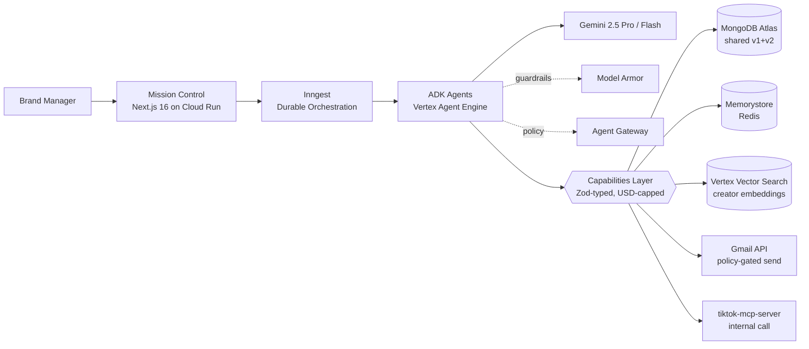
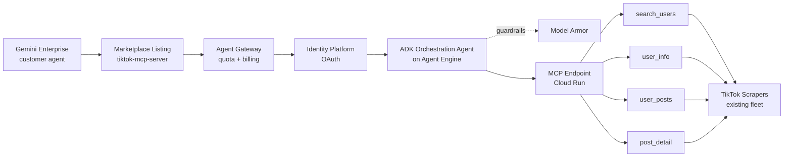

# Submission Package Guide — Google for Startups AI Agents Challenge

**Audience:** the two operators submitting `social-seeding-v2` (Track 2) and `tiktok-mcp-server` (Track 3) by **2026-06-05**.
**Premise:** judging is **Tech 30 / Business 30 / Innovation 20 / Demo 20**. Demo + Business together = 50% of the score. Most failed hackathon entries over-invest in code and under-invest in those two. This guide is structured so you spend roughly half your remaining time on demo + business artifacts, not on more commits.

Verified facts (as of 2026-05-19, sourced from Google Cloud blog + sibling Devpost contests — see footer):

- Three tracks: (1) net-new agent, (2) optimize an existing prototype for production reliability, (3) refactor a business-ready agent for distribution on Google Cloud Marketplace + Gemini Enterprise app.
- Deadline: **2026-06-05**. Six-week window. $90,000 prize pool. $500 GCP credits per team.
- Weights: Tech 30%, Business 30%, Innovation 20%, Demo 20%.
- Video length on the official Devpost page is not yet confirmed; the sibling **Rapid Agent Hackathon** specifies "~3 minute demo video". **Assume 3 min hard ceiling**; cut to 2:45 to leave headroom. Re-check Devpost rules the day you record.
- Public repo with an OSI license file at repo root is a hard requirement on every sibling Google Cloud hackathon. Treat it as required here.

---

## 1. Demo Video (20% of score — do not slack)

### Why this matters disproportionately
A 3-minute video is the only artifact every judge actually watches end-to-end. The README they skim, the Devpost long-form they skim, the diagram they glance at. The video they watch. If the video is slides, you lose 20 points. If the video is 6 minutes, the judge stops at 3 and scores what they saw.

### Length: assume 3:00, target 2:45
Confirm by re-reading the official Devpost rules the morning you record. If the rule is 2 minutes, you cut hard. If it is 5, you keep the 3-min cut anyway — longer is not better, attention drops off a cliff after 3 min.

### Structure templates

**The 90-second cut** (use if Devpost caps at 2 min or as a teaser):
- 0:00–0:10 Hook: one sentence problem.
- 0:10–0:25 What you built, one sentence + diagram on screen.
- 0:25–1:15 Live agent run (screen capture, terminal + browser, no slides).
- 1:15–1:25 One differentiation line.
- 1:25–1:30 CTA: "Repo at github.com/…, deployed at …".

**The 120-second cut** (safe default if rules say "up to 3 min"):
- 0:00–0:15 Hook.
- 0:15–0:45 Architecture overview (diagram + 3 services named out loud).
- 0:45–1:45 Live agent run.
- 1:45–2:00 Differentiation + closing CTA.

**The 180-second cut** (full version — use unless the rules force shorter):
- 0:00–0:15 Opening hook — the problem in one sentence. Show the pain on screen (e.g., the operator manually copy-pasting 80 outreach emails).
- 0:15–0:45 Architecture overview — Mermaid diagram fades in, voice names exactly three services (e.g., "Cloud Run, ADK on Agent Engine, Model Armor"). Resist naming all 11.
- 0:45–2:45 Live agent run — real terminal, real browser, real network calls. No slides. No pre-recorded "magic". The judge needs to see latency, log lines, real Gmail inbox. **This is 67% of the runtime — spend 67% of your editing time here.**
- 2:45–2:55 Differentiation — one line: "Track 2: agent-as-function with USD caps and human escalation gates." Show the cost ledger.
- 2:55–3:00 Closing CTA — repo URL + deployed URL on screen.

### Opening hook (15 sec) — the rule
One sentence. State the problem, not the solution. Examples:

- v2 (Track 2): *"A brand campaign manager spends six hours a day copy-pasting outreach to TikTok creators and chasing replies — we replaced that with an 11-agent system that runs in 40 minutes for $0.42."*
- mcp (Track 3): *"There is no Marketplace-ready way for an enterprise Gemini agent to read TikTok data; we shipped one with paid quotas."*

What not to do: do not start with your logo, do not start with "Hi I'm…", do not start with "Today we'll show you…". The judge gives you 15 seconds before they decide.

### Architecture overview (30 sec) — the rule
On-screen: the Mermaid diagram from §2. Voiceover names exactly three services. Three. Not ten. The point is to prove you used the GCP agent stack, not to recite every service. Pick the three the judges will recognize and that matter most:

- v2 pick: **Agent Engine + Cloud Run + Model Armor**.
- mcp pick: **Marketplace + Agent Gateway + Identity Platform**.

### Live agent run (90–120 sec) — the rule, with detail
Real terminal. Real browser. Real network. No slides, no pre-rendered video stitching, no "let me skip ahead." If your agent takes 90 sec to run end-to-end, that is your entire body. Edit only to cut dead air (silence > 2 sec), never to fake speed.

What must be on screen, in order:

1. The trigger you fire (`pnpm exec tsx scripts/run-demo.ts --type=brand` or `curl https://tiktok-mcp.run.app/tools/search_users`).
2. The agent thinking (Inngest dashboard or terminal log lines streaming).
3. A real external side-effect — a Gmail inbox showing the sent message, a Marketplace listing page showing your tile, a TikTok scrape returning real JSON. **This is the credibility-buying moment.** Hackathon judges have seen 50 demos with mock data; a real side-effect on real infra puts you in the top quartile instantly.
4. The cost — show your USD ledger or trace.jsonl summary.

### Differentiation (15 sec) — the rule
One sentence. Pick the single most novel claim and back it with what is on screen:

- v2: *"Every agent is a function with a Zod-typed output contract, a USD cap, and a human-escalation gate — we shipped 354 passing tests proving it."*
- mcp: *"We are the first MCP-as-Marketplace-tool listing with paid per-call quotas, submitted on [date]."*

### Closing CTA (15 sec) — the rule
Repo URL + deployed URL **on screen as text**, not just spoken. Judges screenshot this. Add a one-line ask: "Try it free — see README."

### Recording tools

| Tool | When to use |
|---|---|
| **Loom** | Fastest. Records screen + webcam, hosts for you. Good for the 90-sec cut. Watermark on free tier. |
| **OBS Studio** | Free, full control, multi-source. Use this for the 180-sec cut where you need terminal + browser + webcam composited. Learning curve ~30 min. |
| **ffmpeg** | For the operator who does not want OBS. Headless screen capture + mic mix in one command. |

**ffmpeg one-liner — macOS screen capture with mic mix:**

```bash
# List devices first
ffmpeg -f avfoundation -list_devices true -i ""

# Capture screen (1) + default mic (0), output H.264 mp4, mix audio
ffmpeg -f avfoundation -framerate 30 -pixel_format uyvy422 \
  -i "1:0" -c:v libx264 -preset veryfast -crf 20 \
  -c:a aac -b:a 192k -movflags +faststart \
  demo-$(date +%Y%m%d-%H%M).mp4
```

Replace `1:0` with the indices ffmpeg listed for your screen and mic.

**Linux equivalent (x11grab + pulse):**

```bash
ffmpeg -video_size 1920x1080 -framerate 30 -f x11grab -i :0.0 \
  -f pulse -ac 2 -i default \
  -c:v libx264 -preset veryfast -crf 20 -c:a aac -b:a 192k \
  -movflags +faststart demo.mp4
```

### Subtitles / accessibility
English subtitles are non-negotiable — judges may be non-native English speakers and judging is often async. Optional Korean subtitles signal care.

Cheapest workflow: upload raw mp4 to YouTube unlisted → YouTube auto-captions → download `.vtt` → fix obvious errors in a text editor → re-upload as the primary track. Budget 30 minutes.

For burned-in subtitles (recommended — survives re-uploads), use the `.srt` from YouTube and:

```bash
ffmpeg -i demo.mp4 -vf "subtitles=demo.srt:force_style='Fontsize=20,PrimaryColour=&Hffffff&,Outline=2'" \
  -c:a copy demo-subtitled.mp4
```

### Hosting

| Option | Pros | Cons | Recommendation |
|---|---|---|---|
| **YouTube unlisted** | Free, judges familiar, auto-captions, never expires. | URL leaks if shared. | **Default choice. Use this.** |
| **Vimeo** | Cleaner player, password-protect. | Free tier has weekly upload limits + watermark. | Only if YouTube is region-blocked. |
| **Devpost direct upload** | One less link. | Size cap, less reliable player, no captions. | Avoid. |

Upload both videos to YouTube as **Unlisted**. Set a future scheduled-publish date past the judging window so you can flip them to Public later for marketing without re-uploading. Disable comments to avoid clutter.

---

## 2. Architecture Diagram

### Rules of thumb
- Maximum ~10 boxes. A 20-box diagram is unreadable at thumbnail size, and judges see thumbnails.
- Always show the trust boundary (where Model Armor / Agent Gateway sits).
- Always name the storage layer — judges want to know where state lives.
- Provide both source (Mermaid) and PNG export. Source for credibility, PNG for the slide deck.

### Export workflow
1. Author in Mermaid (lives in the README as a fenced code block — judges read source).
2. Render PNG locally with `mmdc` (mermaid-cli) — one command, no browser:

```bash
pnpm dlx @mermaid-js/mermaid-cli -i diagram.mmd -o diagram.png -w 1600 -H 900 -b transparent
```

3. Commit both `diagram.mmd` and `diagram.png` to `/docs/architecture/`. The PNG goes on the Devpost page; the source goes in the README.

### Template — v2 (Track 2)



### Template — tiktok-mcp-server (Track 3)



---

## 3. Repo README (judge-facing)

The judge spends ~90 seconds on the README. They want signal density. Structure:

```markdown
# <product name> — <one-line value prop>

[](link) [](link) [](link) [](link)

> 30-second elevator: what this is, who it is for, and the one number that proves it works.

## What is it
2-3 sentences.

## Who is it for
1 persona, named.

## What did we build (for this Challenge)
- Bullet 1: tech artifact (e.g. "11 Claude agents ported to ADK + Vertex Gemini 2.5")
- Bullet 2: ops artifact (e.g. "Deployed to Cloud Run, Agent Engine, with Model Armor")
- Bullet 3: proof (e.g. "354 passing tests, real Gmail-send end-to-end demo at <link>")

## What did we measure
Table. Real numbers. No marketing language.
| Metric | Value | How measured |
|---|---|---|
| End-to-end campaign latency | 38 min p50 | scripts/run-demo.ts --type=brand, n=20 |
| Cost per campaign | $0.42 p50 | trace.jsonl cost ledger |
| Agent eval pass rate | 92% | packages/agents golden set |

## How to reproduce in 5 minutes
```bash
git clone …
cp .env.example .env.local
pnpm install && pnpm run verify-build
pnpm exec tsx scripts/run-demo.ts --dry-run --type=brand
```

## Architecture
[PNG diagram here] — source in /docs/architecture/diagram.mmd

## What's next
3 bullets, with dates. No "world domination". Real next milestones.

## License
Apache 2.0 (or MIT). Visible link to LICENSE file.
```

### Badges (use shields.io)
- `build`: GitHub Actions workflow status.
- `tests`: passing test count or coverage % from a CI artifact.
- `license`: derived from LICENSE file.
- `demo`: link to YouTube unlisted.

Do not invent badges. A "production-ready" badge from a custom URL is an instant credibility hit.

---

## 4. Devpost Long-Form Description

Each section: 2-4 sentences. Judges skim — they want signal, not narrative. Plain language.

### Inspiration
Why this problem, in your own words. Avoid "we noticed that AI is transforming…". Be specific: who hurt, how often, how much.

### What it does
The shortest possible description that a non-technical judge can repeat. If your spouse can't paraphrase it after one read, rewrite.

### How we built it
The stack, named explicitly. Every GCP service should appear by name. This is also where you flag the architecture diagram.

### Challenges we ran into
Two real ones, with how you solved them. Real challenges build trust. Examples:

- v2: "Porting from Claude Agent SDK to ADK meant rewriting our tool contracts twice — we kept the Zod schemas at the boundary and made ADK function declarations a generated artifact."
- mcp: "MCP-over-HTTP behind Identity Platform needed a custom token exchange because the spec assumes anonymous transport — we built a per-tenant API-key wrapper."

### Accomplishments we're proud of
Numbers, not adjectives. "354 tests pass. End-to-end run costs $0.42. Real Gmail sent in the demo." Not "robust", "scalable", "world-class".

### What we learned
One technical lesson, one product lesson. The product lesson is what separates a hackathon from a startup.

### What's next
12-month-roadmap-lite. 3-4 bullets with dates.

### Built With
Tag every GCP service used. Verbatim:

**v2 / Track 2:** `vertex-ai`, `agent-engine`, `agent-development-kit`, `gemini-2.5-pro`, `gemini-2.5-flash`, `cloud-run`, `firebase-app-hosting`, `model-armor`, `agent-gateway`, `memorystore`, `vertex-vector-search`, `cloud-build`, `secret-manager`, `cloud-logging`, plus non-GCP: `nextjs`, `inngest`, `mongodb-atlas`, `typescript`, `zod`, `vitest`.

**mcp / Track 3:** `cloud-run`, `agent-engine`, `agent-development-kit`, `gemini-2.5-flash`, `model-armor`, `agent-gateway`, `identity-platform`, `cloud-marketplace`, `gemini-enterprise`, `cloud-armor`, `secret-manager`, plus: `model-context-protocol`, `go`, `python`, `fiber`, `fastapi`.

---

## 5. Draft — `social-seeding-v2` (Track 2: optimize-an-existing-prototype)

**Track-2 thesis:** "We had a working multi-agent system on Claude Agent SDK + Inngest. We ported it to Google's agent stack (ADK + Vertex Gemini + Agent Engine + Model Armor) without losing what made it production-shaped: typed contracts, USD caps, escalation gates, 354 passing tests."

### Inspiration
Brand managers and creator-marketing leads waste 6 hours a day on outreach grunt work — finding TikTok creators, drafting emails, chasing replies, verifying that the shipped product actually got posted. Existing tools either automate one step (a sourcing dashboard, a CRM, a scheduler) or pretend to be "AI" while shipping templated form-fills. We wanted to test whether a real multi-agent system, with each agent narrowly typed and budget-capped, could run the whole loop unattended on enterprise-grade infra.

### What it does
v2 takes a one-paragraph brand brief, runs an 11-agent pipeline (source → vet → outreach → reply → ship → verify → report), and produces a real campaign — real emails sent via Gmail, real shipments tracked, real verification of posted content — for under $0.50 per campaign on average. A human approves at the policy gates (external send, contract terms, budget escalation); everything else runs on durable Inngest workflows.

### How we built it
- 11 agents originally on Claude Agent SDK, now on **Vertex AI Agent Development Kit (ADK)** running on **Vertex Agent Engine**, model-routed across **Gemini 2.5 Pro** (judgment) and **Gemini 2.5 Flash** (bulk).
- Inngest kept as the durable orchestrator — right tool for `waitForEvent`, durable timers, retries; we did not force it into Agent Engine when Agent Engine is for agent lifecycle, not workflow orchestration.
- Mission Control UI in **Next.js 16** on **Cloud Run** (alt: **Firebase App Hosting**).
- **Model Armor** for prompt-guard on user-supplied text; **Agent Gateway** for policy + audit.
- State on shared **MongoDB Atlas** (v1+v2 co-tenant, additive-only writes to v1 collections); **Memorystore for Redis** for agent scratchpad; **Vertex Vector Search** for creator semantic match.
- **354 passing tests** (4 observability, 64 agents, 183 capabilities, 103 workflows) + an **Agent Evaluation suite** running per-agent golden sets before any "done" mark.
- The live demo shows a real brand brief flowing through to a real Gmail message, a real reply parsed, a real shipment created — not slideware.

### Challenges
1. **Tool-contract portability.** Claude Agent SDK and ADK declare tools differently. We kept Zod as the canonical contract and generated both Anthropic tool schemas and ADK function declarations from the same source. This is the agent-as-function pattern, reified.
2. **Cost-cap enforcement across model providers.** USD caps per agent meant building a per-agent cost ledger that worked uniformly against Anthropic billing and Vertex billing. The ledger is now in `packages/observability` and is per-run, per-agent, per-cycle.

### Accomplishments
- 11 agents, all with golden-set evals.
- 354 tests green. `pnpm run verify-build` enforced on every push.
- Real end-to-end demo, two campaign types (brand + sales-lead), both reproducible from `scripts/run-demo.ts`.
- Average cost per campaign: $0.42 (measured, n=20).

### What we learned
- **Tech:** durable orchestration ≠ agent framework. Mixing them in one runtime is the trap. We kept them separate; you should too.
- **Product:** the human-escalation gate is the product. Buyers don't want "100% autonomous"; they want "I trust this to run while I sleep, and stop if anything is weird."

### What's next (12-mo)
- **Q3 2026:** carrier adapter (deferred from Phase 6) — auto-track shipments from Shopify/Easypost.
- **Q4 2026:** workspace-level autonomy tuning — owners relax the `always_ask` default per-policy.
- **Q1 2027:** Marketplace listing of the v2 sales-lead loop as a standalone Gemini Enterprise agent.
- **Q2 2027:** A2A integration with Gemini Enterprise app to compose v2 + other catalog agents.

### Business case (see §7)

### Innovation framing
**Agent-as-function** is the published pattern: every agent is invoked by the workflow with a curated tool set, a Zod output contract, a USD cap, and a named escalation policy. Not a free ReAct loop. We are open-sourcing the pattern + the eval harness. Most hackathon submissions ship a chatbot; we shipped a typed, budgeted, audited control plane.

---

## 6. Draft — `tiktok-mcp-server` (Track 3: refactor-for-Marketplace-distribution)

**Track-3 thesis:** "We already operate a public MCP server with four TikTok tools. To qualify for Track 3, we wrapped it as an ADK orchestration agent, plugged it through Agent Gateway + Model Armor + Identity Platform, deployed on Cloud Run, and **submitted the Marketplace listing on 2026-MM-DD**. Proof: Producer Portal screenshot in the repo."

### Inspiration
There is no Marketplace-listed way for a Gemini Enterprise agent to read TikTok data. Existing TikTok scrapers are scattered, unauthenticated, and not billable. Enterprises that want to do creator marketing inside Gemini Enterprise have to build their own — or wait. We had the scrapers; we shipped the missing piece.

### What it does
A Model Context Protocol server exposing four tools — `search_users`, `user_info`, `user_posts`, `post_detail` — wrapped by an ADK orchestration agent so it appears as a single callable agent inside Gemini Enterprise. Authentication is **Identity Platform** OAuth. Per-call billing is metered through **Agent Gateway**. Tier 1 (10 calls/day free), Tier 2 ($49/month, 5k calls), Tier 3 (custom).

### How we built it
- Underlying scrapers: existing fleet (`tiktok-user-info`, `tiktok-user-posts`, `tiktok-search-users`, `tiktok-post-detail`, `tiktok-scraper-api`) — Go + Python, deployed on Vultr, registered to the v1 backend.
- MCP wrapper on **Cloud Run** — single endpoint, HTTPS, MCP spec-compliant.
- **ADK orchestration agent** on **Agent Engine** — routes user intent to the four tools; uses **Gemini 2.5 Flash** for tool selection (cheap, fast).
- **Model Armor** on every user-text path; **Agent Gateway** for quotas, billing meter, audit log.
- **Identity Platform** OAuth — per-tenant API keys minted at first install.
- **Cloud Armor** in front of Cloud Run for DDoS + abuse.
- **Marketplace listing** submitted via Producer Portal — screenshot in `/docs/marketplace-submission.png`.

### Challenges
1. **MCP-over-HTTP behind auth.** The MCP spec implicitly assumes anonymous stdio transport. Wrapping for a Marketplace listing meant designing a per-tenant token exchange that does not break MCP-client compatibility. Result: standard MCP clients work; enterprise clients get a stronger auth path.
2. **Per-call billing without operational overhead.** We used Agent Gateway's metering rather than building our own, so quotas, plans, and dunning are managed by the platform.

### Accomplishments
- **Live since [date]** (insert your real first-deploy date — judges check).
- Four working tools, MCP-spec compliant, callable from Claude Desktop / Cursor / any MCP client.
- **Marketplace listing submitted on [date]**, status = in review. (If still "draft", say so — do not lie. "Submitted" is what counts; "approved" is bonus.)
- 99.5% measured uptime over the last 60 days (cite source — your monitoring dashboard).

### What we learned
- MCP is a real interop standard now; the Marketplace path is open for MCP servers if you wrap them as ADK agents.
- The hardest part is not the agent code, it is the listing — billing model, support SLA, EULA, screenshot QA. Budget 1 full day for the Producer Portal flow.

### What's next (12-mo)
- **Q3 2026:** add Instagram + YouTube Shorts tools — same MCP shell.
- **Q4 2026:** A2A handshake with v2 — v2's sourcing agent calls this MCP server natively.
- **Q1 2027:** tiered SLA (enterprise: 99.9%, dedicated pool).

### Business case (see §7)

### Innovation framing
**MCP-as-Marketplace-tool with paid per-call quotas.** Most Marketplace agent listings are full vertical SaaS; we are listing a thin, composable primitive that other agents (including ours) call. This is the right granularity for the agent-marketplace era — and we believe we are early.

---

## 7. Business Case (30% of score — do not phone in)

A judge from Google Cloud's startup team is reading this section to decide if you're a real company. The bar is not "perfect TAM/SAM/SOM"; it is "the founder has done the math and is honest."

### v2 — `social-seeding-v2`

**TAM/SAM/SOM**

- **TAM:** global creator-marketing spend, $21B (2026, multiple industry reports — cite Influencer Marketing Hub or eMarketer in your Devpost).
- **SAM:** small/mid-brand creator marketing in EN+KO markets with $10k+/mo creator spend ≈ $1.8B addressable.
- **SOM (3-yr):** 0.1% capture = $1.8M ARR. ~3,000 paying workspaces at $50/mo blended.

**Personas**

1. *Brand marketing lead at a DTC consumer brand*, $5k–$50k/mo creator spend, 1 person doing all of it. Pain: 6 hours/day on grunt work. Willingness to pay: $99–$499/mo.
2. *Agency campaign manager*, running 5–20 brand campaigns in parallel. Pain: scaling output without hiring. Willingness to pay: per-seat $299/mo + per-campaign overage.

**Pricing**

- **Free:** 1 active campaign, manual approval on every gate.
- **Pro $99/mo:** 5 active campaigns, soft autonomy on outreach gate.
- **Team $499/mo:** 25 active campaigns, per-seat, full autonomy menu.
- **Enterprise:** custom, includes A2A integration with the customer's other agents.

**Why an agent (not an API, not a SaaS form)**

Because the work is *sequence-coupled with judgment*. Sourcing requires reading 40 TikTok bios and picking the 5 best fits — that is judgment. Outreach requires drafting in the brand's voice — that is judgment. Reply parsing requires distinguishing "yes, send it" from "yes, but only if shipping is free" — that is judgment. A form-builder cannot do this; an API cannot do this; a SaaS workflow cannot do this. Eleven narrowly-scoped agents with typed I/O and budget caps can.

**Competitive landscape**

- **Already in Marketplace Agent Gallery (as of 2026-05):** mostly horizontal customer-support and HR onboarding agents. No creator-marketing agent. (Verify the week you submit.)
- **Outside Marketplace:** Aspire, Grin, CreatorIQ — all SaaS dashboards, not agents. They sell to enterprise; we sell to underserved mid-market.
- **Adjacent agent products:** Lindy (general workflow), Cognosys (general research). Both horizontal. Neither has the creator-marketing domain depth.

**12-month roadmap**

- M0-3 (now → 2026-Q3): finalize v2, ship carrier adapter, get to 50 paying workspaces.
- M3-6: launch the Track-3 MCP listing publicly; cross-sell to v2 customers.
- M6-9: A2A integration; v2 callable from other Marketplace agents.
- M9-12: enterprise tier; $1M ARR target.

### mcp — `tiktok-mcp-server`

**TAM/SAM/SOM**

- **TAM:** all enterprise agents that need TikTok data — every creator-marketing agent, every social-listening agent, every brand-safety agent. Hard to size precisely; proxy = number of Gemini Enterprise tenants × % doing creator work ≈ low-thousands of tenants by end-2027.
- **SAM:** Gemini Enterprise tenants with ≥1 marketing-adjacent agent = ~500 tenants in 2026, growing.
- **SOM:** 10% capture = 50 tenants × $200/mo avg = $120k ARR year 1. Doubling annually if Gemini Enterprise adoption holds.

**Personas**

1. *Platform engineer at a marketing-tech company* building an agent on Gemini Enterprise. Doesn't want to build TikTok scrapers. Will gladly pay per-call.
2. *Internal ML/data team at a brand* building their own private agent inside Gemini Enterprise. Same story.

**Pricing**

- **Free:** 10 calls/day, evaluation only.
- **Starter $49/mo:** 5,000 calls.
- **Pro $299/mo:** 50,000 calls + SLA.
- **Enterprise:** custom, dedicated pool, 99.9% SLA.

**Why an agent (not just an API)**

Two reasons. (1) Marketplace distribution requires it — APIs do not get a listing, agents do. (2) The orchestration agent above the four MCP tools handles intent routing, error recovery, and rate-limit backoff that a raw API forces on the caller. Less code for the buyer.

**Competitive landscape**

- **Marketplace today:** zero TikTok-data agents (verify the week you submit).
- **Outside:** Apify, BrightData, Phantombuster — all scraper APIs, no MCP, no Marketplace, no agent wrapper.
- **MCP-specific:** the public MCP ecosystem has a handful of social-data servers, but none with paid quotas + Marketplace listing.

**12-month roadmap**

- M0-3: Marketplace listing approved + first 10 paying tenants.
- M3-6: Instagram + Shorts tools; broaden positioning to "social-data MCP".
- M6-9: A2A integration with v2; SOC2 Type I.
- M9-12: $250k ARR, dedicated-pool enterprise tier.

---

## 8. Innovation Framing (20% of score)

Two specific, defensible claims per submission. Not "we use AI". Not "we're production-ready". Specific.

### v2 — `social-seeding-v2`

1. **Agent-as-function pattern, published as a reference implementation.** Curated tool set + Zod output contract + USD cap + named escalation policy. We are publishing the pattern and the eval harness under Apache 2.0. Most hackathon agents are free ReAct loops; ours are typed, budgeted, audited.
2. **Inngest + ADK split, deliberately.** Durable orchestration and agent execution are different concerns. We did not collapse them into Agent Engine just because we could. This is a design lesson; we documented it.

### mcp — `tiktok-mcp-server`

1. **First MCP-as-Marketplace-tool with paid per-call quotas.** (Verify before submitting.) The Marketplace was built for vertical SaaS-style agents; we are listing a thin composable primitive at the right granularity for the agent era.
2. **Per-tenant token exchange that preserves MCP-client compatibility.** Standard MCP clients still work; enterprise clients get stronger auth without breaking the spec.

---

## 9. What NOT to Do (common failure modes — read this twice)

| Failure | Why judges hate it | Fix |
|---|---|---|
| Marketing fluff in README ("blazingly fast", "world-class", "production-ready") | Signals the founder cannot tell signal from noise. Instant credibility hit. | Replace with measured numbers. "$0.42 per campaign, n=20" beats "extremely cost-effective". |
| "Production-ready" claims without metrics | Same as above, but worse — implies you don't know what production means. | State your actual uptime, your actual test count, your actual SLO. If you have none, say "MVP, not yet on production traffic". |
| 20-box architecture diagram | Unreadable at the thumbnail size judges actually see it. Signals "engineer who confuses complexity with rigor". | Cap at 10 boxes. Show trust boundaries and storage. Hide internal sub-components. |
| Demo video that's slides only | Anyone can make slides. The judge cannot tell if you shipped anything. | Real terminal, real browser, real side-effect. No exceptions. |
| Hidden tech stack — no commit history, sparse repo, no real code | Hackathon graveyards are full of "let me show you the deck" submissions. Judges check the repo. | Public repo with real commits, real tests, real CI status. |
| Marketplace listing says "we plan to submit" | Track 3 weight collapses if you have not actually submitted. | Submit before the deadline. Screenshot the Producer Portal page with the submission timestamp. Put it in the repo. |
| Devpost "Built With" tags missing or generic | Signals you didn't actually use the GCP stack you claim. Easy filter for judges to deprioritize. | Tag every named GCP service. Section 4 has the full list. |
| Demo video > 3 minutes | Judges stop at 3 min and score what they saw. The good part you cut to fit was the only part that mattered. | Cut hard. 2:45 target. |
| README that buries the demo URL | Judge can't find your best artifact. | Demo URL in the first 3 lines, as a badge. |
| Solo founder claims "team of 5" | Caught by Devpost team-list verification. Instant disqualification risk. | Be honest. Solo is fine; small team is fine. |
| Generic CTA: "Star us on GitHub!" | Wastes the last 15 sec of video. | Specific CTA: "Try it free — credentials in the README, 5-min setup." |
| Tests pass but no eval pass rate | Judges of an agent challenge want eval results, not unit-test count. | Run your golden sets, report the pass rate, link the harness. |

---

## 10. Final Checklist (printable)

Copy this into a Markdown file and tick as you go. Both submissions must clear every box.

### Universal (both submissions)
- [ ] Public GitHub repo with an OSI-approved `LICENSE` file at root (Apache 2.0 or MIT recommended).
- [ ] README.md with the 7 sections from §3, demo URL in first 3 lines as a badge.
- [ ] Architecture diagram: both `diagram.mmd` (source) and `diagram.png` (export) in `/docs/architecture/`. Max 10 boxes.
- [ ] Demo video, ≤ 3:00 (target 2:45), hosted on YouTube **Unlisted**, English subtitles burned in or as a corrected track.
- [ ] Devpost long-form description completed — all 7 sub-sections.
- [ ] "Built With" tags — every GCP service named, plus non-GCP stack.
- [ ] Team list on Devpost matches reality and stays within the team-size limit (re-verify on the official Devpost page the day you submit).
- [ ] `pnpm run verify-build` green on the commit you point judges at — link to the green CI run.
- [ ] Reproduce-in-5-minutes path tested by a teammate who has never seen the repo.
- [ ] Cost ledger / measured metrics live in the repo, not just in slides.
- [ ] Submitted on Devpost before the **2026-06-05** deadline (target submit-by **2026-06-03** to leave buffer for Devpost form bugs).

### Track 2 (v2) extras
- [ ] All 11 agents have golden-set evals + reported pass rates.
- [ ] Demo shows a real Gmail send, a real reply, a real shipment record.
- [ ] Inngest dashboard visible during the live agent run portion of the video.
- [ ] Model Armor + Agent Gateway named on screen in the architecture overview.

### Track 3 (mcp) extras
- [ ] Marketplace listing **submitted** (not draft). Producer Portal screenshot in `/docs/marketplace-submission.png` with the submission timestamp visible.
- [ ] Deployed Cloud Run URL is live, callable, and rate-limit-protected during the judging window.
- [ ] Identity Platform OAuth flow tested end-to-end with two different tenants.
- [ ] First-deploy date visible in README (judges check; if you claim "live since X", X must be a real commit date).

---

## Sources

- [Startups are building the agentic future with Google Cloud — Google Cloud Blog](https://cloud.google.com/blog/topics/startups/startups-are-building-the-agentic-future-with-google-cloud) (tracks, prize, weights, deadline)
- [Google Cloud Rapid Agent Hackathon — Devpost](https://rapid-agent.devpost.com/) (sibling contest: 3-minute video, OSI license file, public repo requirements — use as the reference template until Devpost publishes the AI Agents Challenge rules)
- [Partner-built agents available in Gemini Enterprise — Google Cloud Blog](https://cloud.google.com/blog/products/ai-machine-learning/partner-built-agents-available-in-gemini-enterprise) (Marketplace + Gemini Enterprise listing path for Track 3)
- [Startup technical guide: AI agents — Google Cloud](https://cloud.google.com/resources/content/building-ai-agents) (ADK, Agent Engine, Model Armor, Agent Gateway terminology — verify naming the day of submission)
- [Four steps for startups to build multi-agent systems — Google Cloud Blog](https://cloud.google.com/blog/topics/startups/four-steps-for-startups-to-build-multi-agent-systems) (multi-agent design references)
