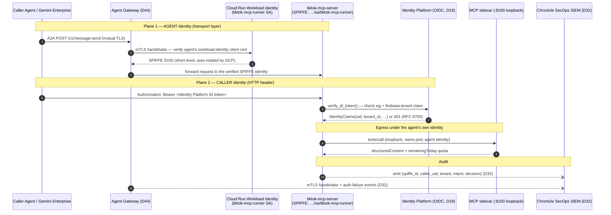

<!-- SPDX-License-Identifier: Apache-2.0 -->
<!-- Copyright 2026 Social Seeding Inc. -->

# Agent Identity — `tiktok-mcp-server` cryptographic ID

> **Track 3 official requirement** (`designed_guide.pdf` p.7): *"implement Agent
> Identity to assign a unique cryptographic ID to the agent."* This document
> specifies how that ID is assigned, where it is recorded, and how it is verified.
>
> **Authority**: [`DECISIONS.md` D48](../decisions/DECISIONS.md) (Agent Identity
> crypto ID) and the `SERVICE-INVENTORY.md` headline that already names *Agent
> Identity (SPIFFE)* under the **Govern** plane (DECISIONS.md §5). Per RULES.md,
> claims here are grounded in the actual GCP primitives and the A2A v0.3 spec —
> no invented mechanisms.

---

## 1. Decision

Assign the agent a **SPIFFE-format unique cryptographic ID**, derived from its
**Cloud Run workload identity** (the dedicated runtime service account), and bind
that ID into the agent's published surface two ways:

1. **In the agent card** (`agent.json`) — a non-secret `identity` block declaring
   the SPIFFE ID + the SPIFFE trust domain, plus a `mutualTLS` security scheme so
   peers know the agent authenticates at the transport layer.
2. **At runtime / on the wire** — the Cloud Run service account is the
   *cryptographic* anchor: GCP issues short-lived, automatically-rotated X.509/JWT
   credentials for it (workload identity), and the agent card MAY additionally
   carry an A2A v0.3 **JWS `signatures[]`** entry so any client can verify the card
   was published by the holder of the agent's key (RFC 7515).

**The chosen ID:**

```
spiffe://ss-mcp-prod.svc.id.goog/ns/agents/sa/tiktok-mcp-runner
```

This is a stable, globally-unique, cryptographically-anchored identifier: the
trust domain `ss-mcp-prod.svc.id.goog` is the GCP Workload Identity pool of the
`ss-mcp-prod` project (the project id suggested in DECISIONS.md §6 O2), and the
path encodes the Kubernetes/Cloud Run service-account `tiktok-mcp-runner` that the
service already runs as (`cloud-run-service.yaml`
`serviceAccountName: tiktok-mcp-runner@__PROJECT__.iam.gserviceaccount.com`).

---

## 2. Why this approach (and the alternatives weighed)

Three candidate mechanisms, evaluated against the PDF's "unique cryptographic ID"
+ "secure by design" mandate:

| Option | What it is | Pro | Con | Verdict |
|---|---|---|---|---|
| **A. Cloud Run / Workload Identity + SPIFFE-format ID** (chosen) | The runtime service account is the identity; GCP auto-issues + auto-rotates the underlying X.509/JWT credential; expressed as a SPIFFE ID | Zero secret material to manage; auto-rotation; already provisioned (`tiktok-mcp-runner` SA exists); SPIFFE is the form `DECISIONS.md` §5 already commits to ("Agent Identity (SPIFFE)") | SPIFFE string is a *naming convention* over GCP identity, not a full SPIRE deployment | **Chosen** — lowest operational risk, no new secret store, matches existing infra |
| **B. Self-run SPIFFE/SPIRE workload certs** | Deploy SPIRE server + agents; issue SVIDs | Full SPIFFE feature set, portable across clouds | New control plane to run + secure; overkill for one Cloud Run service on the challenge timeline (D7) | Deferred — revisit at multi-cloud scale |
| **C. Identity Platform OIDC as the agent ID** | Reuse the OIDC the agent already verifies for callers | No new component | OIDC here authenticates *callers/customers* (D19), not the *agent's own* identity — conflating the two breaks the auth segmentation rule | Rejected for *agent* identity (kept for *caller* auth — see §4) |

Option A also composes cleanly with the **Track-2 `a2a_invoke` capability**, whose
live path is **implemented** (`packages/agents-adk/src/ss_agents/tools/a2a_invoke.py`
`_live()` — real `httpx.post` of the A2A v0.3 envelope to `<endpoint>/v1/message:send`,
bounded retry, task-envelope parsing). Identity-token attachment is **implemented but
opt-in**: `_identity_token()` acquires a SPIFFE/Agent-Identity workload token only when
`A2A_IDENTITY_TOKEN` is set or `A2A_FETCH_ID_TOKEN=1` (ADC fetch for the endpoint
audience); otherwise it returns `None` and the hop proceeds with **no** `Authorization`
header — because today's Cloud Run demo callee is unauthenticated (transport-layer mTLS
enforcement is the post-O7 step, D44 Agent Gateway). Picking SPIFFE here means that once
identity attachment is switched on (opt-in flag) and mTLS is enforced (O7), caller and
callee already speak the same identity language end-to-end.

---

## 3. Where the ID is recorded

| Surface | Field | Value |
|---|---|---|
| Agent card (`agent.json`) | `identity.id` | `spiffe://ss-mcp-prod.svc.id.goog/ns/agents/sa/tiktok-mcp-runner` |
| Agent card | `identity.trustDomain` | `ss-mcp-prod.svc.id.goog` |
| Agent card | `identity.workloadIdentityProvider` | `cloud-run-service-account` |
| Agent card | `securitySchemes.mutualTLS` | A2A v0.3 `mutualTLS` scheme (peers authenticate by client cert at the transport layer) |
| Agent card | `signatures[]` | OPTIONAL JWS over the card (RFC 7515), `kid` = the agent key, `jku` = the public JWKS URL — lets any client verify card authorship |
| Cloud Run | `serviceAccountName` | `tiktok-mcp-runner@ss-mcp-prod.iam.gserviceaccount.com` (the cryptographic anchor) |
| Agent Registry (D23) | registration record | the same SPIFFE ID, so discovery + identity agree |

The `identity` block and the `mutualTLS` scheme are **non-secret** — they are
intended to be public in the discovery document. The *private key* is never in the
card or repo; it lives in the GCP-managed workload-identity credential and never
touches disk (consistent with `cloud-run-service.yaml`'s "secrets via Secret
Manager only; no `ENV` injection" stance).

---

## 4. Identity vs caller-auth — keeping the two planes separate

Two distinct identities meet at this agent; conflating them is the failure mode
the global auth-segmentation rule warns against:

- **Agent Identity** (this document): *who is this agent* —
  `spiffe://ss-mcp-prod.svc.id.goog/ns/agents/sa/tiktok-mcp-runner`. Used when the
  agent (a) authors/signs its card, (b) is A2A-invoked by a peer that pins its
  expected SVID, and (c) makes egress calls (e.g. to its own MCP sidecar, or — in
  the Track-2 reverse direction — when a *caller* agent presents *its* SPIFFE ID).
- **Caller Identity** (D19, already shipped in `identity_platform.py`): *who is
  asking* — an Identity Platform multi-tenant OIDC bearer, or OAuth2 `tiktok:read`.
  Verified per request by `require_identity`; tenant-pinned via the `firebase.tenant`
  claim.

The agent card declares **both** planes: `securitySchemes.oidc` + `oauth` gate the
*caller*; `securitySchemes.mutualTLS` + `identity` declare the *agent*. They never
share keys, tokens, or sessions.

---

## 5. Authentication flow



---

## 6. Audit trail (D32)

Every invocation is attributable to **two** identities for forensic replay:

- **Agent Gateway** (D44) logs the mTLS handshake outcome and the verified SPIFFE
  ID of every hop.
- **The agent** emits a per-invocation structured log carrying
  `{spiffe_id, caller_uid, tenant_id, intent, decision, model_armor_verdict}`.
- Both sinks feed **Chronicle SecOps SIEM** (D32 — *"Chronicle in Track 3
  'Enterprise Standards' evidence"*), where the `security_watch` Tier-3 agent (W3)
  watches Model Armor blocks + auth-failure spikes and can quarantine an offending
  tenant on threshold.
- Audit logs retain **90 days** (D33) via the BigQuery audit-log expiration policy.

This closes the loop the PDF's "secure by design" mandate asks for: a unique
cryptographic agent ID + a verifiable, retained trail of who invoked which intent.

---

## 7. Implementation status (honest scoping per RULES.md)

| Element | Status | Where |
|---|---|---|
| Cloud Run runtime service account (the crypto anchor) | **Provisioned** | `cloud-run-service.yaml` `serviceAccountName` |
| SPIFFE-format ID declared in `agent.json` | **Done (this task)** | `agent.json` `identity` block |
| `mutualTLS` security scheme in card | **Done (this task)** | `agent.json` `securitySchemes.mutualTLS` |
| Caller OIDC/OAuth verification | **Shipped** | `identity_platform.py` |
| `a2a_invoke` live A2A egress (POST `/v1/message:send`) | **Implemented** | `a2a_invoke.py` `_live()` — real `httpx.post`, A2A v0.3 envelope, bounded retry, task-envelope parsing (D45) |
| SPIFFE/identity-token attachment on egress | **Implemented but disabled by default** | `a2a_invoke.py` `_identity_token()` — attaches a `Bearer` token only when `A2A_IDENTITY_TOKEN` is set OR `A2A_FETCH_ID_TOKEN=1` (ADC); otherwise no `Authorization` header (the demo callee is unauthenticated today) |
| Transport-layer mTLS enforcement (Agent Gateway) | **Pending O7 Private-Preview allowlist** | DECISIONS.md §6 O7; the demo Cloud Run callee accepts unauthenticated requests until then |
| JWS-signed card (`signatures[]`) | **Optional / deferred** | requires a signing key + JWKS endpoint; the card is structurally ready (field is A2A v0.3-standard) |

The cryptographic ID is **assigned and published now** (workload-identity SA +
SPIFFE string in the card), and the **live A2A egress hop is implemented** (`_live()`).
What is *not* yet on by default: the egress hop attaches a SPIFFE/identity token only
when explicitly opted in (`A2A_IDENTITY_TOKEN` / `A2A_FETCH_ID_TOKEN=1`), and the
transport-layer *enforcement* (Agent Gateway mTLS, JWS card signing) lands as the
surrounding GCP services come online (O7, D44). Today the demo Cloud Run callee accepts
unauthenticated requests. No claim of "production-enforced mTLS" is made until O7 clears.

---

## 8. References

- Crypto-ID decision: [`DECISIONS.md` D48](../decisions/DECISIONS.md) + §5 Govern plane (Agent Identity / SPIFFE)
- Audit/SIEM: [`DECISIONS.md` D32](../decisions/DECISIONS.md), retention D33
- Agent card: [`code/deployment/agent.json`](code/deployment/agent.json)
- A2A intents that this identity gates: [`A2A-INTENTS.md`](A2A-INTENTS.md)
- A2A v0.3 securityScheme types (`mutualTLS`, `oauth2`, `openIdConnect`) + `signatures` (JWS, RFC 7515): https://a2a-protocol.org/specification/0.3.0
- SPIFFE ID format: https://spiffe.io/docs/latest/spiffe-about/spiffe-concepts/
- Track-2 SPIFFE egress hook: `packages/agents-adk/src/ss_agents/tools/a2a_invoke.py` `_live()`

**Status**: authored per D48 (2026-05-20). Crypto-ID method: **Cloud Run workload
identity expressed as a SPIFFE ID**, declared in the agent card + anchored by the
runtime service account.
