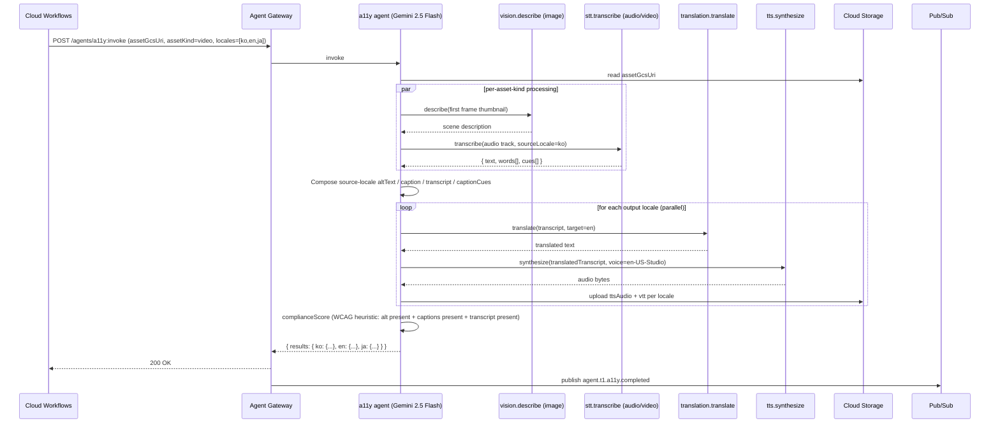

# a11y.spec.md

## 1. Purpose + ARCHITECTURE.md citation

The **A11y agent** generates accessibility artifacts for any media asset that the platform produces or that a creator posts: alt-text per image, captions per video (timestamped, per locale), transcripts, and TTS audio renderings for low-vision operators. Multi-locale per D34 — `ko / en / ja / zh-CN`. Drives both compliance posture (WCAG 2.1 AA expectation) and i18n surface area for the demo.

- **D-ID coverage**: D23 (NEW Tier-1 agent #15), D5 (Gemini 2.5 Flash — cheap structured extraction), D34 (4 locales mandatory), D29 (Multimodal differentiation), D22 (PIPA / future GDPR friendly).
- **ARCHITECTURE.md §3 row 15**: `a11y (NEW) | 1 | Gemini 2.5 Flash | vision.describe, stt.transcribe, tts.synthesize, translation.translate | None | a11y_compliance_score`.
- **v2 reference**: New agent — no v2 predecessor. Consumed by Mission Control + content_verify (#7) annotations.

## 2. JSON Schema (input/output)

```json
{
  "$schema": "https://json-schema.org/draft/2020-12/schema",
  "$id": "https://schemas.social-seeding.com/v2/agents/a11y.schema.json",
  "title": "A11yAgent",
  "$defs": {
    "AssetKind": { "type": "string", "enum": ["image","video","audio"] },
    "CaptionCue": {
      "type": "object",
      "required": ["startSec","endSec","text"],
      "properties": {
        "startSec": { "type": "number", "minimum": 0 },
        "endSec":   { "type": "number", "minimum": 0 },
        "text":     { "type": "string", "minLength": 1, "maxLength": 200 },
        "speaker":  { "type": "string" }
      }
    }
  },
  "type": "object",
  "properties": {
    "Input": {
      "type": "object",
      "required": ["assetGcsUri","assetKind","outputLocales"],
      "properties": {
        "assetGcsUri":  { "type": "string", "pattern": "^gs://" },
        "assetKind":    { "$ref": "#/$defs/AssetKind" },
        "sourceLocale": { "$ref": "https://schemas.social-seeding.com/v2/common/shared.schema.json#/$defs/Locale" },
        "outputLocales":{ "type": "array", "items": { "$ref": "https://schemas.social-seeding.com/v2/common/shared.schema.json#/$defs/Locale" }, "minItems": 1, "maxItems": 4 },
        "altTextOnly":  { "type": "boolean", "default": false, "description": "Image-only fast path" },
        "metadata":     { "$ref": "https://schemas.social-seeding.com/v2/common/shared.schema.json#/$defs/InvocationMetadata" }
      }
    },
    "Output": {
      "type": "object",
      "required": ["assetGcsUri","results"],
      "properties": {
        "assetGcsUri": { "type": "string" },
        "results": {
          "type": "object",
          "description": "Map of locale → a11y bundle",
          "additionalProperties": {
            "type": "object",
            "properties": {
              "altText":         { "type": "string", "maxLength": 400 },
              "caption":         { "type": "string", "maxLength": 200, "description": "Short caption (videos/images)" },
              "transcript":      { "type": "string", "description": "Full transcript (video/audio)" },
              "captionCues":     { "type": "array", "items": { "$ref": "#/$defs/CaptionCue" }, "description": "Timestamped cues (VTT-style)" },
              "ttsAudioGcsUri":  { "type": "string", "description": "TTS rendering of transcript" },
              "vttGcsUri":       { "type": "string", "description": "WebVTT file for video players" }
            }
          }
        },
        "complianceScore": { "type": "number", "minimum": 0, "maximum": 1, "description": "WCAG 2.1 AA heuristic" }
      }
    }
  }
}
```

## 3. OpenAPI 3.1 (REST surface)

```yaml
openapi: 3.1.0
info: { title: A11yAgent, version: 0.1.0 }
servers:
  - $ref: '../_common/shared.openapi.yaml#/servers/0'
paths:
  /agents/a11y:invoke:
    post:
      operationId: invokeA11y
      summary: Generate alt-text / captions / transcripts / TTS per locale.
      parameters:
        - $ref: '../_common/shared.openapi.yaml#/components/parameters/TenantHeader'
        - $ref: '../_common/shared.openapi.yaml#/components/parameters/TraceParent'
        - $ref: '../_common/shared.openapi.yaml#/components/parameters/IdempotencyKey'
      requestBody:
        required: true
        content:
          application/json:
            schema: { $ref: 'https://schemas.social-seeding.com/v2/agents/a11y.schema.json#/properties/Input' }
      responses:
        '200':
          description: A11y artifacts produced.
          content:
            application/json:
              schema: { $ref: 'https://schemas.social-seeding.com/v2/agents/a11y.schema.json#/properties/Output' }
        '422':
          description: Escalated (unsupported_locale / asset_corrupt).
          content:
            application/json:
              schema: { $ref: '../_common/shared.openapi.yaml#/components/schemas/AgentEscalation' }
```

## 4. AsyncAPI 3.0 (Pub/Sub events)

```yaml
asyncapi: 3.0.0
info: { title: A11y.Events, version: 0.1.0 }
channels:
  agent.t1.a11y.completed:
    address: agent.t1.a11y.completed
    messages:
      A11yCompleted:
        payload:
          type: object
          required: [assetGcsUri, localesProduced, complianceScore]
          properties:
            assetGcsUri:      { type: string }
            localesProduced:  { type: array, items: { type: string } }
            complianceScore:  { type: number }
            usdSpent:         { type: number }
operations:
  publishA11yCompleted:
    action: send
    channel: { $ref: '#/channels/agent.t1.a11y.completed' }
```

## 5. Mermaid sequence diagram (happy path)



## 6. Tool list + USD cap + escalation conditions

| Tool | Capability | Purpose |
|---|---|---|
| `vision.describe` | Vision AI / Gemini multimodal | Alt-text + scene description (images, video keyframes) |
| `stt.transcribe` | Speech-to-Text | Audio/video transcription with word-level timestamps |
| `tts.synthesize` | Text-to-Speech | Locale-specific TTS rendering |
| `translation.translate` | Translation API | Cross-locale translation |
| `assets.upload` | Cloud Storage | Persist VTT + TTS audio |

**USD cap**: $0.20 per invocation. Bulk discount: ≤ $0.05 if `altTextOnly=true`.

**Escalation conditions**:
- `outputLocales` contains locale outside D34 set.
- Asset > 100MB (video) — request must use background batch endpoint.
- `stt.transcribe` returns `low_confidence` AND audio < 2 sec.
- All requested locales fail translation (Translation API outage).
- Asset content is RAI-flagged (e.g., extracted text contains hate speech) — output captions to a sanitized form and flag in trace.

```python
class A11yOutput(BaseModel):
    assetGcsUri: str
    results: dict[str, dict]  # locale -> bundle
    complianceScore: float = Field(ge=0, le=1)
```

## 7. Eval criteria (Vertex AI Agent Evaluation)

| Metric | Description | Threshold |
|---|---|---|
| `a11y_compliance_score` | WCAG 2.1 AA heuristic (alt + caption + transcript present) | ≥ 0.95 |
| `caption_wer` | Word error rate vs human-transcribed gold | ≤ 0.10 |
| `translation_bleu` | BLEU vs human translation | ≥ 0.45 |
| `tts_mos_subjective` | Mean opinion score on TTS naturalness (offline panel) | ≥ 4.0 |
| `vtt_validity` | Generated VTT files pass W3C validator | = 1.00 |

**Golden set**: `tests/golden/a11y/*.json` — 60 assets (20 images, 20 videos, 20 audio-only) × 4 locales = 240 test points.

## 8. Edge cases

1. **Video with no audio track** — transcript empty; agent must still produce alt-text from keyframes.
2. **Audio with multiple speakers** — diarize via STT; captionCues carry `speaker` field; if STT can't diarize, fall back to single-speaker mode.
3. **Mixed-language audio** (Korean speaker quoting English phrase) — STT returns segments; transcript preserves mix; translation handles per-segment.
4. **Burned-in subtitles in video** — Vision keyframe describe captures, but caption mismatch causes inflation; flag `subtitle_in_frame` and rely on STT.
5. **Source locale undeclared** — agent infers from audio; if confidence < 0.7, escalate `source_locale_unknown`.
6. **Translation API rate-limited** for batch of 100+ assets — backoff via Cloud Tasks; emit partial result; resume.
7. **VTT character limit per cue** — split long cues into 200-char chunks at word boundaries.
