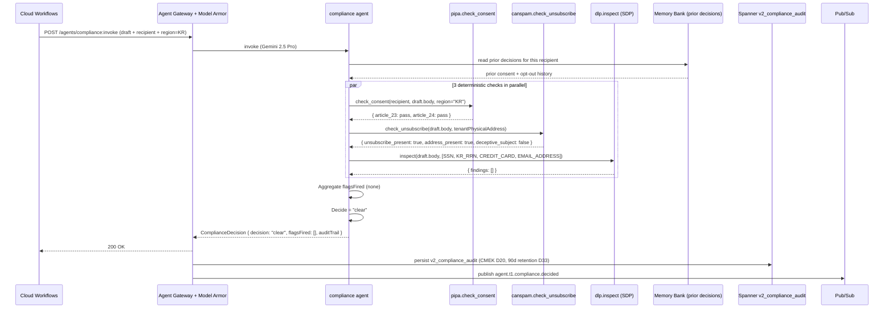

# compliance.spec.md

## 1. Purpose + ARCHITECTURE.md citation

The **Compliance agent** is the pre-send gate that checks every outbound message against legal/regulatory requirements before it reaches `gmail.send`. Day-1 scope (D22): **PIPA Article 23/24** (Korean consent, sensitive data), **CAN-SPAM** (unsubscribe link, physical address, no deceptive subject), and **DLP inspect** (no PII leak in body to wrong recipient). It does NOT decide a message's content quality — that's the writer + critic. It decides whether the message is **legally safe to send today**.

- **D-ID coverage**: D23 (NEW Tier-1 agent #13), D22 (PIPA + Marketplace minimal day-1; SOC2/GDPR deferred), D20 (DLP inspect templates), D21 (Model Armor PII block as upstream defense), D33 (90d audit retention of compliance decisions).
- **ARCHITECTURE.md §3 row 13**: `compliance (NEW) | 1 | Gemini 2.5 Pro | pipa.check_consent, canspam.check_unsubscribe, dlp.inspect | Memory Bank | precision (no false-clear)`.
- **v2 reference**: New agent — no v2 predecessor. Mounted between writer (#3/#11) and `gmail.send`.

## 2. JSON Schema (input/output)

```json
{
  "$schema": "https://json-schema.org/draft/2020-12/schema",
  "$id": "https://schemas.social-seeding.com/v2/agents/compliance.schema.json",
  "title": "ComplianceAgent",
  "$defs": {
    "ComplianceRegion": {
      "type": "string",
      "enum": ["KR","EU","US","JP","CN","GLOBAL"]
    },
    "ComplianceFlag": {
      "type": "string",
      "enum": [
        "missing_unsubscribe","missing_physical_address","deceptive_subject",
        "pii_leak","sensitive_data_pipa_23","sensitive_data_pipa_24",
        "no_prior_consent","gdpr_jurisdiction","minor_recipient",
        "competitor_blacklist","unverified_recipient"
      ]
    },
    "ComplianceDecision": {
      "type": "object",
      "required": ["decision","flagsFired","auditTrail"],
      "properties": {
        "decision":   { "type": "string", "enum": ["clear","needs_fix","block"] },
        "flagsFired": { "type": "array", "items": { "$ref": "#/$defs/ComplianceFlag" } },
        "suggestions": {
          "type": "array",
          "items": {
            "type": "object",
            "required": ["flag","action"],
            "properties": {
              "flag":   { "$ref": "#/$defs/ComplianceFlag" },
              "action": { "type": "string", "description": "Concrete fix the writer should apply" }
            }
          }
        },
        "auditTrail": {
          "type": "object",
          "required": ["pipaResult","canspamResult","dlpResult","decidedAt"],
          "properties": {
            "pipaResult":     { "type": "object" },
            "canspamResult":  { "type": "object" },
            "dlpResult":      { "type": "object" },
            "decidedAt":      { "type": "string", "format": "date-time" }
          }
        }
      }
    }
  },
  "type": "object",
  "properties": {
    "Input": {
      "type": "object",
      "required": ["draft","recipient","region"],
      "properties": {
        "draft": {
          "type": "object",
          "required": ["subject","body"],
          "properties": {
            "subject": { "type": "string" },
            "body":    { "type": "string" },
            "fromEmail":{ "type": "string", "format": "email" }
          }
        },
        "recipient": {
          "type": "object",
          "required": ["email"],
          "properties": {
            "email":            { "type": "string", "format": "email" },
            "country":          { "type": "string", "minLength": 2, "maxLength": 2 },
            "explicitConsent":  { "type": "boolean", "description": "Did the recipient previously opt-in?" },
            "consentSource":    { "type": "string" },
            "ageVerified":      { "type": "boolean" }
          }
        },
        "region":   { "$ref": "#/$defs/ComplianceRegion" },
        "messageKind": { "type": "string", "enum": ["cold_outreach","reply","follow_up","transactional"] },
        "tenantPhysicalAddress": { "type": "string", "description": "Required per CAN-SPAM § 7704(a)(5)" },
        "metadata": { "$ref": "https://schemas.social-seeding.com/v2/common/shared.schema.json#/$defs/InvocationMetadata" }
      }
    },
    "Output": { "$ref": "#/$defs/ComplianceDecision" }
  }
}
```

## 3. OpenAPI 3.1 (REST surface)

```yaml
openapi: 3.1.0
info: { title: ComplianceAgent, version: 0.1.0 }
servers:
  - $ref: '../_common/shared.openapi.yaml#/servers/0'
paths:
  /agents/compliance:invoke:
    post:
      operationId: invokeCompliance
      summary: Pre-send legal compliance check (PIPA + CAN-SPAM + DLP).
      parameters:
        - $ref: '../_common/shared.openapi.yaml#/components/parameters/TenantHeader'
        - $ref: '../_common/shared.openapi.yaml#/components/parameters/TraceParent'
        - $ref: '../_common/shared.openapi.yaml#/components/parameters/IdempotencyKey'
      requestBody:
        required: true
        content:
          application/json:
            schema: { $ref: 'https://schemas.social-seeding.com/v2/agents/compliance.schema.json#/properties/Input' }
      responses:
        '200':
          description: Decision rendered.
          content:
            application/json:
              schema: { $ref: 'https://schemas.social-seeding.com/v2/agents/compliance.schema.json#/properties/Output' }
        '422':
          description: Escalated (insufficient_signals).
          content:
            application/json:
              schema: { $ref: '../_common/shared.openapi.yaml#/components/schemas/AgentEscalation' }
```

## 4. AsyncAPI 3.0 (Pub/Sub events)

```yaml
asyncapi: 3.0.0
info: { title: Compliance.Events, version: 0.1.0 }
channels:
  agent.t1.compliance.decided:
    address: agent.t1.compliance.decided
    messages:
      ComplianceDecided:
        payload:
          type: object
          required: [draftId, decision, flagsFired]
          properties:
            draftId:    { type: string }
            decision:   { type: string, enum: [clear, needs_fix, block] }
            flagsFired: { type: array, items: { type: string } }
            region:     { type: string }
            usdSpent:   { type: number }
  agent.t1.compliance.blocked:
    address: agent.t1.compliance.blocked
    description: Critical signal — fan-out to security_watch (W3) + audit log.
    messages:
      ComplianceBlocked:
        payload:
          type: object
          required: [draftId, flagsFired, tenantId, blockedAt]
          properties:
            draftId:     { type: string }
            tenantId:    { type: string }
            flagsFired:  { type: array, items: { type: string } }
            blockedAt:   { type: string, format: date-time }
operations:
  publishDecided:
    action: send
    channel: { $ref: '#/channels/agent.t1.compliance.decided' }
  publishBlocked:
    action: send
    channel: { $ref: '#/channels/agent.t1.compliance.blocked' }
```

## 5. Mermaid sequence diagram (happy path)



## 6. Tool list + USD cap + escalation conditions

| Tool | Capability | Purpose |
|---|---|---|
| `pipa.check_consent` | rule engine + Spanner | PIPA Article 23 (consent), 24 (sensitive data) |
| `canspam.check_unsubscribe` | regex + heuristics | Unsubscribe link presence, physical address, subject honesty |
| `dlp.inspect` | Sensitive Data Protection (SDP) | PII detection (SSN, RRN, card, email-other-than-recipient) |
| `vault.read_consent_log` | Spanner | Prior consent / opt-out for recipient |

**USD cap**: $0.15 per check. Gemini 2.5 Pro is for the reasoning step over deterministic-tool outputs — most of the work is the tool layer.

**Escalation conditions**:
- `region="EU"` (GDPR scope — D22 deferred); agent escalates `gdpr_out_of_scope`.
- DLP returns critical-severity finding (SSN / credit-card in body).
- Recipient is minor (`ageVerified=false` AND signals of minor) — `minor_recipient` → always block.
- `tenantPhysicalAddress` missing AND `region ∈ {US, GLOBAL}` (CAN-SPAM violation).
- PIPA check returns "unable_to_determine" (ambiguous Korean consent text).

```python
class ComplianceDecision(BaseModel):
    decision: Literal["clear","needs_fix","block"]
    flagsFired: list[ComplianceFlag] = Field(default_factory=list)
    suggestions: list[dict] = Field(default_factory=list)
    auditTrail: dict
```

## 7. Eval criteria (Vertex AI Agent Evaluation)

| Metric | Description | Threshold |
|---|---|---|
| `precision_no_false_clear` | of `clear` decisions, fraction legally OK on human audit | ≥ 0.99 |
| `recall_pii_leak` | of true PII leaks, caught | ≥ 0.98 |
| `pipa_article_23_accuracy` | KR consent decisions vs legal-review | ≥ 0.95 |
| `canspam_full_coverage` | All 5 CAN-SPAM rules checked per US message | = 1.00 |
| `latency_p95_ms` | Pre-send blocking check | ≤ 800 ms |

**Golden set**: `tests/golden/compliance/{kr-pipa,us-canspam,jp-tokutei,zh-pipl}.json` — 50 cases per region; includes seeded PII traps and adversarial consent claims.

## 8. Edge cases

1. **PIPA Article 24 (sensitive data: health, biometrics, religion, sexual orientation)** in skincare campaign — uncommon, but agent must catch references to medical conditions in body.
2. **EU recipient by IP but `country="US"` in CRM** — escalate `gdpr_jurisdiction`; the operator must update record.
3. **Korean recipient with prior global opt-out** (Memory Bank flags) — block `no_prior_consent` regardless of region.
4. **Subject contains emoji that obfuscates a banned word** (e.g., "💊 사세요!") — flag `deceptive_subject` if DLP regex hits decoded form.
5. **DLP false positive on creator's @handle being read as `EMAIL_ADDRESS`** — adjust DLP inspect template to exclude handles.
6. **Compliance decision flips between turns** (clear → block on minor body change) — full re-check on every send; never cache `clear`.
7. **GDPR escalation but operator force-overrides** — only allowed with executive workflow approval (Workforce IF + MFA per D19); audit logged 90d.
