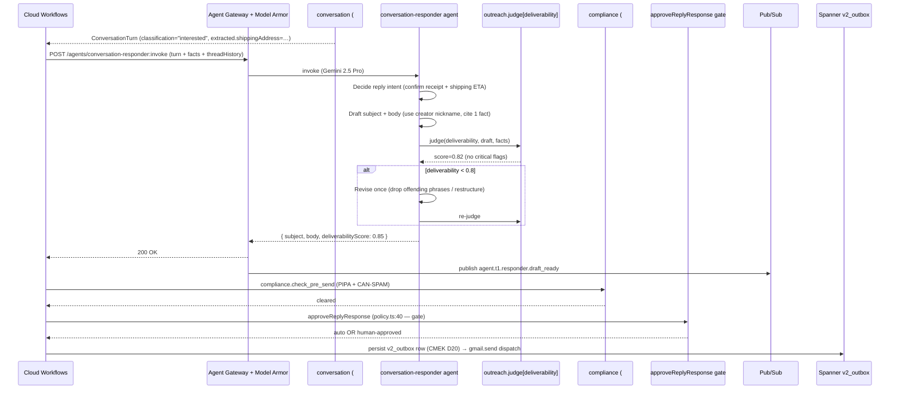

# conversation_responder.spec.md

## 1. Purpose + ARCHITECTURE.md citation

The **Conversation Responder agent** drafts ONE reply on a creator thread when the classifier returned a turn that needs one (`interested` / `needs_info`). It cites the same `OutreachFacts` the original writer cited, runs `outreach.judge[deliverability]` as a self-check, and returns `{subject, body, deliverabilityScore}` — never sends. Sending is a downstream workflow step after compliance (#13) + payment_mandate (#12) + `approveReplyResponse` gate.

- **D-ID coverage**: D23 (Tier-1 agent #5), D5 (Gemini 2.5 Pro for creative judgment), D10 (Gmail test path), D27 (drafted reply may carry AP2 Intent Mandate disclosure when rate proposed).
- **ARCHITECTURE.md §3 row 5**: `conversation_responder | 1 | Gemini 2.5 Pro | templates.list, outreach.render | Memory Bank | response_match_v2`.
- **v2 reference**: `packages/agents/src/conversation-responder.agent.ts:28-119`. Cap $0.25→$1.0 escalation lesson preserved.

## 2. JSON Schema (input/output)

```json
{
  "$schema": "https://json-schema.org/draft/2020-12/schema",
  "$id": "https://schemas.social-seeding.com/v2/agents/conversation_responder.schema.json",
  "title": "ConversationResponderAgent",
  "type": "object",
  "properties": {
    "Input": {
      "type": "object",
      "required": ["turn","facts"],
      "properties": {
        "turn": {
          "allOf": [
            { "$ref": "https://schemas.social-seeding.com/v2/agents/conversation.schema.json#/$defs/ConversationTurn" }
          ]
        },
        "facts": { "$ref": "https://schemas.social-seeding.com/v2/agents/outreach_writer.schema.json#/$defs/OutreachFacts" },
        "threadHistory": {
          "type": "array",
          "items": {
            "type": "object",
            "properties": {
              "role":     { "type": "string", "enum": ["us","them"] },
              "subject":  { "type": "string", "default": "" },
              "bodyText": { "type": "string", "default": "" }
            }
          },
          "default": []
        },
        "voiceNotes":     { "type": "string", "default": "" },
        "signatureBlock": { "type": "string", "default": "" },
        "bannedPhrases":  { "type": "array", "items": { "type": "string" }, "default": [] },
        "locale":   { "$ref": "https://schemas.social-seeding.com/v2/common/shared.schema.json#/$defs/Locale" },
        "metadata": { "$ref": "https://schemas.social-seeding.com/v2/common/shared.schema.json#/$defs/InvocationMetadata" }
      }
    },
    "Output": {
      "type": "object",
      "required": ["subject","body"],
      "properties": {
        "subject":              { "type": "string", "minLength": 1, "maxLength": 120 },
        "body":                 { "type": "string", "minLength": 1, "maxLength": 8000 },
        "deliverabilityScore":  { "type": "number", "minimum": 0, "maximum": 1 },
        "skepticScore":         { "type": "number", "minimum": 0, "maximum": 1 },
        "revisionCount":        { "type": "integer", "minimum": 0, "maximum": 2 },
        "groundedFacts":        { "type": "array", "items": { "type": "string" } }
      }
    }
  }
}
```

## 3. OpenAPI 3.1 (REST surface)

```yaml
openapi: 3.1.0
info: { title: ConversationResponderAgent, version: 0.1.0 }
servers:
  - $ref: '../_common/shared.openapi.yaml#/servers/0'
paths:
  /agents/conversation-responder:invoke:
    post:
      operationId: invokeConversationResponder
      summary: Draft a reply for a classified inbound creator message.
      parameters:
        - $ref: '../_common/shared.openapi.yaml#/components/parameters/TenantHeader'
        - $ref: '../_common/shared.openapi.yaml#/components/parameters/TraceParent'
      requestBody:
        required: true
        content:
          application/json:
            schema: { $ref: 'https://schemas.social-seeding.com/v2/agents/conversation_responder.schema.json#/properties/Input' }
      responses:
        '200':
          description: Reply drafted.
          content:
            application/json:
              schema: { $ref: 'https://schemas.social-seeding.com/v2/agents/conversation_responder.schema.json#/properties/Output' }
        '400': { $ref: '../_common/shared.openapi.yaml#/components/responses/BadRequest' }
        '409': { $ref: '../_common/shared.openapi.yaml#/components/responses/ModelArmorBlocked' }
        '422':
          description: Agent escalated (deliverability < 0.5 after 2 revisions / hostile input).
          content:
            application/json:
              schema: { $ref: '../_common/shared.openapi.yaml#/components/schemas/AgentEscalation' }
        '429': { $ref: '../_common/shared.openapi.yaml#/components/responses/BudgetExceeded' }
```

## 4. AsyncAPI 3.0 (Pub/Sub events)

```yaml
asyncapi: 3.0.0
info: { title: ConversationResponder.Events, version: 0.1.0 }
channels:
  agent.t1.responder.draft_ready:
    address: agent.t1.responder.draft_ready
    messages:
      ResponderDraftReady:
        payload:
          type: object
          required: [campaignId, creatorId, threadId, subject, deliverabilityScore]
          properties:
            campaignId:           { type: string }
            creatorId:            { type: string }
            threadId:             { type: string }
            subject:              { type: string }
            deliverabilityScore:  { type: number }
            revisionCount:        { type: integer }
            usdSpent:             { type: number }
            requiresGate:         { type: boolean, description: "approveReplyResponse policy decision" }
operations:
  publishResponderDraftReady:
    action: send
    channel: { $ref: '#/channels/agent.t1.responder.draft_ready' }
```

## 5. Mermaid sequence diagram (happy path)



## 6. Tool list + USD cap + escalation conditions

| Tool | Capability | Purpose |
|---|---|---|
| `templates.list` | DB read | Workspace's reply templates |
| `outreach.render` | template engine | Variable fill |
| `outreach.judge` | deterministic | Self-check `deliverability` score |

**USD cap**: $1.00 per invocation (Gemini 2.5 Pro tool loop, 4-6 turns observed). Mirrors v2's $0.25→$1.00 raise.

**Escalation conditions**:
- `deliverabilityScore < 0.5` after 2 revisions.
- Inbound `turn.classification ∈ {declined, negotiating, unsubscribe}` (should never have reached here; defensive escalation).
- `facts.hasMinimumContext === false`.
- `bannedPhrases` matched twice (revision unable to resolve).
- Hostile / abusive prior turn in thread history.

```python
class ResponderOutput(BaseModel):
    subject: str = Field(min_length=1, max_length=120)
    body: str = Field(min_length=1, max_length=8000)
    deliverabilityScore: float = Field(ge=0, le=1, default=0.0)
    skepticScore: float | None = None
    revisionCount: int = Field(ge=0, le=2, default=0)
    groundedFacts: list[str]
```

## 7. Eval criteria (Vertex AI Agent Evaluation)

| Metric | Description | Threshold |
|---|---|---|
| `response_match_v2` | Cosine vs golden-set reply | ≥ 0.72 |
| `address_acknowledgement_rate` | When `extracted.shippingAddress` present, reply confirms it | ≥ 0.95 |
| `cta_singularity` | Exactly one '?' or one clear ask | ≥ 0.90 |
| `bannedphrase_leak` | Banned phrases in body | = 0 |
| `revision_rate` | Fraction needing the revise pass | ≤ 0.35 |

**Golden set**: `tests/golden/conversation_responder/{ko,en,ja,zh-CN}.json` — 60 cases per locale.

## 8. Edge cases

1. **`interested` + shippingAddress present but address looks suspicious** — reply confirms receipt + asks logistics agent to verify; do NOT promise ETA.
2. **`needs_info` but the question is "how much do you pay?"** — escalate to negotiating; the responder should NOT propose a rate.
3. **Thread history > 6 turns** — only the last 6 are passed in; older context lives in Memory Bank.
4. **Creator's previous reply had banned-phrase trigger** — body must NOT quote it back.
5. **Locale of inbound differs from outreach locale** (we wrote in English, they replied in Korean) — respond in their locale.
6. **Model Armor blocks output regex (sensitive PII back from our side)** — agent receives error, regenerates with PII redacted, escalates if still blocked.
7. **Duplicate inbound (same `incomingMessageId`)** — idempotency-key dedupes at gateway; agent never invoked twice.
