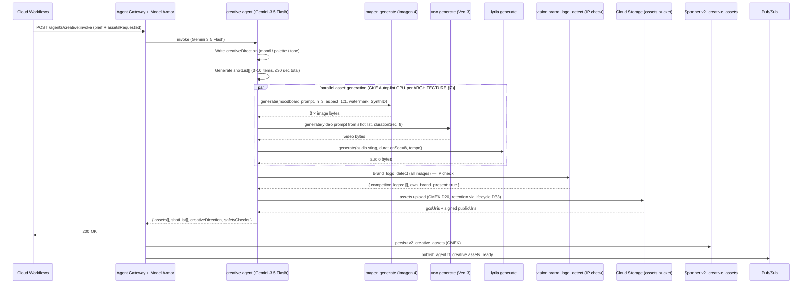

# creative.spec.md

## 1. Purpose + ARCHITECTURE.md citation

The **Creative agent** turns a brand brief into a moodboard + shot list + sample video that the operator (and the seeded creator) can use as a starting point. Multi-modal: Gemini 3.5 Flash for direction + script, **Imagen 4** for moodboard stills, **Veo 3** for sample video (≤ 8 sec), **Lyria** for background audio sting. Output assets land in Cloud Storage with audit metadata.

- **D-ID coverage**: D23 (NEW Tier-1 agent #14), D5 (Gemini 3.5 Flash orchestration), D29 (Multimodal + AP2 + Multi-agent — primary differentiator), D33 (assets retention via Cloud Storage lifecycle), D39 ($1500 credits unlock Veo 3 + Imagen 4 for demo).
- **ARCHITECTURE.md §3 row 14**: `creative (NEW) | 1 | Gemini 3.5 Flash + Imagen 4 + Veo 3 | imagen.generate, veo.generate, lyria.generate, assets.upload | Memory Bank (brand) | safety_v1 + brand_consistency`.
- **v2 reference**: New agent — no v2 predecessor. Slots into stage 1 (overview) optionally + content_review (#7) as reference for matching.

## 2. JSON Schema (input/output)

```json
{
  "$schema": "https://json-schema.org/draft/2020-12/schema",
  "$id": "https://schemas.social-seeding.com/v2/agents/creative.schema.json",
  "title": "CreativeAgent",
  "$defs": {
    "AssetKind": {
      "type": "string",
      "enum": ["moodboard_image","sample_video","audio_sting","shot_list_pdf"]
    },
    "Asset": {
      "type": "object",
      "required": ["kind","gcsUri","mimeType","sizeBytes","generatedAt"],
      "properties": {
        "kind":         { "$ref": "#/$defs/AssetKind" },
        "gcsUri":       { "type": "string", "pattern": "^gs://" },
        "publicUrl":    { "type": "string", "format": "uri", "description": "Signed URL valid ≤24h" },
        "mimeType":     { "type": "string" },
        "sizeBytes":    { "type": "integer", "minimum": 0 },
        "durationSec":  { "type": "number", "minimum": 0, "maximum": 60 },
        "promptUsed":   { "type": "string" },
        "safetyScore":  { "type": "number", "minimum": 0, "maximum": 1 },
        "watermark":    { "type": "string", "enum": ["SynthID","explicit_ai_tag"], "description": "Provenance marker (Imagen 4 / Veo 3 default)" },
        "generatedAt":  { "type": "string", "format": "date-time" }
      }
    },
    "ShotListItem": {
      "type": "object",
      "required": ["sequence","durationSec","description"],
      "properties": {
        "sequence":    { "type": "integer", "minimum": 1 },
        "durationSec": { "type": "number", "minimum": 0.5, "maximum": 30 },
        "description": { "type": "string", "maxLength": 400 },
        "cameraAngle": { "type": "string" },
        "voCue":       { "type": "string", "description": "Voiceover line (optional)" }
      }
    }
  },
  "type": "object",
  "properties": {
    "Input": {
      "type": "object",
      "required": ["brief"],
      "properties": {
        "brief":          { "$ref": "https://schemas.social-seeding.com/v2/agents/sourcing.schema.json#/properties/Input/properties/brief" },
        "creatorStyleHints": {
          "type": "object",
          "properties": {
            "uniqueId":         { "type": "string" },
            "preferredAngles":  { "type": "array", "items": { "type": "string" } },
            "tone":             { "type": "string" }
          }
        },
        "assetsRequested": {
          "type": "array",
          "items": { "$ref": "#/$defs/AssetKind" },
          "default": ["moodboard_image","sample_video","shot_list_pdf"]
        },
        "locale":   { "$ref": "https://schemas.social-seeding.com/v2/common/shared.schema.json#/$defs/Locale" },
        "metadata": { "$ref": "https://schemas.social-seeding.com/v2/common/shared.schema.json#/$defs/InvocationMetadata" }
      }
    },
    "Output": {
      "type": "object",
      "required": ["assets","shotList","creativeDirection"],
      "properties": {
        "assets":             { "type": "array", "items": { "$ref": "#/$defs/Asset" }, "minItems": 1 },
        "shotList":           { "type": "array", "items": { "$ref": "#/$defs/ShotListItem" }, "minItems": 3, "maxItems": 10 },
        "creativeDirection":  { "type": "string", "minLength": 50, "maxLength": 1500 },
        "safetyChecks": {
          "type": "object",
          "properties": {
            "raiPassed":     { "type": "boolean" },
            "ipDetections":  { "type": "array", "items": { "type": "string" } },
            "logoDetections":{ "type": "array", "items": { "type": "string" } }
          }
        }
      }
    }
  }
}
```

## 3. OpenAPI 3.1 (REST surface)

```yaml
openapi: 3.1.0
info: { title: CreativeAgent, version: 0.1.0 }
servers:
  - $ref: '../_common/shared.openapi.yaml#/servers/0'
paths:
  /agents/creative:invoke:
    post:
      operationId: invokeCreative
      summary: Generate moodboard + sample video + shot list from a brand brief.
      parameters:
        - $ref: '../_common/shared.openapi.yaml#/components/parameters/TenantHeader'
        - $ref: '../_common/shared.openapi.yaml#/components/parameters/TraceParent'
        - $ref: '../_common/shared.openapi.yaml#/components/parameters/IdempotencyKey'
      requestBody:
        required: true
        content:
          application/json:
            schema: { $ref: 'https://schemas.social-seeding.com/v2/agents/creative.schema.json#/properties/Input' }
      responses:
        '200':
          description: Assets generated.
          content:
            application/json:
              schema: { $ref: 'https://schemas.social-seeding.com/v2/agents/creative.schema.json#/properties/Output' }
        '409': { $ref: '../_common/shared.openapi.yaml#/components/responses/ModelArmorBlocked' }
        '422':
          description: Escalated (RAI block / IP-detection / quota).
          content:
            application/json:
              schema: { $ref: '../_common/shared.openapi.yaml#/components/schemas/AgentEscalation' }
```

## 4. AsyncAPI 3.0 (Pub/Sub events)

```yaml
asyncapi: 3.0.0
info: { title: Creative.Events, version: 0.1.0 }
channels:
  agent.t1.creative.assets_ready:
    address: agent.t1.creative.assets_ready
    messages:
      AssetsReady:
        payload:
          type: object
          required: [campaignId, assetCount, primaryGcsUris]
          properties:
            campaignId:       { type: string }
            assetCount:       { type: integer }
            primaryGcsUris:   { type: array, items: { type: string } }
            usdSpent:         { type: number }
            generationDurationSec: { type: number }
  asset.safety.blocked:
    address: asset.safety.blocked
    description: When RAI / IP detection blocks generation.
    messages:
      AssetBlocked:
        payload:
          type: object
          properties:
            campaignId:   { type: string }
            kind:         { type: string }
            reason:       { type: string }
            promptDigest: { type: string }
operations:
  publishAssetsReady:
    action: send
    channel: { $ref: '#/channels/agent.t1.creative.assets_ready' }
  publishAssetBlocked:
    action: send
    channel: { $ref: '#/channels/asset.safety.blocked' }
```

## 5. Mermaid sequence diagram (happy path)



## 6. Tool list + USD cap + escalation conditions

| Tool | Capability | Purpose |
|---|---|---|
| `imagen.generate` | Imagen 4 (Vertex AI) | Moodboard stills (3-5 per run) |
| `veo.generate` | Veo 3 (Vertex AI) | Sample video, ≤ 8 sec |
| `lyria.generate` | Lyria (Vertex AI) | Audio sting / BGM |
| `vision.brand_logo_detect` | Vision AI | IP / competitor logo detection on output |
| `assets.upload` | Cloud Storage | Persist + sign URLs |

**USD cap**: $3.00 per invocation. Veo 3 dominates cost (~$0.50-1.50 for 8 sec at 720p, per current Vertex AI rate card); Imagen 4 ≈ $0.04 / image × 3 = $0.12; Lyria ≈ $0.10 / 8s.

**Escalation conditions**:
- RAI default policy blocks generation (sensitive content in brief).
- `vision.brand_logo_detect` detects competitor IP in generated asset.
- Veo 3 quota exhausted in region (failover to another region or escalate).
- `brief.brandProduct.category` is on the high-risk list (alcohol/tobacco/firearms in some locales — RAI blocks).
- Cloud Storage upload fails (KMS region failure during CMEK write).

```python
class CreativeOutput(BaseModel):
    assets: list[Asset] = Field(min_items=1)
    shotList: list[ShotListItem] = Field(min_items=3, max_items=10)
    creativeDirection: str = Field(min_length=50, max_length=1500)
    safetyChecks: dict
```

## 7. Eval criteria (Vertex AI Agent Evaluation)

| Metric | Description | Threshold |
|---|---|---|
| `safety_v1` | RAI pass on all generated assets | = 1.00 |
| `brand_consistency` | Cosine of asset embedding vs brand reference set | ≥ 0.80 |
| `ip_clean_rate` | No competitor / unlicensed logos in output | = 1.00 |
| `shot_list_actionability` | Each shot includes camera angle + duration + concrete description | ≥ 0.95 |
| `cost_per_run` | Average USD per full asset pack | ≤ $2.50 |
| `latency_p95_sec` | Time to fully-uploaded assets | ≤ 90 sec |

**Golden set**: `tests/golden/creative/*.json` — 30 briefs across categories (skincare, food, fashion, tech, fitness).

## 8. Edge cases

1. **Brief implies generating likeness of a real person** — RAI blocks; escalate `likeness_policy_block`.
2. **Brand reference set in Memory Bank empty (new workspace)** — fall back to category-level mood; flag `low_brand_signal`.
3. **Veo 3 returns video with hallucinated text overlay** — flag in trace; regenerate once with negative prompt.
4. **Localized prompt** (Korean creative direction) returns English-text overlay on image — re-prompt with explicit "no text" or "Korean text only".
5. **Watermark missing on Imagen output** (rare model bug) — re-run; if persistent, escalate `watermark_missing`.
6. **Quota burst across 100 simultaneous creative runs** — Cloud Tasks queues; throttle per tenant.
7. **CMEK key disabled mid-upload** — assets.upload fails; runbook flips key (D32); retry once.
