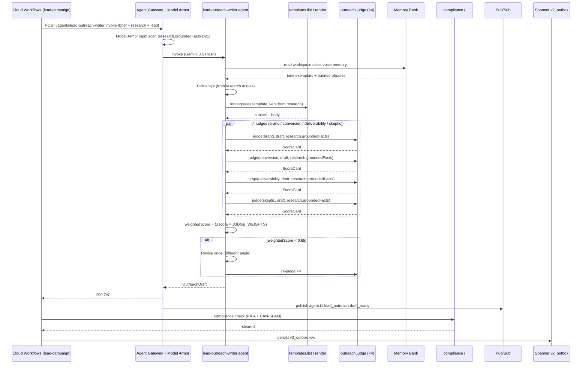

# lead_outreach_writer.spec.md

## 1. Purpose + ARCHITECTURE.md citation

The **Lead Outreach Writer agent** is the B2B sibling of the brand-side outreach writer (agent #3). It drafts ONE cold-sales email from the `LeadCampaignBrief` plus the lead's `LeadResearch` (output of the research agent #9). Same `OutreachDraft` output shape so downstream gates / `gmail.send` / conversation classifier read uniformly. Tone leans sales: "pitching SaaS to a business decision-maker" — not "inviting a creator to a free sample."

- **D-ID coverage**: D23 (Tier-1 agent #11), D5 (Gemini 3.5 Flash), D10 (Gmail test-only path), D11 (lead loop in v2 day-1 scope), D27 (lead-outreach feeds payment_mandate when sales-priced tier).
- **ARCHITECTURE.md §3 row 11**: `lead_outreach_writer | 1 | Gemini 3.5 Flash | templates.list, outreach.render, crm.enrich | Memory Bank | response_match_v2`.
- **v2 reference**: `packages/agents/src/lead-outreach-writer.agent.ts:35-114`. Cap $1.20 preserved.

## 2. JSON Schema (input/output)

```json
{
  "$schema": "https://json-schema.org/draft/2020-12/schema",
  "$id": "https://schemas.social-seeding.com/v2/agents/lead_outreach_writer.schema.json",
  "title": "LeadOutreachWriterAgent",
  "$defs": {
    "LeadResearch": {
      "type": "object",
      "required": ["pitch","angles","confidence"],
      "properties": {
        "pitch":          { "type": "string", "minLength": 20, "maxLength": 800 },
        "angles":         { "type": "array", "items": { "type": "string", "minLength": 10, "maxLength": 280 }, "minItems": 1, "maxItems": 5 },
        "groundedFacts":  { "type": "array", "items": { "type": "string", "minLength": 5, "maxLength": 280 } },
        "contactProfile": { "type": "string" },
        "confidence":     { "type": "number", "minimum": 0, "maximum": 100 },
        "researchedAt":   { "type": "string", "format": "date-time" }
      }
    }
  },
  "type": "object",
  "properties": {
    "Input": {
      "type": "object",
      "required": ["brief","research","lead"],
      "properties": {
        "brief":    { "$ref": "https://schemas.social-seeding.com/v2/agents/research.schema.json#/$defs/LeadCampaignBrief" },
        "research": { "$ref": "#/$defs/LeadResearch" },
        "lead": {
          "type": "object",
          "required": ["companyName","country"],
          "properties": {
            "companyName":    { "type": "string", "minLength": 1 },
            "companyNameEn":  { "type": "string" },
            "country":        { "type": "string", "minLength": 2, "maxLength": 2 },
            "homepageUrl":    { "type": "string", "format": "uri" },
            "contactEmail":   { "type": "string", "format": "email" }
          }
        },
        "signatureBlock": { "type": "string", "default": "" },
        "bannedPhrases":  { "type": "array", "items": { "type": "string" }, "default": [] },
        "locale":   { "$ref": "https://schemas.social-seeding.com/v2/common/shared.schema.json#/$defs/Locale" },
        "metadata": { "$ref": "https://schemas.social-seeding.com/v2/common/shared.schema.json#/$defs/InvocationMetadata" }
      }
    },
    "Output": { "$ref": "https://schemas.social-seeding.com/v2/agents/outreach_writer.schema.json#/$defs/OutreachDraft" }
  }
}
```

## 3. OpenAPI 3.1 (REST surface)

```yaml
openapi: 3.1.0
info: { title: LeadOutreachWriterAgent, version: 0.1.0 }
servers:
  - $ref: '../_common/shared.openapi.yaml#/servers/0'
paths:
  /agents/lead-outreach-writer:invoke:
    post:
      operationId: invokeLeadOutreachWriter
      summary: Draft one cold-sales email for one B2B lead.
      parameters:
        - $ref: '../_common/shared.openapi.yaml#/components/parameters/TenantHeader'
        - $ref: '../_common/shared.openapi.yaml#/components/parameters/TraceParent'
        - $ref: '../_common/shared.openapi.yaml#/components/parameters/IdempotencyKey'
      requestBody:
        required: true
        content:
          application/json:
            schema: { $ref: 'https://schemas.social-seeding.com/v2/agents/lead_outreach_writer.schema.json#/properties/Input' }
      responses:
        '200':
          description: Draft produced.
          content:
            application/json:
              schema: { $ref: 'https://schemas.social-seeding.com/v2/agents/lead_outreach_writer.schema.json#/properties/Output' }
        '422':
          description: Escalated (research_confidence_too_low / weighted_score_below_floor).
          content:
            application/json:
              schema: { $ref: '../_common/shared.openapi.yaml#/components/schemas/AgentEscalation' }
```

## 4. AsyncAPI 3.0 (Pub/Sub events)

```yaml
asyncapi: 3.0.0
info: { title: LeadOutreachWriter.Events, version: 0.1.0 }
channels:
  agent.t1.lead_outreach.draft_ready:
    address: agent.t1.lead_outreach.draft_ready
    messages:
      LeadDraftReady:
        payload:
          type: object
          required: [leadCampaignId, leadId, draftId, weightedScore]
          properties:
            leadCampaignId: { type: string }
            leadId:         { type: string }
            draftId:        { type: string }
            angle:          { type: string }
            weightedScore:  { type: number }
            spamScore:      { type: number }
            locale:         { type: string }
            usdSpent:       { type: number }
operations:
  publishLeadDraftReady:
    action: send
    channel: { $ref: '#/channels/agent.t1.lead_outreach.draft_ready' }
```

## 5. Mermaid sequence diagram (happy path)



## 6. Tool list + USD cap + escalation conditions

| Tool | Capability | Purpose |
|---|---|---|
| `templates.list` | DB read | Workspace sales templates |
| `outreach.render` | template engine | Variable fill |
| `outreach.judge` | deterministic | 4 judges with same weights as brand path |
| `crm.enrich` | Modal + Kimi | Re-enrich if research stale (≥ 30d) |

**USD cap**: $1.20 per lead. Slightly higher than brand writer (B2B emails are longer + go through more revision passes per v2 `lead-outreach-writer.agent.ts:33`).

**Escalation conditions**:
- `research.confidence < 30` → `research_confidence_too_low`.
- Weighted score < 0.65 even after one revise.
- `bannedPhrases` matched in body twice.
- `lead.contactEmail` missing AND brief allows email-required-only mode.
- Locale mismatch — agent must write in lead's country language; if unsupported, escalate.

```python
class LeadOutreachOutput(OutreachDraft):
    # same shape as brand-side OutreachDraft
    angle: Literal[
      "data_specific","pain_killer","mutual_benefit","authority","directness"
    ]
```

## 7. Eval criteria (Vertex AI Agent Evaluation)

| Metric | Description | Threshold |
|---|---|---|
| `response_match_v2` | Cosine vs golden-set winning B2B draft | ≥ 0.72 |
| `grounded_facts_usage` | Fraction of body's claims from `research.groundedFacts` | ≥ 0.90 |
| `judge_weighted_score` | Average across runs | ≥ 0.70 |
| `spam_score` | Average self-rated | ≤ 3 |
| `revise_rate` | Fraction needing revise pass | ≤ 0.35 |

**Golden set**: `tests/golden/lead_outreach_writer/{ko,en}.json` — 30 cases per locale; K-beauty + global SaaS scenarios.

## 8. Edge cases

1. **Korean lead with English homepage** — write in Korean; the homepage facts may need translation in-prompt.
2. **`research.groundedFacts` empty** — agent must produce a SHORT draft (no company-specific claims) or escalate.
3. **`brief.outreach.toneNotes` says "formal" but workspace memory has "casual" exemplars** — request takes priority; memory exemplars are reference only.
4. **Recipient title in `research.contactProfile` ≠ obvious from email** — agent uses title in body greeting only if explicit; otherwise generic.
5. **Same lead emailed previously (anti-fatigue)** — Memory Bank surfaces last-touch; if < 30d, escalate `lead_recently_contacted`.
6. **`research.angles[0]` is "directness" but lead is from formal-culture country (JP)** — agent adjusts angle to `authority` or `mutual_benefit`.
7. **Compliance pre-check fails (no opt-out, missing physical address per CAN-SPAM)** — agent rewrites with footer placeholder; if still fails, escalate to compliance agent #13.
