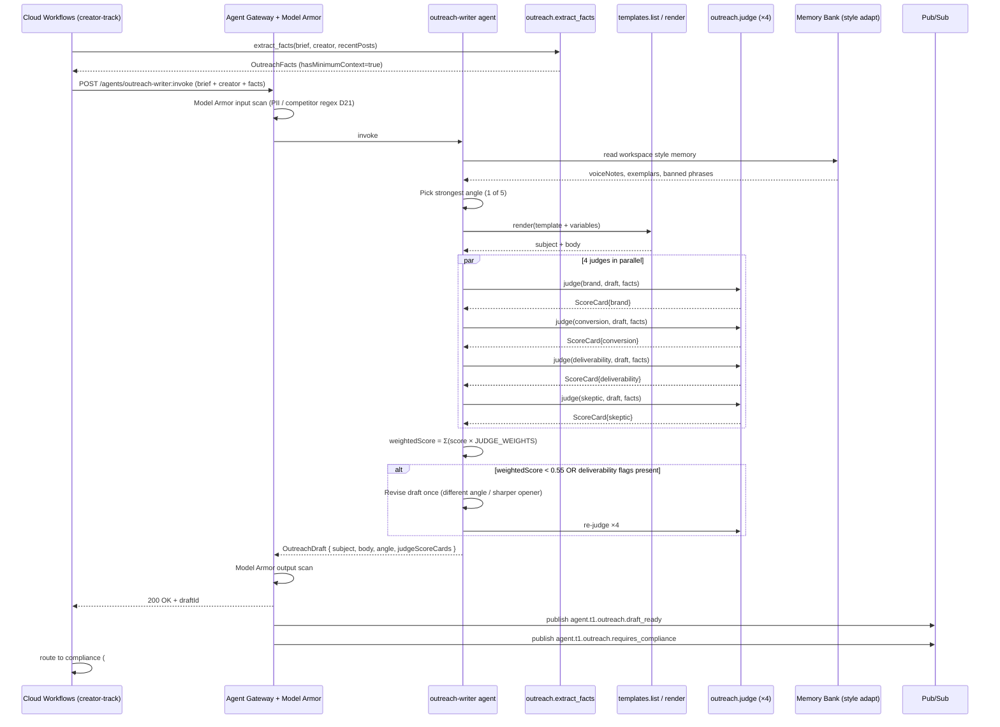

# outreach_writer.spec.md

## 1. Purpose + ARCHITECTURE.md citation

The **Outreach Writer agent** drafts ONE grounded, personalized email per creator. It uses the 5-angle × 4-judge tournament from v1's `lib/cold-mail` (pain_killer / aspirational / peer_proof / data_specific / contrarian_hook), cites ONLY closed-set facts produced by `outreach.extract_facts`, and returns the weighted winner with judge scorecards attached. The drafted message NEVER fires through `gmail.send` directly — the compliance + payment_mandate gates plus `approveOutreachSend` (policy.ts:40) sit between writer and send.

- **D-ID coverage**: D23 (Tier-1 agent #3), D5 (Gemini 3.5 Flash for judgment), D10 (Gmail test-account-only in demo), D21 (Model Armor blocks PII/competitor names in draft text), D27 (writer output feeds the AP2 Intent Mandate composer).
- **ARCHITECTURE.md §3 row 3**: `outreach_writer | 1 | Gemini 3.5 Flash tournament | templates.list, outreach.extract_facts, outreach.render, outreach.judge | Memory Bank (style adapt) | response_match_v2 + spam_score`.
- **v2 reference**: `packages/agents/src/outreach-writer.agent.ts:34-133`. Carries `JUDGE_WEIGHTS` from `packages/contracts/src/outreach.ts:74-79` verbatim so v1↔v2 A/B comparisons stay calibrated.

## 2. JSON Schema (input/output)

```json
{
  "$schema": "https://json-schema.org/draft/2020-12/schema",
  "$id": "https://schemas.social-seeding.com/v2/agents/outreach_writer.schema.json",
  "title": "OutreachWriterAgent",
  "$defs": {
    "AngleKey": {
      "type": "string",
      "enum": ["pain_killer","aspirational","peer_proof","data_specific","contrarian_hook"]
    },
    "JudgeKey": {
      "type": "string",
      "enum": ["brand","conversion","deliverability","skeptic"]
    },
    "JudgeScoreCard": {
      "type": "object",
      "required": ["judge","score","rationale"],
      "properties": {
        "judge":      { "$ref": "#/$defs/JudgeKey" },
        "score":      { "type": "number", "minimum": 0, "maximum": 1 },
        "rationale":  { "type": "string", "maxLength": 600 },
        "flags":      { "type": "array", "items": { "type": "string" }, "default": [] }
      }
    },
    "OutreachFacts": {
      "type": "object",
      "required": ["creator","brand","logistics","hasMinimumContext"],
      "properties": {
        "creator": {
          "type": "object",
          "required": ["uniqueId","nickname","followerCount"],
          "properties": {
            "uniqueId":          { "type": "string" },
            "nickname":          { "type": "string" },
            "signature":         { "type": "string", "default": "" },
            "topHashtags":       { "type": "array", "maxItems": 5, "items": { "type": "string" } },
            "recentPostThemes":  { "type": "array", "maxItems": 3, "items": { "type": "string" } },
            "followerCount":     { "type": "integer", "minimum": 0 },
            "avgViews":          { "type": "integer", "minimum": 0 },
            "engagementRate":    { "type": "number", "minimum": 0, "maximum": 1 }
          }
        },
        "brand": {
          "type": "object",
          "required": ["name","category","description"],
          "properties": {
            "name":        { "type": "string" },
            "category":    { "type": "string" },
            "description": { "type": "string" },
            "keyClaims":   { "type": "array", "items": { "type": "string" }, "default": [] }
          }
        },
        "logistics": {
          "type": "object",
          "required": ["shipsSamples"],
          "properties": { "shipsSamples": { "type": "boolean" } }
        },
        "hasMinimumContext": { "type": "boolean" }
      }
    },
    "OutreachDraft": {
      "type": "object",
      "required": ["subject","body","angle","spamScore","groundedFacts"],
      "properties": {
        "subject":       { "type": "string", "minLength": 1, "maxLength": 120 },
        "body":          { "type": "string", "minLength": 1, "maxLength": 8000 },
        "angle":         { "$ref": "#/$defs/AngleKey" },
        "spamScore":     { "type": "number", "minimum": 0, "maximum": 10 },
        "groundedFacts": { "type": "array", "items": { "type": "string" } },
        "judgeScores": {
          "type": "object",
          "properties": {
            "brand":          { "type": "number" },
            "conversion":     { "type": "number" },
            "deliverability": { "type": "number" },
            "skeptic":        { "type": "number" }
          }
        },
        "judgeScoreCards": { "type": "array", "items": { "$ref": "#/$defs/JudgeScoreCard" }, "minItems": 4, "maxItems": 4 },
        "locale": { "$ref": "https://schemas.social-seeding.com/v2/common/shared.schema.json#/$defs/Locale" }
      }
    }
  },
  "type": "object",
  "properties": {
    "Input": {
      "type": "object",
      "required": ["brief","creator"],
      "properties": {
        "brief":     { "$ref": "https://schemas.social-seeding.com/v2/agents/sourcing.schema.json#/properties/Input/properties/brief" },
        "creator":   { "$ref": "https://schemas.social-seeding.com/v2/agents/sourcing.schema.json#/$defs/TikTokCreator" },
        "recentPosts": {
          "type": "array",
          "items": {
            "type": "object",
            "properties": {
              "desc":     { "type": "string", "default": "" },
              "hashtags": { "type": "array", "items": { "type": "string" }, "default": [] }
            }
          },
          "default": []
        },
        "facts":         { "$ref": "#/$defs/OutreachFacts" },
        "voiceNotes":    { "type": "string", "default": "" },
        "signatureBlock":{ "type": "string", "default": "" },
        "bannedPhrases": { "type": "array", "items": { "type": "string" }, "default": [] },
        "locale":        { "$ref": "https://schemas.social-seeding.com/v2/common/shared.schema.json#/$defs/Locale" },
        "metadata":      { "$ref": "https://schemas.social-seeding.com/v2/common/shared.schema.json#/$defs/InvocationMetadata" }
      }
    },
    "Output": { "$ref": "#/$defs/OutreachDraft" }
  }
}
```

## 3. OpenAPI 3.1 (REST surface)

```yaml
openapi: 3.1.0
info: { title: OutreachWriterAgent, version: 0.1.0 }
servers:
  - $ref: '../_common/shared.openapi.yaml#/servers/0'
paths:
  /agents/outreach-writer:invoke:
    post:
      operationId: invokeOutreachWriter
      summary: Draft one personalized cold-outreach email for one creator.
      parameters:
        - $ref: '../_common/shared.openapi.yaml#/components/parameters/TenantHeader'
        - $ref: '../_common/shared.openapi.yaml#/components/parameters/TraceParent'
        - $ref: '../_common/shared.openapi.yaml#/components/parameters/IdempotencyKey'
      requestBody:
        required: true
        content:
          application/json:
            schema: { $ref: 'https://schemas.social-seeding.com/v2/agents/outreach_writer.schema.json#/properties/Input' }
      responses:
        '200':
          description: Draft produced.
          content:
            application/json:
              schema: { $ref: 'https://schemas.social-seeding.com/v2/agents/outreach_writer.schema.json#/properties/Output' }
        '400': { $ref: '../_common/shared.openapi.yaml#/components/responses/BadRequest' }
        '401': { $ref: '../_common/shared.openapi.yaml#/components/responses/Unauthorized' }
        '409': { $ref: '../_common/shared.openapi.yaml#/components/responses/ModelArmorBlocked' }
        '422':
          description: Agent escalated (insufficient_context / draft_below_quality_floor).
          content:
            application/json:
              schema: { $ref: '../_common/shared.openapi.yaml#/components/schemas/AgentEscalation' }
        '429': { $ref: '../_common/shared.openapi.yaml#/components/responses/BudgetExceeded' }
```

## 4. AsyncAPI 3.0 (Pub/Sub events)

```yaml
asyncapi: 3.0.0
info: { title: OutreachWriter.Events, version: 0.1.0 }
channels:
  agent.t1.outreach.draft_ready:
    address: agent.t1.outreach.draft_ready
    messages:
      DraftReady:
        contentType: application/json
        payload:
          type: object
          required: [campaignId, creatorId, angle, spamScore, weightedScore, draftId]
          properties:
            campaignId:    { type: string }
            creatorId:     { type: string }
            draftId:       { type: string, description: "Spanner v2_outreach_drafts row id" }
            angle:         { type: string }
            spamScore:     { type: number, minimum: 0, maximum: 10 }
            weightedScore: { type: number, minimum: 0, maximum: 1, description: "Σ(score × JUDGE_WEIGHTS)" }
            locale:        { type: string }
            usdSpent:      { type: number }
            traceId:       { type: string }
  agent.t1.outreach.requires_compliance:
    address: agent.t1.outreach.requires_compliance
    description: Always emitted on success — compliance agent (#13) subscribes before any send.
    messages:
      ComplianceRequested:
        payload:
          type: object
          required: [campaignId, creatorId, draftId]
          properties:
            campaignId:{ type: string }
            creatorId: { type: string }
            draftId:   { type: string }
  agent.lifecycle.escalated: { $ref: '../_common/shared.asyncapi.yaml#/channels/agent.lifecycle.escalated' }
operations:
  publishDraftReady:
    action: send
    channel: { $ref: '#/channels/agent.t1.outreach.draft_ready' }
  publishComplianceRequested:
    action: send
    channel: { $ref: '#/channels/agent.t1.outreach.requires_compliance' }
```

## 5. Mermaid sequence diagram (happy path)



## 6. Tool list + USD cap + escalation conditions

| Tool | Capability | Purpose |
|---|---|---|
| `templates.list` | DB read | Per-workspace template inventory |
| `outreach.extract_facts` | deterministic (closed-set) | The fact bench the draft cites |
| `outreach.render` | template engine | Mustache-style variable fill |
| `outreach.judge` | deterministic | 4 judges (brand / conversion / deliverability / skeptic) |

**USD cap**: $1.50 per invocation (Gemini 3.5 Flash; revise pass included). v2 lesson: `outreach-writer.agent.ts:55` documents the $0.80→$1.50 raise after live demos.

**Escalation conditions**:
- `facts.hasMinimumContext === false`.
- Weighted score < 0.55 even after one revise.
- `deliverability` flags include critical (`hiddenText`, `tooManyExclamations`, `excessiveCaps`) twice.
- `bannedPhrases` matched in body and revision can't drop them.
- Locale of `creator.language` not in {ko,en,ja,zh-CN} (D34).

```python
class OutreachDraft(BaseModel):
    subject: str = Field(min_length=1, max_length=120)
    body: str = Field(min_length=1, max_length=8000)
    angle: Literal["pain_killer","aspirational","peer_proof","data_specific","contrarian_hook"]
    spamScore: float = Field(ge=0, le=10)
    groundedFacts: list[str]
    judgeScoreCards: list[JudgeScoreCard] = Field(min_items=4, max_items=4)
    locale: Literal["ko","en","ja","zh-CN"] = "ko"

JUDGE_WEIGHTS = {"skeptic": 0.40, "conversion": 0.30, "deliverability": 0.15, "brand": 0.15}
```

## 7. Eval criteria (Vertex AI Agent Evaluation)

| Metric | Description | Threshold |
|---|---|---|
| `response_match_v2` | Cosine similarity to golden-set winning draft | ≥ 0.75 |
| `spam_score_max` | Max self-reported spamScore across runs | ≤ 3 |
| `groundedness` | Fraction of body claims traceable to `OutreachFacts.*` | ≥ 0.95 |
| `judge_calibration` | Agreement between 4 judges and human review | ≥ 0.80 |
| `bannedphrase_leak_rate` | Banned phrases that snuck into final draft | = 0.00 |
| `revise_rate` | Fraction needing the revise pass | ≤ 0.30 |

**Golden set**: `tests/golden/outreach_writer/{ko,en,ja,zh-CN}.json` (40 cases per locale = 160). Mirrors `packages/agents/src/outreach-writer.golden.test.ts`.

## 8. Edge cases

1. **Brief has `shipsSamples=false` but creator's outreach norm is sample-driven** — body must NOT imply sample; angle defaults to `data_specific` or `peer_proof`.
2. **Creator's `signature` is in English but campaign locale is Korean** — write in Korean, but the agent must NOT cite English signature text verbatim (translate or drop).
3. **`facts.creator.recentPostThemes[]` is empty** — only `topHashtags[]` is citable; if both empty, escalate `insufficient_context`.
4. **Model Armor blocks output** (e.g., regex matched a competitor name the operator forgot to add to bannedPhrases) — agent receives `BLOCKED` from gateway; runtime returns 409, workflow retries with augmented banned list.
5. **Judges deadlock (2 say revise, 2 say accept)** — weighted score is the tiebreaker; if still ambiguous, accept.
6. **Locale mismatch creator vs workspace** (Korean workspace, English-speaking creator) — `locale` field comes from `creator.language` not workspace; downstream translation (a11y agent) handles operator preview.
7. **Idempotency replay**: same draftId requested twice within 24h → return cached draft from Memory Bank (Firestore TTL 14d per D33).
