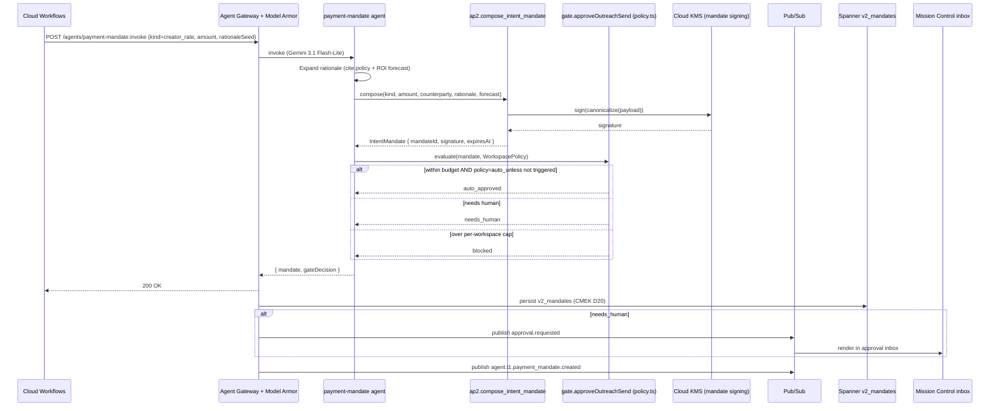

# payment_mandate.spec.md

## 1. Purpose + ARCHITECTURE.md citation

The **Payment Mandate agent** composes an AP2 v0.2 **Intent Mandate** for any agent action that incurs spend (shipping cost, paid creator rate, sample fulfillment fees, ads spend). It NEVER initiates payment — D27 explicitly limits v2 to Intent Mandate, never Cart or Payment Mandates. The agent's output is a structured intent document the human approves via `approveOutreachSend` / `approveShipment` / `approveStageAdvance` (`policy.ts:40-44`). Auto-approval is gated on per-workspace `WorkspacePolicy.budgets.maxUsdPerCampaign` + autonomy level.

- **D-ID coverage**: D23 (NEW Tier-1 agent #12), D27 (AP2 Intent Mandate ONLY — safety-first scope), D12 (multi-tenant + AP2), D28 ($0.01/view pricing model — Intent Mandate carries the per-view forecast).
- **ARCHITECTURE.md §3 row 12**: `payment_mandate (NEW) | 1 | Gemini 3.1 Flash-Lite | ap2.compose_intent_mandate, gate.approveOutreachSend | Session | mandate_validity`.
- **v2 reference**: New agent — no v2 predecessor. Slots into v2's `gate.approveOutreachSend` policy (`packages/contracts/src/policy.ts:40`).

## 2. JSON Schema (input/output)

```json
{
  "$schema": "https://json-schema.org/draft/2020-12/schema",
  "$id": "https://schemas.social-seeding.com/v2/agents/payment_mandate.schema.json",
  "title": "PaymentMandateAgent",
  "$defs": {
    "MandateKind": {
      "type": "string",
      "enum": ["shipment_cost","creator_rate","sample_fulfillment","ads_spend","platform_fee"]
    },
    "IntentMandate": {
      "type": "object",
      "required": ["mandateId","kind","tenantId","workspaceId","amountUsdCents","rationale","expiresAt","signature"],
      "properties": {
        "mandateId":       { "type": "string", "pattern": "^mnd_[A-Za-z0-9_-]{16,}$" },
        "kind":            { "$ref": "#/$defs/MandateKind" },
        "tenantId":        { "type": "string" },
        "workspaceId":     { "type": "string" },
        "campaignId":      { "type": "string" },
        "subjectAgentId":  { "type": "string", "description": "Which agent will be authorized to act if approved" },
        "counterparty": {
          "type": "object",
          "properties": {
            "kind":      { "type": "string", "enum": ["carrier","creator","ad_network","platform"] },
            "id":        { "type": "string" },
            "displayName":{ "type": "string" }
          }
        },
        "amountUsdCents":  { "type": "integer", "minimum": 0 },
        "currency":        { "type": "string", "default": "USD" },
        "rationale":       { "type": "string", "minLength": 20, "maxLength": 800 },
        "forecast": {
          "type": "object",
          "description": "Optional per-view ROI forecast for $0.01/view model (D28).",
          "properties": {
            "viewsExpected":  { "type": "integer", "minimum": 0 },
            "cpmUsd":         { "type": "number", "minimum": 0 },
            "roiMultiple":    { "type": "number" }
          }
        },
        "expiresAt":       { "type": "string", "format": "date-time" },
        "signature":       { "type": "string", "description": "HMAC-SHA256 over canonicalized payload using Cloud KMS-wrapped key (D20)" }
      }
    }
  },
  "type": "object",
  "properties": {
    "Input": {
      "type": "object",
      "required": ["kind","tenantId","workspaceId","amountUsdCents","subjectAgentId","rationaleSeed"],
      "properties": {
        "kind":            { "$ref": "#/$defs/MandateKind" },
        "tenantId":        { "type": "string" },
        "workspaceId":     { "type": "string" },
        "campaignId":      { "type": "string" },
        "subjectAgentId":  { "$ref": "https://schemas.social-seeding.com/v2/common/shared.schema.json#/$defs/AgentId" },
        "amountUsdCents":  { "type": "integer", "minimum": 0 },
        "counterparty":    { "type": "object" },
        "rationaleSeed":   { "type": "string", "minLength": 5, "description": "Free-text the agent expands into a structured rationale" },
        "forecastInputs": {
          "type": "object",
          "properties": {
            "viewsExpected": { "type": "integer", "minimum": 0 },
            "cpmUsd":        { "type": "number", "minimum": 0 }
          }
        },
        "metadata": { "$ref": "https://schemas.social-seeding.com/v2/common/shared.schema.json#/$defs/InvocationMetadata" }
      }
    },
    "Output": {
      "type": "object",
      "required": ["mandate","gateDecision"],
      "properties": {
        "mandate":      { "$ref": "#/$defs/IntentMandate" },
        "gateDecision": {
          "type": "object",
          "required": ["decision"],
          "properties": {
            "decision":   { "type": "string", "enum": ["auto_approved","needs_human","blocked"] },
            "reason":     { "type": "string" },
            "expiresAt":  { "type": "string", "format": "date-time" }
          }
        }
      }
    }
  }
}
```

## 3. OpenAPI 3.1 (REST surface)

```yaml
openapi: 3.1.0
info: { title: PaymentMandateAgent, version: 0.1.0 }
servers:
  - $ref: '../_common/shared.openapi.yaml#/servers/0'
paths:
  /agents/payment-mandate:invoke:
    post:
      operationId: invokePaymentMandate
      summary: Compose an AP2 Intent Mandate and route to the approval gate.
      parameters:
        - $ref: '../_common/shared.openapi.yaml#/components/parameters/TenantHeader'
        - $ref: '../_common/shared.openapi.yaml#/components/parameters/TraceParent'
        - $ref: '../_common/shared.openapi.yaml#/components/parameters/IdempotencyKey'
      requestBody:
        required: true
        content:
          application/json:
            schema: { $ref: 'https://schemas.social-seeding.com/v2/agents/payment_mandate.schema.json#/properties/Input' }
      responses:
        '200':
          description: Mandate composed (auto_approved or needs_human).
          content:
            application/json:
              schema: { $ref: 'https://schemas.social-seeding.com/v2/agents/payment_mandate.schema.json#/properties/Output' }
        '403':
          description: Blocked — tenant over budget or mandate kind disallowed.
          content:
            application/problem+json:
              schema: { $ref: '../_common/shared.openapi.yaml#/components/schemas/Problem' }
        '422':
          description: Escalated.
          content:
            application/json:
              schema: { $ref: '../_common/shared.openapi.yaml#/components/schemas/AgentEscalation' }
```

## 4. AsyncAPI 3.0 (Pub/Sub events)

```yaml
asyncapi: 3.0.0
info: { title: PaymentMandate.Events, version: 0.1.0 }
channels:
  agent.t1.payment_mandate.created:
    address: agent.t1.payment_mandate.created
    messages:
      MandateCreated:
        payload:
          type: object
          required: [mandateId, kind, tenantId, workspaceId, amountUsdCents, decision]
          properties:
            mandateId:       { type: string }
            kind:            { type: string }
            tenantId:        { type: string }
            workspaceId:     { type: string }
            campaignId:      { type: string }
            amountUsdCents:  { type: integer }
            decision:        { type: string, enum: [auto_approved, needs_human, blocked] }
            expiresAt:       { type: string, format: date-time }
  approval.requested:
    address: approval.requested
    description: When decision=needs_human, fan-out to MC inbox.
    messages:
      ApprovalRequested:
        payload:
          type: object
          required: [approvalId, mandateId, kind]
          properties:
            approvalId: { type: string }
            mandateId:  { type: string }
            kind:       { type: string }
            workspaceId:{ type: string }
            campaignId: { type: string }
operations:
  publishMandateCreated:
    action: send
    channel: { $ref: '#/channels/agent.t1.payment_mandate.created' }
  publishApprovalRequested:
    action: send
    channel: { $ref: '#/channels/approval.requested' }
```

## 5. Mermaid sequence diagram (happy path)



## 6. Tool list + USD cap + escalation conditions

| Tool | Capability | Purpose |
|---|---|---|
| `ap2.compose_intent_mandate` | deterministic + KMS signing | AP2 v0.2 mandate composition |
| `gate.approveOutreachSend` | policy evaluator | Reads `WorkspacePolicy` from Spanner; returns decision |
| `billing.query` | BigQuery | Current spend vs budget (workspace + campaign) |
| `forecast.cpm` | BigQuery ML | Optional ROI forecast for D28 per-view pricing |

**USD cap**: $0.10 per mandate (Flash, ≤ 2 tool calls).

**Escalation conditions**:
- `amountUsdCents <= 0` (defensive).
- Counterparty type mismatches mandate kind (e.g., `creator_rate` + `counterparty.kind="carrier"`).
- `WorkspacePolicy` not found in Spanner (workspace deleted mid-flight).
- KMS signing fails (key disabled, region failure) — runbook auto-rotates (D32).
- Spend already exceeds `maxUsdPerCampaign` (gate returns `blocked`, not an escalation — surface to operator).

```python
class IntentMandate(BaseModel):
    mandateId: str = Field(pattern=r"^mnd_[A-Za-z0-9_-]{16,}$")
    kind: Literal["shipment_cost","creator_rate","sample_fulfillment","ads_spend","platform_fee"]
    tenantId: str
    workspaceId: str
    campaignId: str | None = None
    subjectAgentId: str
    amountUsdCents: int = Field(ge=0)
    rationale: str = Field(min_length=20, max_length=800)
    expiresAt: datetime
    signature: str
```

## 7. Eval criteria (Vertex AI Agent Evaluation)

| Metric | Description | Threshold |
|---|---|---|
| `mandate_validity` | Of generated mandates, fraction passing AP2 v0.2 schema + signature verify | = 1.00 |
| `rationale_quality` | LLM-as-judge — concrete, policy-citing | ≥ 0.85 |
| `gate_decision_correctness` | vs human review on edge cases | ≥ 0.95 |
| `false_auto_approve_rate` | Auto-approved when should have escalated | ≤ 0.02 |
| `forecast_accuracy` (when D28 forecast attached) | viewsExpected vs actual MAPE | ≤ 30% |

**Golden set**: `tests/golden/payment_mandate/*.json` — 100 scenarios (per-kind, per-tier, edge budgets).

## 8. Edge cases

1. **Mandate kind disallowed by tenant** (e.g., free-tier prohibits `creator_rate`) — gate returns `blocked`, no human escalation needed; tenant sees policy error.
2. **Currency mismatch** — D28 forecasts in USD; if `counterparty.id` carrier prices in JPY, rationale notes "estimated at JPY-USD 145".
3. **Same mandate replayed (idempotency)** — return existing mandateId; no double-sign.
4. **Mandate expires before human approves** — rebuild with new `expiresAt`; previous mandate marked `expired` in Spanner.
5. **Multi-currency campaign** (KR shipping + US creator pay) — issue separate mandates per kind.
6. **Tenant in quarantine (security_watch W3)** — gate auto-blocks regardless of budget.
7. **Cloud KMS region failover** — signing service degraded; agent escalates `kms_unavailable`; runbook flips to secondary key ring (D32).
