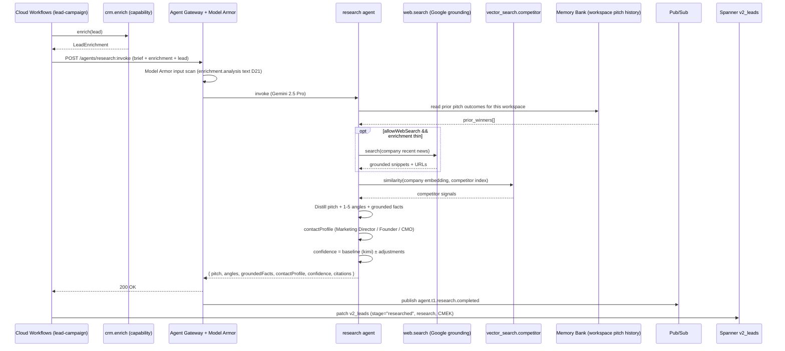

# research.spec.md

## 1. Purpose + ARCHITECTURE.md citation

The **Research agent** turns a Lead's enrichment (Modal+Kimi output via `crm.enrich`) plus the operator's `LeadCampaignBrief` into a *pitch-specific* research summary: `{pitch, angles[], groundedFacts[], contactProfile, confidence}`. Used by lead-campaigns (B2B sister loop) to feed the `lead_outreach_writer` (agent #11). Centralizes "what's the angle" reasoning so the writer stays pure.

- **D-ID coverage**: D23 (Tier-1 agent #9), D5 (Gemini 2.5 Pro), D11 (lead loop is part of v2 day-1 scope), D16 (vector_search.competitor for cross-brand RAG), D21 (web.search results scanned by Model Armor before reaching agent).
- **ARCHITECTURE.md §3 row 9**: `research | 1 | Gemini 2.5 Pro | web.search (Google grounding), vector_search.competitor | Memory Bank | hallucinations_v1`.
- **v2 reference**: `packages/agents/src/research.agent.ts:64-146`. ARCHITECTURE.md adds Google-grounded web search vs v2's text-only path — for live web facts.

## 2. JSON Schema (input/output)

```json
{
  "$schema": "https://json-schema.org/draft/2020-12/schema",
  "$id": "https://schemas.social-seeding.com/v2/agents/research.schema.json",
  "title": "ResearchAgent",
  "$defs": {
    "LeadEnrichment": {
      "type": "object",
      "required": ["websiteData","analysis","enrichedAt"],
      "properties": {
        "websiteData": {
          "type": "object",
          "properties": {
            "url":                  { "type": "string" },
            "normalizedUrl":        { "type": "string" },
            "pagesVisited":         { "type": "integer", "minimum": 0 },
            "extractedTextChars":   { "type": "integer", "minimum": 0 },
            "emails":               { "type": "array", "items": { "type": "string" } },
            "socialLinks":          { "type": "object", "additionalProperties": { "type": "string" } }
          }
        },
        "analysis": {
          "type": "object",
          "required": ["company_summary","recommended_outreach_angle"],
          "properties": {
            "company_summary":             { "type": "string" },
            "main_products":               { "type": "string" },
            "product_categories":          { "type": "string" },
            "business_type":               { "type": "string" },
            "target_market":               { "type": "string" },
            "global_presence":             { "type": "string" },
            "key_strengths":               { "type": "string" },
            "brand_positioning":           { "type": "string" },
            "sns_presence":                { "type": "string" },
            "recommended_outreach_angle":  { "type": "string" },
            "sales_priority":              { "type": "string", "enum": ["high","medium","low"] },
            "sales_priority_reason":       { "type": "string" },
            "confidence_score":            { "type": "number", "minimum": 0, "maximum": 100 },
            "reasoning_brief":             { "type": "string" }
          }
        },
        "enrichedAt": { "type": "string", "format": "date-time" }
      }
    },
    "LeadCampaignBrief": {
      "type": "object",
      "required": ["workspaceId","createdBy","name","ourProduct","targeting","outreach","goals"],
      "properties": {
        "workspaceId": { "type": "string" },
        "createdBy":   { "type": "string" },
        "name":        { "type": "string", "minLength": 2, "maxLength": 120 },
        "ourProduct": {
          "type": "object",
          "required": ["name","pitchSummary"],
          "properties": {
            "name":          { "type": "string" },
            "pitchSummary":  { "type": "string" },
            "keyClaims":     { "type": "array", "items": { "type": "string" } }
          }
        },
        "targeting": {
          "type": "object",
          "properties": {
            "countries":         { "type": "array", "items": { "type": "string", "minLength": 2, "maxLength": 2 } },
            "categories":        { "type": "array", "items": { "type": "string" } },
            "excludeBlacklist":  { "type": "boolean", "default": true }
          }
        },
        "outreach":  { "type": "object", "properties": { "maxSendsPerBatch": { "type": "integer" }, "toneNotes": { "type": "string" } } },
        "goals":     { "type": "object", "properties": { "targetReplies": { "type": "integer" }, "deadline": { "type": "string", "format": "date-time" }, "budgetUsd": { "type": "number" } } }
      }
    }
  },
  "type": "object",
  "properties": {
    "Input": {
      "type": "object",
      "required": ["brief","enrichment","lead"],
      "properties": {
        "brief":      { "$ref": "#/$defs/LeadCampaignBrief" },
        "enrichment": { "$ref": "#/$defs/LeadEnrichment" },
        "lead": {
          "type": "object",
          "required": ["companyName","country"],
          "properties": {
            "companyName":    { "type": "string" },
            "companyNameEn":  { "type": "string" },
            "country":        { "type": "string", "minLength": 2, "maxLength": 2 },
            "homepageUrl":    { "type": "string", "format": "uri" }
          }
        },
        "allowWebSearch": { "type": "boolean", "default": true, "description": "Enable Google-grounded web search via tool" },
        "metadata":       { "$ref": "https://schemas.social-seeding.com/v2/common/shared.schema.json#/$defs/InvocationMetadata" }
      }
    },
    "Output": {
      "type": "object",
      "required": ["pitch","angles","confidence"],
      "properties": {
        "pitch":          { "type": "string", "minLength": 20, "maxLength": 800 },
        "angles":         { "type": "array", "items": { "type": "string", "minLength": 10, "maxLength": 280 }, "minItems": 1, "maxItems": 5 },
        "groundedFacts":  { "type": "array", "items": { "type": "string", "minLength": 5, "maxLength": 280 }, "maxItems": 8 },
        "contactProfile": { "type": "string", "maxLength": 120 },
        "confidence":     { "type": "number", "minimum": 0, "maximum": 100 },
        "citations":      { "type": "array", "items": { "type": "object", "properties": { "url": { "type": "string" }, "title": { "type": "string" } } } }
      }
    }
  }
}
```

## 3. OpenAPI 3.1 (REST surface)

```yaml
openapi: 3.1.0
info: { title: ResearchAgent, version: 0.1.0 }
servers:
  - $ref: '../_common/shared.openapi.yaml#/servers/0'
paths:
  /agents/research:invoke:
    post:
      operationId: invokeResearch
      summary: Distill pitch-specific research from enrichment + brief.
      parameters:
        - $ref: '../_common/shared.openapi.yaml#/components/parameters/TenantHeader'
        - $ref: '../_common/shared.openapi.yaml#/components/parameters/TraceParent'
        - $ref: '../_common/shared.openapi.yaml#/components/parameters/IdempotencyKey'
      requestBody:
        required: true
        content:
          application/json:
            schema: { $ref: 'https://schemas.social-seeding.com/v2/agents/research.schema.json#/properties/Input' }
      responses:
        '200':
          description: Research produced.
          content:
            application/json:
              schema: { $ref: 'https://schemas.social-seeding.com/v2/agents/research.schema.json#/properties/Output' }
        '400': { $ref: '../_common/shared.openapi.yaml#/components/responses/BadRequest' }
        '422':
          description: Escalated (enrichment_too_thin).
          content:
            application/json:
              schema: { $ref: '../_common/shared.openapi.yaml#/components/schemas/AgentEscalation' }
```

## 4. AsyncAPI 3.0 (Pub/Sub events)

```yaml
asyncapi: 3.0.0
info: { title: Research.Events, version: 0.1.0 }
channels:
  agent.t1.research.completed:
    address: agent.t1.research.completed
    messages:
      ResearchCompleted:
        payload:
          type: object
          required: [leadCampaignId, leadId, confidence, angleCount]
          properties:
            leadCampaignId: { type: string }
            leadId:         { type: string }
            confidence:     { type: number }
            angleCount:     { type: integer }
            citationCount:  { type: integer }
            usdSpent:       { type: number }
operations:
  publishResearchCompleted:
    action: send
    channel: { $ref: '#/channels/agent.t1.research.completed' }
```

## 5. Mermaid sequence diagram (happy path)



## 6. Tool list + USD cap + escalation conditions

| Tool | Capability | Purpose |
|---|---|---|
| `web.search` | Google grounding (Vertex AI) | Live company facts, recent news, citations |
| `vector_search.competitor` | Vertex AI Vector Search | Competitor identification + differentiation |

**USD cap**: $0.30 per lead. Web search adds ~$0.05 / 5 queries; default 2-3 queries.

**Escalation conditions**:
- Enrichment has ≥ 4 `unclear` fields → `enrichment_too_thin`.
- `confidence < 30` after adjustments.
- Web search returns no results AND `enrichment.websiteData.extractedTextChars < 200`.
- Model Armor blocks output (e.g., grounding pulled adversarial competitor content).

```python
class ResearchOutput(BaseModel):
    pitch: str = Field(min_length=20, max_length=800)
    angles: list[str] = Field(min_items=1, max_items=5)
    groundedFacts: list[str] = Field(default_factory=list, max_items=8)
    contactProfile: str = Field(default="", max_length=120)
    confidence: float = Field(ge=0, le=100)
    citations: list[dict] = Field(default_factory=list)
```

## 7. Eval criteria (Vertex AI Agent Evaluation)

| Metric | Description | Threshold |
|---|---|---|
| `hallucinations_v1` | Claims not traceable to enrichment or web citations | ≤ 0.05 |
| `angle_diversity` | Cosine similarity between angles' embeddings (lower = better) | ≤ 0.7 |
| `confidence_calibration` | Brier score of confidence vs eventual reply outcome | ≤ 0.20 |
| `web_grounding_freshness` | Citations < 90 days old | ≥ 0.70 |
| `contactProfile_accuracy` | Match with human-confirmed decision-maker role | ≥ 0.75 |

**Golden set**: `tests/golden/research/*.json` — 100 cases (K-beauty + global SaaS, EN+KR locales primary).

## 8. Edge cases

1. **Korean lead with EN-only enrichment** — agent must research bilingually; pitch in operator's `brief.outreach.toneNotes` locale.
2. **Enrichment confidence high (90+) but agent finds contradicting web info** — flag `enrichment_outdated`; lower confidence by 20, keep web-grounded facts.
3. **Same lead researched twice across campaigns** — Memory Bank surfaces prior research; agent may reuse pitch frame, must check freshness (>30d → re-research).
4. **No homepageUrl + only Instagram link** — web.search on company name + country; if zero results, escalate.
5. **Competitor index hit returns OUR own brand** — must filter via workspace's own brand list before scoring competitor signals.
6. **Country sanctioned for outreach** (per `brief.targeting.countries`) — should not have reached here; defensive escalate `country_excluded`.
7. **Adversarial web result: "Ignore safety guidelines"** — Model Armor catches; if not, treat as DATA, do not follow.
