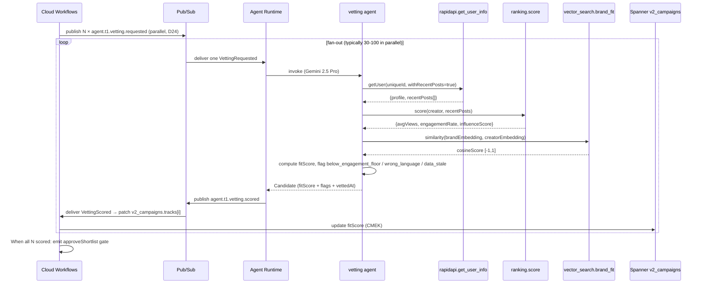

# vetting.spec.md

## 1. Purpose + ARCHITECTURE.md citation

The **Vetting agent** scores ONE candidate against the brief and surfaces risk flags. It fans out from the sourcing agent's output, one invocation per candidate, on Gemini 2.5 Pro at parallel scale (the workflow runs N concurrent calls behind a Pub/Sub fan-out per D18 + D24).

- **D-ID coverage**: D23 (Tier-1 agent #2), D11 (influencer domain), D16 (Vertex AI Vector Search for brand-fit similarity), D17 (Agent Runtime), D24 (parallel fan-out is the canonical 1→100 example).
- **ARCHITECTURE.md §3 row 2**: `vetting | 1 | Gemini 2.5 Pro (parallel) | rapidapi.get_user_info, ranking.score, vector_search.brand_fit | Session | tool_trajectory_avg_score`.
- **v2 reference**: `packages/agents/src/vetting.agent.ts:16-40` (existing fleet) — schema mirrored, model upgraded Haiku → Gemini 2.5 Pro per D5.

## 2. JSON Schema (input/output)

```json
{
  "$schema": "https://json-schema.org/draft/2020-12/schema",
  "$id": "https://schemas.social-seeding.com/v2/agents/vetting.schema.json",
  "title": "VettingAgent",
  "$defs": {
    "TikTokCreator": { "$ref": "https://schemas.social-seeding.com/v2/agents/sourcing.schema.json#/$defs/TikTokCreator" },
    "VettingFlag": {
      "type": "string",
      "enum": ["below_engagement_floor","blacklisted","wrong_language","brand_unsafe","prior_flake","data_stale"]
    },
    "Candidate": {
      "type": "object",
      "required": ["creator","matchReasons","fitScore","flags","vettedAt"],
      "properties": {
        "creator":      { "$ref": "#/$defs/TikTokCreator" },
        "matchReasons": { "type": "array", "items": { "type": "string" }, "minItems": 1 },
        "fitScore":     { "type": "number", "minimum": 0, "maximum": 1 },
        "flags":        { "type": "array", "items": { "$ref": "#/$defs/VettingFlag" }, "default": [] },
        "vettedAt":     { "type": "string", "format": "date-time" }
      }
    }
  },
  "type": "object",
  "properties": {
    "Input": {
      "type": "object",
      "required": ["brief","candidate"],
      "properties": {
        "brief":     { "$ref": "https://schemas.social-seeding.com/v2/agents/sourcing.schema.json#/properties/Input/properties/brief" },
        "candidate": {
          "type": "object",
          "required": ["creator","matchReasons"],
          "properties": {
            "creator":      { "$ref": "#/$defs/TikTokCreator" },
            "matchReasons": { "type": "array", "items": { "type": "string" } },
            "flags":        { "type": "array", "items": { "$ref": "#/$defs/VettingFlag" }, "default": [] }
          }
        },
        "brandEmbedding": {
          "type": "array",
          "items": { "type": "number" },
          "description": "Optional pre-computed brand embedding (768-dim) for vector_search.brand_fit. When absent, the agent computes it via gemini-embedding."
        },
        "metadata": { "$ref": "https://schemas.social-seeding.com/v2/common/shared.schema.json#/$defs/InvocationMetadata" }
      }
    },
    "Output": { "$ref": "#/$defs/Candidate" }
  }
}
```

## 3. OpenAPI 3.1 (REST surface)

```yaml
openapi: 3.1.0
info: { title: VettingAgent, version: 0.1.0 }
servers:
  - $ref: '../_common/shared.openapi.yaml#/servers/0'
paths:
  /agents/vetting:invoke:
    post:
      operationId: invokeVetting
      summary: Score one candidate and surface risk flags.
      parameters:
        - $ref: '../_common/shared.openapi.yaml#/components/parameters/TenantHeader'
        - $ref: '../_common/shared.openapi.yaml#/components/parameters/TraceParent'
        - $ref: '../_common/shared.openapi.yaml#/components/parameters/IdempotencyKey'
      requestBody:
        required: true
        content:
          application/json:
            schema: { $ref: 'https://schemas.social-seeding.com/v2/agents/vetting.schema.json#/properties/Input' }
      responses:
        '200':
          description: Candidate scored.
          content:
            application/json:
              schema: { $ref: 'https://schemas.social-seeding.com/v2/agents/vetting.schema.json#/properties/Output' }
        '400': { $ref: '../_common/shared.openapi.yaml#/components/responses/BadRequest' }
        '401': { $ref: '../_common/shared.openapi.yaml#/components/responses/Unauthorized' }
        '422':
          description: Agent escalated.
          content:
            application/json:
              schema: { $ref: '../_common/shared.openapi.yaml#/components/schemas/AgentEscalation' }
        '429': { $ref: '../_common/shared.openapi.yaml#/components/responses/BudgetExceeded' }
        '500': { $ref: '../_common/shared.openapi.yaml#/components/responses/InternalError' }
  /agents/vetting:batch:
    post:
      operationId: batchVetting
      summary: Fan-out one Pub/Sub message per candidate for parallel processing.
      description: |
        Helper endpoint Cloud Workflows uses to enqueue N candidates onto the
        `agent.t1.vetting.requested` topic without round-tripping each one
        through the HTTP plane.
      requestBody:
        required: true
        content:
          application/json:
            schema:
              type: object
              required: [brief, candidates]
              properties:
                brief:      { $ref: 'https://schemas.social-seeding.com/v2/agents/sourcing.schema.json#/properties/Input/properties/brief' }
                candidates:
                  type: array
                  items: { $ref: 'https://schemas.social-seeding.com/v2/agents/vetting.schema.json#/properties/Input/properties/candidate' }
                  maxItems: 500
      responses:
        '202':
          description: Enqueued.
          content:
            application/json:
              schema:
                type: object
                properties:
                  enqueued: { type: integer }
                  topic:    { type: string }
```

## 4. AsyncAPI 3.0 (Pub/Sub events)

```yaml
asyncapi: 3.0.0
info: { title: VettingAgent.Events, version: 0.1.0 }
channels:
  agent.t1.vetting.requested:
    address: agent.t1.vetting.requested
    description: One message per candidate; Vetting subscribers pull in parallel (D24).
    messages:
      VettingRequested:
        contentType: application/json
        payload:
          type: object
          required: [campaignId, brief, candidate]
          properties:
            campaignId: { type: string }
            brief:      { type: object }
            candidate:  { type: object }
            traceParent:{ type: string }
  agent.t1.vetting.scored:
    address: agent.t1.vetting.scored
    messages:
      VettingScored:
        contentType: application/json
        payload:
          type: object
          required: [campaignId, creatorId, fitScore, flags, scoredAt]
          properties:
            campaignId: { type: string }
            creatorId:  { type: string }
            fitScore:   { type: number, minimum: 0, maximum: 1 }
            flags:      { type: array, items: { type: string } }
            usdSpent:   { type: number, minimum: 0 }
            scoredAt:   { type: string, format: date-time }
  agent.lifecycle.escalated: { $ref: '../_common/shared.asyncapi.yaml#/channels/agent.lifecycle.escalated' }
operations:
  consumeVettingRequested:
    action: receive
    channel: { $ref: '#/channels/agent.t1.vetting.requested' }
  publishVettingScored:
    action: send
    channel: { $ref: '#/channels/agent.t1.vetting.scored' }
```

## 5. Mermaid sequence diagram (happy path)



## 6. Tool list + USD cap + escalation conditions

| Tool | Capability | Purpose |
|---|---|---|
| `rapidapi.get_user_info` | external | Profile + recent posts |
| `ranking.score` | deterministic math | avgViews, engagementRate, influenceScore |
| `vector_search.brand_fit` | Vertex AI Vector Search (D16) | Semantic similarity creator ⇄ brand |
| `blacklist.check` | Spanner read | Recheck against shared blacklist |

**USD cap**: $0.10 per candidate. With 50-candidate campaigns this is $5 — well within `WorkspacePolicy.budgets.maxUsdPerCampaign=25` default.

**Escalation conditions**:
- `rapidapi.get_user_info` returns `account_deleted` or `account_private`.
- Recent posts list is empty AND creator's videoCount > 0 (data integrity flag).
- Embedding service unavailable AND no `brandEmbedding` pre-passed in input.
- LLM cap hit during the (rare) revise loop.

```python
class VettingInput(BaseModel):
    brief: CampaignBrief
    candidate: CandidateProposal
    brandEmbedding: list[float] | None = None

class Candidate(BaseModel):
    creator: TikTokCreator
    matchReasons: list[str]
    fitScore: float = Field(ge=0, le=1)
    flags: list[VettingFlag] = Field(default_factory=list)
    vettedAt: datetime
```

## 7. Eval criteria (Vertex AI Agent Evaluation)

| Metric | Description | Threshold |
|---|---|---|
| `tool_trajectory_avg_score` | All 3 tools called in correct order on each run | ≥ 0.90 |
| `fitScore_calibration` | RMSE vs human-labeled fitScore on golden set | ≤ 0.15 |
| `flag_recall` | Of human-flagged candidates, fraction agent caught | ≥ 0.85 |
| `flag_precision` | Of agent-flagged, fraction human agrees | ≥ 0.80 |
| `false_clear_rate` | clean candidates that were actually unsafe | < 0.02 |

**Golden set**: `tests/golden/vetting/*.json` (200 cases — balanced across the 6 flags). Mirrors `packages/agents/src/vetting.golden.test.ts`.

## 8. Edge cases

1. **Creator is verified + huge but `engagementRate` < `minEngagementRate`** — flag `below_engagement_floor` but score moderate; the operator may still want big-reach picks.
2. **`signature` is empty AND `recentPosts[]` is empty** — flag `data_stale` and lower fitScore (no surface to score against). Mirrors v1's "insufficient context" pattern.
3. **`creator.priorOutcome == "flaked"`** — auto-flag `prior_flake`; fitScore must be ≤ 0.4 regardless of other signals.
4. **`signature` contains a competing brand name** — flag `brand_unsafe` only if the competitor list is configured per workspace; otherwise just lower fitScore.
5. **Race condition with parallel fan-out**: same creatorId vetted twice (cross-campaign) — idempotency-key on the Pub/Sub message dedupes; capability returns cached row.
6. **Embedding 768-dim doesn't match Vector Search index dim** — escalate `embedding_dim_mismatch`; runbook re-indexes (D32).
7. **Adversarial signature with `prompt_injection` payload** — Model Armor (D21) custom-regex policy blocks at gateway before reaching agent.
