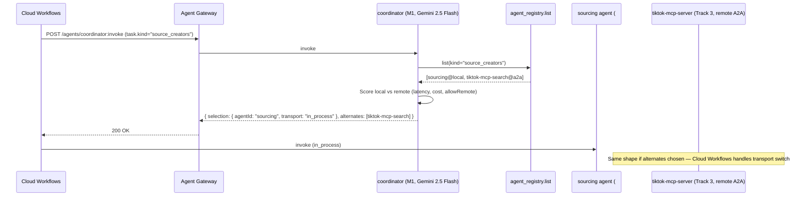

# coordinator.spec.md (M1)

## 1. Purpose + ARCHITECTURE.md citation

The **Coordinator agent (M1)** routes a high-level task to the right Tier-1 agent OR an A2A remote agent. It is the canonical "1→100" pattern from D24: rather than hard-coding which workflow step invokes which agent, the coordinator inspects the task envelope (kind, signals, current track state) and selects. Plumbs in Agent Registry to discover remotely-listed agents (Track 3's `tiktok-mcp-server` is the first example).

- **D-ID coverage**: D23 (Tier-2 M1), D24 (phased coordination: in-process for 0→1, RemoteA2AAgent for 1→100), D17 (Vertex AI Agent Runtime), D38 (PM-style hierarchy: M3 PM / leads / workers).
- **ARCHITECTURE.md §3 row 17**: `coordinator (M1) | 2 | Gemini 2.5 Flash | agent_registry.list, a2a.invoke | Session | routing_accuracy`.
- **v2 reference**: No v2 predecessor — this is the agent that earns the "1→100" point.

## 2. JSON Schema (input/output)

```json
{
  "$schema": "https://json-schema.org/draft/2020-12/schema",
  "$id": "https://schemas.social-seeding.com/v2/agents/coordinator.schema.json",
  "title": "CoordinatorAgent",
  "$defs": {
    "TaskKind": {
      "type": "string",
      "enum": [
        "source_creators","vet_candidate","draft_outreach","classify_reply",
        "draft_reply","parse_address","verify_post","compile_report",
        "research_lead","draft_lead_outreach","compose_mandate","check_compliance",
        "generate_creative","make_accessible","detect_friction","custom"
      ]
    },
    "AgentSelection": {
      "type": "object",
      "required": ["agentId","reason","invokeUrl","transport"],
      "properties": {
        "agentId":   { "$ref": "https://schemas.social-seeding.com/v2/common/shared.schema.json#/$defs/AgentId" },
        "reason":    { "type": "string", "minLength": 5, "maxLength": 400 },
        "invokeUrl": { "type": "string", "format": "uri" },
        "transport": { "type": "string", "enum": ["in_process","http","a2a_grpc","mcp"] },
        "remoteRegistryId": { "type": "string", "description": "Agent Registry entry id when transport=a2a_grpc" }
      }
    }
  },
  "type": "object",
  "properties": {
    "Input": {
      "type": "object",
      "required": ["task"],
      "properties": {
        "task": {
          "type": "object",
          "required": ["kind","tenantId"],
          "properties": {
            "kind":         { "$ref": "#/$defs/TaskKind" },
            "tenantId":     { "type": "string" },
            "workspaceId":  { "type": "string" },
            "campaignId":   { "type": "string" },
            "payload":      { "type": "object", "additionalProperties": true },
            "hints":        { "type": "array", "items": { "type": "string" } }
          }
        },
        "allowRemote":   { "type": "boolean", "default": true },
        "preferLocal":   { "type": "boolean", "default": true },
        "metadata":      { "$ref": "https://schemas.social-seeding.com/v2/common/shared.schema.json#/$defs/InvocationMetadata" }
      }
    },
    "Output": {
      "type": "object",
      "required": ["selection"],
      "properties": {
        "selection":  { "$ref": "#/$defs/AgentSelection" },
        "alternates": { "type": "array", "items": { "$ref": "#/$defs/AgentSelection" }, "maxItems": 3 },
        "confidence": { "type": "number", "minimum": 0, "maximum": 1 }
      }
    }
  }
}
```

## 3. OpenAPI 3.1 (REST surface)

```yaml
openapi: 3.1.0
info: { title: CoordinatorAgent, version: 0.1.0 }
servers:
  - $ref: '../_common/shared.openapi.yaml#/servers/0'
paths:
  /agents/coordinator:invoke:
    post:
      operationId: invokeCoordinator
      summary: Route a task to the right (local or remote) agent.
      parameters:
        - $ref: '../_common/shared.openapi.yaml#/components/parameters/TenantHeader'
        - $ref: '../_common/shared.openapi.yaml#/components/parameters/TraceParent'
      requestBody:
        required: true
        content:
          application/json:
            schema: { $ref: 'https://schemas.social-seeding.com/v2/agents/coordinator.schema.json#/properties/Input' }
      responses:
        '200':
          description: Routing decided.
          content:
            application/json:
              schema: { $ref: 'https://schemas.social-seeding.com/v2/agents/coordinator.schema.json#/properties/Output' }
        '422':
          description: Escalated (no_agent_matched).
          content:
            application/json:
              schema: { $ref: '../_common/shared.openapi.yaml#/components/schemas/AgentEscalation' }
```

## 4. AsyncAPI 3.0 (Pub/Sub events)

```yaml
asyncapi: 3.0.0
info: { title: Coordinator.Events, version: 0.1.0 }
channels:
  agent.t2.coordinator.routed:
    address: agent.t2.coordinator.routed
    messages:
      Routed:
        payload:
          type: object
          required: [taskKind, selectedAgent, transport, traceId]
          properties:
            taskKind:        { type: string }
            selectedAgent:   { type: string }
            transport:       { type: string }
            remoteRegistryId:{ type: string }
            usdSpent:        { type: number }
            traceId:         { type: string }
operations:
  publishRouted:
    action: send
    channel: { $ref: '#/channels/agent.t2.coordinator.routed' }
```

## 5. Mermaid sequence diagram (happy path)



## 6. Tool list + USD cap + escalation conditions

| Tool | Capability | Purpose |
|---|---|---|
| `agent_registry.list` | Agent Registry | Discover available agents (local + A2A) |
| `a2a.invoke` (downstream) | A2A v0.3 | Remote agent invocation (handled by Workflows after routing) |

**USD cap**: $0.05 per routing decision (Flash, single turn, no creative).

**Escalation conditions**:
- No agent matched (`kind="custom"` with no hints).
- Selected remote agent fails health check.
- `allowRemote=false` but no local equivalent.

## 7. Eval criteria

| Metric | Threshold |
|---|---|
| `routing_accuracy` (vs human-labeled) | ≥ 0.95 |
| `remote_fallback_correctness` | ≥ 0.90 |
| `latency_p95_ms` | ≤ 300 |

**Golden set**: `tests/golden/coordinator/*.json` — 200 task envelopes covering all 16 kinds + 4 ambiguous cases.

## 8. Edge cases

1. **Ambiguous task kind** ("we need to look at creators") — agent asks coordinator (M2 critic) for disambiguation or routes to most likely.
2. **Remote agent in Agent Registry has stale heartbeat** — skip; surface `remote_unhealthy` in alternates.
3. **Routing loop** (M1 → M1) — defensive cap; escalate.
4. **Quota constraints**: tenant in cost_watch warning — coordinator picks cheapest path (Haiku-class local).
5. **MCP transport requested for an A2A-only agent** — escalate `transport_mismatch`.
6. **Multi-region failover** — if local region's agent unhealthy, route to peer region's runtime.
7. **Track 3 dual submission**: a task that needs `tiktok-mcp-server` is routed via A2A, not local — agent must respect that.
