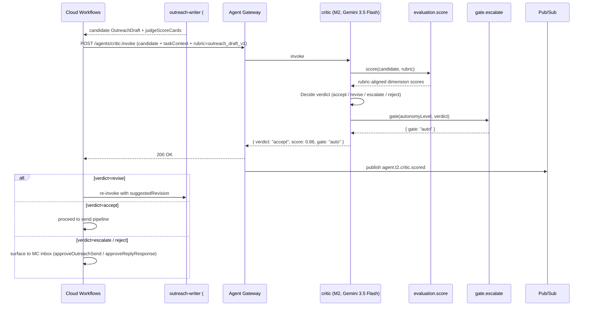

# critic.spec.md (M2)

## 1. Purpose + ARCHITECTURE.md citation

The **Critic agent (M2)** is the LLM-as-judge that scores every Tier-1 agent's output before it crosses a human-approval gate. It does NOT replace deterministic judges (`outreach.judge[brand|conversion|deliverability|skeptic]`) — those run inside the writer. The critic runs at the **task seam**: did the writer's output meet the brief, or should this be re-run / escalated? Inputs the candidate output + the original task context; emits `{accept|revise|escalate}` with rationale + the gate to use.

- **D-ID coverage**: D23 (Tier-2 M2), D25 (Vertex Agent Evaluation feeds critic's golden bench), D38 (M2 is the "review" lead in M3-PM hierarchy).
- **ARCHITECTURE.md §3 row 18**: `critic (M2) | 2 | Gemini 3.5 Flash | evaluation.score, gate.escalate | None | judge_agreement_v_human`.
- **v2 reference**: No v2 predecessor (v2 had per-writer judges only).

## 2. JSON Schema (input/output)

```json
{
  "$schema": "https://json-schema.org/draft/2020-12/schema",
  "$id": "https://schemas.social-seeding.com/v2/agents/critic.schema.json",
  "title": "CriticAgent",
  "$defs": {
    "Verdict": {
      "type": "string",
      "enum": ["accept","revise","escalate","reject"]
    }
  },
  "type": "object",
  "properties": {
    "Input": {
      "type": "object",
      "required": ["candidateAgentId","candidateOutput","taskContext"],
      "properties": {
        "candidateAgentId":   { "$ref": "https://schemas.social-seeding.com/v2/common/shared.schema.json#/$defs/AgentId" },
        "candidateOutput":    { "type": "object", "additionalProperties": true },
        "taskContext": {
          "type": "object",
          "additionalProperties": true,
          "description": "The brief / facts / prior turns the candidate had"
        },
        "evaluationRubric": {
          "type": "string",
          "enum": ["outreach_draft_v1","reply_draft_v1","report_narrative_v1","research_brief_v1","mandate_v1","compliance_decision_v1","creative_v1","custom"]
        },
        "metadata": { "$ref": "https://schemas.social-seeding.com/v2/common/shared.schema.json#/$defs/InvocationMetadata" }
      }
    },
    "Output": {
      "type": "object",
      "required": ["verdict","score","rationale"],
      "properties": {
        "verdict":   { "$ref": "#/$defs/Verdict" },
        "score":     { "type": "number", "minimum": 0, "maximum": 1 },
        "rationale": { "type": "string", "minLength": 20, "maxLength": 1200 },
        "issues":    { "type": "array", "items": { "type": "string", "maxLength": 280 } },
        "suggestedRevision": { "type": "string", "description": "Concrete fix to try" },
        "gate":      { "type": "string", "enum": ["auto","needs_human","blocked"] }
      }
    }
  }
}
```

## 3. OpenAPI 3.1 (REST surface)

```yaml
openapi: 3.1.0
info: { title: CriticAgent, version: 0.1.0 }
servers:
  - $ref: '../_common/shared.openapi.yaml#/servers/0'
paths:
  /agents/critic:invoke:
    post:
      operationId: invokeCritic
      summary: Score a Tier-1 agent's output and gate the next action.
      parameters:
        - $ref: '../_common/shared.openapi.yaml#/components/parameters/TenantHeader'
        - $ref: '../_common/shared.openapi.yaml#/components/parameters/TraceParent'
      requestBody:
        required: true
        content:
          application/json:
            schema: { $ref: 'https://schemas.social-seeding.com/v2/agents/critic.schema.json#/properties/Input' }
      responses:
        '200':
          description: Verdict rendered.
          content:
            application/json:
              schema: { $ref: 'https://schemas.social-seeding.com/v2/agents/critic.schema.json#/properties/Output' }
        '422':
          description: Escalated.
          content:
            application/json:
              schema: { $ref: '../_common/shared.openapi.yaml#/components/schemas/AgentEscalation' }
```

## 4. AsyncAPI 3.0 (Pub/Sub events)

```yaml
asyncapi: 3.0.0
info: { title: Critic.Events, version: 0.1.0 }
channels:
  agent.t2.critic.scored:
    address: agent.t2.critic.scored
    messages:
      CriticScored:
        payload:
          type: object
          required: [candidateAgentId, verdict, score]
          properties:
            candidateAgentId: { type: string }
            verdict:          { type: string }
            score:            { type: number }
            rationale:        { type: string }
            gate:             { type: string }
            usdSpent:         { type: number }
operations:
  publishCriticScored:
    action: send
    channel: { $ref: '#/channels/agent.t2.critic.scored' }
```

## 5. Mermaid sequence diagram (happy path)



## 6. Tool list + USD cap + escalation conditions

| Tool | Capability | Purpose |
|---|---|---|
| `evaluation.score` | Vertex AI Agent Evaluation API | Rubric-aligned dimension scoring |
| `gate.escalate` | policy evaluator | Map verdict + autonomy → gate decision |

**USD cap**: $0.30 per critique.

**Escalation conditions**:
- Rubric unknown.
- Candidate output schema doesn't match rubric's expected shape.
- All sub-scores below 0.3 (verdict=reject with `quality_floor_breach`).

## 7. Eval criteria

| Metric | Threshold |
|---|---|
| `judge_agreement_v_human` | ≥ 0.85 inter-rater agreement | |
| `false_accept_rate` | ≤ 0.05 |
| `false_reject_rate` | ≤ 0.10 |

**Golden set**: `tests/golden/critic/*.json` — 200 candidate outputs across 7 rubrics, each with human-labeled verdict.

## 8. Edge cases

1. **Self-criticizing loop** (critic critiques critic) — defensive guard; M2 never invokes itself.
2. **Rubric mismatch** — agent escalates `rubric_undefined` before any work.
3. **Adversarial candidate output** with prompt injection — Model Armor scans; if it gets through, critic treats as DATA.
4. **High-confidence reject but operator override** — Workforce IF MFA-gated override; logged 90d (D33).
5. **Critic disagrees with deterministic judges inside writer** (e.g., writer's deliverability=0.9, critic says 0.5) — surface both; operator decides.
6. **Multi-locale rubric drift** — separate golden sets per locale.
7. **Critic cost exceeds writer cost** — cost_watch (W2) flags pattern; M3 optimizer (next agent) may switch critic to Haiku for low-stakes runs.
