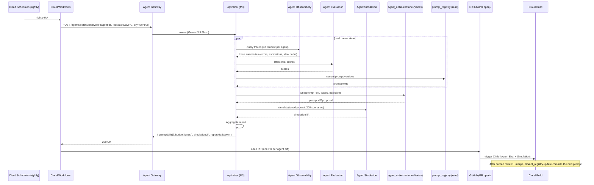

# optimizer.spec.md (M3)

## 1. Purpose + ARCHITECTURE.md citation

The **Optimizer agent (M3)** runs nightly (and on-demand) to rewrite Tier-1 agent prompts and re-tune tool/USD budgets via Vertex AI Agent Optimizer. Reads recent traces from Agent Observability, Agent Simulation outcomes, and Agent Evaluation deltas; produces a prompt diff + budget adjustment proposal. The actual prompt commit happens via Cloud Build PR — the optimizer NEVER hot-patches in-flight production prompts.

- **D-ID coverage**: D23 (Tier-2 M3), D25 (Optimizer = part of "Prompt + Agent Evaluation + Vertex SFT + Distillation + RLHF" stack), D38 (M3 PM is the highest-tier coordinator in the build-time hierarchy too).
- **ARCHITECTURE.md §3 row 19**: `optimizer (M3) | 2 | Gemini 3.5 Flash | agent_optimizer.tune, prompt_registry.update | None | offline_eval_lift`.
- **v2 reference**: No v2 predecessor (v2 prompts are hand-tuned per agent file).

## 2. JSON Schema (input/output)

```json
{
  "$schema": "https://json-schema.org/draft/2020-12/schema",
  "$id": "https://schemas.social-seeding.com/v2/agents/optimizer.schema.json",
  "title": "OptimizerAgent",
  "$defs": {
    "PromptDiff": {
      "type": "object",
      "required": ["agentId","oldPromptVersion","newPromptDraft","expectedLift"],
      "properties": {
        "agentId":          { "$ref": "https://schemas.social-seeding.com/v2/common/shared.schema.json#/$defs/AgentId" },
        "oldPromptVersion": { "type": "string" },
        "newPromptDraft":   { "type": "string" },
        "diffMarkdown":     { "type": "string" },
        "expectedLift":     { "type": "number", "description": "Predicted offline_eval delta (e.g., +0.04)" },
        "regressionRisk":   { "type": "string", "enum": ["low","medium","high"] }
      }
    },
    "BudgetTune": {
      "type": "object",
      "required": ["agentId","oldMaxUsd","newMaxUsd","rationale"],
      "properties": {
        "agentId":   { "$ref": "https://schemas.social-seeding.com/v2/common/shared.schema.json#/$defs/AgentId" },
        "oldMaxUsd": { "type": "number" },
        "newMaxUsd": { "type": "number" },
        "rationale": { "type": "string" }
      }
    }
  },
  "type": "object",
  "properties": {
    "Input": {
      "type": "object",
      "required": ["agentIdsToTune","lookbackDays"],
      "properties": {
        "agentIdsToTune":  { "type": "array", "items": { "$ref": "https://schemas.social-seeding.com/v2/common/shared.schema.json#/$defs/AgentId" }, "minItems": 1 },
        "lookbackDays":    { "type": "integer", "minimum": 1, "maximum": 30, "default": 7 },
        "objectiveMetric": { "type": "string", "enum": ["response_match_v2","grounding_score","activation_lift","cost_efficiency"] },
        "simulationScenarios": { "type": "integer", "minimum": 10, "maximum": 5000, "default": 200 },
        "dryRun":          { "type": "boolean", "default": true, "description": "When true, emit diff only; no prompt_registry.update" },
        "metadata":        { "$ref": "https://schemas.social-seeding.com/v2/common/shared.schema.json#/$defs/InvocationMetadata" }
      }
    },
    "Output": {
      "type": "object",
      "required": ["promptDiffs","budgetTunes","reportMarkdown"],
      "properties": {
        "promptDiffs":     { "type": "array", "items": { "$ref": "#/$defs/PromptDiff" } },
        "budgetTunes":     { "type": "array", "items": { "$ref": "#/$defs/BudgetTune" } },
        "simulationLift": {
          "type": "object",
          "additionalProperties": {
            "type": "object",
            "properties": {
              "baseline": { "type": "number" },
              "tuned":    { "type": "number" },
              "delta":    { "type": "number" }
            }
          }
        },
        "reportMarkdown":  { "type": "string", "minLength": 50, "maxLength": 8000 }
      }
    }
  }
}
```

## 3. OpenAPI 3.1 (REST surface)

```yaml
openapi: 3.1.0
info: { title: OptimizerAgent, version: 0.1.0 }
servers:
  - $ref: '../_common/shared.openapi.yaml#/servers/0'
paths:
  /agents/optimizer:invoke:
    post:
      operationId: invokeOptimizer
      summary: Propose prompt + budget tunings for selected agents.
      parameters:
        - $ref: '../_common/shared.openapi.yaml#/components/parameters/TenantHeader'
        - $ref: '../_common/shared.openapi.yaml#/components/parameters/TraceParent'
      requestBody:
        required: true
        content:
          application/json:
            schema: { $ref: 'https://schemas.social-seeding.com/v2/agents/optimizer.schema.json#/properties/Input' }
      responses:
        '200':
          description: Tunings produced.
          content:
            application/json:
              schema: { $ref: 'https://schemas.social-seeding.com/v2/agents/optimizer.schema.json#/properties/Output' }
        '422':
          description: Escalated (insufficient_data / regression detected).
          content:
            application/json:
              schema: { $ref: '../_common/shared.openapi.yaml#/components/schemas/AgentEscalation' }
```

## 4. AsyncAPI 3.0 (Pub/Sub events)

```yaml
asyncapi: 3.0.0
info: { title: Optimizer.Events, version: 0.1.0 }
channels:
  agent.t2.optimizer.proposed:
    address: agent.t2.optimizer.proposed
    messages:
      ProposedTunings:
        payload:
          type: object
          required: [agentIds, promptDiffCount, budgetTuneCount, dryRun]
          properties:
            agentIds:         { type: array, items: { type: string } }
            promptDiffCount:  { type: integer }
            budgetTuneCount:  { type: integer }
            dryRun:           { type: boolean }
            usdSpent:         { type: number }
  agent.t2.optimizer.committed:
    address: agent.t2.optimizer.committed
    description: Fired only when a PR is merged after human review.
    messages:
      Committed:
        payload:
          type: object
          properties:
            commitSha:  { type: string }
            agentIds:   { type: array, items: { type: string } }
operations:
  publishProposed:
    action: send
    channel: { $ref: '#/channels/agent.t2.optimizer.proposed' }
  publishCommitted:
    action: send
    channel: { $ref: '#/channels/agent.t2.optimizer.committed' }
```

## 5. Mermaid sequence diagram (happy path)



## 6. Tool list + USD cap + escalation conditions

| Tool | Capability | Purpose |
|---|---|---|
| `agent_optimizer.tune` | Vertex AI Agent Optimizer | Prompt rewrite proposals |
| `prompt_registry.update` | Cloud Storage / Spanner | Versioned prompt store (write only after PR merge) |
| `agent_observability.query` | Cloud Monitoring + traces | Recent perf telemetry |
| `agent_simulation.run` | Vertex AI Agent Simulation | Offline eval lift |
| `agent_evaluation.score` | Vertex AI Agent Evaluation | Baseline scores |
| `github.open_pr` | GitHub Apps | Open PR with diff + simulation report |

**USD cap**: $5.00 per nightly run (covers ≤ 22 agents × $0.20 each).

**Escalation conditions**:
- Simulation lift < 0 for 3+ agents in one run (regression — pause optimization).
- Agent Observability backfill stale (data plane outage).
- prompt_registry locked by ongoing canary deploy.
- Cost spike during optimizer's own simulation run (cost_watch flags).

## 7. Eval criteria

| Metric | Threshold |
|---|---|
| `offline_eval_lift` (sim vs baseline) | ≥ 2% mean lift across tuned agents |
| `regression_rate` (sim < baseline) | ≤ 10% |
| `pr_acceptance_rate` (human review) | ≥ 60% |

**Golden set**: `tests/golden/optimizer/*.json` — 30 baseline prompt suites + known-good improvements.

## 8. Edge cases

1. **Optimizer rewrites its own prompt** — explicitly excluded from `agentIdsToTune` allowlist.
2. **Prompt diff includes a banned phrase** — auto-flag in PR; CI blocks merge.
3. **New prompt over MAX_PROMPT_TOKENS** — clip to limit; warn in report.
4. **Simulation fails for half the cases** — abort tune; emit `simulation_unstable`.
5. **Multi-locale prompts**: optimizer must tune per-locale separately.
6. **Cost spike during simulation** — backoff scenarios from 200 → 50.
7. **Prompt registry merge conflict** — open PR for human resolution.
