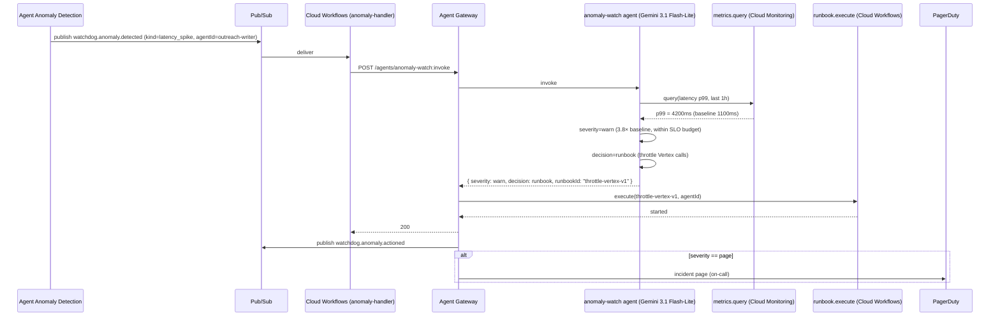

# anomaly_watch.spec.md (W1)

## 1. Purpose + ARCHITECTURE.md citation

The **Anomaly Watch agent (W1)** subscribes to Agent Observability + Agent Anomaly Detection signals and triggers Cloud Workflows auto-runbooks on detection. Watches: token explosions, latency spikes, error-rate spikes, escalation storms, and cross-agent reasoning anomalies. Decides severity (info/warn/page) and which runbook to invoke (e.g., flip canary back to 100% baseline, throttle a tenant, page the on-call CSM).

- **D-ID coverage**: D23 (Tier-3 W1), D32 (auto-runbook via Cloud Workflows, PagerDuty, Slack, Chronicle SIEM), D37 (Agent Anomaly Detection feeds chaos test results), D31 (99.99% availability — fast mean-time-to-detect is the lever).
- **ARCHITECTURE.md §3 row 20**: `anomaly_watch (W1) | 3 | Gemini 3.1 Flash-Lite | metrics.query, runbook.execute | None | precision (alert vs false)`.
- **v2 reference**: No v2 predecessor; v2 only had cost-recording (`packages/observability/src/recordCost`).

## 2. JSON Schema (input/output)

```json
{
  "$schema": "https://json-schema.org/draft/2020-12/schema",
  "$id": "https://schemas.social-seeding.com/v2/agents/anomaly_watch.schema.json",
  "title": "AnomalyWatchAgent",
  "$defs": {
    "AnomalyKind": {
      "type": "string",
      "enum": ["cost_spike","latency_spike","token_explosion","error_rate_spike","escalation_storm","escalation_quietness","drift_signal","tool_failure_burst"]
    },
    "Severity": { "type": "string", "enum": ["info","warn","page"] }
  },
  "type": "object",
  "properties": {
    "Input": {
      "type": "object",
      "required": ["signalKind","tenantId","agentId","metricValue","baseline","detectedAt"],
      "properties": {
        "signalKind":    { "$ref": "#/$defs/AnomalyKind" },
        "tenantId":      { "type": "string" },
        "agentId":       { "$ref": "https://schemas.social-seeding.com/v2/common/shared.schema.json#/$defs/AgentId" },
        "region":        { "type": "string" },
        "metricValue":   { "type": "number" },
        "baseline":      { "type": "number" },
        "lookbackHours": { "type": "integer", "minimum": 1, "maximum": 168, "default": 24 },
        "detectedAt":    { "type": "string", "format": "date-time" },
        "metadata":      { "$ref": "https://schemas.social-seeding.com/v2/common/shared.schema.json#/$defs/InvocationMetadata" }
      }
    },
    "Output": {
      "type": "object",
      "required": ["severity","decision","traceLinks"],
      "properties": {
        "severity":   { "$ref": "#/$defs/Severity" },
        "decision":   { "type": "string", "enum": ["log_only","runbook","page_oncall","quarantine_tenant"] },
        "runbookId":  { "type": "string" },
        "rationale":  { "type": "string", "maxLength": 600 },
        "traceLinks": { "type": "array", "items": { "type": "string" } },
        "remediation":{ "type": "string" }
      }
    }
  }
}
```

## 3. OpenAPI 3.1 (REST surface)

```yaml
openapi: 3.1.0
info: { title: AnomalyWatchAgent, version: 0.1.0 }
servers:
  - $ref: '../_common/shared.openapi.yaml#/servers/0'
paths:
  /agents/anomaly-watch:invoke:
    post:
      operationId: invokeAnomalyWatch
      summary: Decide on an anomaly signal — log / runbook / page / quarantine.
      parameters:
        - $ref: '../_common/shared.openapi.yaml#/components/parameters/TenantHeader'
      requestBody:
        required: true
        content:
          application/json:
            schema: { $ref: 'https://schemas.social-seeding.com/v2/agents/anomaly_watch.schema.json#/properties/Input' }
      responses:
        '200':
          description: Decision rendered.
          content:
            application/json:
              schema: { $ref: 'https://schemas.social-seeding.com/v2/agents/anomaly_watch.schema.json#/properties/Output' }
```

## 4. AsyncAPI 3.0 (Pub/Sub events)

```yaml
asyncapi: 3.0.0
info: { title: AnomalyWatch.Events, version: 0.1.0 }
channels:
  watchdog.anomaly.detected:    { $ref: '../_common/shared.asyncapi.yaml#/channels/watchdog.anomaly.detected' }
  watchdog.anomaly.actioned:
    address: watchdog.anomaly.actioned
    messages:
      Actioned:
        payload:
          type: object
          required: [decision, severity, agentId, runbookId]
          properties:
            decision:  { type: string }
            severity:  { type: string }
            agentId:   { type: string }
            runbookId: { type: string }
            tenantId:  { type: string }
operations:
  consumeDetected:
    action: receive
    channel: { $ref: '#/channels/watchdog.anomaly.detected' }
  publishActioned:
    action: send
    channel: { $ref: '#/channels/watchdog.anomaly.actioned' }
```

## 5. Mermaid sequence diagram (happy path)



## 6. Tool list + USD cap + escalation conditions

| Tool | Capability | Purpose |
|---|---|---|
| `metrics.query` | Cloud Monitoring | Pull live metrics for context |
| `runbook.execute` | Cloud Workflows | Auto-remediation invocation |
| `pagerduty.incident` | PagerDuty API | On-call paging |
| `chronicle.alert` | Chronicle SecOps | Audit cross-link |

**USD cap**: $0.05 per anomaly (Flash, ≤ 2 tool calls).

**Escalation conditions**:
- Same signal fires > 5× in 1h (chaos escalation — page on-call regardless).
- Runbook execution fails twice — escalate to human.
- Cloud Monitoring read fails (observability outage) — best-effort severity=page based on signal alone.

## 7. Eval criteria

| Metric | Threshold |
|---|---|
| `alert_precision` | ≥ 0.90 (low false positives) |
| `mean_time_to_action` | ≤ 60 sec from detection |
| `runbook_success_rate` | ≥ 0.85 |

**Golden set**: `tests/golden/anomaly_watch/*.json` — 100 anomaly snapshots (real outages, chaos exercises, false positives).

## 8. Edge cases

1. **Anomaly during demo recording** — log_only severity to avoid pages during scripted scenes.
2. **Cross-region correlated anomaly** — escalate to page; runbook may include traffic shift.
3. **False positive from cold-start** — agent recognizes warm-up window and downgrades severity.
4. **Anomaly fires on cost_watch's own metrics** — defensive guard; no recursion.
5. **All Workflows region down** (control plane outage) — agent emits manual-runbook instructions to Slack.
6. **Tenant in security_watch quarantine already** — skip remediation; signal is expected.
7. **Anomaly kind not in enum** — degrade to severity=warn, log_only, flag `unknown_signal_kind`.
