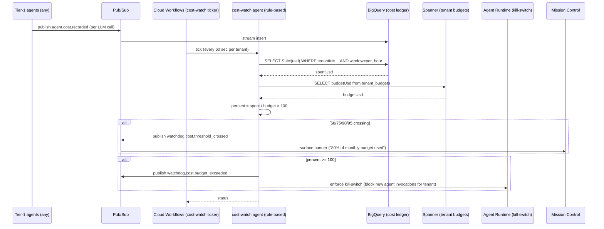

# cost_watch.spec.md (W2)

## 1. Purpose + ARCHITECTURE.md citation

The **Cost Watch agent (W2)** enforces per-tenant USD/day ceilings and emits Pub/Sub alerts at 50/75/90/95% thresholds. **Rule-based, no LLM** by default (D23: "agent-shaped for consistency, but cost_watch needs no judgment — it's a deterministic threshold gate"). When patterns escape thresholds anomalously (e.g., a sudden 5× spike before crossing 50%), it can escalate to anomaly_watch for human-language decision.

- **D-ID coverage**: D23 (Tier-3 W2), D28 ($0.01/view pricing — cost_watch is the metering enforcer), D31 (cost SLO part of enterprise grade), D33 (cost ledger 90d retention).
- **ARCHITECTURE.md §3 row 21**: `cost_watch (W2) | 3 | rule-based (no LLM, but agent-shaped for D23 consistency) | billing.query, pubsub.alert | None | latency to alert`.
- **v2 reference**: `packages/observability/src/recordCost` is the per-call ledger writer; this agent consumes the resulting BigQuery table.

## 2. JSON Schema (input/output)

```json
{
  "$schema": "https://json-schema.org/draft/2020-12/schema",
  "$id": "https://schemas.social-seeding.com/v2/agents/cost_watch.schema.json",
  "title": "CostWatchAgent",
  "$defs": {
    "ThresholdPercent": { "type": "integer", "enum": [50, 75, 90, 95, 100, 110] },
    "BudgetWindow": { "type": "string", "enum": ["per_minute","per_hour","per_day","per_month","per_campaign"] }
  },
  "type": "object",
  "properties": {
    "Input": {
      "type": "object",
      "required": ["tenantId","window","tickTime"],
      "properties": {
        "tenantId":   { "type": "string" },
        "workspaceId":{ "type": "string" },
        "window":     { "$ref": "#/$defs/BudgetWindow" },
        "tickTime":   { "type": "string", "format": "date-time" },
        "forceRecheck": { "type": "boolean", "default": false },
        "metadata":   { "$ref": "https://schemas.social-seeding.com/v2/common/shared.schema.json#/$defs/InvocationMetadata" }
      }
    },
    "Output": {
      "type": "object",
      "required": ["tenantId","window","spentUsd","budgetUsd","percent","crossings"],
      "properties": {
        "tenantId":  { "type": "string" },
        "window":    { "$ref": "#/$defs/BudgetWindow" },
        "spentUsd":  { "type": "number", "minimum": 0 },
        "budgetUsd": { "type": "number", "minimum": 0 },
        "percent":   { "type": "number", "minimum": 0 },
        "crossings": {
          "type": "array",
          "items": {
            "type": "object",
            "required": ["threshold","crossedAt","action"],
            "properties": {
              "threshold": { "$ref": "#/$defs/ThresholdPercent" },
              "crossedAt": { "type": "string", "format": "date-time" },
              "action":    { "type": "string", "enum": ["notified","warned","throttled","halted","over_limit_block"] }
            }
          }
        },
        "throttle":  { "type": "object", "properties": { "tps": { "type": "number" }, "until": { "type": "string", "format": "date-time" } } }
      }
    }
  }
}
```

## 3. OpenAPI 3.1 (REST surface)

```yaml
openapi: 3.1.0
info: { title: CostWatchAgent, version: 0.1.0 }
servers:
  - $ref: '../_common/shared.openapi.yaml#/servers/0'
paths:
  /agents/cost-watch:invoke:
    post:
      operationId: invokeCostWatch
      summary: Evaluate tenant spend vs budget for a window; emit threshold alerts.
      parameters:
        - $ref: '../_common/shared.openapi.yaml#/components/parameters/TenantHeader'
      requestBody:
        required: true
        content:
          application/json:
            schema: { $ref: 'https://schemas.social-seeding.com/v2/agents/cost_watch.schema.json#/properties/Input' }
      responses:
        '200':
          description: Status + crossings.
          content:
            application/json:
              schema: { $ref: 'https://schemas.social-seeding.com/v2/agents/cost_watch.schema.json#/properties/Output' }
```

## 4. AsyncAPI 3.0 (Pub/Sub events)

```yaml
asyncapi: 3.0.0
info: { title: CostWatch.Events, version: 0.1.0 }
channels:
  agent.cost.recorded: { $ref: '../_common/shared.asyncapi.yaml#/channels/agent.cost.recorded' }
  watchdog.cost.threshold_crossed:
    address: watchdog.cost.threshold_crossed
    messages:
      ThresholdCrossed:
        payload:
          type: object
          required: [tenantId, window, threshold, percent, action]
          properties:
            tenantId:  { type: string }
            workspaceId:{ type: string }
            window:    { type: string }
            threshold: { type: integer }
            percent:   { type: number }
            spentUsd:  { type: number }
            budgetUsd: { type: number }
            action:    { type: string }
  watchdog.cost.budget_exceeded:
    address: watchdog.cost.budget_exceeded
    description: When spend > 100% — agents in this tenant are halted.
    messages:
      BudgetExceeded:
        payload:
          type: object
          required: [tenantId, window, spentUsd, budgetUsd]
          properties:
            tenantId:  { type: string }
            window:    { type: string }
            spentUsd:  { type: number }
            budgetUsd: { type: number }
operations:
  consumeCostRecorded:
    action: receive
    channel: { $ref: '#/channels/agent.cost.recorded' }
  publishThresholdCrossed:
    action: send
    channel: { $ref: '#/channels/watchdog.cost.threshold_crossed' }
  publishBudgetExceeded:
    action: send
    channel: { $ref: '#/channels/watchdog.cost.budget_exceeded' }
```

## 5. Mermaid sequence diagram (happy path)



## 6. Tool list + USD cap + escalation conditions

| Tool | Capability | Purpose |
|---|---|---|
| `billing.query` | BigQuery | Spend rollup per tenant per window |
| `pubsub.alert` | Pub/Sub | Emit crossing events |
| `tenant_budgets.read` | Spanner | Per-tenant limits |
| `kill_switch.enforce` | Agent Runtime | Block new invocations |

**USD cap**: $0.0 — no LLM. The agent's compute is one BQ query + one Spanner read per tick.

**Escalation conditions**:
- BigQuery query fails — degrade to last-known-good cached value; emit `cost_watch_blind`.
- Budget table corrupted (negative budget) — escalate to security_watch (W3).
- Tenant has no budget configured — default to $50/day (configurable; D39 unlocks higher defaults).

## 7. Eval criteria

| Metric | Threshold |
|---|---|
| `time_to_alert` (crossing → message published) | ≤ 5 sec |
| `false_positive_rate` | ≤ 0.01 (clock drift / race conditions) |
| `false_negative_rate` (missed crossing) | = 0 |
| `kill_switch_accuracy` | = 1.00 (never block within budget) |

## 8. Edge cases

1. **Race condition**: budget changed mid-window — recompute on every tick.
2. **Tenant timezone vs UTC** — `per_day` uses tenant TZ; `per_month` uses UTC.
3. **Free-tier tenant** — budgetUsd=0, so any spend crosses 100%; agent emits a clear "free tier exceeded" message, not a generic over-budget alert.
4. **Failover region with stale BigQuery replica** — accept up to 30-sec staleness; flag in trace.
5. **Watchdog watching watchdog** (cost_watch costs are recorded too) — exclude `cost-watch` agentId from its own rollup.
6. **Forced recheck** (operator-requested) — bypass tick cadence; immediate poll.
7. **Budget = 0 + zero spend** — percent is `NaN`; output `0.0` explicitly, no action.
