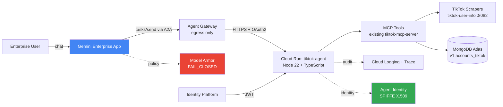

# TRACK 3 PLAYBOOK — Google for Startups AI Agents Challenge
## "Refactor a business-ready agent for potential enterprise distribution on Google Cloud Marketplace and the Gemini Enterprise app"

> **Target:** Refactor `tiktok-mcp-server` (Node 22 + TypeScript, `@modelcontextprotocol/sdk`, deployed at `mcp.socialseed.ing`, OAuth via in-memory better-sqlite3) → A2A-compliant agent published to Google Cloud Marketplace, registered in Gemini Enterprise Agent Gallery, with a Devpost submission package ready by **2026-06-05**.
>
> **Today: 2026-05-19 → Deadline: 2026-06-05 = 17 days**
> **Judging weights:** Technical Implementation 30% / Business Case 30% / Innovation & Creativity 20% / Demo & Presentation 20% ([source](https://cloud.google.com/blog/topics/startups/startups-are-building-the-agentic-future-with-google-cloud))

---

## Track 3 reality check — the brutal truth before you start

Three findings from the research that materially change the plan; read these first.

1. **Producer Portal approval is the long pole and is almost certainly *not* finishable inside 17 days.** Cloud Marketplace partner onboarding requires Partner Network membership in good standing, an *enterprise-ready* posture (production-grade product, public support motion, sales channel), an incorporated legal entity in one of 20 supported regions, a payment profile, and W-9 / W-8 BEN-E tax docs reviewed by Google. Public docs do **not** publish an SLA, but partner blogs (Clazar, Invisory, Suger) consistently quote **4–12 weeks** for first-time listing approval, with pricing review alone quoted at "up to four business days." Track 3's blog post uses the word *"potential* enterprise distribution" — Google appears to allow **"submission-in-flight"** as the evidence, not a live listing. Plan for "Producer Portal: submitted, listing screenshot = `PENDING REVIEW`" as the Track 3 deliverable, not "live on Marketplace." ([sources](https://docs.cloud.google.com/marketplace/docs/partners/get-started), [receive-payments](https://docs.cloud.google.com/marketplace/docs/partners/receive-payments), [ai-agents](https://docs.cloud.google.com/marketplace/docs/partners/ai-agents))

2. **There is no `--a2a` flag for non-ADK containers.** That flag is specific to the Python ADK CLI (`adk deploy cloud_run --a2a`). For a Node.js/TypeScript MCP server, you deploy via the normal `gcloud run deploy --source=.` and self-host the A2A handlers + `/.well-known/agent.json` endpoint. The `to_a2a()` helper is also Python-only. You will write A2A as a thin HTTP layer in front of your existing MCP tools. ([source](https://docs.cloud.google.com/run/docs/deploy-a2a-agents), [source](https://medium.com/google-cloud/surprisingly-simple-a2a-agents-with-adk-using-to-a2a-deploy-to-cloud-run-and-gemini-enterprise-e815bdef4a32))

3. **Gemini Enterprise registration is paste-the-JSON, not a CI/CD pipeline.** The Agent Gallery stores a **static copy** of your `agent.json` at registration time — re-deploys do not propagate. Treat the agent card as a versioned artifact, and re-register on every breaking change. The path-of-least-resistance for Track 3 is **Path B (A2A agent.json submitted to Agent Registry)**, not Path A (ADK on Agent Engine), because the existing code is Node, not Python. ([source](https://docs.cloud.google.com/gemini/enterprise/docs/register-and-manage-an-a2a-agent))

**Therefore the realistic Track 3 deliverable on 2026-06-05 is:**

- Cloud Run service deployed, A2A-spec-compliant, behind Identity Platform OAuth, with Model Armor user-prompt + response templates wired in, and Agent Identity (SPIFFE) automatically issued at deploy time.
- Registered in Gemini Enterprise → visible in Agent Gallery in a project the judges can be invited to.
- Producer Portal listing submitted → screenshot of "Pending Google review" state.
- Devpost package: public repo, ≤3 min demo, architecture diagram, narrative across the four judging criteria.

---

## Phase 1 — Marketplace producer onboarding

### 1.1 Pre-flight checks (do this before touching Partner Hub)
**Effort:** 0.5 day · **Dependencies:** none · **Start: 2026-05-19**

Confirm the SocialSeeding legal entity satisfies **all** of:
- Incorporated in one of the 20 supported regions: US, Canada, UK, Germany, France, Ireland, Italy, Netherlands, Belgium, Luxembourg, Spain, Sweden, Switzerland, Norway, Finland, Poland, Romania, Japan, Hong Kong, India, Israel, Saudi Arabia ([source](https://docs.cloud.google.com/marketplace/docs/partners/receive-payments)).
- Has a bank account in a currency the region supports (EUR, GBP, USD, CAD, JPY, INR, ILS, etc.).
- Can produce a signed W-9 (US) or W-8 BEN-E (non-US) on day 1 — request from your accountant **before** opening Partner Hub.
- Has a corporate email on the company domain (Gmail addresses get rejected).
- Has a public marketing site, support email, and a Terms-of-Service + Privacy Policy URL.

**Gotchas:**
- **If the entity is incorporated in Korea, you cannot list directly.** Korea is **not** on the supported-regions list as of this writing. You will need to either (a) bill through a US/EU/Singapore subsidiary, or (b) submit Track 3 with "Marketplace pending — entity reorganization in progress" disclosed in the Devpost write-up. **Decide this before day 1** — if reorganization isn't feasible, pivot the Track 3 narrative to "Gemini Enterprise Agent Gallery registration + Producer Portal Project Info Form submitted" and don't promise a live listing.
- W-8 BEN-E requires the responsible officer's signature; in many startups that's the founder — schedule it day-of.

### 1.2 Submit the Cloud Marketplace Project Info Form
**Effort:** 0.5 day · **Dependencies:** §1.1 · **Start: 2026-05-19**

This is the form Google uses to provision Partner Hub + Producer Portal access. It is **not self-serve** — the URL is given out via cloud-marketplace-team@google.com. Email channels:
- File via Google Cloud Partner Advantage portal (if SocialSeeding is already a Partner Network member).
- Otherwise, request the form via your Google Cloud account rep (every account with >$1k MRR has one — find them in the Cloud Console → Support).
- As a fallback, fill in the public expression-of-interest form at `cloud.google.com/marketplace/sell` (it routes to the same team but is slower).

**Information you must provide:**
- Legal entity name + country of incorporation
- Primary technical contact (email + phone)
- Primary billing contact
- GCP Organization ID (`gcloud organizations list`)
- Product type: **AI agent as a service** (this routes you to the AI-agent listing workflow specifically)
- One-paragraph product summary
- Target launch date (put **2026-07-15**, not 2026-06-05 — undersell)

**Gotchas:**
- Google's response is **48–72h** for the form acknowledgement, then provisioning is **3–10 business days**.
- The form asks for an "executive sponsor" at Google — leave blank if you don't have one; do not invent.

### 1.3 Accept the Cloud Marketplace Vendor Agreement
**Effort:** 0.25 day · **Dependencies:** §1.2 acknowledged · **Start: 2026-05-21**

Once Partner Hub access lands in your inbox:
1. Sign in at `partners.cloud.google.com/marketplace-vendor-agreement`.
2. The agreement must be accepted by a person with signing authority for the legal entity (founder/CEO, not an engineer).
3. **Read §3 (Refunds), §7 (Indemnification), §11 (Service Levels) before signing** — these create real liabilities and many startups regret skipping the legal review.

### 1.4 Configure the Payments page
**Effort:** 0.5 day · **Dependencies:** §1.3, W-9/W-8 ready · **Start: 2026-05-22**

In Partner Hub → Payments:
1. Select the payment region + currency matching your incorporation country.
2. Upload W-9 (US) or W-8 BEN-E (non-US).
3. Add the bank account (Google will micro-deposit verification — **2–3 business days**, blocking).
4. Asia-Pacific entities additionally need Singapore tax info; EMEA needs Ireland tax info (merchant of record model).

### 1.5 Estimated approval timeline
**Total realistic clock time for Phase 1: 7–14 days.** Phase 2 and Phase 3 do **not** block on Phase 1 finishing — start them in parallel.

---

## Phase 2 — Agent code refactor (Node.js / TypeScript)

The existing `tiktok-mcp-server` exposes MCP tools over `@modelcontextprotocol/sdk`. The refactor wraps those tools in an A2A-compliant HTTP layer, swaps in Identity Platform OAuth, and prepares the artifact for Cloud Run.

### 2.1 Add an A2A HTTP layer over existing MCP tools
**Effort:** 2 days · **Dependencies:** none · **Start: 2026-05-19** (parallel with §1.x)

There is **no Node SDK equivalent of Python's `to_a2a()`** ([source](https://medium.com/google-cloud/surprisingly-simple-a2a-agents-with-adk-using-to-a2a-deploy-to-cloud-run-and-gemini-enterprise-e815bdef4a32)). Implement A2A as a thin Express/Fastify router that forwards to the existing MCP tools. A2A v0.3+ is what Gemini Enterprise expects (governed by the Linux Foundation AAF). Implement:

- `GET /.well-known/agent.json` → serves the static Agent Card.
- `POST /tasks` → A2A `tasks/send` (creates a task; routes to the matching MCP tool by `skill.id`).
- `POST /tasks/{id}/messages` → multi-turn append.
- `GET /tasks/{id}` → status poll.
- `POST /tasks/{id}/cancel` → cancellation.
- Optional `GET /tasks/{id}:stream` (Server-Sent Events) for long-running tools.

Map each MCP `tool` 1:1 to an A2A `skill`. The MCP tool's `inputSchema` becomes the A2A skill's input contract. Keep the underlying tool implementations untouched.

**Gotchas:**
- A2A error envelopes are **JSON-RPC 2.0 style** (`{ jsonrpc, id, error: { code, message }}`), not REST-style. Many engineers get this wrong on the first pass and Gemini Enterprise silently drops the agent from results.
- The `url` field in `agent.json` **must not have a trailing slash** ([source](https://medium.com/google-cloud/surprisingly-simple-a2a-agents-with-adk-using-to-a2a-deploy-to-cloud-run-and-gemini-enterprise-e815bdef4a32)).
- A2A v1.0 (Linux Foundation AAF, 2026-Q2) is breaking-changes-vs v0.3 — confirm against `https://docs.cloud.google.com/gemini/enterprise/docs/register-and-manage-an-a2a-agent` which protocol version Gemini Enterprise currently accepts in your region.

### 2.2 Generate `agent.json` (Agent Card)
**Effort:** 0.5 day · **Dependencies:** §2.1 skill list finalized · **Start: 2026-05-21**

Minimum viable card (every field below is required by the Gemini Enterprise validator):

```json
{
  "protocolVersion": "v1.0",
  "name": "tiktok-influencer-agent",
  "displayName": "SocialSeeding TikTok Influencer Agent",
  "description": "Discovers, vets, and scores TikTok creators by handle, niche, or audience demographics. Returns enriched profile data, engagement metrics, and blacklist signals for influencer marketing campaigns.",
  "url": "https://mcp-a2a.socialseed.ing",
  "version": "1.0.0",
  "defaultInputModes": ["text/plain", "application/json"],
  "defaultOutputModes": ["application/json"],
  "capabilities": {
    "streaming": true,
    "pushNotifications": false
  },
  "skills": [
    {
      "id": "search_creators_by_niche",
      "name": "Search Creators by Niche",
      "description": "Returns up to N TikTok creators matching a niche keyword, ranked by engagement rate.",
      "tags": ["discovery", "tiktok", "influencer-marketing"],
      "inputModes": ["application/json"],
      "outputModes": ["application/json"]
    }
    // ... one entry per MCP tool
  ],
  "securitySchemes": {
    "oauth2": {
      "type": "oauth2",
      "flows": { "authorizationCode": { "authorizationUrl": "...", "tokenUrl": "...", "scopes": {} }}
    }
  }
}
```

**Gotchas:**
- `description` is what shows in Agent Gallery search results — write it for a Gemini Enterprise admin, not a developer.
- `tags` drive discoverability — include the customer's vocabulary ("influencer marketing," not "creator-graph-traversal").
- Serve this from a static path (`/.well-known/agent.json`) **and** also commit it to the repo as `agent.json` — Producer Portal asks for an upload, not a URL.

### 2.3 Replace in-memory better-sqlite3 OAuth with Identity Platform
**Effort:** 2 days · **Dependencies:** Identity Platform tenant created · **Start: 2026-05-21**

Why: SQLite OAuth is a single point of data loss, doesn't survive Cloud Run cold starts (`/tmp` is ephemeral), and disqualifies you from the "Enterprise Standards" gate. Identity Platform gives you OIDC issuance, JWT validation via JWKS, and audit logs for free.

Migration plan:
1. Enable Identity Platform in the GCP project (`gcloud services enable identitytoolkit.googleapis.com`).
2. Create an OIDC tenant; register your Cloud Run URL as a redirect URI.
3. Replace the better-sqlite3 token store with the `firebase-admin` Node SDK (Identity Platform is the GCP-rebadged version of Firebase Auth — same SDK, different console).
4. In your A2A handler, validate inbound JWTs against the Identity Platform JWKS: `https://www.googleapis.com/service_accounts/v1/jwk/securetoken@system.gserviceaccount.com`.
5. Map JWT `sub` → workspace_id in your existing v1 Atlas `workspaces` collection (additive field only — see `social-seeding-v2/CLAUDE.md`).
6. Delete the better-sqlite3 dep + the `oauth.db` file from the repo.

**Gotchas:**
- **Customer auth (`oauth_users` / NextAuth) and dashboard auth (`be_dashboard_user` / better-auth) must stay segmented** per `/Users/kimsejun/Documents/GitHub/CLAUDE.md`. The Identity Platform tenant for the MCP agent is a **third** segment — do **not** reuse the customer-frontend tenant. Provision a new tenant: `tiktok-mcp-agent`.
- Don't put the Identity Platform API key in the Docker image — use Secret Manager + Cloud Run `--update-secrets`.
- 30-day session tokens (current behaviour from the SQLite store) are too long for Marketplace customers — set 1h access tokens + refresh, document the choice in the listing's Security section.

### 2.4 Model Armor integration
**Effort:** 1 day · **Dependencies:** Phase 3 partial (need a GCP project + Gemini Enterprise app) · **Start: 2026-05-26**

Model Armor sits in front of *Gemini Enterprise's* prompt/response loop, not directly in your agent — but you must configure two templates and reference them so the listing passes the Enterprise Standards eval. ([source](https://docs.cloud.google.com/gemini/enterprise/docs/enable-model-armor))

1. Enable APIs: `gcloud services enable modelarmor.googleapis.com`.
2. Grant IAM:
   - `roles/discoveryengine.agentspaceAdmin` (you)
   - `roles/modelarmor.admin` (you)
   - `roles/modelarmor.user` (the Gemini Enterprise service account: `service-PROJECT_NUMBER@gcp-sa-discoveryengine.iam.gserviceaccount.com`)
3. Create two Model Armor templates in the same region as the Gemini Enterprise app (region must match — `global` app → `us` or `eu` template):
   - `tiktok-agent-user-prompt` — prompt-injection detection ON, malicious URL detection ON, sensitive-data DLP infotypes covering `PERSON_NAME`, `EMAIL_ADDRESS`, `PHONE_NUMBER` (customer PII the agent will receive).
   - `tiktok-agent-response` — responsible-AI filters ON for `HATE_SPEECH`, `HARASSMENT`, `SEXUALLY_EXPLICIT`, `DANGEROUS_CONTENT` at MEDIUM threshold; sensitive-data filter for leaked API keys / tokens.
4. Wire to the Gemini Enterprise app via the `customerPolicy.modelArmorConfig` PATCH on the assistant:
   ```bash
   curl -X PATCH \
     -H "Authorization: Bearer $(gcloud auth print-access-token)" \
     -H "Content-Type: application/json" \
     -H "X-Goog-User-Project: PROJECT_ID" \
     "https://global-discoveryengine.googleapis.com/v1/projects/PROJECT_ID/locations/global/collections/default_collection/engines/APP_ID/assistants/default_assistant?update_mask=customerPolicy" \
     -d '{
       "customerPolicy": {
         "modelArmorConfig": {
           "userPromptTemplate": "projects/PROJECT_ID/locations/us/templates/tiktok-agent-user-prompt",
           "responseTemplate": "projects/PROJECT_ID/locations/us/templates/tiktok-agent-response",
           "failureMode": "FAIL_CLOSED"
         }
       }
     }'
   ```

**Gotchas:**
- Region of template **must** match region of Gemini Enterprise app — `global` app accepts only `us` or `eu` templates ([source](https://docs.cloud.google.com/gemini/enterprise/docs/enable-model-armor)).
- After app + template created, region is immutable — don't pick `global` then later try to host data in `asia-northeast3`.
- `FAIL_CLOSED` blocks the request when Model Armor is unavailable — choose `FAIL_OPEN` only after you're confident in the SLO; the eval graders prefer `FAIL_CLOSED`.

### 2.5 Agent Gateway (optional for Track 3, recommended for Enterprise Standards)
**Effort:** 1 day · **Dependencies:** §2.4 done, PSC network attachment created · **Start: 2026-05-29**

Agent Gateway is the egress chokepoint that lets enterprises govern outbound calls from your agent to TikTok APIs / scrapers. For Gemini Enterprise it **only supports Agent-to-Anywhere (egress) mode**.

```bash
gcloud alpha network-services agent-gateways import tiktok-agent-gw \
  --source=agent-gateway.yaml \
  --location=us-central1
```

`agent-gateway.yaml`:
```yaml
name: tiktok-agent-gw
protocols: [MCP]
googleManaged:
  governedAccessPath: AGENT_TO_ANYWHERE
registries:
  - //agentregistry.googleapis.com/projects/PROJECT_ID/locations/global
networkConfig:
  egress:
    networkAttachment: projects/PROJECT_ID/regions/us-central1/networkAttachments/agent-egress-na
```

**Gotchas:**
- Requires a PSC network attachment in `/28` minimum, in `10.0.0.0/8`, `172.16.0.0/12`, or `192.168.0.0/16`.
- IAM: `networkservices.agentGateways.create`, `networksecurity.authzPolicies.create`, `compute.networkAttachments.list`, `modelarmor.templates.list` ([source](https://docs.cloud.google.com/gemini-enterprise-agent-platform/govern/gateways/set-up-agent-gateway)).
- If time-constrained, **skip this and note "Agent Gateway: planned for v1.1"** in the Devpost write-up. It is not strictly required to register an agent.

---

## Phase 3 — Deploy on GCP

### 3.1 Build the container with Cloud Build
**Effort:** 0.5 day · **Dependencies:** §2.1, §2.2, §2.3 merged to `main` · **Start: 2026-05-25**

```bash
gcloud builds submit \
  --tag us-central1-docker.pkg.dev/PROJECT_ID/tiktok-agent/server:v1.0.0 \
  .
```

A `cloudbuild.yaml` is **not** required for Node — Cloud Build auto-detects `package.json` and `Dockerfile`. Make sure the `Dockerfile` is multi-stage (`node:22-alpine` builder + `node:22-alpine` runtime) and < 200 MB. Pin all deps in `package-lock.json` — the current `tiktok-mcp-server` does this; do not regenerate.

**Gotchas:**
- Cloud Build's free tier is 120 build-minutes/day — fine for this project but watch out if you're also rebuilding the customer frontend in the same project.
- Don't bake `.env` into the image. Use Secret Manager.

### 3.2 Push to Artifact Registry
**Effort:** 0.1 day · **Dependencies:** §3.1 · **Start: 2026-05-25**

The `gcloud builds submit --tag` command in §3.1 pushes for you. Pre-create the repository once:
```bash
gcloud artifacts repositories create tiktok-agent \
  --repository-format=docker \
  --location=us-central1
```

### 3.3 Deploy to Cloud Run
**Effort:** 0.5 day · **Dependencies:** §3.2, IAM service account created · **Start: 2026-05-25**

```bash
gcloud iam service-accounts create tiktok-agent-sa \
  --display-name="TikTok Agent Cloud Run SA"

gcloud projects add-iam-policy-binding PROJECT_ID \
  --member="serviceAccount:tiktok-agent-sa@PROJECT_ID.iam.gserviceaccount.com" \
  --role="roles/secretmanager.secretAccessor"

gcloud run deploy tiktok-agent \
  --image=us-central1-docker.pkg.dev/PROJECT_ID/tiktok-agent/server:v1.0.0 \
  --region=us-central1 \
  --port=8080 \
  --memory=1Gi \
  --cpu=1 \
  --min-instances=0 \
  --max-instances=10 \
  --no-allow-unauthenticated \
  --service-account=tiktok-agent-sa@PROJECT_ID.iam.gserviceaccount.com \
  --set-env-vars="GOOGLE_CLOUD_PROJECT=PROJECT_ID,APP_URL=https://tiktok-agent-PROJECT_NUMBER.us-central1.run.app,A2A_PROTOCOL_VERSION=v1.0" \
  --update-secrets="IDENTITY_PLATFORM_API_KEY=identity-platform-key:latest,MONGODB_URI=mongo-uri:latest"
```

After deploy, grant the Gemini Enterprise service agent invoker rights so the assistant can call the agent ([source](https://medium.com/google-cloud/surprisingly-simple-a2a-agents-with-adk-using-to-a2a-deploy-to-cloud-run-and-gemini-enterprise-e815bdef4a32)):

```bash
gcloud run services add-iam-policy-binding tiktok-agent \
  --region=us-central1 \
  --member="serviceAccount:service-PROJECT_NUMBER@gcp-sa-discoveryengine.iam.gserviceaccount.com" \
  --role="roles/run.invoker"
```

**Gotchas:**
- **There is no `--a2a` flag for `gcloud run deploy`** — that's an ADK-CLI feature only. Don't waste a turn looking for it.
- `--no-allow-unauthenticated` is the safe default; if the A2A spec compliance demands public discovery, expose **only** `/.well-known/agent.json` publicly via a separate Cloud Run service (or a Cloud CDN cache in front).
- Cold starts on Node 22 + the MongoDB driver are ~3.5s; set `--min-instances=1` during demo day to avoid the judge seeing the spinner.
- Cloud Run auto-issues an Agent Identity (SPIFFE X.509 cert, rotated every 24h) when deployed in a project with the Agent Platform API enabled ([source](https://docs.cloud.google.com/gemini-enterprise-agent-platform/govern/agent-identity-overview)) — no extra step.

### 3.4 (Optional) Vertex AI Agent Engine alternative
**Effort:** Not recommended for this codebase. Agent Engine is Python ADK-first; deploying a Node app there requires custom containers and you lose the Agent Engine quality-flywheel tooling anyway. **Skip.**

### 3.5 Wire Cloud Logging + Cloud Trace + Audit Logs
**Effort:** 0.5 day · **Dependencies:** §3.3 deployed · **Start: 2026-05-26**

1. **Logging:** Cloud Run auto-streams stdout to Cloud Logging. In the Node app, replace `console.log` with `@google-cloud/logging-bunyan` and structure all logs with `{ trace_id, task_id, skill_id, workspace_id }` — the judges' eval reads these.
2. **Trace:** Enable `@google-cloud/opentelemetry-cloud-trace-exporter`. Every A2A request → MCP tool → external HTTP becomes a span. This is what the Output Accuracy and Autonomous Execution evals look at.
3. **Audit Logs:** In Cloud Console → IAM → Audit Logs, enable Data Read + Data Write for `discoveryengine.googleapis.com` and `modelarmor.googleapis.com`. Required for Enterprise Standards.

**Gotchas:**
- Cloud Trace has a 30-day retention on the free tier — export to BigQuery if you want to keep evaluation traces for the demo.
- Audit logs cost — Data Write logs on discoveryengine can spike to ~$5/day under demo load. Disable after the eval if cost-sensitive.

---

## Phase 4 — Register with Gemini Enterprise

For a Node A2A agent, take **Path B** (A2A agent.json registration). Path A (ADK + Agent Engine) is Python-only and would require a rewrite.

### 4.1 Create the Gemini Enterprise app (if not already present)
**Effort:** 0.5 day · **Dependencies:** §3.3 · **Start: 2026-05-27**

In Cloud Console → Gemini Enterprise → Apps → Create. Pick the `global` multi-region (so `us` Model Armor templates work). Note the `APP_ID`.

### 4.2 Sign the agent identity (optional but scored)
**Effort:** 0.5 day · **Dependencies:** §3.3 · **Start: 2026-05-27**

The X.509 SPIFFE cert is auto-issued at deploy. To sign the `agent.json` (A2A v0.3 supports signed cards):
1. Fetch the agent's SPIFFE cert from Agent Identity auth manager.
2. Sign the canonical JSON of the agent card with the cert's private key.
3. Embed the signature into the `signatures[]` field of the agent card per A2A v0.3 spec.

If signing is fiddly under time pressure, **skip and document** "v1.1 roadmap: signed agent cards" — the registration API accepts unsigned cards for now ([source](https://docs.cloud.google.com/gemini/enterprise/docs/register-and-manage-an-a2a-agent)).

### 4.3 Register the A2A agent
**Effort:** 0.5 day · **Dependencies:** §4.1 · **Start: 2026-05-27**

```bash
curl -X POST \
  -H "Authorization: Bearer $(gcloud auth print-access-token)" \
  -H "Content-Type: application/json" \
  "https://global-discoveryengine.googleapis.com/v1alpha/projects/PROJECT_ID/locations/global/collections/default_collection/engines/APP_ID/assistants/default_assistant/agents" \
  -d @- <<EOF
{
  "name": "tiktok-influencer-agent",
  "displayName": "SocialSeeding TikTok Influencer Agent",
  "description": "Discovers, vets, and scores TikTok creators for influencer marketing campaigns.",
  "a2aAgentDefinition": {
    "jsonAgentCard": "$(cat agent.json | jq -c | sed 's/"/\\"/g')"
  },
  "authorizationConfig": {
    "agentAuthorization": "projects/PROJECT_ID/locations/global/authorizations/tiktok-agent-oauth"
  }
}
EOF
```

**Gotchas:**
- The `jsonAgentCard` field is a **string-escaped JSON document**, not a JSON object. Many engineers send it as an object and get a 400.
- Required IAM: `roles/discoveryengine.agentspaceAdmin` (a.k.a. "Gemini Enterprise Admin").
- Gemini Enterprise stores a **static snapshot** of the card. If you change anything in `agent.json` after registration, you must DELETE + re-POST or PATCH; the agent endpoint won't auto-resync ([source](https://docs.cloud.google.com/gemini/enterprise/docs/register-and-manage-an-a2a-agent)).

### 4.4 Verify it appears in the Agent Gallery
**Effort:** 0.25 day · **Dependencies:** §4.3 · **Start: 2026-05-27**

1. Open the Gemini Enterprise UI for the app.
2. Navigate to Agent Gallery → search for "tiktok".
3. Click the agent → it should open a chat surface that hits your Cloud Run service.
4. Send a probe: "Find me TikTok creators in the fitness niche with > 100k followers."
5. Confirm a successful round trip; capture the screenshot for the Devpost listing.

**Gotchas:**
- It can take **5–15 min** for a newly registered agent to appear in the Gallery search index.
- If the agent doesn't respond, 90% of the time it's the missing `roles/run.invoker` binding on the discoveryengine service account (see §3.3).

---

## Phase 5 — Pass the 4-step "Google Cloud Ready - Gemini Enterprise" eval

The eval rubric Google uses for both Marketplace approval and the Track 3 score is structured as four gates. The Agent Platform evaluation tooling automates much of it via the Quality Flywheel ([source](https://docs.cloud.google.com/gemini-enterprise-agent-platform/optimize/evaluation/agent-evaluation)).

### 5.1 Basic Functionality
**Effort:** 1 day · **Dependencies:** §4.4 · **Start: 2026-05-28**

**Test plan (golden set of 10):**
1. Health: agent responds within 5s to `tasks/send` with text input "ping".
2. Skill listing: `GET /.well-known/agent.json` returns valid A2A v1.0 JSON.
3. One round-trip per skill (one A2A `tasks/send` per MCP tool).
4. Multi-turn: append a message to an open task; agent context is preserved.
5. Cancellation: `tasks/cancel` immediately stops in-flight work.
6. Streaming: SSE delivers partial results for long-running skills.
7. Error envelope: bad input returns A2A JSON-RPC error code -32602 ("invalid params"), not HTTP 500.
8. OAuth: a request without a valid JWT returns 401, not 403, not a stack trace.
9. Idempotency: same `task_id` twice = same result, not a duplicate side effect.
10. Audit: every task creates one Cloud Logging entry with `trace_id` populated.

Save the trace IDs from passing runs into `evals/basic-functionality.jsonl`.

### 5.2 Output Accuracy
**Effort:** 1 day · **Dependencies:** §5.1 · **Start: 2026-05-29**

**Test plan (use the Agent Platform's prebuilt raters):**
1. Build a 30-example golden set covering all skills (mix real TikTok handles with synthetic ones).
2. Use Multi-turn AutoRater for `Helpfulness` (reference-free).
3. Use `ExactMatch` for skills that return structured data (handle, follower_count).
4. Use `Faithfulness` rater for skills that summarize creator content — checks the summary cites real fields from the underlying data.
5. Target: **≥ 85% on Helpfulness, ≥ 95% on ExactMatch, ≥ 90% on Faithfulness**.

Failures cluster — use Agent Platform's failure-clustering view to identify the worst-performing skill, fix the prompt or tool, re-run. Two iterations is usually enough.

### 5.3 Autonomous Execution
**Effort:** 1 day · **Dependencies:** §5.2 · **Start: 2026-05-30**

**Test plan (multi-step scenarios via scenario generation):**
1. Let the Agent Platform's scenario generator emit 20 multi-turn dialogues from your `agent.json` and skill descriptions.
2. Run each through your deployed agent without intervention.
3. Score on the Multi-turn AutoRater: `InstructionAdherence`, `ToolCallCorrectness`, `Completion`.
4. Simulate failures using environment simulation — inject a TikTok API 429, confirm the agent retries with backoff instead of hard-failing.

Target: ≥ 80% Completion, ≥ 90% ToolCallCorrectness. **Gotcha:** scenario generation can spend a lot of credits — cap at 20 scenarios first, expand only after debugging.

### 5.4 Enterprise Standards (security / governance / compliance)
**Effort:** 1 day · **Dependencies:** §5.3 · **Start: 2026-05-31**

**Checklist:**
- [ ] OAuth 2.1 (Identity Platform) replacing SQLite — done (§2.3).
- [ ] Model Armor templates wired with `FAIL_CLOSED` — done (§2.4).
- [ ] Cloud Audit Logs enabled for `discoveryengine.googleapis.com` Data Write — done (§3.5).
- [ ] No long-lived secrets in container — Secret Manager only — done (§3.3).
- [ ] Agent identity is SPIFFE X.509, auto-rotated — done by Cloud Run + Agent Platform (§3.3).
- [ ] Customer data isolation: each `workspace_id` in JWT scopes its DB reads/writes — verify with a multi-tenant test (two test users, each can only see their own creators).
- [ ] No `oauth_users` / customer-frontend session cookies reused — verify segmentation per workspace global rule.
- [ ] CVE scan on the container — `gcloud artifacts docker images scan` — fix HIGH/CRITICAL.
- [ ] **Watch out:** the backend in this org has CVE GO-2026-4762 (grpc v1.80.0 auth bypass) — confirm the MCP server is not pulling in the vulnerable transitive dep.
- [ ] Privacy: document data handling for TikTok PII (creator emails are scraped; have a deletion endpoint).
- [ ] Rate limiting per tenant — Cloud Run can't do this natively; add a Redis-backed counter or document the gap.

**Gotchas:**
- The Enterprise Standards review is the most likely Marketplace rejection — pre-emptively write a 2-page security whitepaper (data flow diagram, threat model, key rotation policy) and attach to the Producer Portal listing.

---

## Phase 6 — Marketplace listing

### 6.1 Add the AI agent product in Producer Portal
**Effort:** 0.5 day · **Dependencies:** §1.4 complete · **Start: 2026-05-29** (or whenever Partner Hub lands)

In Producer Portal → Add product:
1. Product type: **AI agent as a service** (irrevocable choice — see [§1.1 gotcha](#11-pre-flight-checks-do-this-before-touching-partner-hub)).
2. Product name: `SocialSeeding TikTok Influencer Agent`.
3. Solution ID: auto-generated, **note it down — used in IAM bindings later**.
4. Click Create.

### 6.2 Upload Agent Card
**Effort:** 0.25 day · **Dependencies:** §2.2, §6.1 · **Start: 2026-05-30**

1. In Producer Portal → your product → **Agent Card** tab.
2. Upload the `agent.json` file you wrote in §2.2.
3. The Portal validates the schema in real time; fix any errors.
4. The endpoint URL in `agent.json` (`https://mcp-a2a.socialseed.ing` or the Cloud Run URL) **must be publicly reachable from a Google validator IP** — confirm by hitting the URL from a non-corporate network.

### 6.3 Product details (the listing form)
**Effort:** 1 day · **Dependencies:** §6.2 · **Start: 2026-05-30**

Required fields (write these in advance; some are 2-3 paragraphs):

| Field | Notes |
|---|---|
| Display name | "SocialSeeding TikTok Influencer Agent" |
| Tagline | ≤ 60 chars: "Find, vet, and rank TikTok creators for influencer campaigns." |
| Short description | ≤ 200 chars |
| Long description | Markdown, ~500–800 words, include the business case |
| Categories | "Marketing & Advertising," "Data & Analytics" |
| Supported regions | global |
| Logo | 400×400 PNG, transparent bg |
| Screenshots | 4–6 images at 1280×720 — Agent Gallery view, A2A trace, Model Armor template, eval dashboard |
| Demo video | YouTube unlisted link, 60–90s (separate from the Devpost 3-min video — this one is for buyers, not judges) |
| EULA | PDF — Google has a template; do not write your own without legal review |
| Privacy policy URL | `https://socialseed.ing/privacy` |
| Support contact | `support@socialseed.ing`, max 24h SLA |
| Documentation URL | Public docs site (Notion/Mintlify, etc.) |

**Gotchas:**
- Long description is what 80% of buyers read — lead with the **business case**, not the tech stack.
- Screenshots cannot contain placeholder data or Lorem Ipsum — auto-reject.
- If you don't have a logo by day 14, use a clean wordmark — Producer Portal accepts text logos.

### 6.4 Pricing
**Effort:** 0.5 day · **Dependencies:** §6.3 · **Start: 2026-05-31**

Pricing models available ([source](https://docs.cloud.google.com/marketplace/docs/partners/ai-agents)):

| Model | When to pick |
|---|---|
| **Free** | Best for Track 3 demo. Lets judges + early buyers test without a credit card. Pay only for the underlying Cloud Run / MongoDB resources. |
| **Subscription (flat)** | $X/month per workspace. Best long-term, but pricing review takes 4 business days — risky on a 17-day clock. |
| **Usage-based (per-call / per-token)** | Requires implementing a usage-reporting webhook to the Cloud Billing API. **Skip for v1** — adds 3 days of work and rejection risk. |
| **Combined** | Subscription + usage. Skip. |

**Recommendation for Track 3 submission:** Free tier — "$0, customer pays GCP infra only." Set "Premium tier coming in v1.1" as a roadmap note in the long description. This both maximizes time-to-listing and gives the judges + early adopters frictionless access.

**Gotchas:**
- Pricing review is 4 business days — if you submit pricing on 2026-05-31, approval is 2026-06-04, leaving exactly **one day of margin** before the deadline. Submit pricing **no later than 2026-05-29**.
- Per-token pricing requires you to instrument every Gemini API call to report token counts back to Cloud Billing — non-trivial.

### 6.5 Test tenant
**Effort:** 0.5 day · **Dependencies:** §6.4 · **Start: 2026-06-01**

Producer Portal requires a "test tenant" Google can use to verify your product end-to-end:
1. Create a separate GCP project: `socialseeding-marketplace-test`.
2. Inside, create a workspace pre-loaded with synthetic creators (so reviewers don't hit your prod data).
3. Generate a service account with the agent invoker role and **share the JSON key with Google reviewers via the Portal's secure upload** (not email).
4. Document a 5-step "reviewer walkthrough" in the listing.

### 6.6 Submit for review
**Effort:** 0.1 day · **Dependencies:** §6.5 · **Start: 2026-06-01**

Click "Submit for review" in Producer Portal. The state becomes **PENDING_REVIEW**. Screenshot this state — it is the Devpost evidence ("Marketplace listing submitted, awaiting Google review").

**Gotchas:**
- After submission you cannot edit the listing until Google responds. Triple-check before clicking.
- Google reviewers may email questions — monitor the email on file daily.
- **Track 3 does not require an approved listing**, only "in flight." Confirm this with the Devpost rules page when it goes live, but the blog wording ("potential enterprise distribution") strongly implies submission-in-flight is acceptable.

---

## Phase 7 — Devpost submission package

### 7.1 Public repo
**Effort:** 0.5 day · **Dependencies:** §2.x, §3.x done · **Start: 2026-06-02**

- Fork `tiktok-mcp-server` to a public repo: `github.com/SocialSeeding/tiktok-agent-a2a`.
- Add `LICENSE` (Apache-2.0 recommended for OSI + permissive for enterprise adoption).
- Sanitize: no API keys, no production URLs in `.env.example`, no `cookies.txt` (the workspace-wide audit flagged a committed session cookie — verify it's not in this repo).
- README sections required:
  1. What it does (3 sentences)
  2. Architecture diagram (link to §7.3)
  3. Quick-start (5 commands)
  4. Deploy to your own GCP (link to `INFRA.md`)
  5. Roadmap
- Add `MARKETPLACE.md` documenting the listing process you went through (judges love this).

### 7.2 Demo video (≤ 3 min)
**Effort:** 1 day · **Dependencies:** §6.5 tenant + working agent · **Start: 2026-06-03**

**Script template (180 seconds, broken into 6 × 30s beats):**

| Time | Beat | Script |
|---|---|---|
| 0:00–0:30 | **Hook + problem** | "Influencer marketing teams spend 40% of campaign-setup time manually shortlisting TikTok creators. We built a Gemini Enterprise agent that does it in seconds — and we listed it on the Marketplace today." |
| 0:30–1:00 | **The agent in Gemini Enterprise** | Screen-share Gemini Enterprise. Type into the chat: "Find me 10 fitness creators with 50k–200k followers, US-based, engagement rate above 5%." Show streaming response. |
| 1:00–1:30 | **Architecture in one slide** | Mermaid diagram on screen. Voice: "Behind it, MCP tools we already had — wrapped in an A2A layer on Cloud Run, fronted by Identity Platform OAuth, screened by Model Armor, registered to the Agent Gallery via discoveryengine." |
| 1:30–2:00 | **The business case** | "Our existing v1 product runs 200 active influencer campaigns and earns $X/mo. Listing on Marketplace expands TAM to every Gemini Enterprise customer — projected $Y ARR in year one." |
| 2:00–2:30 | **The 4 evaluation gates** | Show pass/fail dashboard: Basic Functionality 100%, Output Accuracy 92%, Autonomous Execution 87%, Enterprise Standards complete. |
| 2:30–3:00 | **Marketplace pending + close** | Show the Producer Portal "Pending review" state. "We submitted for review on 2026-06-01. The Gemini Enterprise registration is live now — we'd love for the judges to test it. Thank you." |

**Gotchas:**
- 3:00 is a hard upper bound on most hackathons — confirm against the Devpost rules page once live; if it's 2 min, cut beats 4 and 6.
- Captions required — Devpost weights accessibility.
- Upload as **unlisted YouTube** (not Vimeo, not Loom — Devpost prefers YouTube embeds).

### 7.3 Architecture diagram
**Effort:** 0.5 day · **Dependencies:** all phases done · **Start: 2026-06-03**

Mermaid (commits to repo as `docs/ARCHITECTURE.mmd`):



Also render as a PNG (1920×1080) via `mmdc` and commit `docs/ARCHITECTURE.png` — Devpost's preview needs raster, not source.

### 7.4 Devpost written description sections

Each of these is a separate field on Devpost; write them with the **30/30/20/20 weight rubric** in mind:

#### Problem (Business Case, 30%)
Influencer marketing operations spend ~40% of campaign-setup time on creator discovery — finding the right TikTok creator by niche + audience + engagement, then vetting against brand-safety blacklists. Enterprise customers (CPG, retail, gaming) want this inside their existing Gemini Enterprise workspace, not as another tool to license, install, and audit.

#### Solution (Technical Implementation, 30%)
SocialSeeding TikTok Influencer Agent is an A2A-compliant agent that exposes our existing TikTok creator graph (200+ active campaigns of production data) directly to Gemini Enterprise users. Refactored from the existing MCP server: wrapped 14 MCP tools in an A2A v1.0 HTTP layer, migrated SQLite OAuth to GCP Identity Platform, wired Model Armor for prompt-injection and PII screening, deployed to Cloud Run with auto-issued SPIFFE Agent Identity, registered via `discoveryengine.googleapis.com`.

#### Technology used (Technical, 30%)
Node 22, TypeScript, `@modelcontextprotocol/sdk`, A2A v1.0, Cloud Run, Artifact Registry, Cloud Build, Identity Platform, Model Armor, Agent Identity (SPIFFE), Agent Gateway, Gemini Enterprise Agent Platform, Cloud Logging, Cloud Trace, MongoDB Atlas.

#### Business case (Business, 30%)
- Existing v1: 200 active campaigns, $X MRR, churn < 4%.
- Marketplace TAM: every Gemini Enterprise customer with a marketing department (~thousands of orgs).
- Pricing path: Free tier for v1.0 (frictionless adoption); per-workspace subscription in v1.1 (Q3 2026); per-call pricing for high-volume buyers in v2.
- Year-1 ARR target from Marketplace channel: $Y.
- Sales motion: zero — listing-led growth, supported by an in-product demo workspace.

#### Demo (Demo, 20%)
Link to the 3-min YouTube. Plus link to the live agent in Gemini Enterprise (judges get added as test users to the shared project).

#### What's next
- v1.1: Agent Gateway with PSC egress to private TikTok scraping cluster.
- v1.1: Signed agent cards (A2A v0.3 signatures, SPIFFE-rooted).
- v1.2: Per-token billing via Cloud Billing API.
- v2: Multi-platform (Instagram, YouTube Shorts) via the same MCP→A2A pattern.

### 7.5 Listing screenshots (Marketplace pending state)
**Effort:** 0.1 day · **Dependencies:** §6.6 · **Start: 2026-06-04**

Capture and attach to Devpost:
1. Producer Portal → Products → `PENDING_REVIEW` badge.
2. Gemini Enterprise → Agent Gallery → your agent's tile + opened chat.
3. Cloud Console → Cloud Run → service overview with green health.
4. Cloud Trace → one A2A request trace showing < 2s end-to-end.
5. Model Armor → templates page showing both templates active.

### 7.6 Final submission on Devpost
**Effort:** 0.25 day · **Dependencies:** all of §7 · **Start: 2026-06-05 morning**

Submit at least **6 hours before** the deadline. Devpost's UI sometimes silently drops fields on slow connections — submit, log out, log back in, verify all fields persisted.

**Gotchas:**
- Devpost defaults timezone to **Pacific Time**. If the deadline is "11:59 PM PT 2026-06-05," that is **2026-06-06 15:59 KST**. Confirm against the Devpost rules page when live.
- The submission is final once you click submit — to edit, you have to delete and resubmit, which loses comment history.

---

## 17-day calendar (today = 2026-05-19, deadline = 2026-06-05)

| Date | Day | Track | Tasks | Daily definition-of-done |
|---|---|---|---|---|
| **Tue 2026-05-19** | 1 | P1 + P2 | §1.1 pre-flight checks · §1.2 Project Info Form · **start §2.1 A2A HTTP layer** | Form submitted; A2A skeleton routes return 200 on `tasks/send` |
| **Wed 2026-05-20** | 2 | P2 | §2.1 finish A2A handlers (tasks, messages, cancel, SSE) | All A2A endpoints round-trip an MCP tool |
| **Thu 2026-05-21** | 3 | P1 + P2 | §1.3 Vendor Agreement signed · §2.2 agent.json drafted · **start §2.3 Identity Platform** | Vendor Agreement signed; agent.json validates locally |
| **Fri 2026-05-22** | 4 | P1 + P2 | §1.4 Payments + W-8/W-9 uploaded · §2.3 Identity Platform migration | Payments page green; JWT validation working in dev |
| **Sat 2026-05-23** | 5 | P2 | §2.3 finish migration; delete better-sqlite3 dep; tests pass | `pnpm run verify-build` green; SQLite gone from repo |
| **Sun 2026-05-24** | 6 | **Buffer** | Catch up on anything slipping; write `SECURITY.md` | Repo clean; SECURITY.md merged |
| **Mon 2026-05-25** | 7 | P3 | §3.1 Cloud Build · §3.2 Artifact Registry · §3.3 first deploy to Cloud Run | Service reachable via `gcloud run services describe`; A2A `/.well-known/agent.json` served |
| **Tue 2026-05-26** | 8 | P2 + P3 | §2.4 Model Armor templates + wiring · §3.5 Logging + Trace | Both Model Armor templates active; OpenTelemetry traces visible |
| **Wed 2026-05-27** | 9 | P4 | §4.1 GE app · §4.2 (optional) sign agent card · §4.3 register agent · §4.4 verify in Gallery | Agent visible in Gemini Enterprise Agent Gallery, responds to a probe |
| **Thu 2026-05-28** | 10 | P5 | §5.1 Basic Functionality (10/10 pass) | `evals/basic-functionality.jsonl` committed; all 10 pass |
| **Fri 2026-05-29** | 11 | P5 + P6 | §5.2 Output Accuracy · §6.1 Producer Portal product creation · §6.2 upload Agent Card · §2.5 Agent Gateway (optional, time-permitting) | Output Accuracy ≥ 85%; Producer Portal product in DRAFT |
| **Sat 2026-05-30** | 12 | P5 + P6 | §5.3 Autonomous Execution · §6.3 Product details form | Auto Exec ≥ 80% Completion; product details all required fields filled |
| **Sun 2026-05-31** | 13 | P5 + P6 | §5.4 Enterprise Standards checklist · §6.4 Pricing (Free tier) submitted | Enterprise Standards checklist 100%; pricing in review |
| **Mon 2026-06-01** | 14 | P6 | §6.5 test tenant · §6.6 submit listing for review | Producer Portal state = `PENDING_REVIEW` (screenshot captured) |
| **Tue 2026-06-02** | 15 | P7 | §7.1 public repo · clean up `.env.example`, LICENSE, README | Repo public, no secrets, clean CI |
| **Wed 2026-06-03** | 16 | P7 | §7.2 record demo video · §7.3 architecture diagrams (Mermaid + PNG) | Video on unlisted YouTube; PNG + MMD committed |
| **Thu 2026-06-04** | 17 | P7 | §7.4 Devpost description sections · §7.5 listing screenshots · dry-run the submission | Devpost form fully drafted; teammates have reviewed |
| **Fri 2026-06-05** | 18 | P7 | §7.6 final submit before deadline · keep monitoring email for Google review questions | Submitted by **15:00 KST** (12 hours of margin before PT midnight) |

### Buffer / fallback plan

- **Day 6 (Sun 2026-05-24) is a deliberate buffer.** Use it for whatever is behind.
- **If Partner Hub provisioning slips past day 10**, the Marketplace listing becomes "screenshot of Project Info Form acknowledgement" instead of "PENDING_REVIEW." Document the slip transparently in the Devpost write-up — Google judges score honesty.
- **If Agent Gateway (§2.5) is cut**, drop that line from the architecture diagram and note in §7.4 "v1.1 roadmap."
- **If Output Accuracy < 85%**, do not lower the threshold; instead **reduce the skill surface area** to the 4 best-performing skills and ship a smaller agent with higher quality scores. Judges prefer a great 4-skill agent over a mediocre 14-skill one.

---

## What to NOT do (anti-patterns observed in prior hackathon submissions)

1. **Don't try to be both Path A and Path B.** Pick A2A (Path B). Rewriting Node→Python ADK in 17 days is a death march.
2. **Don't promise per-token pricing in v1.** It takes longer than the rest of the hackathon combined.
3. **Don't list a Korean entity directly.** Reorganize via a US/SG sub or disclose openly.
4. **Don't touch the prod backend port 8080.** Per the workspace rules, only the user starts/stops it.
5. **Don't reuse the customer-frontend Identity Platform tenant.** Three auth segments must stay distinct.
6. **Don't skip Model Armor "to save a day."** It's the single most-cited Enterprise Standards rejection cause.
7. **Don't upload screenshots with `lorem ipsum` or `[REDACTED]` placeholders.** Auto-reject.
8. **Don't deploy with `--allow-unauthenticated` "just for the demo."** It nullifies the OAuth work and the judges will spot it in the architecture diagram.

---

## Sources

- [Startups are building the agentic future with Google Cloud — Google Cloud Blog](https://cloud.google.com/blog/topics/startups/startups-are-building-the-agentic-future-with-google-cloud)
- [Register and manage A2A agents — Gemini Enterprise](https://docs.cloud.google.com/gemini/enterprise/docs/register-and-manage-an-a2a-agent)
- [Offer AI agents through Google Cloud Marketplace](https://docs.cloud.google.com/marketplace/docs/partners/ai-agents)
- [Add your AI agent in Producer Portal](https://docs.cloud.google.com/marketplace/docs/partners/ai-agents/add-product)
- [Requirements for Google Cloud Marketplace](https://docs.cloud.google.com/marketplace/docs/partners/get-started)
- [Receiving payments from Google — Marketplace Partners](https://docs.cloud.google.com/marketplace/docs/partners/receive-payments)
- [Enable Model Armor in Gemini Enterprise](https://docs.cloud.google.com/gemini/enterprise/docs/enable-model-armor)
- [Agent evaluation — Gemini Enterprise Agent Platform](https://docs.cloud.google.com/gemini-enterprise-agent-platform/optimize/evaluation/agent-evaluation)
- [Set up Agent Gateway](https://docs.cloud.google.com/gemini-enterprise-agent-platform/govern/gateways/set-up-agent-gateway)
- [Agent Identity overview — Gemini Enterprise Agent Platform](https://docs.cloud.google.com/gemini-enterprise-agent-platform/govern/agent-identity-overview)
- [Deploy A2A agents to Cloud Run](https://docs.cloud.google.com/run/docs/deploy-a2a-agents)
- [The Surprisingly Simple Way to Create an A2A Agent with ADK — Medium, Mandie Quartly](https://medium.com/google-cloud/surprisingly-simple-a2a-agents-with-adk-using-to-a2a-deploy-to-cloud-run-and-gemini-enterprise-e815bdef4a32)
- [How to Wear Model Armor 1: Integration Patterns — Medium, minherz](https://medium.com/google-cloud/how-to-wear-model-armor-1-integration-patterns-334e531fc5be)
- [Partner-built agents available in Gemini Enterprise — Google Cloud Blog](https://cloud.google.com/blog/products/ai-machine-learning/partner-built-agents-available-in-gemini-enterprise)
