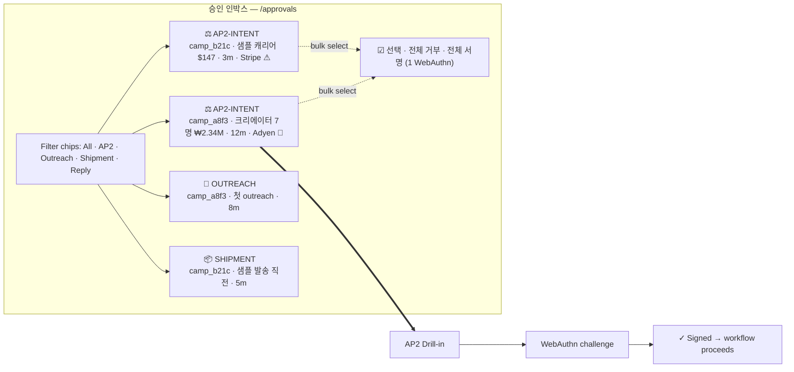
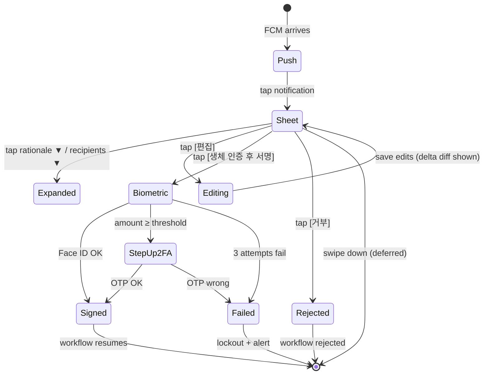
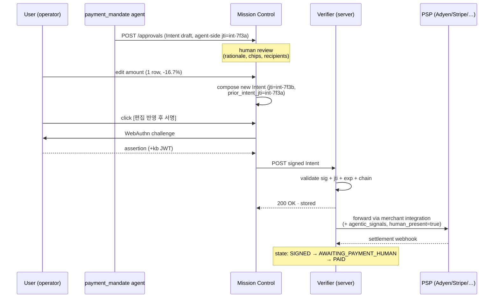
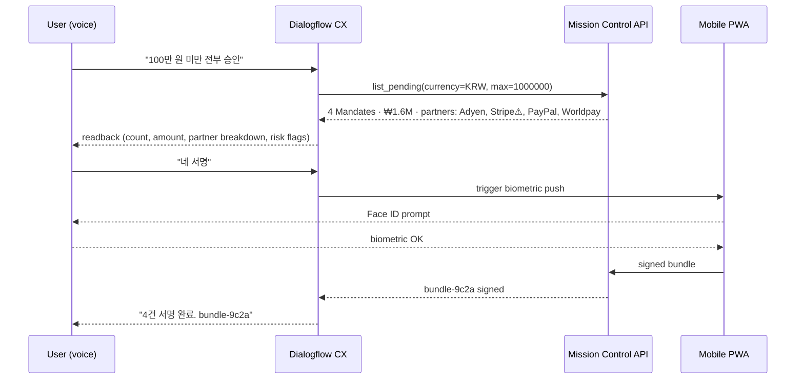
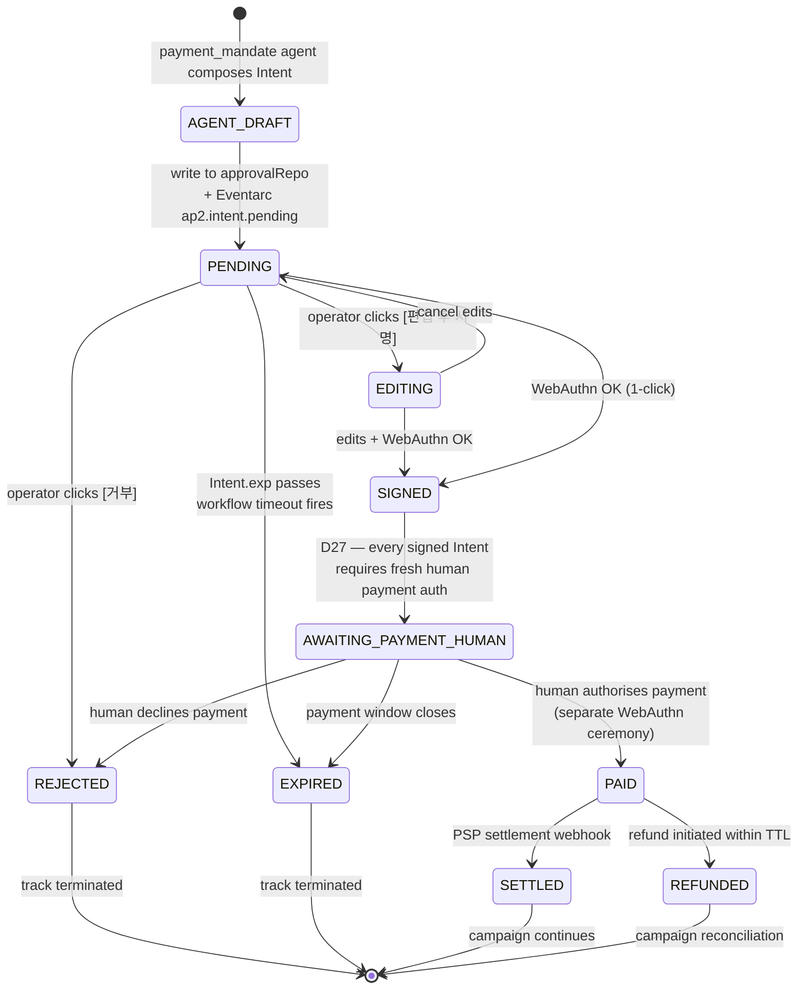

# AP2-UX.md — Agent Payments Protocol UX Specification

**Owner**: Background agent #6 of 13 (Frontend Architect persona)
**Date**: 2026-05-19
**Status**: Draft v1 — pending operator review (resolves outstanding question **O5** in `DECISIONS.md §6`)
**Scope**: All three surfaces declared in **D26** — Mission Control (Next.js 16), Mobile PWA (React Native Expo), Dialogflow CX chatbot — under the **D27** scope clamp (Intent Mandate only; human approves payment).

**Compliance bars**:
- WCAG 2.2 AA (per D34 i18n + a11y conventions in §7)
- AP2 v0.2.0 cryptographic chain (per `PROTOCOLS.md §2`)
- v2's existing approval-gate pattern (see `apps/web/app/(mission-control)/approvals/[id]/page.tsx`)

---

## 1. AP2 Mandate types — quick recap

AP2 v0.2.0 chains **three** SD-JWT Verifiable Digital Credentials (VDCs), each one cryptographically bound to the previous via a SHA-256 hash. The three credentials answer three distinct questions:

| Mandate | Who signs | Question it answers | TTL guidance | Key binding |
|---|---|---|---|---|
| **Intent Mandate** | User (hardware-backed key — passkey / WebAuthn) | "Did the user delegate authority for this kind of purchase?" | Long (hours to 24h) | `cnf` = agent's public key (agent proves possession at use-time) |
| **Cart Mandate** | Merchant first, then User (or agent under Intent rules) | "Did the user accept these exact merchant-offered terms?" | Short (minutes — cart freshness) | `cnf` = signer's key (user or agent-acting-for-user) |
| **Payment Mandate** | User (or agent on user's behalf) | "Is the issuer authorised to charge this instrument for this amount, with what risk signals?" | Very short (one-shot, expires at settlement window close) | `cnf` = payment instrument key |

**Critical anti-replay primitives** on every Mandate:
- `jti` — unique credential ID; verifiers reject duplicate `jti` within TTL window.
- `exp` — strict expiry; verifiers reject after.
- Key Binding JWT (`+kb`) — holder must prove fresh possession of the binding key at presentation time.
- `iat` — issued-at; verifiers may reject if `iat` is in the future or too far in the past.

The chain is **non-repudiable**: each step has a real-world identity (user / merchant / processor) tied to a signing key. Forensic reconstruction after a dispute is deterministic.

---

## 2. D27 scope clarification — Intent-only, human approves payment

Per `DECISIONS.md` Round 5, **D27**: AP2 scope is **Intent Mandate only**.

> "Agent plans, human approves payment."

**What this means concretely for the v2 UX**:

| Capability | v2 day-1 (D27) | Future (post-launch) |
|---|---|---|
| Agent plans purchase intent (creator-payout, sample-procurement, ads-budget allocation) | ✅ Agent composes Intent Mandate | ✅ |
| User signs Intent on hardware-backed key | ✅ Mandatory UX path | ✅ |
| Cart Mandate auto-signed by agent within Intent scope | ❌ Out of scope — human must sign Cart too | ✅ Possible — deferred |
| Payment Mandate issued by agent without fresh human step-up | ❌ Out of scope — human must explicitly authorise each payment | ✅ Possible — deferred |
| Multi-merchant fan-out under single Intent | ❌ Out of scope — one Intent → one human-approved payment | ✅ Possible — deferred |

**Why intent-only**: PIPA (D22) + Marketplace risk posture + agent-hallucination defence (the "agent invented a $50k charge" failure mode dies at the human gate). The Cart and Payment Mandates **still exist** in the protocol chain — they're just always **counter-signed by a human**, never by the agent autonomously.

**State machine constraint** (§8): every Intent must transition through `AWAITING_PAYMENT_HUMAN` before `PAID`. There is no autonomous path from `SIGNED` → `PAID` in v2 day-1.

---

## 3. Mission Control approval UX (Next.js 16)

Mission Control is the operator's primary surface. The existing approval drill-in pattern at `apps/web/app/(mission-control)/approvals/[id]/page.tsx` already supports four `approval.kind` discriminators (`shortlist`, `outreach_send`, `reply_response`, `shipment`). We **add a fifth**: `payment_mandate`.

### 3.1 Approval inbox row (compact)

The inbox row reuses the existing v2 row layout (`/approvals` page-level grid) but adds a Mandate badge and amount column. One row per Intent Mandate awaiting a human decision.

```
┌─────────────────────────────────────────────────────────────────────────────────────────────────┐
│ ⚖️ AP2-INTENT  │ camp_a8f3…  │ 크리에이터 7명 결제      │ ₩2,340,000  │ 12분 대기 │ Adyen 🏦 │ → │
│ ⚖️ AP2-INTENT  │ camp_b21c…  │ 샘플 발송 캐리어 결제    │  $147.34    │  3분 대기 │ Stripe⚠│ → │
│ 📨 OUTREACH    │ camp_a8f3…  │ 첫 outreach 검토         │     —       │  8분 대기 │   —    │ → │
│ 📦 SHIPMENT    │ camp_b21c…  │ 샘플 발송 직전 검토      │     —       │  5분 대기 │   —    │ → │
└─────────────────────────────────────────────────────────────────────────────────────────────────┘
```

**Columns**:
1. **Type badge** — `⚖️ AP2-INTENT` icon + colour (slate-blue) distinguishes payment Mandates from non-payment approvals at a glance.
2. **Campaign ID** — links to campaign drill-in (existing pattern).
3. **One-line description** — derived from `Intent.shopping_intent.category` + count.
4. **Total amount** — formatted per locale (D34): KRW `₩2,340,000`, USD `$147.34`, JPY `¥16,200`, CNY `¥1,070`.
5. **Wait time** — minutes since Intent was created. Highlights red after 30 min (deliverability risk + creator-relationship risk).
6. **Payment partner badge** — Adyen 🏦 / Stripe / PayPal / Worldpay / Klarna etc. (per `PROTOCOLS.md §2.6`). A `⚠️` decoration appears if the partner is **not on the AP2 launch list** (Visa, Stripe direct) — signals to the operator that this transaction will route via merchant-side orchestration, not native AP2 rails.
7. **Drill-in chevron** — keyboard-accessible link.

**Sort & filter**:
- Default sort: oldest-first (wait-time descending) — same as existing inbox.
- Filter: `kind=payment_mandate` toggle (chip in the inbox header).
- Bulk-select: checkbox column appears when `kind=payment_mandate` filter is active (enables §3.4 bulk approval).

### 3.2 Drill-in page (full Mandate detail)

The drill-in extends the existing `renderShipmentApproval` / `renderOutreachSendApproval` layout. Server component, server action, branches on `approval.kind === "payment_mandate"`.

```
┌──────────────────────────────────────────────────────────────────────────────────────┐
│ ← 승인 인박스                                                                          │
│                                                                                      │
│ PAYMENT_MANDATE · approveIntentMandate                                               │
│ ╔══════════════════════════════════════════════════════════════════════════════════╗ │
│ ║  Acme Pet Foods · 크리에이터 7명 결제 (intent #int-7f3a…)                     ⚖️ ║ │
│ ╚══════════════════════════════════════════════════════════════════════════════════╝ │
│ 대기 시작 12분 전 · camp_a8f3c… · expires in 23h 48m                                 │
│                                                                                      │
│ ┌──────────────────────────────────────────────────────────────────────────────────┐ │
│ │ 에이전트가 이 안을 고른 이유 (rationale)                                         │ │
│ │ ──────────────────────────────────────────────────────────────────────────────── │ │
│ │ 7명의 크리에이터가 outreach 단계를 통과했고, 사전 합의된 단가 평균 $42/post 안에  │ │
│ │ 있습니다. PIPA Article 23 동의서를 모두 받았고, 카드 토큰은 Adyen 보관 vault     │ │
│ │ 토큰입니다. 환불 가능 정책 적용. 비용 cap $5000 미만 (현재 $2340).               │ │
│ └──────────────────────────────────────────────────────────────────────────────────┘ │
│                                                                                      │
│ ┌──────────────────────────────────────┐ ┌────────────────────────────────────────┐ │
│ │ Intent Mandate 요약                  │ │ judge / risk chips                     │ │
│ │ ──────────────────────────────────── │ │ ────────────────────────────────────── │ │
│ │ category:       creator_payout       │ │ [✓ within-budget]   [✓ PIPA-cleared]   │ │
│ │ price_max:      ₩3,000,000           │ │ [✓ merchant-allowlist] [✓ refundable]  │ │
│ │ delegation:     human_present (D27)  │ │ [✓ Model-Armor-passed] [⚠ first-time]  │ │
│ │ merchant_allowlist:                  │ │ [⚠ post-30-day TTL not set]            │ │
│ │   did:web:adyen.com                  │ │                                        │ │
│ │ refundable_required: true            │ │ Payment partner: Adyen 🏦  (AP2 native)│ │
│ │ TTL:            24h (expires 17:32)  │ │                                        │ │
│ │ jti:            intent-7f3a-…        │ │                                        │ │
│ └──────────────────────────────────────┘ └────────────────────────────────────────┘ │
│                                                                                      │
│ ┌──────────────────────────────────────────────────────────────────────────────────┐ │
│ │ 결제 대상 7명                                                                    │ │
│ │ ──────────────────────────────────────────────────────────────────────────────── │ │
│ │ □  creator                  amount    judge           grounded?                  │ │
│ │ ☑  @kr_petlover              ₩504,000 [✓✓✓✓]          contract#c4f2  ─edit─     │ │
│ │ ☑  @petmom_seoul             ₩320,000 [✓✓✓·]          contract#c4f3  ─edit─     │ │
│ │ ☑  @doggo_diary              ₩480,000 [✓✓✓✓]          contract#c4f4  ─edit─     │ │
│ │ ☑  @cat_in_box               ₩288,000 [✓✓·✓]          contract#c4f5  ─edit─     │ │
│ │ ☑  @snack_for_pets           ₩400,000 [✓✓✓✓]          contract#c4f6  ─edit─     │ │
│ │ ☑  @paws_and_claws           ₩208,000 [✓·✓✓]          contract#c4f7  ─edit─     │ │
│ │ ☑  @woof_woof_seoul          ₩140,000 [✓✓✓✓]          contract#c4f8  ─edit─     │ │
│ │                                                                                  │ │
│ │ 합계:                       ₩2,340,000                                           │ │
│ └──────────────────────────────────────────────────────────────────────────────────┘ │
│                                                                                      │
│ ┌──────────────────────────────────────────────────────────────────────────────────┐ │
│ │ raw Intent Mandate (JWS payload, read-only)                            ▼ expand  │ │
│ └──────────────────────────────────────────────────────────────────────────────────┘ │
│                                                                                      │
│              [거부]   [편집 후 서명]   [전체 서명 (1-click sign)]                    │
└──────────────────────────────────────────────────────────────────────────────────────┘
```

**Required elements** (from §3.1 inbox feeding this drill-in):

1. **Header strip** — campaign name, Intent ID short-form, wait time, expiry countdown (live JS ticker — re-render every 30 s; turns rose at < 1 h, blocks submit at expired).
2. **Rationale card** — re-uses existing `<Card><CardBody><SectionLabel>` shell. Same component as outreach/shipment.
3. **Mandate summary card** (left) — pulled from `Intent.shopping_intent.*`. Format constants per locale.
4. **Judgment chips card** (right) — boolean chips from `payment_mandate` agent's pre-judges:
   - `within-budget` — total ≤ `price_max`
   - `PIPA-cleared` — every recipient has Article 23 consent on file
   - `merchant-allowlist` — every payee `did:web:` is in Intent's `merchant_allowlist`
   - `refundable` — every payment instrument supports refund (per partner capability matrix)
   - `Model-Armor-passed` — no PI/JB/PII flag on the rationale text (D21)
   - `first-time` — this is the operator's first AP2 sign of the day → forces step-up (see §3.6)
   - `post-30-day TTL` — Intent TTL exceeds 30 days (suspicious; flag for review)
5. **Payment partner badge** — Adyen / Stripe / etc with "AP2 native" or "via merchant orchestration" tag.
6. **Recipient table** — one row per payee; checkboxes (default checked) for per-recipient inclusion; per-row inline edit link → opens modal (§3.3); shows the judge summary as a 4-glyph chip (each glyph is one of `✓ · ✗` for brand / conversion / deliverability / skeptic per the existing `OutreachDraft.judgeScores` model); links to grounded contract artifact.
7. **Raw Mandate disclosure** — `<details>` element; collapsed by default; expanded view shows the full SD-JWT payload pretty-printed (read-only, mono font). For forensic / debugging use.
8. **Action row** — three buttons in standard v2 order:
   - **거부** (reject) — tone `reject`, secondary
   - **편집 후 서명** (edit-then-sign) — variant `primary`, opens edit drawer (§3.3)
   - **전체 서명 (1-click sign)** — variant `primary`, tone `approve` — most prominent. Triggers WebAuthn challenge (§3.6).

### 3.3 Edit-then-sign flow

When the operator clicks **편집 후 서명**, a side drawer opens (does not navigate away). The drawer lets the operator override:

| Field | Editable? | Constraint |
|---|---|---|
| Per-recipient amount | ✅ | Within `price_max` aggregate; cannot exceed the **agent's proposed amount × 1.2** without an additional confirmation prompt |
| Recipient inclusion (checkbox) | ✅ | At least one recipient must remain |
| Merchant allowlist | ❌ | Locked — overriding the merchant list re-opens the security review |
| Refundable flag | ❌ | Locked — overriding turns the Mandate into a different risk class |
| TTL | ⚠ Reducible only | Operator may **shorten** the TTL but never extend (replay-window expansion is dangerous) |
| Rationale (operator note) | ✅ | Free-text 0-500 chars; appended to the Mandate as a separate `operator_note` claim |

**Confirmation pattern**:
1. Operator edits amount(s).
2. Drawer shows a **delta diff card** at the bottom: `agent_proposed ₩504,000 → operator ₩420,000 (-16.7%)` for each changed row.
3. The 1-click sign button label changes to `편집 반영 후 서명 (3 변경)` — the count is the number of fields changed.
4. Pressing it triggers a WebAuthn challenge that signs the **modified** SD-JWT payload. The agent's original Intent is preserved (immutable); the human-edited variant is a **new** Intent with a new `jti` and a back-reference (`prior_intent_jti`) to the agent's draft.
5. Audit log records both: agent draft + human override + diff. Forensics is unambiguous.

**Anti-pattern guard** (§9): if the operator's edit reduces the amount **below the agent's confidence-band floor** (a per-creator min payout in the campaign settings), a warning toast appears ("이 단가는 크리에이터 거래 기준선 미만입니다 — 동의 손실 위험"). Operator can still proceed but must acknowledge.

### 3.4 Bulk approve (10+ Mandates at once with delta diff)

When the inbox filter is `kind=payment_mandate`, a multi-select checkbox column appears on each row. Selecting 2+ rows reveals a sticky toolbar at the bottom of the viewport:

```
┌─────────────────────────────────────────────────────────────────────────────────────┐
│ ☑ 14 Mandate 선택  │  합계 ₩28,440,000  │  partner: Adyen ×12, PayPal ×2          │
│ [전체 거부]   [전체 서명 (1 WebAuthn)]   [개별 검토로 분리]                          │
└─────────────────────────────────────────────────────────────────────────────────────┘
```

**Bulk-approve modal** (opens on click of `전체 서명`):

```
┌──────────────────────────────────────────────────────────────────────────────────┐
│ 14개 Intent Mandate 한꺼번에 서명                                                │
│                                                                                  │
│ 다음 Mandate가 한 번의 WebAuthn 챌린지로 서명됩니다:                              │
│                                                                                  │
│ ┌────────────────────────────────────────────────────────────────────────────┐  │
│ │ camp_a8f3 · creator_payout · 7명          ₩2,340,000  Adyen   ✓✓✓✓✓     │  │
│ │ camp_a8f3 · creator_payout · 3명          ₩900,000    Adyen   ✓✓✓✓·     │  │
│ │ camp_b21c · sample_carrier · 1건          $147.34     Stripe⚠ ✓✓✓✓✓     │  │
│ │ camp_b21c · ads_topup · 1건               $500.00     PayPal  ✓✓✓·✓     │  │
│ │ … 10 more …                                                                │  │
│ └────────────────────────────────────────────────────────────────────────────┘  │
│                                                                                  │
│ ⚠ 1건은 AP2 native가 아닌 partner를 사용합니다 (Stripe → merchant orchestration). │
│ ⚠ 3건은 첫 번째 거래입니다 (이 partner와의 첫 transaction).                       │
│                                                                                  │
│ delta diff (agent-draft → human override):                                       │
│   · 0 건 — 그대로 서명                                                           │
│                                                                                  │
│                                  [취소]   [WebAuthn 인증 후 14건 서명]            │
└──────────────────────────────────────────────────────────────────────────────────┘
```

**Bulk-approve constraints**:
- Single WebAuthn assertion signs a **bundle SD-JWT** that contains all 14 Mandate hashes (one assertion, one fresh `cnf` proof). Replay-protected by `jti` on the bundle + each child Mandate's own `jti`.
- The bundle is **rejected by the verifier** if any single child Mandate fails (no partial-approval; see §10).
- Bulk approve is **disabled** if:
  - Any selected Mandate has a `first-time-partner` chip (force individual review)
  - Total aggregate amount > operator's daily authority ceiling (operator policy in workspace settings)
  - Any selected Mandate has a `Model-Armor-flagged` chip
- Operator can **edit before bulk-approve** by clicking individual `─edit─` links — those Mandates are pulled out of the bundle, edited individually, then re-added.

### 3.5 Reject flow

Identical UX to existing v2 reject buttons:
- Single Mandate: red `[거부]` button → confirmation prompt → `approval.status = "rejected"` → workflow's `step.waitForEvent("approval/resolved")` resolves with `decision: "rejected"` → Inngest workflow takes the rejected branch (no payment is issued).
- Bulk: `[전체 거부]` → operator must type "REJECT" (case-sensitive) into a confirmation input to prevent accidental mass-rejection.

Rejection emits an Eventarc event for the `customer_success` agent (per Tier-1 agent inventory in DECISIONS §4), which logs the rejection reason against the creator-track for future training signal.

### 3.6 WebAuthn step-up

Every signing action (single, edit-then-sign, bulk) triggers a fresh WebAuthn challenge:
- **Default policy**: passkey on platform authenticator (Touch ID / Windows Hello / Android biometric).
- **High-value threshold**: ≥ ₩10,000,000 OR ≥ $10,000 → force a **roaming authenticator** (YubiKey / Titan) instead of platform; rejects platform-only assertion.
- **First-of-day**: force re-authentication (no session caching of WebAuthn assertion).
- **Failure handling**: 3 failed assertions → lock the operator out for 5 min + page on-call security (per D32 alerting).
- The WebAuthn ceremony's `signature` is what becomes the user's JWS over the Mandate's `+kb` JWT. No separate signing step.

---

## 4. Mobile PWA (Expo) approval UX

Per D26, the mobile PWA is built with React Native Expo, deployed as a PWA (not native binaries day-1). It mirrors a subset of Mission Control optimised for one-handed phone use.

### 4.1 Push notification spec (FCM payload + deep link)

FCM (Firebase Cloud Messaging — `D-services` Frontend bullet) delivers the new-Mandate alert.

**FCM message payload** (sent server-side by the `payment_mandate` agent's post-write hook):

```json
{
  "message": {
    "token": "<user-device-FCM-token>",
    "notification": {
      "title": "AP2 서명 대기: ₩2,340,000",
      "body": "Acme Pet Foods · 크리에이터 7명 결제 (12분 대기)"
    },
    "data": {
      "approval_id": "appr_int_7f3a8e",
      "kind": "payment_mandate",
      "campaign_id": "camp_a8f3c2…",
      "amount_minor": "2340000",
      "currency": "KRW",
      "expires_at": "2026-05-19T17:32:00Z",
      "deep_link": "socialseed://approvals/appr_int_7f3a8e",
      "fallback_url": "https://app.socialseed.ing/approvals/appr_int_7f3a8e"
    },
    "android": {
      "priority": "high",
      "notification": {
        "channel_id": "ap2_approvals",
        "tag": "appr_int_7f3a8e",
        "click_action": "OPEN_APPROVAL"
      }
    },
    "apns": {
      "headers": { "apns-priority": "10", "apns-push-type": "alert" },
      "payload": {
        "aps": {
          "alert": { "title": "AP2 서명 대기: ₩2,340,000", "body": "..." },
          "sound": "default",
          "category": "AP2_APPROVAL",
          "mutable-content": 1,
          "thread-id": "camp_a8f3c2"
        }
      }
    },
    "webpush": {
      "headers": { "Urgency": "high", "TTL": "300" },
      "notification": {
        "actions": [
          { "action": "review", "title": "검토" },
          { "action": "dismiss", "title": "나중에" }
        ],
        "renotify": true,
        "requireInteraction": true
      }
    }
  }
}
```

**Key fields**:
- `tag` / `thread-id` — collapses repeat notifications for the same approval (no spam).
- `expires_at` — client can grey out / suppress the notification after expiry.
- `deep_link` — opens the PWA bottom-sheet directly to the approval (no inbox navigation).
- `fallback_url` — used when the PWA is not installed.
- `actions` — Android/Web only; iOS uses `category` `AP2_APPROVAL` to surface the same two actions.

**Localisation (D34)**: `title` / `body` rendered per the operator's preferred locale. The Mandate amount uses locale-aware formatting via `Intl.NumberFormat`.

**Anti-spam**: the FCM server-side function debounces — at most one push per operator per 60 s, batching new arrivals. Critical Mandates (`high-value` + `expires-in-under-1h`) bypass the debounce.

### 4.2 Bottom-sheet approval (one-handed)

Tapping the push (or opening the PWA's `/approvals` inbox) reveals a **bottom-sheet** with thumb-reach controls. Designed for one-handed phone use; primary actions sit in the lower 40% of the screen.

```
┌─────────────────────────┐
│   ━━━━━━━ (drag handle) │  ← swipe down to dismiss
│                         │
│ ⚖️ AP2-INTENT            │
│ Acme Pet Foods          │
│ 크리에이터 7명 결제      │
│ ────────────────────    │
│ ₩2,340,000              │  ← large, bold, locale-formatted
│ 12분 대기 · expires 23h │
│                         │
│ partner: Adyen 🏦       │
│ ────────────────────    │
│ ✓ within-budget         │
│ ✓ PIPA-cleared          │
│ ✓ merchant-allowlist    │
│ ✓ refundable            │
│ ⚠ first-time partner    │
│                         │
│ rationale ▼             │  ← collapsed; tap to expand
│ recipient list ▼        │  ← collapsed; tap to expand
│ raw Mandate ▼           │  ← collapsed
│                         │
│ ━━━━━━━━━━━━━━━━━━━━━   │
│                         │
│  [거부]    [편집]        │  ← left thumb, secondary
│  ┌──────────────────┐   │
│  │ ☑ 생체 인증 후 서명 │   │  ← right thumb, primary
│  └──────────────────┘   │
└─────────────────────────┘
```

**Interaction notes**:
- Drag handle at top — swipe down to dismiss (decision deferred, Mandate stays pending).
- Primary action `생체 인증 후 서명` is a full-width button at the bottom — biggest target, thumb-reachable on a 6.7" device.
- Secondary actions (`거부`, `편집`) are smaller, above the primary, equally weighted.
- Expandable sections (`rationale ▼`, `recipient list ▼`, `raw Mandate ▼`) collapse by default to keep the sheet under-one-screen for the common-case approve flow.
- Editing on mobile opens a full-screen modal (not a side drawer like Mission Control) — same field constraints as §3.3.

### 4.3 Biometric step-up (WebAuthn)

The PWA uses the **Web Authentication API** (Expo Web supports this natively in Safari/Chrome PWA wrappers; native Expo wraps the platform's biometric prompt via `expo-local-authentication` for the WebAuthn ceremony's user verification).

**Authentication flow**:
1. Operator taps `생체 인증 후 서명`.
2. PWA calls `navigator.credentials.get({ publicKey: <challenge> })`.
3. Platform shows Face ID / Touch ID / fingerprint prompt.
4. On success, the WebAuthn assertion signs the Mandate's `+kb` JWT.
5. PWA POSTs the signed Mandate to `/api/approvals/{id}/sign`.
6. Server verifies → emits Eventarc `ap2.intent.signed` → workflow proceeds.

**High-value step-up**:
- Mandates ≥ ₩10,000,000 OR ≥ $10,000 require a **second factor** beyond biometric: an SMS OTP (sent to the operator's registered phone) OR a TOTP from the operator's authenticator app. The biometric alone is insufficient.
- The high-value threshold is configurable per workspace.

**Failure handling**:
- Biometric refused (system-level) → fall back to passcode → fall back to web-based sign-in.
- 3 failed biometric attempts → bottom sheet collapses to an "open Mission Control to retry" link (mobile lockout).

### 4.4 Offline behaviour

The PWA queues "view-only" data offline (last-fetched Mandates) so the operator can review (read-only) in the subway. **Signing is online-only** — the WebAuthn assertion + Mandate post must reach the server within the assertion's freshness window. Offline taps on `생체 인증 후 서명` show a friendly "온라인에서 다시 시도" message.

---

## 5. Dialogflow CX approval UX

Per D26, Dialogflow CX is the chatbot surface. It is **explicitly not** the primary approval surface — it's an alternative for hands-free / voice scenarios (driving, walking, phone-only).

### 5.1 Voice/text approval intents

The Dialogflow CX agent has the following AP2-specific intents (named with the `ap2.` prefix):

| Intent | Sample utterances | Slots |
|---|---|---|
| `ap2.list_pending` | "show pending approvals" · "결재 대기 보여줘" · "保留中の承認" | (none) |
| `ap2.approve_one` | "approve approval ABC" · "ABC 승인해줘" | `approval_id` (required) |
| `ap2.approve_filtered` | "approve all under 100K KRW" · "approve everything below ten dollars" · "100만 원 미만 전부 승인" | `currency` `amount_max` (both required) |
| `ap2.reject_one` | "reject approval ABC" · "ABC 거부" | `approval_id` (required) |
| `ap2.detail` | "show me details for ABC" · "ABC 상세" | `approval_id` (required) |
| `ap2.cancel` | "never mind" · "cancel" · "취소" | (none) |

**Critical safety rule** (§9): **every `approve_*` intent forces a readback + confirmation utterance before signing**. The bot **never** signs on the first turn.

### 5.2 Confirmation utterance + readback before sign

Worked example — Korean operator, voice channel:

```
사용자: "100만 원 미만 결제 전부 승인해줘"

bot: "100만 원 미만 결제 Mandate 4건을 찾았습니다:
      1. Acme Pet Foods · 크리에이터 3명 · ₩900,000 · partner Adyen
      2. Beta Coffee · 샘플 발송 · ₩67,400 · partner Stripe (AP2 미지원)
      3. Gamma Snacks · 광고 결제 · ₩540,000 · partner PayPal
      4. Delta Lab · ads topup · ₩120,000 · partner Worldpay
      합계 ₩1,627,400.
      'AP2 미지원 partner 1건이 포함됨' — Beta Coffee 1건이 merchant orchestration 으로
      처리됩니다. 이 4건을 한꺼번에 서명하시겠습니까? '네 서명' 이라고 말씀해 주세요."

사용자: "네 서명"

bot: "확인했습니다. 휴대폰의 생체 인증 알림을 확인해 주세요."

[PWA receives a push; operator authenticates via Face ID]

bot: "4건 서명 완료. 거래 ID는 bundle-9c2a 입니다. 영수증은 이메일로 발송됩니다."
```

**Readback requirements**:
- **Count** — "4 Mandate" (never just "approve all")
- **Aggregate amount** — "합계 ₩1,627,400"
- **Per-partner breakdown** — if any partner is AP2-non-native, call it out explicitly
- **Risk flags** — if any Mandate has `first-time-partner` or `Model-Armor-flagged`, the bot **refuses bulk approve via voice** and asks the operator to go to Mission Control: "1건은 첫 거래 파트너이므로 voice 승인 불가 — Mission Control 에서 검토해주세요."
- **Confirmation phrase** — must be one of the exact phrases registered as an `ap2.confirm` intent: `"네 서명"`, `"yes sign"`, `"確認"`, `"确认签名"` (D34 i18n). Ambiguous phrases like "OK" or "응" are rejected ("'네 서명' 이라고 말씀해 주세요").

**Why redirect to PWA for the actual signing**: voice channels cannot perform WebAuthn. The bot kicks the WebAuthn ceremony to the operator's primary device via the push channel from §4.1. The bot then waits (up to 60 s) for the signing webhook, then confirms.

### 5.3 Text channel (Mission Control embedded chat)

Same intent grammar; same readback rule; the bot renders the Mandate list as a clickable card carousel (not a plain text dump) so the operator can drill in via tap.

---

## 6. Wireframes

### 6.1 Mission Control approval inbox (full page)



### 6.2 Mobile PWA bottom sheet (state machine)



### 6.3 AP2 chain of custody (forensic view)



### 6.4 Voice channel readback



### 6.5 Bulk approve delta diff

```
Bulk-approve modal — 4 Mandates, 1 edited

agent-draft → operator override
─────────────────────────────────────────────────────────────
camp_a8f3 · creator_payout · 7명
   @paws_and_claws   ₩208,000 → ₩175,000  (-15.9%)
   (6 other recipients unchanged)
   subtotal:         ₩2,340,000 → ₩2,307,000

camp_b21c · sample_carrier  · 1건         (no change)
camp_b21c · ads_topup        · 1건         (no change)
camp_c45f · creator_payout  · 4명         (no change)
─────────────────────────────────────────────────────────────
aggregate:        ₩3,887,400 → ₩3,854,400

[취소]                            [WebAuthn 인증 후 4건 서명]
```

---

## 7. Accessibility (WCAG 2.2 AA)

### 7.1 i18n (D34) — 4 locales

| Locale | Date/time format | Currency format example | Right-to-left? |
|---|---|---|---|
| `ko-KR` | `YYYY-MM-DD HH:mm` | `₩2,340,000` | No |
| `en-US` | `MMM D, YYYY h:mm A` | `$147.34` | No |
| `ja-JP` | `YYYY年M月D日 HH:mm` | `¥16,200` | No |
| `zh-CN` | `YYYY年M月D日 HH:mm` | `¥1,070` | No |

All Mandate amounts use `Intl.NumberFormat(locale, { style: "currency", currency })`. Date/time uses `Intl.DateTimeFormat` with the operator's preferred locale (stored in `user_prefs`).

**Translation key conventions**:
- Strings live in `apps/web/messages/{ko,en,ja,zh}.json` (next-intl).
- AP2-specific keys are namespaced `approvals.ap2.*`.
- Risk-flag chip names (`within-budget`, `first-time-partner`) are translated; the underlying machine value is locale-agnostic (so trace logs stay searchable).

### 7.2 Screen reader (NVDA / VoiceOver / TalkBack)

- **Mandate drill-in heading** — `<h1>` carries the campaign name + count + Intent ID short-form, in that order. Example: `<h1>Acme Pet Foods · 크리에이터 7명 결제 · int-7f3a</h1>`. Heading is the first focusable element on the page.
- **Risk chips** — each chip is a `<span role="status">` with `aria-label="within-budget: passed"`. Group has `aria-label="judgment chips"`.
- **Recipient table** — proper `<table>` with `<caption>` and `<th scope="col">` / `<th scope="row">`. Editable amount cells use `<input>` with `aria-describedby="row-validation-msg"`.
- **Amount values** — wrapped in `<span aria-label="₩2,340,000 Korean won">` so the SR reads the currency, not just digits.
- **Critical action buttons** — `[전체 서명]` has `aria-describedby` pointing at a hidden `<span>` saying "WebAuthn step-up required. Will sign 7 Mandates totalling 2.3 million won." Screen reader users hear the full implication before activating.
- **Live region for expiry countdown** — `<div aria-live="polite" aria-atomic="true">` updates every minute, NOT every second (polite + minute-grained avoids SR spam).
- **Bottom sheet (mobile)** — `role="dialog"` `aria-modal="true"`; focus traps inside; ESC / swipe-down both dismiss. Initial focus on the heading, NOT on the primary action (prevents accidental signing on screen-reader activation).

### 7.3 Focus order

Mission Control drill-in tab order:
1. Back link (`← 승인 인박스`)
2. H1 heading
3. Expiry countdown
4. Rationale card (text region)
5. Mandate summary card (text region)
6. Judgment chips (group)
7. Recipient table (cell-by-cell)
8. Raw Mandate disclosure (`<details>`)
9. **Action buttons in order: 거부 → 편집 후 서명 → 전체 서명**

The most-destructive action (`거부`) is **first**, not last — defensive focus-order pattern. The most-frequent action (`전체 서명`) is last and visually prominent. Tab from any field never accidentally lands on `전체 서명` first.

### 7.4 Contrast & target size

- All AP2-specific colour tokens (slate-blue badge, green chips, rose warning) meet **4.5:1** for text and **3:1** for non-text per WCAG 2.2 AA.
- Primary `전체 서명` button: ≥ 44×44 pt touch target on mobile; ≥ 32×32 pt on desktop. (2.5.8 Target Size Minimum.)
- Checkbox column in inbox: 24×24 pt visible target with 44×44 pt hit area.
- Focus ring: 2 px solid `#2563eb` outline + 2 px outline offset (visible on all browsers, no `:focus { outline: none }` anywhere in AP2 surfaces).

### 7.5 Reduced motion (`prefers-reduced-motion`)

- Expiry countdown does not animate; just updates the digit.
- Bottom-sheet open/close uses `transform: translateY` with a 200 ms cubic-bezier transition, suppressed under `prefers-reduced-motion: reduce` to a 0 ms snap.
- Delta-diff "added/removed" highlight uses colour, not animation.

### 7.6 Keyboard-only flow

The entire AP2 sign loop is keyboard-completable:
- Tab through inbox rows → Enter to drill in.
- Tab through chips/summary → Tab into recipient table → Space toggles row checkbox → Tab past table → focus lands on `[거부]`.
- Space on `[전체 서명]` → WebAuthn ceremony (which is its own platform-managed accessible UI).
- ESC anywhere returns to inbox without changes.

---

## 8. State diagram



**State annotations**:

| State | Persisted in | Eventarc topic | UI surface |
|---|---|---|---|
| `AGENT_DRAFT` | (in-memory only, agent scratchpad) | — | none |
| `PENDING` | `approvalRepo` (Firestore) | `ap2.intent.pending` | Mission Control inbox + mobile push |
| `EDITING` | (client-only, no persistence until sign) | — | drill-in / bottom sheet |
| `SIGNED` | `approvalRepo` + AP2 store (Spanner) | `ap2.intent.signed` | drill-in shows "signed by {operator} at {time}"; payment step queued |
| `AWAITING_PAYMENT_HUMAN` | AP2 store | `ap2.payment.awaiting_human` | new approval row appears for the payment auth step |
| `PAID` | AP2 store + PSP records | `ap2.payment.paid` | campaign timeline event |
| `REJECTED` | `approvalRepo` (resolved) | `approval/resolved` (existing v2 event) | drill-in shows "rejected by {operator} · reason: {note}" |
| `EXPIRED` | `approvalRepo` (resolved, auto) | `ap2.intent.expired` | inbox shows expired badge for 24h then archives |
| `SETTLED` | PSP records + BigQuery | `ap2.payment.settled` | campaign report |
| `REFUNDED` | PSP records | `ap2.payment.refunded` | campaign timeline event |

**Important state guarantees**:
- A `PENDING` Intent **never** auto-promotes to `SIGNED` — only an authenticated operator action (or, in scope-expansion phase, an explicitly delegated agent under Intent rules — out of scope for v2).
- The `AWAITING_PAYMENT_HUMAN` state is the **D27 enforcement point**: no autonomous `SIGNED → PAID` edge exists.
- `EXPIRED` is a **terminal** state — operators cannot resurrect an expired Intent; they must request the agent compose a fresh one.

---

## 9. Anti-patterns — what NOT to do

### 9.1 Silent auto-approve under threshold

**Don't**: "auto-approve all Mandates under $10."

**Why not**: defeats the entire D27 premise. The agent can be tricked into composing N × $9 Mandates that aggregate to $9·N; or a single Intent's `price_max` can be subverted. Per-Mandate-amount thresholds are insufficient.

**Instead**: bulk approve (§3.4) gives the operator the same velocity, with a single WebAuthn for the batch and a full delta-diff readback. The human is always in the loop; just one assertion covers N Mandates.

### 9.2 Ambiguous "approve" wording

**Don't**: button labelled `"Approve"` alone.

**Why not**: in AP2, "approve" overloads at least three meanings — sign the Intent, sign the Cart, authorise the Payment. The operator clicking `"Approve"` may not know which they're authorising. Forensic dispute becomes "what did the operator think they were approving?"

**Instead**: every action button must name the **specific Mandate type** and the **specific action**. v2 uses:
- `[전체 서명]` (sign all) — never just `[승인]`
- `[편집 후 서명]` — never just `[Edit]`
- `[거부]` — fine, "reject" is unambiguous (nothing to sign)
- `[결제 인증]` (authorise payment) — for the AWAITING_PAYMENT_HUMAN step
- The English variants are `[Sign all]`, `[Edit and sign]`, `[Reject]`, `[Authorise payment]`. Never `[Approve]`.

### 9.3 Caching WebAuthn assertions

**Don't**: cache a WebAuthn signing assertion for "the rest of the session" so the operator doesn't have to re-authenticate.

**Why not**: AP2 Key Binding requires **fresh** proof at each Mandate's use-time. Reusing an assertion across Mandates defeats anti-replay; an XSS or session-theft attack can replay the cached assertion for any new Mandate composed by an attacker.

**Instead**: every sign action triggers a **fresh** challenge. The platform's biometric prompt is fast (≈ 1 s on modern devices); the friction is acceptable.

### 9.4 Showing the raw JWS as the primary review surface

**Don't**: make operators read the SD-JWT payload to understand what they're signing.

**Why not**: humans skim. The fields the agent put in the Mandate may not match what the operator thinks the Mandate covers. A misread `price_max` of `1500000` vs `15000000` (one extra zero) is a 10× authorisation error.

**Instead**: the drill-in (§3.2) presents pre-parsed semantic fields with locale-formatted amounts, plus boolean judgment chips, plus a recipient table. The raw JWS is in a collapsed disclosure for forensics, never the primary read.

### 9.5 Hiding the partner / processor identity

**Don't**: just say "payment will be processed" without naming Adyen / Stripe / PayPal.

**Why not**: operator may not realise the chosen partner is not AP2-native (e.g. Stripe routes via merchant orchestration; some `agentic_signals` do not reach the issuer). Operator's risk model differs by partner.

**Instead**: partner badge is mandatory on the row, the drill-in, the readback, and the bulk-approve modal. `⚠ AP2 미지원` flag for non-native partners.

### 9.6 Auto-extending TTL on re-approve

**Don't**: when an operator re-edits an expired Intent, just bump the `exp` and re-issue.

**Why not**: the original agent reasoning may be stale; the merchant state may have changed; the creator-track may have moved. Re-using the same Mandate skeleton hides drift.

**Instead**: expired Intents are terminal. The agent must compose a fresh Intent from current state. The new Intent links to the expired one via `prior_intent_jti` for audit, but is otherwise independent.

### 9.7 Bulk-approving across workspaces

**Don't**: let a single multi-workspace operator bulk-approve Mandates spanning different tenants.

**Why not**: PIPA tenancy + AP2's per-tenant signing key separation. A bulk signature must be tenant-scoped; cross-tenant signature is a compliance break.

**Instead**: bulk approve is **workspace-scoped**. The UI greys out cross-workspace selections; the API rejects them server-side.

### 9.8 Vague rejection reasons

**Don't**: reject without a structured reason.

**Why not**: the `customer_success` agent (per DECISIONS §4) trains on rejection signals. A bare "rejected" gives no training value. Worse, dispute reconstruction can't tell why the human disagreed with the agent.

**Instead**: rejection drawer offers a structured-reason picklist (`amount_too_high`, `wrong_recipient`, `partner_concern`, `policy_violation`, `other`) plus a free-text note. The structured reason feeds back to the agent as a training signal.

### 9.9 Browser back/forward leaving stale state

**Don't**: rely on client state for approval status.

**Why not**: another operator (or the agent itself) can change the Mandate between the operator's page load and click. A stale-state submit can re-approve an already-rejected Mandate.

**Instead**: the server action (existing v2 pattern in `resolveAction`) re-fetches the Mandate, checks `status === "pending"`, and rejects the submission if not. The UI then surfaces "이 Mandate는 이미 처리되었습니다" with a fresh state.

---

## 10. Risk register

| Risk | Likelihood | Severity | Mitigation | Owner |
|---|---|---|---|---|
| **R1 — Mandate replay** (attacker captures a signed Mandate, re-presents it within TTL) | Medium | High | Server enforces `jti` uniqueness across rolling 48 h window; Spanner unique constraint on `(workspace_id, jti)`; Key Binding `+kb` JWT requires fresh proof at presentation | `payment_mandate` agent + AP2 verifier service |
| **R2 — Operator key compromise** (phishing → device theft → attacker has both passkey and session) | Low | Critical | Force step-up for high-value (§3.6); enforce roaming-authenticator for `≥ ₩10M`; SOC alerts on geo-anomaly (Chronicle SIEM per D32); revoke device passkey via Identity Platform per D19; "first-of-day" forces full re-auth | Security + Identity Platform |
| **R3 — Agent compromise** (Model Armor bypass — agent composes Intent with covertly mutated `price_max`) | Low | Critical | Independent compliance agent (D4-#13 in agent inventory) re-validates every Intent against campaign policy + workspace caps **before** approval surface; rationale text is Model-Armor-scanned; cost_watch (W2) caps per-tenant daily spend | `compliance` agent + W2 cost_watch |
| **R4 — Partial-approval semantics** (operator approves bundle, only some children settle) | Medium | Medium | Bundle is **atomic** at the Mandate layer — verifier rejects bundle if any child Mandate fails validation. Settlement, however, happens per-Mandate downstream; partial settlement (e.g. one PSP outage) is handled via per-Mandate retry, not by re-signing the bundle. UI shows per-Mandate settlement status post-sign | AP2 verifier + workflow retry |
| **R5 — Cross-tenant bulk approval bug** (multi-workspace operator's bulk signs cross-tenant Mandates) | Low | Critical (compliance) | Server-side: bulk endpoint rejects mixed-tenant request with HTTP 422; client-side: row checkbox disabled for non-current-workspace rows; tenant_id is part of WebAuthn assertion's challenge so signature is cryptographically tenant-bound | Identity Platform + AP2 verifier |
| **R6 — TTL gaming via clock skew** (attacker manipulates client clock to "extend" Intent TTL) | Low | Medium | Verifier uses **server time** + NTP-synced clock-skew tolerance ±5 min; client clocks are advisory only; `iat`/`exp` validated server-side | AP2 verifier |
| **R7 — Push-notification spoofing** (attacker sends fake FCM-looking push to trick operator into approving a non-existent Mandate) | Low | Medium | Push deep-link only opens the PWA's approval drill-in, which **fetches state from the server** (no client-side trust of push payload). Operator never signs based on push content alone. Push title/body are advisory | PWA + server |
| **R8 — Confused-deputy via Dialogflow CX** (voice utterance from non-operator (TV in the room) approves under operator's logged-in CX session) | Medium | High | Voice channel requires **per-utterance speaker-verification** (Google Cloud Speaker ID, where available) for sensitive intents; otherwise voice channel routes signing to PWA biometric (§5.2); voice never signs directly | CX agent + Speaker ID |
| **R9 — Mandate-signed but Eventarc lost** (signature recorded but workflow doesn't resume) | Low | Medium | Cloud Workflows uses durable correlation tokens (Pub/Sub Schema Registry); SIGNED state is the source of truth; if no resume within 5 min, watchdog (W1) re-emits Eventarc; idempotent workflow consumer | Workflow orchestrator + W1 anomaly_watch |
| **R10 — UI shows stale risk chip** (chip says `within-budget` but the cap was lowered after the agent composed the Intent) | Medium | Medium | Drill-in re-runs all judgment checks server-side at render time (not at agent-compose time); a chip that flipped to `⚠` after compose blocks the 1-click sign path; operator must re-trigger agent to recompose | Server render path |
| **R11 — Cart Mandate inconsistency** (in scope-expansion phase: agent auto-signs Cart that doesn't match Intent attributes) | (deferred — out of D27 scope) | High | Future: independent verifier walks Intent → Cart hash chain + re-validates attribute match before Payment Mandate issuance. v2 day-1: human signs Cart too, so this risk is eliminated | (future) AP2 verifier |
| **R12 — Operator burnout / approval fatigue** (operator clicks through without reading; classic warning-fatigue failure) | High | High | Risk-flag chips use distinct colours + WCAG-compliant icons (not colour-only); the "rationale" card is the first thing in the focus order; force step-up for high-value bypasses muscle-memory; "first-of-day" re-auth interrupts the pattern; weekly fatigue report from `customer_success` agent flags operators whose approve rate exceeds 95% | UX + customer_success agent |
| **R13 — Locale-formatting bug shows wrong order of magnitude** (₩1,000,000 rendered as ₩1,000.00 due to a `Intl.NumberFormat` misconfiguration) | Low | Critical | Snapshot tests per locale × per currency in the FE test suite (vitest); SR aria-label always speaks the full amount with currency name to give a second channel | FE QA + a11y |
| **R14 — JWS signing key compromise (server side)** (verifier's key or KMS key is exfiltrated) | Very low | Critical | KMS-managed keys (D20), no key material leaves HSM; key rotation per `PROTOCOLS.md §1.6` with overlap; Chronicle SIEM alerts on anomalous KMS sign requests | Cloud KMS + security_watch (W3) |

---

## Open questions for the operator

These resolve before the `payment_mandate` agent ships (per O5 in DECISIONS.md §6, this document is the answer to O5, but it surfaces new sub-questions):

1. **O5.1 — High-value threshold** for forced roaming-authenticator step-up: ₩10M / $10k is the proposed default. Override per-workspace?
2. **O5.2 — Daily authority ceiling** per operator (above which bulk approve is disabled)? Default proposed: ₩50M / $50k per operator per day. Override per-role?
3. **O5.3 — Reject-reason picklist** vocabulary: the §9.8 list (`amount_too_high`, `wrong_recipient`, `partner_concern`, `policy_violation`, `other`) is a starting point. Want more granular?
4. **O5.4 — Mandate retention policy**: PIPA D33 says 30 days for PII. AP2 Mandate JWS is **signed and immutable** — does it count as PII? Tentative answer: the Mandate is **audit/financial** evidence, retained per PIPA Article 25 (financial records 5 y); but operator-edited rationale text is PII and gets DLP-redacted at 30 d.
5. **O5.5 — Carrier adapter for `sample_carrier` Mandates** (cross-references `HANDOFF.md` open item from 2026-05-14): which carrier(s) day-1? Determines partner badge list.

---

## File paths

This document lives at:
- `/Users/kimsejun/Documents/GitHub/social-seeding-v2/gcp-research/ux/AP2-UX.md`

References:
- `/Users/kimsejun/Documents/GitHub/social-seeding-v2/gcp-research/decisions/DECISIONS.md` (D26, D27, D34 are the load-bearing decisions for this doc)
- `/Users/kimsejun/Documents/GitHub/social-seeding-v2/gcp-research/protocols/PROTOCOLS.md` (§2 AP2 schemas; §1 A2A transport for FCM/Eventarc plumbing)
- `/Users/kimsejun/Documents/GitHub/social-seeding-v2/apps/web/app/(mission-control)/approvals/[id]/page.tsx` (existing drill-in pattern this doc extends with `kind: "payment_mandate"`)

**Next implementation handoff**: the `payment_mandate` agent (NEW Tier-1 #12 per DECISIONS §4) writes `approval.kind === "payment_mandate"` rows; the Next.js drill-in adds a `renderPaymentMandateApproval` branch alongside the existing four. The Eventarc topic naming (`ap2.intent.*`) and Pub/Sub Schema Registry entries are authored in the Phase-3 background-agent task (workflows rebuild, O6).
