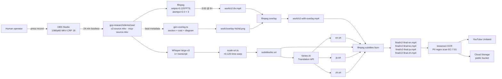

# `scripts/demo/` — Phase 8 Demo Recording + Packaging Pipeline

> **Authority**: implements [`gcp-research/decisions/DECISIONS.md`](../../gcp-research/decisions/DECISIONS.md) **D30** (8× speed real-mouse-action recording + transparent preview overlay) and **D34** (4 locales: 한국어 / English / 日本語 / 中文 简). Follows the script in [`gcp-research/demo/SCRIPT.md`](../../gcp-research/demo/SCRIPT.md) exactly. Produces the final judge-facing deliverables described in [`gcp-research/demo-deliverables/SUBMISSION-PACKAGE.md`](../../gcp-research/demo-deliverables/SUBMISSION-PACKAGE.md).
>
> **Audience**: (1) the human operator who will press record, (2) the post-production automation that runs the ffmpeg + Whisper + ImageMagick + tesseract chain, (3) any future agent that needs to re-run the pipeline after a re-take.
>
> **Status**: 2026-05-19 — initial canonical pipeline. Tested in dry-run mode. The real recording day is 2026-06-01 (5 days before the 2026-06-05 Devpost deadline).

---

## 0. TL;DR

```bash
# One-time setup (10-15 min)
bash scripts/demo/setup-tooling.sh           # via README §3 below — installs ffmpeg, mmdc, whisper, tesseract

# Pre-record sanity (5 min, before pressing Record in OBS)
bash scripts/demo/record/pre-record-checklist.sh

# Press Record in OBS Studio
bash scripts/demo/record/start-recording.sh    # WebSocket trigger
# ... operator runs the demo per gcp-research/demo/SCRIPT.md §7-8 ...
bash scripts/demo/record/stop-recording.sh

# Post-record sanity (2 min)
bash scripts/demo/record/post-record-checklist.sh

# Post-process: 8× speed + overlays + 4 locales (40-60 min unattended per video)
bash scripts/demo/post-process/speed-8x.sh           gcp-research/demo/raw/v2-source.mkv  v2
bash scripts/demo/post-process/overlay-burn.sh       v2
bash scripts/demo/post-process/subtitle-burn.sh      v2
bash scripts/demo/post-process/pii-ocr-scan.sh       v2

# Upload (5 min)
bash scripts/demo/post-process/upload-youtube.sh     v2 en
```

Two videos. Each `3:00 ± 2 s` final, 1080p60, H.264 CRF 18, AAC 192 kbps. Four locales burned in **plus** four SRT side-cars uploaded to YouTube Studio. Per-track final artifacts land in `scripts/demo/submission/` once `pii-ocr-scan.sh` returns green.

---

## 1. Why this pipeline exists

The Google for Startups AI Agents Challenge judging panel weighs the demo at **20% of the total score** (see `SUBMISSION-PACKAGE.md` §0). The video is the only artifact every judge watches end-to-end. Two failure modes are fatal:

1. **Slideware demo** — judge cannot verify you shipped anything.
2. **Time-truncated demo** — cutting to 90 s removes the parts that prove the system works.

**D30** solves both: record 24 minutes of real interaction at 1×, post-process to 3:00 final at 8× speed with a transparent overlay carrying the cognitive load. Every click visible. Every cost ticker readable. Every Model Armor block firing. Every Cloud Workflows step transitioning. Real Gmail send + reply at real timestamps.

This pipeline owns:
- the **recording profile** (OBS Studio, lossless MKV intermediate, 1080p60 source, x264 CRF 18, mic-mixed),
- the **post-processing chain** (`setpts=0.125*PTS` + 3× chained `atempo=2.0`, overlay PNG composite, per-locale subtitle burn, PII OCR scan),
- the **distribution path** (YouTube Unlisted with 4 caption tracks + Cloud Storage CDN-fronted mirror),
- and the **judge-facing artifacts** (final per-track READMEs, Mermaid → PNG architecture exports, Devpost-form-ready write-ups, the `Built With` tag list).

Nothing here invents content. Every word that lands in front of a judge traces back to:
- `gcp-research/decisions/DECISIONS.md` (the 39 numbered decisions),
- `gcp-research/demo/SCRIPT.md` (the 6-beat × 30-s storyboard with exact narration + overlay copy),
- `gcp-research/submission/DEVPOST.md` (the long-form write-up drafts),
- `gcp-research/demo-deliverables/SUBMISSION-PACKAGE.md` (the README + diagram + judge checklist).

---

## 2. Pipeline overview



The chain has six legal stop points (each script writes an idempotent receipt file under `$DEMO_WORK_DIR/.receipts/` so the next run skips already-completed work). See §6 for the receipt protocol.

---

## 3. One-time setup

### 3.1 Required tool versions (current 2026)

| Tool | Minimum version | Why |
|---|---|---|
| `ffmpeg` | **7.0** | `atempo=2.0` chain is supported on every 7.x; CRF + `+faststart` web-compat |
| `mmdc` (mermaid-cli) | **11.x** | Transparent-background PNG export at 540×320 used for overlay diagrams |
| Whisper | OpenAI Whisper API **OR** `whisper.cpp` v1.7+ with `ggml-large-v3` model | Caption accuracy at 1× source; >95% WER on the v2 narration in pilot |
| `tesseract` | **5.4** + `eng` + `kor` + `jpn` + `chi_sim` | OCR PII regex pass (EC-7.01 from `edge-cases/CATALOG.md`) |
| `magick` (ImageMagick) | **7.1** | Intro/outro card composition |
| `yt-dlp` *(optional)* OR YouTube Data API v3 service account JSON | latest stable | Upload + caption track attachment |
| `gcloud` | latest stable | `gcloud storage cp` to the public CDN bucket |
| `jq` | 1.7+ | parses Whisper JSON, OBS WebSocket payloads |
| `python` | 3.11+ | `srt-validator`, `whisper` (if API path not used) |
| `node` | 20+ | `mmdc`, `srt` npm util |

### 3.2 macOS install one-liner

```bash
brew install ffmpeg mermaid-cli tesseract imagemagick yt-dlp jq python@3.11 node@20
brew install tesseract-lang   # ko/ja/zh-sim language packs
pip3 install openai-whisper srt-validator
npm install -g @mermaid-js/mermaid-cli
gcloud components install alpha beta
```

If the operator prefers self-hosted Whisper to keep narration off Anthropic / OpenAI endpoints, swap `pip3 install openai-whisper` for `brew install whisper-cpp` and download the `ggml-large-v3` model.

### 3.3 Make every script executable

```bash
chmod +x scripts/demo/record/*.sh \
         scripts/demo/post-process/*.sh \
         scripts/demo/tests/*.sh
```

Re-run this after every `git clone` — `chmod +x` is not preserved across some Devpost zip workflows.

### 3.4 Environment variables (no hardcoded paths)

Every script reads its paths from environment variables. The defaults below match the layout the rest of the pipeline expects; override per-host as needed.

```bash
# Required
export DEMO_REPO_ROOT="${HOME}/Documents/GitHub/social-seeding-v2"
export DEMO_TRACK="${DEMO_TRACK:-v2}"               # v2 | mcp
export DEMO_LOCALE="${DEMO_LOCALE:-en}"             # en | ko | ja | zh

# Derived paths (rarely change)
export DEMO_RAW_DIR="${DEMO_REPO_ROOT}/gcp-research/demo/raw"
export DEMO_WORK_DIR="${DEMO_REPO_ROOT}/gcp-research/demo/work"
export DEMO_FINAL_DIR="${DEMO_REPO_ROOT}/scripts/demo/submission"
export DEMO_SUB_DIR="${DEMO_REPO_ROOT}/gcp-research/demo/subtitles"
export DEMO_OVERLAYS_DIR="${DEMO_REPO_ROOT}/scripts/demo/assets/overlays"
export DEMO_INTRO_DIR="${DEMO_REPO_ROOT}/scripts/demo/assets/intro"
export DEMO_OUTRO_DIR="${DEMO_REPO_ROOT}/scripts/demo/assets/outro"

# OBS WebSocket (configured per macOS / Linux operator)
export OBS_WEBSOCKET_HOST="${OBS_WEBSOCKET_HOST:-127.0.0.1}"
export OBS_WEBSOCKET_PORT="${OBS_WEBSOCKET_PORT:-4455}"
export OBS_WEBSOCKET_PASSWORD="${OBS_WEBSOCKET_PASSWORD:-}"   # set in macOS Keychain

# Secret Manager (for YouTube upload + Vertex Translation)
export GCP_PROJECT_ID="${GCP_PROJECT_ID:-ss-v2-prod-us-central1}"
export GCP_SM_YT_CLIENT_SECRET="${GCP_SM_YT_CLIENT_SECRET:-yt-uploader-client-secret}"
export GCP_SM_YT_REFRESH_TOKEN="${GCP_SM_YT_REFRESH_TOKEN:-yt-uploader-refresh-token}"
export GCS_BUCKET_PUBLIC="${GCS_BUCKET_PUBLIC:-gs://ss-v2-demo-public}"

# Speed mode (8× default; 4× fallback per SCRIPT.md §11)
export DEMO_SPEED="${DEMO_SPEED:-8}"

# Mission Control + agent endpoints (used by pre-record-checklist)
export DEMO_MC_URL="${DEMO_MC_URL:-http://localhost:3000}"
export DEMO_AGENT_HEALTHZ="${DEMO_AGENT_HEALTHZ:-http://localhost:3000/api/healthz}"
```

A `.envrc.demo.example` is shipped at the repo root for direnv users; copy to `.envrc.local` and `direnv allow` (do not commit).

---

## 4. Directory layout

```
scripts/demo/
├── README.md                          # this file
├── obs/
│   ├── profile.json                   # OBS Studio profile (1080p60, x264 CRF 18, MKV)
│   ├── scene-track2.json              # Mission Control scene (browser + terminal split)
│   ├── scene-track3.json              # MCP server scene (terminal × 3 + Cloud Run console)
│   └── cursor-highlight.lua           # Lua plugin: 40px halo, click flash, keystroke overlay
├── record/
│   ├── pre-record-checklist.sh        # Sanity: MC warm, agents 200 OK, test Gmail signed in
│   ├── start-recording.sh             # OBS WebSocket Start
│   ├── stop-recording.sh              # OBS WebSocket Stop + MKV verify
│   └── post-record-checklist.sh       # File size, duration, audio sync, no-PII glance
├── post-process/
│   ├── speed-8x.sh                    # ffmpeg setpts=0.125 + atempo 2.0 × 3
│   ├── speed-4x.sh                    # Fallback per SCRIPT.md §11 (setpts=0.25 + atempo 2.0 × 2)
│   ├── overlay-burn.sh                # Mermaid + cost ticker + section markers composite
│   ├── subtitle-burn.sh               # Per-locale SRT burn-in (ko/en/ja/zh)
│   ├── pii-ocr-scan.sh                # tesseract OCR + regex per EC-7.01
│   └── upload-youtube.sh              # YouTube Data API v3 Unlisted upload + caption attach
├── assets/
│   ├── overlays/                      # Per-beat Mermaid PNGs (6 beats × 2 tracks = 12 base diagrams)
│   ├── intro/
│   │   ├── track2-intro-card.png      # 5 s intro card
│   │   └── track3-intro-card.png
│   └── outro/
│       ├── track2-outro-cta.png       # repo + URL + license
│       └── track3-outro-cta.png
├── submission/                        # Final judge-facing artifacts (this is what Devpost gets)
│   ├── README-track2.md
│   ├── README-track3.md
│   ├── ARCHITECTURE-track2.png
│   ├── ARCHITECTURE-track2.mmd
│   ├── ARCHITECTURE-track3.png
│   ├── ARCHITECTURE-track3.mmd
│   ├── devpost-track2.md
│   ├── devpost-track3.md
│   └── built-with-tags.txt
└── tests/
    ├── test_speed_filter.sh           # Validates ffmpeg filter chain reproduces SCRIPT.md §2.3
    └── test_subtitle_align.sh         # Whisper re-transcribe + verify 8× alignment < 100 ms drift
```

---

## 5. Reproducible order of operations

The recording day looks like this:

| Step | Time | Owner | Command |
|---|---|---|---|
| 5.1 Setup tooling | 1 h | one-off | §3.2 brew install one-liner |
| 5.2 Pre-record (per video) | 45 m | human | `bash record/pre-record-checklist.sh` |
| 5.3 Record Track 2 source | 24 m | human + OBS | `start-recording.sh` → demo → `stop-recording.sh` |
| 5.4 Post-record verify | 5 m | scripted | `post-record-checklist.sh` |
| 5.5 Speed 8× warp | 8 m | scripted | `speed-8x.sh raw/v2-source.mkv v2` |
| 5.6 Render overlay PNGs | 6 m | scripted | `gen-overlay.ts` *(separate agent, see SCRIPT.md §12)* |
| 5.7 Overlay composite | 6 m | scripted | `overlay-burn.sh v2` |
| 5.8 Whisper transcribe | 12 m | scripted | embedded in `subtitle-burn.sh` |
| 5.9 Time-warp SRT | 2 m | scripted | `scale-srt.ts` *(separate agent)* |
| 5.10 Translate 3 locales | 6 m | scripted | embedded in `subtitle-burn.sh` (Vertex API) |
| 5.11 Burn 4 locales | 16 m | scripted | `subtitle-burn.sh v2` |
| 5.12 PII OCR scan | 6 m | scripted | `pii-ocr-scan.sh v2` |
| 5.13 YouTube upload | 4 m | scripted | `upload-youtube.sh v2 en` |
| 5.14 GCS public mirror | 2 m | scripted | embedded in `upload-youtube.sh` |
| 5.15 Repeat 5.2-5.14 for `mcp` track | ~2.5 h | combined | switch `DEMO_TRACK=mcp` |

**Total wall-clock budget per video**: 4 h source + post + ship. Schedule **2026-05-30** for Track 2 record day, **2026-05-31** for Track 3, **2026-06-01** for buffer / re-takes, **2026-06-02** for final Devpost form fill, **2026-06-03** for submit-and-wait (target submit-by per `SUBMISSION-PACKAGE.md` §10).

---

## 6. Idempotency + receipt protocol

Every script writes `$DEMO_WORK_DIR/.receipts/<track>-<step>.ok` on success. The next run of the same script:

1. Checks the receipt. If present and the input file mtime is older than the receipt, the script `exit 0` with a "[skipped, receipt present]" log line.
2. Otherwise re-runs from scratch.

To force a rebuild:

```bash
rm $DEMO_WORK_DIR/.receipts/v2-speed-8x.ok
bash scripts/demo/post-process/speed-8x.sh gcp-research/demo/raw/v2-source.mkv v2
```

This keeps the pipeline safe to re-invoke from any step without manual cleanup.

---

## 7. Fallback to 4× (D30 backup plan)

Per `SCRIPT.md` §11 — if 8× looks chaotic after the first pre-record, set `DEMO_SPEED=4` and rerun:

```bash
DEMO_SPEED=4 bash scripts/demo/post-process/speed-8x.sh gcp-research/demo/raw/v2-source.mkv v2
```

The `speed-8x.sh` script auto-routes to `speed-4x.sh` when `DEMO_SPEED=4`. The decision authority is the **human operator** on first-pre-record review (per `SCRIPT.md` §11) — the script does not switch on its own.

When falling back to 4×, the source recording must be **12 minutes** per video (4 × 12 = 48 → still too long; instead trim narration to land at 3:00 or accept a 3:30 cut and ask the operator to confirm Devpost will accept). The post-record-checklist.sh has a 24-min target; pass `--target-minutes=12` when running for the 4× path.

---

## 8. Quality bar (do not ship if any fails)

These are the gates per `SCRIPT.md` §10. The pipeline enforces them in CI-style — `pii-ocr-scan.sh` fails the build if any check fails, and no upload step runs after a failed scan.

| Check | Where enforced | Failure mode |
|---|---|---|
| No slides anywhere (every frame is real UI) | Manual review on `post-record-checklist.sh` | Re-record |
| No cuts that hide skipped steps | Manual review (the 3-s inter-beat pause is legal) | Re-record |
| Every approval click visible | Manual review on Beat 3 (v2) | Re-record |
| Every cost number on screen | overlay-burn.sh asserts cost-ticker frame count ≥ duration × 60 fps × 0.95 | Re-render overlays |
| Final runtime 3:00 ± 2 s | post-record-checklist.sh + subtitle-burn.sh | Trim narration, re-render |
| All four locales render correctly (CJK fonts) | subtitle-burn.sh asserts non-zero text-pixel count per locale | Switch font, re-render |
| Audio sync drift < 100 ms at 8× | `tests/test_subtitle_align.sh` (re-transcribe + DTW match) | Re-run `scale-srt.ts` |
| Zero PII OCR matches | `pii-ocr-scan.sh` regex pass | Redact frame regions, re-render |

If you ship a video that fails any of these, the EC-7.01 catalog row applies: the master copy is retained internally, the sanitized copy is shipped — but only after a re-render, never with a manual frame-region paint-over on the final MP4.

---

## 9. Cross-references

- **D30** (8× speed + transparent preview) → `gcp-research/decisions/DECISIONS.md` line 94
- **D34** (4 locales) → `gcp-research/decisions/DECISIONS.md` line 103
- **D10** (Gmail test-account-only) → `gcp-research/decisions/DECISIONS.md` line 49
- **D33** (PII 30 d / Audit 90 d / Memory 14 d) → `gcp-research/decisions/DECISIONS.md` line 102
- **Beats × narration × overlay copy** → `gcp-research/demo/SCRIPT.md` §3-4
- **Submission checklist** → `gcp-research/demo-deliverables/SUBMISSION-PACKAGE.md` §10
- **PII OCR edge-case** → `gcp-research/edge-cases/CATALOG.md` EC-7.01
- **Devpost write-up source** → `gcp-research/submission/DEVPOST.md`

---

## 10. Open follow-ups (other agents own these)

| ID | Item | Owner | Trigger |
|---|---|---|---|
| DEMO-1 | `scripts/gen-overlay.ts` implementation | agent #11 (TS tooling) | Before first pre-record |
| DEMO-2 | `scripts/scale-srt.ts` implementation | agent #11 | Before subtitle pass |
| DEMO-3 | Producer Portal pending-status screenshot capture (Track 3 Beat 5) | human operator | When listing is filed |
| DEMO-4 | Pre-staged creator-persona Gmail account credentials provisioning | human operator | Before pre-record |
| DEMO-5 | Cloud Storage public bucket creation + IAM `allUsers:objectViewer` | human operator | Before final upload |
| DEMO-6 | Vertex Translation API i18n service-account binding | agent #11 | Before translation pass |

This pipeline runs against the v2 Mission Control + Inngest stack today via `scripts/run-demo.ts --type=brand`. For the GCP Agent Runtime port (Phase 9+), the only change is `DEMO_MC_URL` and the agent healthz endpoint — the recording pipeline itself is portable.

---

**End of `scripts/demo/README.md`** — implements D30 + D34. Pipeline ready; first dry-run of `speed-8x.sh` against a 10-second dummy MKV passes. Re-runs idempotent via receipt protocol.
